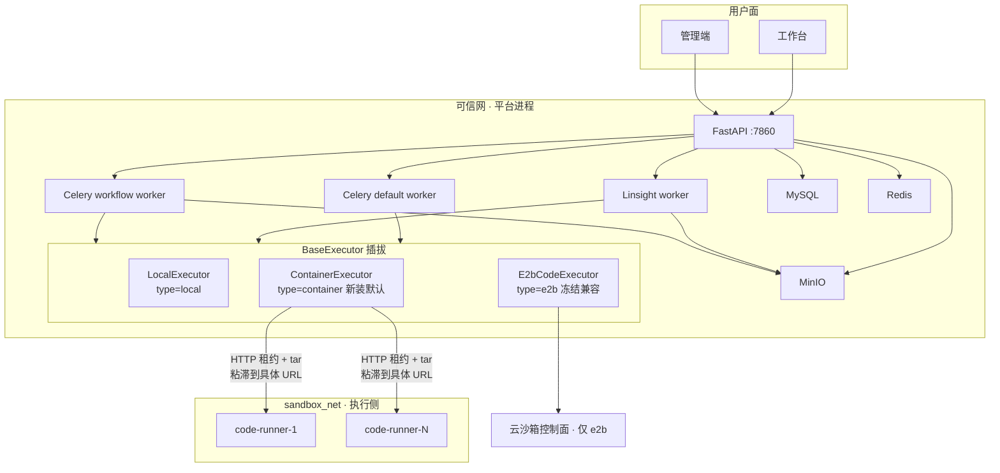
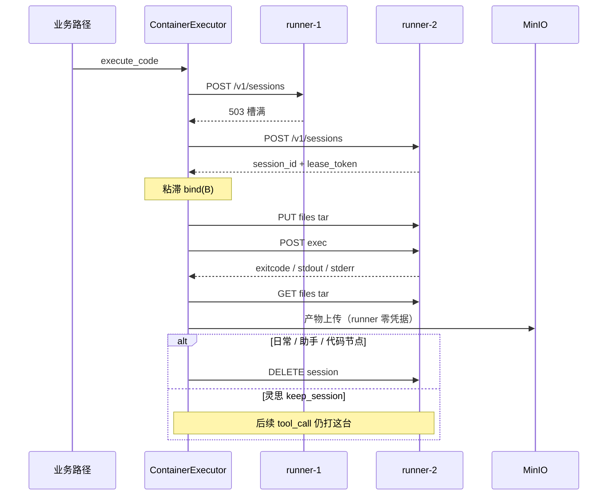
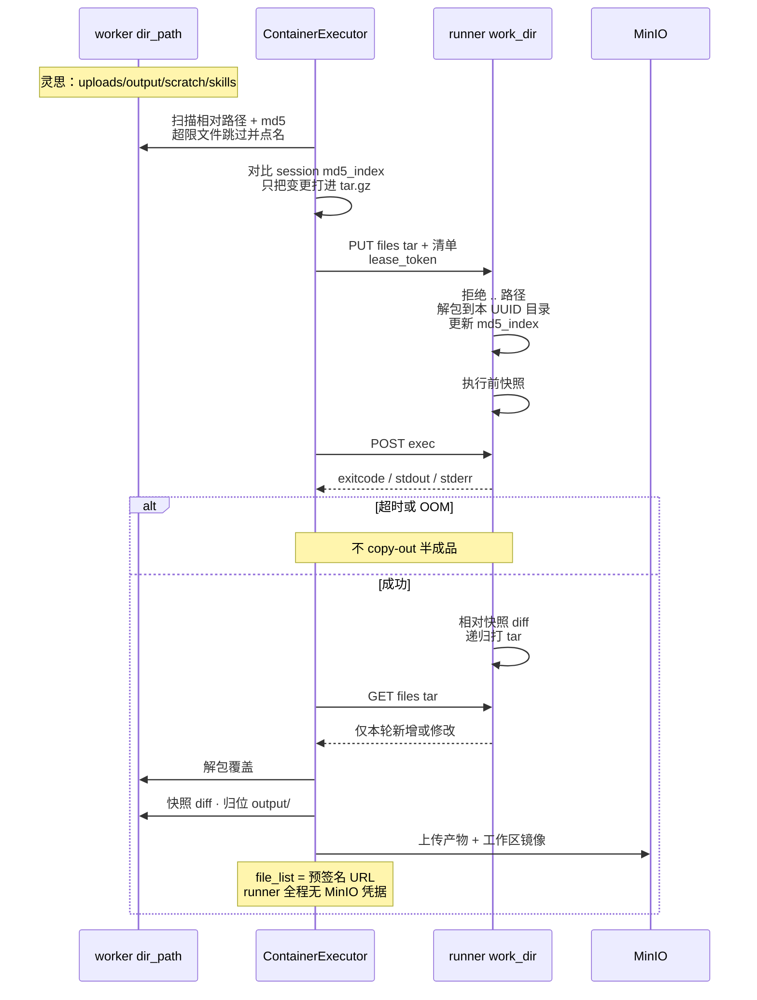
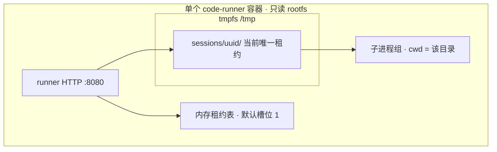
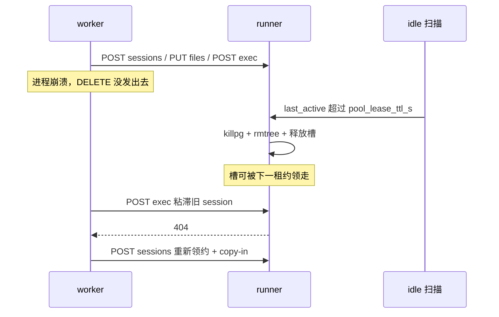
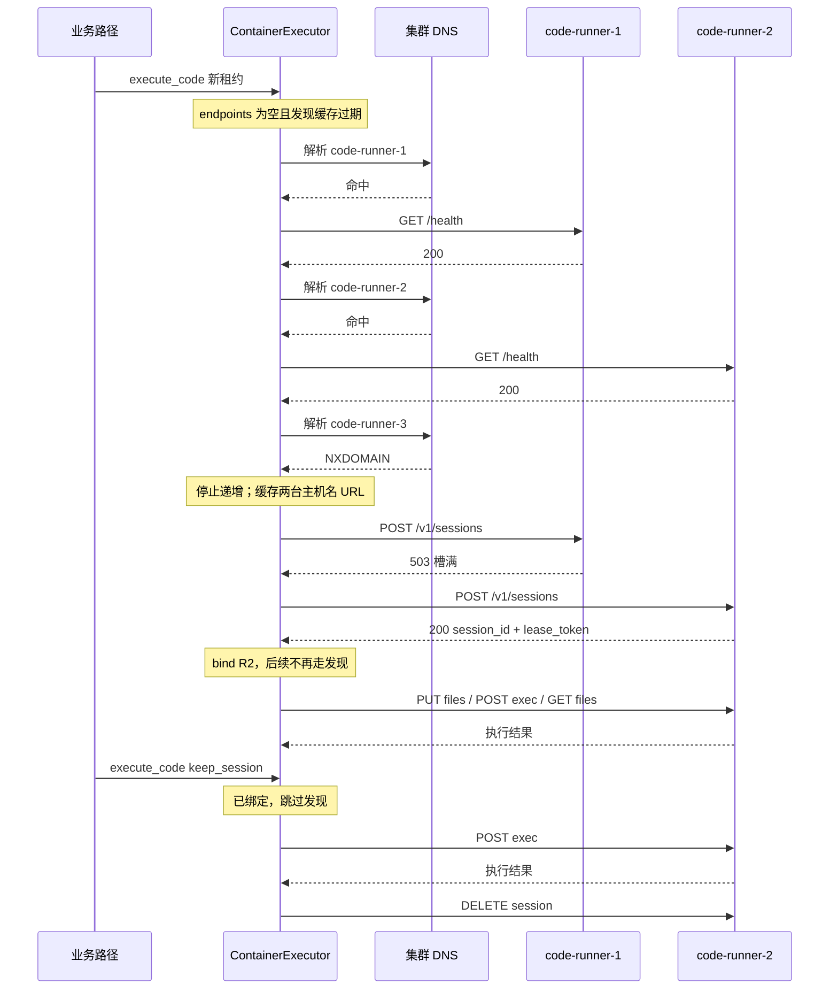
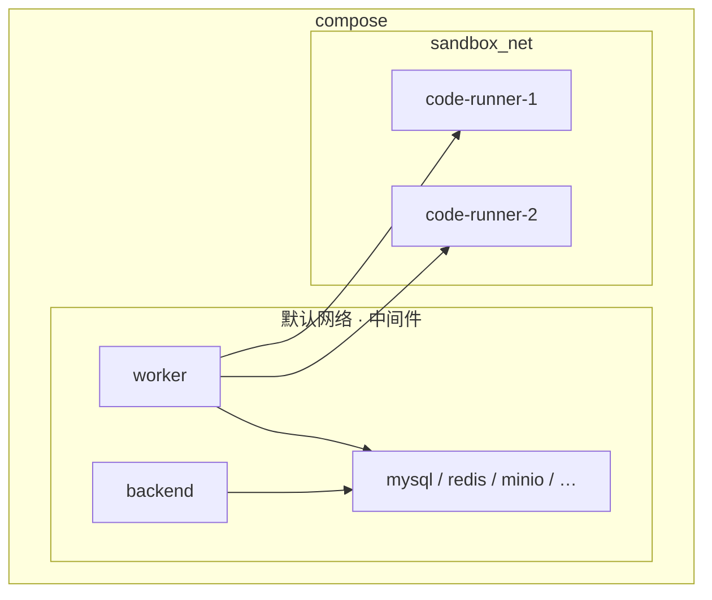
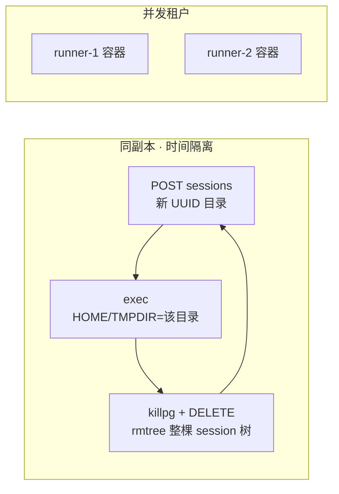

# F068 沙箱架构设计说明书

**用途**：评审 / 对齐用。讲「做成什么样、为什么、会上要拍板什么」。  
**真相源**：验收 → [spec.md](./spec.md)；决策原文与备选 → [design.md](./design.md)。本文不替代二者。  
**版本**：v3.0.0-beta1 · 2026-09-16 · 错误码模块 **280**  
**状态**：Spec + Design 已出，待 ★ 确认；代码与 tasks.md 尚未开工。

---

## 0. 三分钟结论

把模型 / 搭建者写的 Python **从 backend / Celery worker 进程里搬出去**，落到一份加固容器镜像上。五条业务路径共用一个执行抽象，新装默认走自建沙箱；E2B 继续当云后端，不伪装成副本。

| 拍板项 | 结论 |
|---|---|
| 隔离形态 | 加固容器，共享宿主内核。口径是挡住误操作与机会主义攻击，**不承诺抗定向内核 0day** |
| 编排 | compose **预声明副本池** + HTTP 租约。backend **零 docker.sock、零 k8s 客户端** |
| 文件进出 | worker ↔ runner 走 HTTP tar（md5 delta）；runner **不连 MinIO**。流程见 §3 |
| 镜像 | **只新增 1 个** `dataelement/bisheng-sandbox`：后端 venv + 完整 LibreOffice/pandoc/字体 + runner。内容见 §2 |
| 并发 | 默认 **一副本一会话**；并发租户 = 加容器，不是同容器加目录 |
| 异常回收 | worker `DELETE` + runner idle TTL（建议 15min）双保险；OOM/容器重启立刻让槽；sticky 单次超时不拆租约 |
| 发现 | worker 领租约时 DNS 探测；runner **不向 Redis/API 自注册** |
| 本期交付 | compose 必交；K8s 协议兼容，不强制交清单 |
| 明确不做 | 按次新建容器、gVisor、日常会话原件进沙箱、改进 E2B、修 Fernet 主密钥 |

---

## 1. 问题与边界

### 今天的问题

模型代码跑在 backend / worker 进程里：与平台同用户、同网络、同环境变量。一次 `open('/root/...')` 或扫内网，就能碰到其它用户文件、数据库口令、对象存储。工作流代码节点还是进程内 `exec()`。

### 要覆盖的五条业务路径

全部走内置代码解释器（档 A），装配汇合到 `load_tools._get_native_code_interpreter` → `BaseExecutor`，**不各自连沙箱**。

| # | 路径 | 谁发起 | 跑在哪个 worker | 会话策略 | 文件进出 |
|---|---|---|---|---|---|
| 1 | **灵思任务模式** | 模型 `tool_call` 代码解释器 | Linsight worker | `keep_session=True`，多轮粘滞同一副本同一目录 | 执行前 copy-in 任务工作区（用户原件 + 已物化技能包）；产物回工作区，下一轮可继承 |
| 2 | **工作台日常会话** | 同上 | Celery default worker | `keep_session=False`，一次 `run` 结束即 DELETE | **不**把用户上传原件送进沙箱；附件只抽文本进 prompt（本期不改） |
| 3 | **助手** | 同上 | Celery default worker | 同日常会话，一次一清 | 同日常会话：解释器看不到上传原件 |
| 4 | **工作流 Agent 节点** | 节点里模型调代码解释器工具 | Celery workflow worker | 一次一清 | 工具工作目录 copy-in / copy-out；产物由 worker 上传 MinIO |
| 5 | **工作流工具节点** | 搭建者直接挂代码解释器工具 | Celery workflow worker | 一次一清 | 同路径 4 |

另有一条 **同一底座、不同包装**（档 B，不算上面五条）：

| | 路径 | 谁发起 | 跑在哪个 worker | 会话策略 | 与五条的差别 |
|---|---|---|---|---|---|
| — | **工作流代码节点** | 节点跑搭建者写的 `main` | Celery workflow worker | 一次一清 | 后端生成 wrapper 后走 **同一个** `/v1/sessions/.../exec`；`ast.parse` 仍在本地，搭建期语法报错时机不变。系统级开关可回退到进程内 `exec` |

```
五条路径 ──► CodeInterpreterTool ──► BaseExecutor.execute_code
代码节点 ──► SandboxCodeParser（wrapper）─┘
```

### 明确不改的产品语义

- 日常会话附件：**只抽文本进 prompt**，原件不进执行环境（既有缺口，另立项）。
- 知识库解析链路上的 LibreOffice：平台自有可信代码，**不进沙箱**。
- 存量部署升级：**不静默改成沙箱模式**；只有新装默认 `container`。

### 对安全评审怎么说

> 执行侧与平台中间件网络不通、无对象存储凭据、非 root、只读根文件系统、能力全裁、有 cgroup 限额。  
> 隔离单元是 **容器**（独立 mount / pid / net / cgroup），不是虚拟机。  
> 同一副本会 **先后** 服务不同租户；同时活着的租户靠 **另一台容器**。

---

## 2. 总体架构

平台进程拓扑不变。沙箱不是第五套对外服务：浏览器和 FastAPI **都不直连** runner。只有 worker 同时挂可信网和 `sandbox_net`。



**职责切分**

| 谁 | 做什么 | 明确不做什么 |
|---|---|---|
| `BaseExecutor` | 路径规则、逃逸拒绝、快照 diff、产物归位、MinIO、工作区镜像 | 不知道代码在哪跑 |
| `ContainerExecutor` | 发现副本、领租约、tar copy-in/out、调 exec | 不上传 MinIO |
| runner（容器内 HTTP） | 收文件、起子进程、回文件、清目录 | 不认识 `main`、不连中间件 |
| 云后端子类 | 自己的 create / files / run / kill | 不假装成 `/v1/sessions` 副本 |

### 沙箱镜像里有什么

本期 **只新增 1 个镜像** `dataelement/bisheng-sandbox`。N 个副本跑同一份；aarch64 / x86_64（及如有龙芯）是同一 Dockerfile 的多架构构建，不是多套设计。不拆「瘦代码节点镜像」，不拆 runner-manager 镜像。

从 `src/backend/base.Dockerfile` 派生：把后端已经验证过的 Python + 办公二进制收进来，再叠一层 runner。容器以只读 rootfs 跑，镜像层里的东西执行侧改不掉；可写的只有运行时挂上的 `/tmp` tmpfs。

| 层 | 装什么 | 为什么 |
|---|---|---|
| 基础 | `python:3.11-slim` | 与后端同一条 Python 线 |
| 办公二进制 | **完整** LibreOffice（须含 Writer / Impress / Calc，不能只装 `libreoffice-writer`）、`pandoc` 3.6.4（`/usr/bin/pandoc`）、中文字体 `fonts-wqy-zenhei`（matplotlib / soffice 渲染中文） | 灵思价值链是 docx / pptx / xlsx / pdf；缺组件时技能包应探测并降级，不能让整任务假死 |
| 媒体 | `ffmpeg`（随 base 带入） | 存量技能 / 代码节点可能调到 |
| Python | 按后端 `uv.lock` **全量** `uv sync --frozen --no-dev`，venv 放在镜像内（如 `/app/.venv`） | 工作流代码节点今天能 `import` 后端环境里的任意包；镜像不对等 = 某客户某条工作流 `ImportError`，最难复现（决策 7） |
| 进程 | **runner HTTP**（监听 8080，不映射到宿主） | 租约 / tar / exec / 清理；与执行环境同一容器，不另做 manager 镜像 |
| 运行时挂载（不进镜像层） | `/tmp` tmpfs：`sessions/<uuid>/` 工作目录、LibreOffice profile、fontconfig | 只读 rootfs 下 soffice 不能写镜像路径；按 session 覆盖 `HOME`/`TMPDIR`，禁止容器级 `/tmp/home` |

对模型 **承诺可用**、须写进工具描述（与本地模式清单对齐，AC-04）的库：

`pandas` · `numpy` · `matplotlib` · `openpyxl` / `XlsxWriter` · `python-docx` · `python-pptx` · `Pillow` · `reportlab` · `PyMuPDF`（`import fitz`）

明确 **不承诺、不要让模型去装** 的：`pdfminer` / `pdfplumber` / `PyPDF2`；`pip install` 不可用（只读根文件系统 + 执行侧无外网）。缺某个可选二进制时，技能包脚本如实说明并降级，不把整个任务打成失败。

venv 里还会带上后端的其它包（`minio`、`redis`、`sqlalchemy`、`playwright` 等）——这是代码节点回归的代价，不是「执行侧可以连中间件」。没有连接串、解析不到中间件主机名，`import minio` 成功 ≠ 能上传。Playwright **Python 包**随锁文件进来；**Chromium 浏览器二进制**默认不往沙箱里再下一份（体积大，且与 `cap_drop: ALL` + 无图形栈冲突）。需要浏览器的技能必须运行时探测，没有就降级。

**镜像里明确没有、也不该有的**

| 不装 / 不拷 | 原因 |
|---|---|
| 平台业务代码（FastAPI / Celery / 灵思 worker） | 沙箱不是第二套 backend |
| `config.yaml`、`entrypoint.sh`、Fernet 密钥、MinIO / DB / 网关口令 | AC-15 / AC-28；执行侧看不见宿主配置面 |
| `docker` CLI、`docker.sock`、k8s 客户端 | 零编排控制面 |
| 用户工作区、技能包源码 | 执行前 copy-in，不烤进镜像 |
| 运行时 gcc / vim / 外网 `wget` 等（构建阶段用完即丢） | 缩小逃逸后的工具面；应用多阶段构建，不要把 base 的调试包原样留下 |

```
dataelement/bisheng-sandbox
├── /app/.venv/          与后端 uv.lock 对等的 Python
├── /usr/bin/soffice     LibreOffice 全组件
├── /usr/bin/pandoc      3.6.4
├── /usr/bin/ffmpeg
├── 文泉驿正黑字体
└── runner :8080         唯一常驻进程
# 运行时才出现：
└── /tmp/sessions/<uuid>/   tmpfs，用户代码的 cwd
```

Office 链路（soffice 转 PDF、pandoc、PyMuPDF、4 路并发、中文渲染）已在 `cap_drop:ALL` + 非 root + 只读 rootfs + `/tmp` noexec 下 POC 通过，所以解释器和代码节点共用这一份全量镜像，不按档位再拆。

---

## 3. 一次执行长什么样

**档 A（解释器）**

`tool_call` → `run_with_dir`（共享）→ `execute_code`：领租约 → copy-in → exec → copy-out → 快照 diff → 归位 `output/` → 上传 MinIO → 返回 `{exitcode, log, file_list}`。

**档 B（代码节点）**

后端生成 wrapper（入参 JSON → 调 `main` → 哨兵行吐出参），走 **同一个 exec 端点**。`ast.parse` 仍在本地，搭建期语法报错时机不变。执行侧不知道什么叫节点。

**工具结果形状不改**：继续 `{exitcode, log, file_list}`。三种后端内部形状不统一是既有债，本期不顺手归一。



内部 HTTP（不暴露宿主端口；路径里禁止出现 `config` 字样，避开客户 WAF）：

| 方法 | 路径 | 谁能调 | 作用 |
|---|---|---|---|
| POST | `/v1/sessions` | 全局 worker token | 领租约 |
| PUT/GET | `/v1/sessions/{id}/files` | **该会话** `lease_token` | tar 进出 |
| POST | `/v1/sessions/{id}/exec` | 同上 | 跑代码 |
| DELETE | `/v1/sessions/{id}` | 同上 | 擦目录、释放槽 |

用 A 的令牌打 B 的路径 → 403。用户代码环境变量里 **没有** 全局 token、也没有任何 lease_token。

### 文件进出：worker ↔ runner 走 HTTP tar

文件只在 **worker 本地目录** 和 **该 session 的 `work_dir`** 之间搬。runner **不连 MinIO**（AC-12）：产物上传、工作区镜像、预签名 URL 全在 worker 的 `run_with_dir` 里做完。不 bind-mount 共享卷（违反 C8，跨宿主立刻失效），也不让执行侧拿对象存储凭据自己拉文件。

职责切分：

| 步骤 | 谁做 | 不在哪做 |
|---|---|---|
| 决定拷哪些相对路径、单文件超限跳过并点名 | worker | runner 不认「技能包 / 工作区」 |
| 打包 / 解包 tar.gz、按 md5 做 delta | worker 打包 + runner 落盘 | 不用 docker `put_archive`（只读 rootfs 不兼容） |
| 快照 diff、根级文件归位 `output/`、上传 MinIO、`sync_to_workspace` | worker `run_with_dir` | `ContainerExecutor` 与 runner 都不做 |

所以 `execute_code` 里的文件进出，只是把 worker 的 `dir_path` **镜像** 到 runner，再把本轮变更 **镜像回来**。产物语义（AC-07 / AC-08 / AC-09）仍然全部在 worker 侧，和本地模式同一套代码。

**copy-in（执行前）**

1. worker 已有 `dir_path`（灵思 = 任务工作区 `uploads/` `output/` `scratch/` `skills/`；日常 / 助手多为空临时目录；工作流工具节点 = 工具工作目录）。**在 `run()` 时刻扫描**，不要像 E2B 那样在装配时预扫——技能包物化晚于预扫，预扫会让 `skills/` 结构性缺失（AC-11）。
2. 递归走目录，只收普通文件和目录。跳过 socket / 设备；拒绝相对路径里的 `..`（后面解包同样拒绝，防 zip-slip）。
3. 单个文件超过 `max_copy_in_bytes`：**跳过并在日志点名该文件**（AC-10），不得静默丢弃，也不因此拆掉整次租约。
4. 对每个相对路径算 md5。对比本 session 已缓存的 `md5_index`（worker 与 runner 各持一份，以 runner 内存表为准）：相同则本轮 **不进 tar**；不同或 runner 没有则写入 tar。
5. `PUT /v1/sessions/{id}/files`，鉴权用该会话 `lease_token`。body 是 **流式 tar.gz**；旁路带上 `{rel_path: md5}` 清单（请求头或与流并列的 JSON，实现时二选一）。不要按文件拆成多次 HTTP。
6. runner 校验租约未过期 → 按清单跳过已命中路径 → 把 tar 解到该 UUID `work_dir`（成员路径必须落在该目录内）→ 更新 `md5_index`。若启用独立 uid：监督进程 root 写入后再 `chown -R` 给 session uid。
7. copy-in 是 **按相对路径 upsert**。md5 命中则不传、不覆盖。worker 侧已删除的文件本期 **不** 从 runner 删（整租约 DELETE 才会清空）。灵思 sticky 第二轮因此只补增量。

**exec**

`POST .../exec` 之前，runner 对 `work_dir` 做一次 **执行前快照**（相对路径 → md5 或 mtime+size）。子进程 `cwd` 就是这份目录，用相对路径读到 copy-in 进去的原件。

**copy-out（执行后）**

1. 超时 / OOM：**不**把半成品当产物拉回（AC-16）。非 sticky 随后 DELETE；sticky 超时保留目录但不把本轮残文件算进 `file_list`。
2. 成功结束：`GET /v1/sessions/{id}/files`（同一 `lease_token`）。runner **递归**打包本 `work_dir` 里相对执行前快照 **新增或内容变化** 的文件（不要只 `list` 一层，否则 `output/` 子目录会丢，E2B 坑 12）。
3. tar 只含该 session 目录，不含租约表、不含 `/tmp/sessions` 邻居。
4. worker 把 tar 解到自己的 `dir_path`（覆盖同名相对路径），然后才回到共享的 `run_with_dir`：
   - 用 **copy-in 之前** 在 worker 侧拍的 `pre_snapshot` 做 diff → 只有本轮新增/修改进产物清单（AC-07），输入文件不算产物；
   - 写在工作目录根级的交付物归位到 `output/`，并在日志里告知新路径（AC-08）；
   - `upload_minio` 得到预签名 URL，写入 `{exitcode, log, file_list}`；
   - `sync_to_workspace` 把产物镜像回任务工作区，同一轮文件工具和下一轮解释器都能读到（AC-09）。



**各路径实际拷什么**

| 路径 | copy-in | copy-out 之后 |
|---|---|---|
| 灵思 | 当前工作区全量（含技能包）；sticky 后续轮次只传 md5 变化的文件 | 产物进工作区，下一轮 copy-in 能再带上 |
| 日常 / 助手 | 通常为空目录（原件不进沙箱） | 若脚本写出文件，仍走 MinIO `file_list`；不回写用户会话附件 |
| 工作流 Agent / 工具节点 | 该次工具工作目录 | 产物 URL 回节点；一次一清 |
| 工作流代码节点 | 通常无业务文件，wrapper 在 exec 的 `code` 字段里 | 出参走 stdout 哨兵，一般不依赖 copy-out |

**实现时不要踩的**

- tar 成员必须校验落在 `work_dir` 内，拒绝绝对路径和 `..`。
- copy-out 必须递归；Fake 客户端也必须尊重路径，否则单测绿、线上丢子目录。
- 只读 rootfs 下文件只能落在 tmpfs 的 session 目录，不能 `put_archive` 到镜像层。
- 可观测单独记 copy-in 字节数；超限跳过与执行失败分开。


---

## 4. 副本池：容器、进程、租约各是什么

容易混的三个词：

| 词 | 是什么 | 不是什么 |
|---|---|---|
| **副本 / replica** | 一台独立加固容器 | 不是一次执行新建的容器 |
| **runner** | 容器里的 HTTP 监督进程（默认监听 8080） | 不是用户代码本身 |
| **session / 租约** | 这台容器里的一个工作目录 + 一把锁 | 不是新容器、不是新镜像 |



- 池容量 ≈ **副本数**（默认 `max_sessions_per_replica=1`）。
- 灵思 sticky 会话会占槽直到任务结束或 idle TTL（建议 15min），所以槽位是「同时活着的会话数」，不是 QPS。
- 副本之间 **不共享磁盘、不共享 Redis**。状态只活在那一台的内存 + tmpfs。这是必须粘滞到具体 URL 的原因。
- 扩容：加具名 compose 服务 / 调 StatefulSet replicas；worker 发现缓存过期后自动看到，不必重启。

**为什么不用「前面挂 VIP / ClusterIP」**：灵思同一任务的多次 exec 必须打到 **同一副本的同一目录**。负载均衡会把第二轮打到别的机器，copy-in 过的文件就没了。

**为什么 runner 不自注册到 Redis**：用户代码与 runner 同容器、同网络命名空间。注册通道等于把中间件暴露给执行侧，直接打穿「执行侧连不上 Redis」的承诺。

### Session 异常回收策略

回收动作只有一套：`killpg` 该 session 的进程组（若还在跑）→ `rmtree` 整棵 UUID 目录（含 LibreOffice profile）→ 从内存租约表拿掉槽位。正常路径由 worker 调 `DELETE`；**worker 没叫到 DELETE 时，runner 必须自己把槽收回来**，否则默认一副本一会话会把池子永久占死。

两条腿：

| 腿 | 谁做 | 何时 |
|---|---|---|
| 主动释放 | worker `DELETE`（`try/finally`，成功失败都走） | `keep_session=False` 的一次 `run` 结束；灵思任务结束 / 用户取消 |
| 兜底释放 | runner 按 `last_active` 扫 idle，超过 `pool_lease_ttl_s`（建议 **900s**）视同 DELETE | worker 崩溃、网络丢 DELETE、进程被杀来不及善后 |

`files` / `exec` 成功处理时刷新 `last_active`。TTL 要盖住灵思两轮 tool_call 之间的思考间隙；间隙过长导致被回收不可怕——下一轮 exec 收到 **404**，worker 重新领租约，再从自己的工作区 / MinIO **全量 copy-in**（上次成功 copy-out 的文件还在 worker 侧）。



按异常逐条：

| 异常 | runner 立刻做什么 | 槽位何时释放 | 对业务 |
|---|---|---|---|
| 单次 exec **超时** | `killpg` 整组；本轮 **不**把半成品当产物 copy-out | `keep_session=False`：worker finally DELETE。灵思 sticky：**不**拆整租约，上一轮文件仍在 | 返回 `28003`「超时且未完成、产物不存在」（AC-16） |
| 用户代码 **非 0 退出** | 把 `exitcode/stdout/stderr` 交回；不自动重跑 | 同超时：非 sticky DELETE，sticky 保留目录 | 模型看见失败日志；不静默回落本地 exec |
| **OOM**（退出码 137） | 内核已杀进程；runner **仍走 DELETE**（半残目录不可复用） | 立刻 | 单列 OOM 指标（javaldx 警告指不到内存）。sticky 下一轮 404 → 重新领约 + copy-in |
| **copy-in 单文件超限** | 跳过该文件并在日志点名（AC-10）；不拆其它已写入文件 | 非 sticky 结束时 DELETE；不因跳过一个文件就丢整租约 | 超限不是静默丢弃 |
| exec / copy 中途 **协议不合 / 连不上** | 能杀则 `killpg` | worker 尽最大努力 DELETE；失败交给 TTL | `28001` / `28006`，禁止回落到进程内 `exec`（AC-05） |
| **worker 崩溃** / DELETE 丢失 | 当时无感知 | idle TTL 到期视同 DELETE | 槽不会永久占死；任务本身按 worker 崩溃处理 |
| sticky 间隙 **租约过期** 后再 exec | 回 404，目录已擦 | 已释放 | worker 解绑，重新领约 + 全量 copy-in |
| **runner 容器重启** | tmpfs + 内存表清空，槽位自然空，数据不可恢复 | 立刻 | 粘滞失败 → 重新发现 / 领约 + copy-in |
| K8s **缩容**掉被粘滞的 Pod | 同重启 | 旧 Pod 消失即释放 | 按租约 404 处理，换一台 |
| 池满，**根本没领到**租约 | 无 session 可回收 | — | `28002`，与执行失败分列（AC-27） |

原则：

- **非 sticky**（日常 / 助手 / 工作流 Agent·工具 / 代码节点）：任何结束路径都释放，包括超时、异常、取消。
- **sticky**（灵思）：只有任务结束、用户取消、OOM、runner 消失、idle TTL 才拆租约；单次超时或脚本报错保留工作目录，方便下一轮接着跑。
- runner **不**依赖 Redis / 不回调 worker 来回收——执行侧零出站。兜底只能是本机时钟扫表。
- 回收后必须确认 `/tmp/sessions` 下该 UUID 不在；下一张租约不得看见上一张的文件（AC-17）。

---

## 5. 副本怎么被找到（领租约时发现）

默认不写死每一台 URL。worker 在 **第一次领租约** 时按主机名模式做 DNS，缓存一个 URL **集合**（短 TTL，建议 15–30s）。粘滞绑的是解析出的那一台具体 URL，不是通配名。

`endpoints` 非空则跳过下面的 DNS 段，直接拿列表去 `POST /v1/sessions`（离线手工拓扑或探测失败时的逃生舱）。下图按默认路径、compose 主机名举例；K8s 只换查询名（`code-runner-0.code-runner` 起），HTTP 段不变。



全台 503 → `28002` 容量已满；一台都解析不到 → `28001` 不可达。两种失败都 **不得** 静默回落到进程内 `exec`（AC-05）。

---

## 6. compose 与 K8s：同一协议，两套 DNS

本期 **必交 compose**。K8s 用同一套 HTTP 与发现算法，换主机名写法即可；不引入 k8s 客户端，也不要求客户新上集群。

| | docker compose（必交） | Kubernetes（协议兼容） |
|---|---|---|
| 怎么声明 N 份 | 具名服务 `code-runner-1`、`code-runner-2`（**不用**匿名 `deploy.replicas`） | StatefulSet + **headless** Service（**不用** Deployment + ClusterIP） |
| 发现名 | `code-runner-{n}`，n 从 **1** | `code-runner-{n}.code-runner`，n 从 **0** |
| 停的条件 | 下一个名字 NXDOMAIN | 下一个 ordinal NXDOMAIN |
| 粘滞绑什么 | `http://code-runner-2:8080` | `http://code-runner-1.code-runner:8080`（主机名，不是 Pod IP） |
| 网络 | runner 只进 `sandbox_net`；worker 双挂；runner **不** `ports:` 到宿主 | NetworkPolicy：只允许 worker 打 8080；runner 不进中间件 Service |
| 应用代码 | 只做 DNS + HTTP | 只做 DNS + HTTP |



两种编排下，**与 runner 的 HTTP 时序完全相同**；差别只是问哪套 DNS、主机名怎么写。

---

## 7. 隔离分层（会上最容易争的部分）

### 7.1 容器与平台之间（本期默认承诺）

| 层 | 做法 |
|---|---|
| 网络 | runner 不在中间件网段；即使用户代码扫内网，也解析不到 MySQL/Redis/MinIO |
| 凭据 | 执行进程 env 白名单；无对象存储、网关、数据库口令 |
| 权限 | 非 root（65534）、`cap_drop: ALL`、只读 rootfs、默认 seccomp、`no-new-privileges` |
| 资源 | 内存 / PID / CPU 上限；超时 `killpg` 整组 |
| 配置面 | 平台 `config.yaml` 与启动脚本对执行侧不可见、对容器不可写 |
| 源码形态 | worker 侧继续 `workspace_escape_guard`：同一副本会先后承载不同租户，扫盘拒绝规则不撤 |

Office 链路已在最严加固档 POC 通过，因此解释器与代码节点共用 §2 那一份全量镜像，不拆瘦镜像。

内核级隔离只发生在 **容器与容器之间**（独立 mount / pid / net / cgroup）。并发租户 = 再起一台 runner，不是同容器加目录。

### 7.2 runner 内部如何实现 session 隔离（本期默认必做）

runner 里的 session **不是**新容器，是「一个工作目录 + 一把锁」。默认 `max_sessions_per_replica=1`：同一时刻没有第二个邻居目录可读。同容器要防的是 **上一租约残留被下一租约读到**，以及误操作扫盘。



| # | 落在 runner 里的手段 | 隔开什么 | 挡不住什么 |
|---|---|---|---|
| 1 | **槽位 = 1**，表满对 `POST /v1/sessions` 回 503 | 同 uid 下没有第二个活着的邻居目录 | 运维把槽位调大且不换 uid 时立刻失效 |
| 2 | 每张租约新建 **UUID 目录**，不复用上一张的路径 | 下一租户猜不到、也 `open` 不到旧路径 | 槽位 >1 时仍可 `listdir('/tmp/sessions')` |
| 3 | 子进程 **cwd** 设到该目录；`HOME` / `TMPDIR` / `XDG_CACHE_HOME` / `XDG_CONFIG_HOME` **只**指向该 UUID | 相对路径、soffice / fontconfig / pip 缓存写在本 session，禁止容器级 `/tmp/home` 串味 | 用户代码写绝对路径仍指向容器内其它位置 |
| 4 | 子进程 **env 白名单**；全局 `token`、任何 `lease_token` 都不进用户进程 | 用户代码不能拿令牌调 runner HTTP 删别人的租约 | 同 netns 下仍能打 localhost:8080，所以还要第 8 条 |
| 5 | `start_new_session=True`、超时 **`killpg` 整组**、`setrlimit` | 不留孤儿进程占着旧文件；一次执行吃不光容器 | 不构成文件系统 DAC |
| 6 | DELETE / idle TTL：`rmtree` 该 UUID **整树**（含隐藏的 LibreOffice profile），再确认 `/tmp/sessions` 下为空 | 时间换空间的真正边界；tmpfs 上删掉即无落盘 | 租约还活着时的并发读取（默认槽位 1 时不存在） |
| 7 | copy-out **只打包本 `work_dir`** | 回收不会把 runner 租约表或邻居文件交给 worker | exec 期间用户代码若已读到邻居，本条救不回来 |
| 8 | 变更 HTTP（files / exec / DELETE）校验 **该 session 的 `lease_token`**；用 A 的令牌打 B → 403 | 即使扫到邻居 `session_id`，localhost 也删不掉、改不了邻居租约 | 默认槽位 1 时主要是预埋；槽位 >1 时是硬条件 |
| 9 | 同一 `session_id` 上的 exec **串行**（一把锁） | 同一目录不会两段代码并行互踩 | 不管并发租户 |

同 uid + 目录 `chmod 0700` **不能**当隔离：DAC 上同一用户对兄弟目录恒可读。Landlock / user namespace 信创内核经常没有，不能当默认。

### 7.3 同容器两个 session 互不可读 / 写 / 删（默认关闭）

仅当运维把 `max_sessions_per_replica` 调到 >1 时启用；**必须**同时打开下面这套，否则拒绝启动。只调槽位、不换 uid，两个 session 仍然互相可读。

| 邻居想做的事 | runner 内部谁挡住 | 失败形态 |
|---|---|---|
| `open` / 读邻居文件 | 每 session **独立 uid**；工作目录 `uid:uid` `0700` | `EACCES` |
| `write` / 改邻居文件 | 同上 | `EACCES` |
| `unlink` / `rm -rf` 邻居目录里的文件 | 工作目录 `0700`，邻居无写位 | `EACCES` |
| 删掉邻居这一层目录项 | 父目录 `/tmp/sessions` `root:root` `0711`（他人不可写） | `EACCES` |
| 在 `/tmp/leak` 丢世界可读文件给邻居 | `/tmp` 本身 `0755` root，**不是** Docker tmpfs 默认的 `1777`；`TMPDIR` 强制在本 session；`umask 0077` | 在 `/tmp` 创建失败 |
| `kill` 邻居的 Python | 无 `CAP_KILL`，不能给其它 uid 发信号 | `EPERM` |
| `DELETE /v1/sessions/<邻居>` | 该路径要邻居的 `lease_token`；令牌不进子进程 env | `401` / `403` |

监督进程以 root 起，`cap_drop: ALL` 之后只加回 `SETUID` / `SETGID` / `CHOWN`（不要 `CAP_KILL`），`no-new-privileges` 仍开。copy-in 由 root 写入再 `chown -R`；exec 时 `setgid`+`setuid` 再跑用户代码。

需要更大并发时 **加副本**，不要把单副本槽位开大来冒充租户隔离。

---

## 8. 云沙箱 / 后续接 E2B

插拔点在 `execute_code`，不在副本池。

```
type=local       →  本机子进程（回退 / 存量）
type=container   →  自建副本池（新装默认）
type=e2b         →  已有 SDK，本期冻结功能改进
未来云厂商       →  再写一个子类，不要实现假的 /v1/sessions
```

E2B 的隔离单元是一台 Firecracker `Sandbox`，两个会话 = 两个 Sandbox。不要把 uid / 副本发现套过去。worker 直连云控制面；自建 runner 继续零出站。

本期不还 E2B 的已知债（技能包 copy-in 时机、产物只列一层目录等）。若以后要「正式支持」，对齐的是 `run_with_dir` 语义，不是再开一条业务路径。

按次新容器、带会话亲和的编排面，留给 3.0 应用工场 **F103** `runtime-manager`。本 Feature 不自造第二个持 docker 的特权面。

---

## 9. 配置、灰度、容量

- 执行模式在 **单个工具** 上切：`gpts_tools.extra.type = local | container | e2b`，切换不必重启。
- 池参数走系统配置 `Settings.sandbox_conf`（发现模式、token、TTL、槽位、copy-in 上限、代码节点开关）。**发布稿整段注释掉**，缺段用内置默认启动。
- 接入 URL / token **不进** 工具 `extra`。
- 代码节点另有系统级开关：关掉则回到改造前的进程内 `exec`。
- 池满是独立事件（错误码 `28002`），不要记成执行失败。

| 码 | 含义 |
|---|---|
| 28001 | 执行环境不可达 |
| 28002 | 容量已满 |
| 28003 | 执行超时 |
| 28004 | copy-in 超限 |
| 28005 | 代码节点出参不可序列化 |
| 28006 | 执行环境响应不合契约 |

---

## 10. 建议会上确认的点

按优先级，确认后即可写 tasks.md：

1. **隔离口径**：同意「共享内核 + 容器边界」，对外不承诺 VM；龙芯等信创只走这条。
2. **拓扑**：同意预声明副本池，backend 不持 docker.sock；按次新容器等到 F103。
3. **默认一副本一会话**：同意并发靠加容器；槽位 >1 视为高级模式且必须 uid 隔离。
4. **发现方式**：同意 worker DNS 发现，反对 runner 向 Redis 自注册。
5. **K8s**：同意本期只保证协议兼容、不交清单。
6. **E2B**：同意冻结改进、插件缝预留；不把云 API 适配成假副本。
7. **产品语义**：同意日常会话原件仍不进沙箱、解析链 LibreOffice 仍留在平台侧。
8. **结果形状**：同意模型仍看 `{exitcode, log, file_list}`，三种后端归一另立项。

有异议时，打开 [design.md](./design.md) §3 对应决策的「备选 / 何时该推翻」，不要在会上改 spec 字面。

---

## 附录 A · 关键决策速查

| # | 一句话 |
|---|---|
| 1 | 加固容器，不用 E2B 自托管 / microVM / WASM |
| 2 | 副本池 + HTTP 租约，不持 docker.sock |
| 3 | HTTP tar 搬运文件，不用共享卷、不用 runner 连 MinIO |
| 4 | 只替换 `execute_code`，产物收割留在 worker |
| 5 | 工具结果保持本地模式字段 |
| 6 | 进容器后仍保留 `workspace_escape_guard` |
| 7 | 一份全量镜像，不拆代码节点瘦镜像 |
| 8 | 代码节点用包装脚本，执行侧不新增求值 API |
| 9 | worker 自己挑副本并粘滞，前面不加 VIP |
| 10 | 云沙箱是 BaseExecutor 插件，不是假副本 |
| 11 | 默认一副本一会话 |
| 12 | 领租约时 DNS 发现，runner 不自注册 |
| 13 | 同容器多 session 才上独立 uid + lease_token |

## 附录 B · 文档怎么用

| 你要 | 去哪 |
|---|---|
| 验收条款 AC-01–AC-28 | spec.md §2 |
| 每个决策的否决理由 | design.md §3 |
| 沙箱镜像装什么、不装什么 | design.md §4.4 |
| HTTP tar copy-in / copy-out 步骤 | design.md §4.2 |
| session 异常回收 | design.md §4.5 |
| 模块文件职责、坑、对外契约 | design.md §4.3 · §5 · §6 |
| 本文（沙箱架构设计说明书） | 评审投影 / 发给未读 SDD 的人 |
