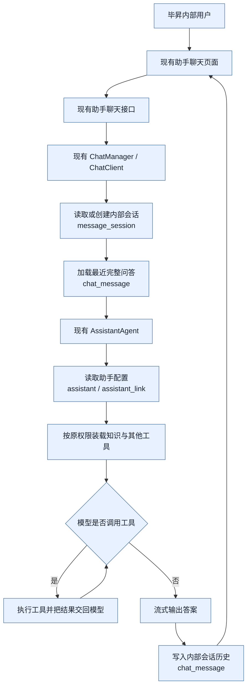
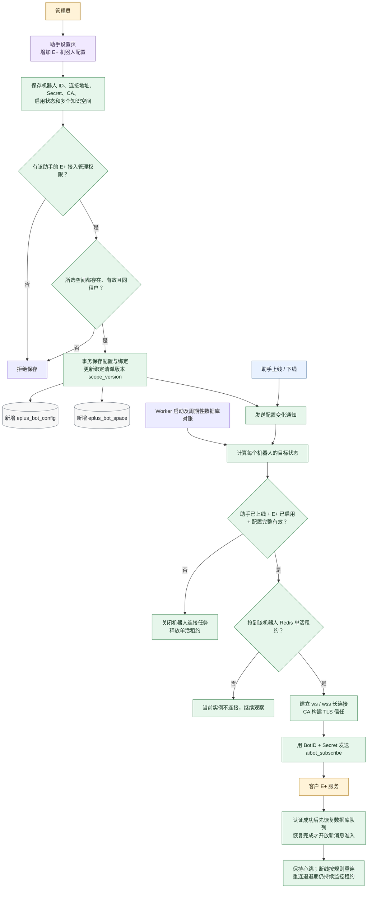
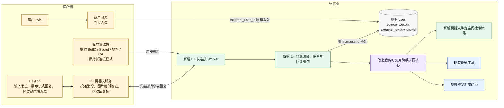
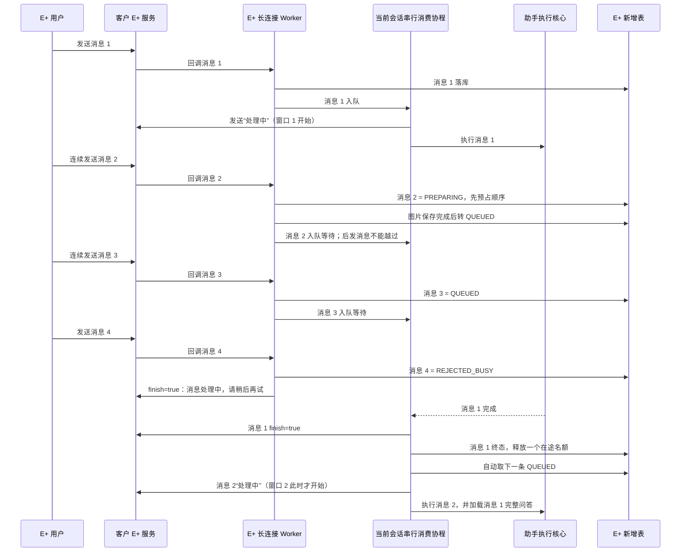
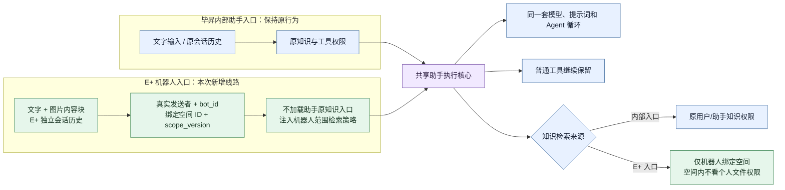
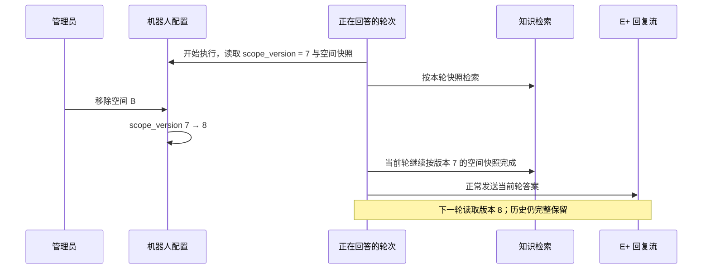

# F073 E+ 机器人对接技术评审流程图

> 本文是 `design.md` 的流程视图，用于技术评审。详细字段、协议约束和异常边界仍以 [design.md](./design.md) 为准。

## 1. 图例与范围

| 标记 | 含义 |
|---|---|
| 客户侧 | 客户 App、E+ 平台、客户 IAM/网关负责 |
| 本次新增 | F073 新增服务、流程或数据表 |
| 本次改造 | 修改毕昇现有助手能力，但必须兼容原入口 |
| 现有复用 | 直接使用现有能力，不改变原行为 |

本次不是给每个助手创建一个新 Worker。部署时新增一组**共享常驻的 E+ 长连接 Worker 进程**；一个 Worker 进程可以承载多个机器人连接任务，同一机器人通过 Redis 单活租约保证同一时刻只有一个连接持有者。

## 2. 原有毕昇助手执行流程（现状，不因 E+ 改变）

结论：内部入口仍使用 `message_session`、`chat_message` 和原有用户权限；E+ 消息不写这两张表，也不会改变内部助手的历史和权限行为。

## 3. 机器人配置与连接生命周期

生命周期规则：

1. 保存配置只落库，允许助手尚未上线。
2. 只有“助手已上线 + E+ 配置已启用 + 配置有效”才建立连接。
3. 助手下线、关闭 E+ 配置或删除配置时立即断开。
4. 助手已经在线时再启用 E+ 或轮换凭据，也会连接或重连，不要求重新上下线。
5. 变更通知用于快速响应，周期性数据库对账用于防止通知丢失。
6. 单活租约覆盖连接、断线和最长 30 秒的重连退避全过程；任何阶段丢失租约都会关闭该机器人本机任务。

## 4. 客户侧与毕昇侧完整职责

客户 App 的会话历史由 E+ 自己维护；毕昇不向 E+ 同步历史，也不提供 E+ 历史查询接口。毕昇另外保存内部机器人会话，只用于多轮理解、排队、幂等、审计和空间范围隔离。

## 5. E+ 消息进入后的完整主流程

```mermaid
flowchart TD
    MSG["客户 E+ 服务推送消息"] --> RECEIVE["长连接 Worker 收到消息"]
    RECEIVE --> BOT{"当前连接机器人与 aibotid 一致？"}
    BOT -->|否| DROP["拒绝并告警"]
    BOT -->|是| DEDUP["先插入回调记录<br/>eplus_inbound_message"]
    DEDUP --> DUP{"tenant + bot_id + msgid 已存在？"}
    DUP -->|是| OLD["按原记录处理，不重复执行助手"]
    DUP -->|否| USER{"用 wecom + from.userid<br/>找到有效毕昇用户？"}
    USER -->|否| NOPERM["回复：无权限使用<br/>记录终态"]
    USER -->|是| CONV["读取或创建机器人会话<br/>eplus_conversation"]
    CONV --> LIMIT{"该用户 + 机器人<br/>已有 3 条在途消息？"}
    LIMIT -->|是| BUSY["回复：消息处理中，请稍后再试<br/>状态 REJECTED_BUSY"]
    LIMIT -->|否| RESERVE["按到达顺序预占轮次<br/>eplus_turn = PREPARING"]
    RESERVE --> NORMALIZE["解析文字、图片或图文混排<br/>剥离群聊 @机器人"]
    NORMALIZE --> MEDIA{"有图片？"}
    MEDIA -->|是| DOWNLOAD["立即下载、解密、校验并存 MinIO"]
    MEDIA -->|否| TURN
    DOWNLOAD --> TURN["媒体准备完成<br/>PREPARING → QUEUED"]
    TURN --> Q["放入该会话串行队列"]
    Q --> WAIT{"前一轮已进入终态？"}
    WAIT -->|否| Q
    WAIT -->|是| RUN["会话消费协程取出下一条<br/>读取最新 scope 快照并生成执行 token<br/>状态改为 RUNNING / PROCESSING"]
    RUN --> PLACEHOLDER["发送第一帧：处理中<br/>该消息的 E+ 6 分钟回复窗口开始"]
    PLACEHOLDER --> ACK{"首帧回执成功？"}
    ACK -->|否| FAIL["不启动助手，记录失败"]
    ACK -->|是| CONTEXT["装入本轮固定 scope 快照<br/>加载跨版本完整历史"]
    CONTEXT --> IMAGE["按视觉模型 / OCR 能力处理图片"]
    IMAGE --> AGENT["调用共用助手执行核心"]
    AGENT --> TOOL{"模型是否调用工具？"}
    TOOL -->|普通工具| NORMALTOOL["按真实用户和原权限执行"]
    TOOL -->|毕昇知识| SCOPE["只检索机器人当前绑定空间"]
    NORMALTOOL --> AGENT
    SCOPE --> AGENT
    TOOL -->|生成回答| BUFFER["模型片段进入回复组包器<br/>约 1–2 秒或阈值合并"]
    BUFFER --> TIME{"距离首帧是否接近 5 分钟硬上限？"}
    TIME -->|是| TIMEOUT["取消下游任务<br/>发送处理超时 + finish=true"]
    TIME -->|否| STREAM["发送累计全文<br/>等待每帧回执"]
    STREAM --> DONE{"模型结束？"}
    DONE -->|否| BUFFER
    DONE -->|是| FINISH["发送 finish=true"]
    FINISH --> SUCCESS["写入答案与成功状态<br/>释放在途计数"]
    TIMEOUT --> END
    FAIL --> END
    SUCCESS --> NEXT["同一消费协程自动取下一条 QUEUED"]
    END --> NEXT

    classDef customer fill:#fff3d8,stroke:#ad7a18,color:#30220a;
    classDef added fill:#e6f6eb,stroke:#438a59,color:#173321;
    classDef changed fill:#f1e9ff,stroke:#7954a8,color:#291b3d;
    classDef existing fill:#e8f1ff,stroke:#4f78a8,color:#172033;
    classDef data fill:#f7f7f7,stroke:#6f7782,color:#20242a;
    classDef reject fill:#fdeaea,stroke:#aa4242,color:#431717;

    class MSG customer;
    class RECEIVE,BOT,DEDUP,DUP,USER,CONV,LIMIT,RESERVE,NORMALIZE,MEDIA,DOWNLOAD,TURN,Q,WAIT,RUN,PLACEHOLDER,ACK,CONTEXT,SCOPE,BUFFER,TIME,STREAM,DONE,FINISH,SUCCESS,NEXT added;
    class IMAGE,AGENT changed;
    class NORMALTOOL,TOOL existing;
    class DROP,NOPERM,BUSY,FAIL,TIMEOUT,END reject;
```

## 6. 用户连续发送消息时谁触发下一轮

`PREPARING/QUEUED` 都是本次 E+ 接入新增的状态，不是原有助手逻辑。同一机器人先按 E+ 到达顺序串行完成上下文读取和数据库预留，写入 `PREPARING` 后立即释放准入锁，再并发下载图片；因此慢图片不阻塞其他会话验人、排队或忙碌回复。队首未准备好时后续 `QUEUED` 不得先执行。下一条由同一个 Worker 的会话消费协程在前一轮结束后主动取出，不需要用户重新发送，也不经过 Celery。Worker 异常退出后，新租约持有者通过跨重连共享的恢复屏障先完成旧队列恢复，再开放新回调；中断的 `PREPARING/RUNNING` 标为失败，尚未开始的 `QUEUED` 恢复执行；RUNNING 的 execution token 防止旧 worker 延迟回写。

## 7. 助手核心到底改什么

这里的“替换”只表示：**本次 E+ 调用路径不加载助手原来的知识入口，改为注入机器人绑定空间范围**。它不修改助手配置，不替换整个助手，也不影响毕昇内部入口。

## 8. `scope_version` 的作用

`scope_version` 是机器人“绑定空间清单”的版本，不是知识文件内容版本。任何绑定增删都会递增；本期只用于配置通知、本轮范围快照标识和审计。它不用于过滤历史，也不取消正在执行的回答。

## 9. 数据落点与表变更

```mermaid
flowchart TD
    CFG["管理员保存机器人配置"] --> T1[("新增 eplus_bot_config<br/>一对一配置、密钥、连接状态、scope_version")]
    CFG --> T2[("新增 eplus_bot_space<br/>机器人与多个空间的绑定")]

    CALLBACK["E+ 消息到达"] --> T3[("新增 eplus_inbound_message<br/>msgid 去重、协议与回复状态")]
    CALLBACK --> EXISTINGUSER[("读取现有 user<br/>不改表结构")]

    ACCEPT["消息通过准入"] --> T4[("新增 eplus_conversation<br/>单聊/群聊上下文与顺序号")]
    ACCEPT --> T5[("新增 eplus_turn<br/>输入、图片引用、答案、执行状态")]

    RUN2["助手执行"] --> ASSISTANT[("读取现有 assistant / assistant_link<br/>不改表结构")]
    RUN2 --> KNOWLEDGE[("读取现有 knowledge 与索引<br/>不改表结构")]
    RUN2 -.->|"E+ 不读写"| OLD[("现有 message_session / chat_message")]

    IMAGE2["图片下载解密"] --> MINIO[("现有 MinIO<br/>保存图片对象")]
    CONTROL["连接、限流与恢复"] --> REDIS[("现有 Redis<br/>单活租约、发送额度")]

    classDef added fill:#e6f6eb,stroke:#438a59,color:#173321;
    classDef existing fill:#e8f1ff,stroke:#4f78a8,color:#172033;
    classDef data fill:#f7f7f7,stroke:#6f7782,color:#20242a;
    classDef changed fill:#f1e9ff,stroke:#7954a8,color:#291b3d;

    class CFG,CALLBACK,ACCEPT,IMAGE2,CONTROL added;
    class RUN2 changed;
    class EXISTINGUSER,ASSISTANT,KNOWLEDGE,OLD,MINIO,REDIS existing;
    class T1,T2,T3,T4,T5 data;
```

| 数据对象 | 增删改 | 何时写入 | 用途 |
|---|---|---|---|
| `eplus_bot_config` | 新增表 | 保存机器人配置、连接状态变化 | 助手与机器人一对一、凭据、连接状态、绑定版本 |
| `eplus_bot_space` | 新增表 | 管理员保存空间多选 | 机器人知识范围唯一真相 |
| `eplus_inbound_message` | 新增表 | 每条 E+ 消息最先写入 | `msgid` 幂等、协议状态、回复状态 |
| `eplus_conversation` | 新增表 | 有权限的首条单聊/群聊消息 | E+ 独立会话、顺序和当前空间版本 |
| `eplus_turn` | 新增表 | 消息通过准入后 | 排队、输入和图片引用、回答、审计 |
| `user` | 只读复用 | 每条消息验人 | 用 `source='wecom' + external_id=from.userid` 找真实用户 |
| `assistant` / `assistant_link` | 只读复用 | 配置及执行助手时 | 模型、提示词和工具配置 |
| `knowledge` 及索引 | 只读复用 | 机器人知识检索时 | 只在已绑定空间范围内召回 |
| `message_session` / `chat_message` | 不读不写 | 不适用 | 继续只服务毕昇内部助手入口 |

没有删除现有表，也不修改现有表结构；本次数据库范围是新增五张 E+ 专用表。

## 10. 本次改动范围与评审重点

| 范围 | 类型 | 工作量判断 | 主要风险 |
|---|---|---:|---|
| E+ 长连接协议、心跳、回执、重连、单活 | 新增 | 大 | 重复连接互踢、断线恢复、私有 CA |
| E+ 配置页与管理接口 | 改造 + 新增 | 中 | Secret 安全、上下线生命周期、同租户校验 |
| 五张 E+ 专用表及 schema discovery 自动建表 | 新增 | 中 | 幂等键、状态恢复、双数据库兼容 |
| 机器人会话排队与三条在途控制 | 新增 | 中 | 顺序、崩溃恢复、重复执行 |
| 图片下载、解密、存储及多模态分流 | 新增 + 改造 | 中到大 | 临时地址过期、解密错误、模型能力差异 |
| 共享助手执行核心支持显式内容和知识范围 | 改造 | 中到大 | 不能影响内部助手原行为 |
| 机器人绑定空间检索及嵌套工具范围传递 | 新增 + 改造 | 大 | 本次最高越权风险点 |
| 流式合并、5 分钟硬超时、6 分钟协议窗口 | 新增 | 中 | 超时后仍发送、结束帧配额不足 |
| 内部助手入口、内部历史、原权限逻辑 | 不改 | 回归范围大 | 必须证明兼容，而不是只测 E+ |
| OpenFGA 权限模型 | 不改 | 小 | 只校验助手管理权限，不新增空间动作 |
| 客户 IAM → 网关 → `user.external_id` | 复用确认 | 小 | `userid` 必须原样一致，不自动创建缺失用户 |

技术评审建议重点确认四件事：

1. Worker 的目标状态对账、单活租约和崩溃接管是否完整。
2. `msgid` 数据库幂等与 `QUEUED` 恢复是否可能重复执行或乱序。
3. E+ 路径的知识范围能否贯穿直接检索、工作流、API/MCP 等所有毕昇知识入口。
4. 5 分钟硬取消、`finish=true` 预留，以及执行中改绑时“本轮继续、下一轮生效”是否可验证。
