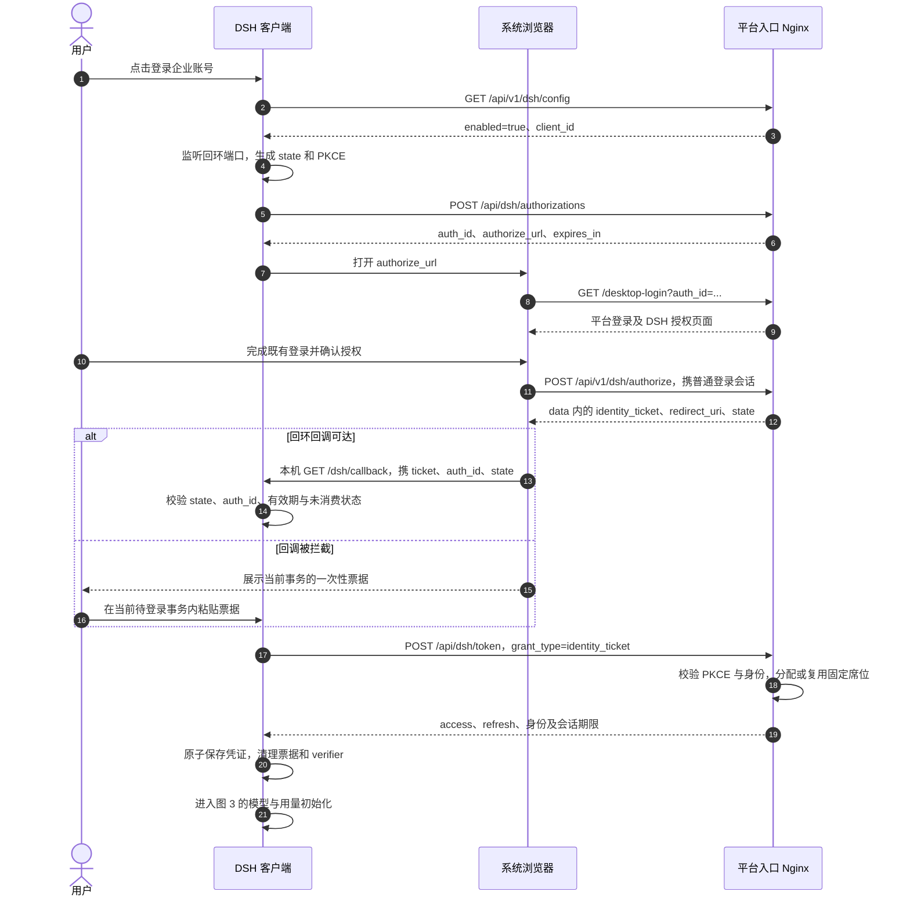
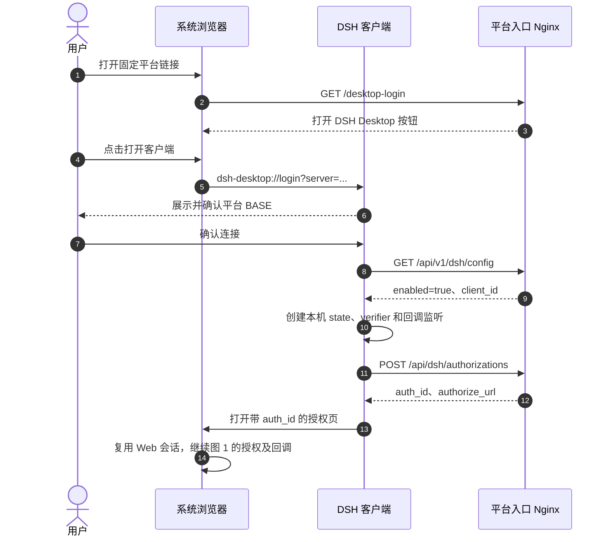
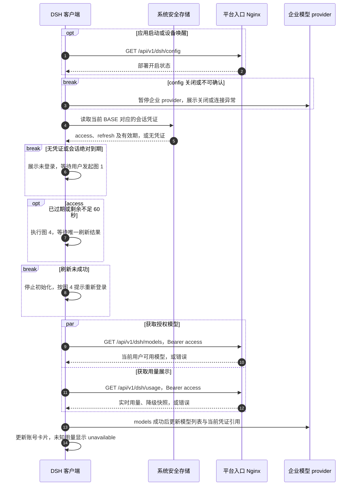
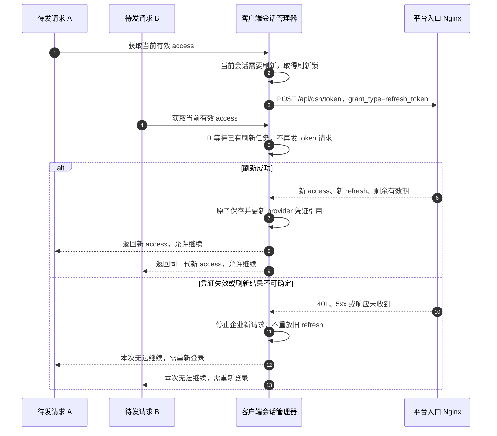
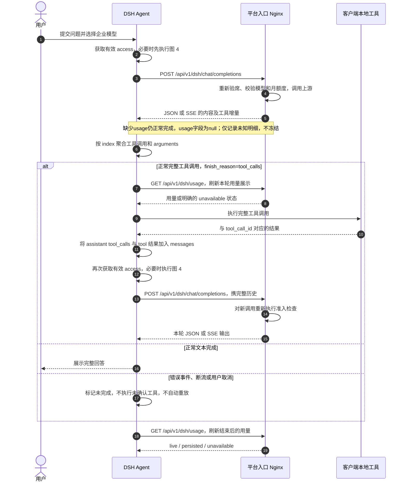
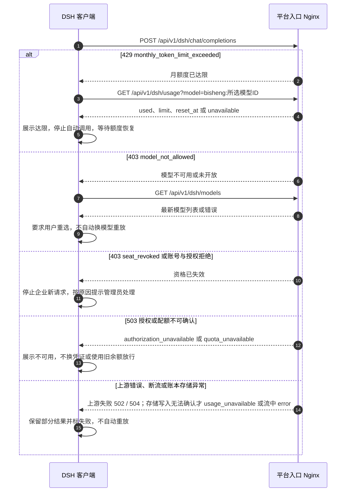
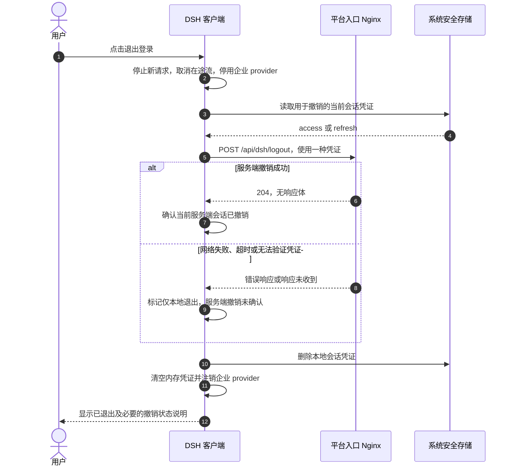

# DSH Desktop 接入 BiSheng：客户端开发与联调接口契约

> **2026-09-11 兼容修订（待服务端实现）**：移除安装标识不改变本公开契约，`contract_version` 保持 `0.5.0`。客户端无需新增参数或解析 JWT，现有登录、刷新、模型调用和缓存用量协议保持不变；测试环境切换需重新登录。详见可独立交付客户端的 [安装标识解绑兼容说明](./client-installation-unbinding-compatibility.md)。License schema=2 和内部 HMAC 变化仅由服务端/发行工具处理，不应因此把本接口升为 0.6.0。

> 0.4.0 部署简化：服务端改用共享 HMAC 派生的 HS256；客户端不持有密钥，将 token 视为不透明凭证。月度默认 Asia/Shanghai。接口路径和时序保持，旧 access token 需重新登录。详见 deployment-simplification.md。
版本：`0.5.0` · 日期：2026-09-10 · 所属：F062 / v3.0.0-beta2<br>
开发分支：`feat/3.0.0-beta2-pre`

**契约状态：`0.5.0` 新增缓存 Token 明细；字段扩展已获用户确认，客户端接收与联调待完成。** Gateway 开发分支为 `feat/dsh-access`（基于 main）。后续路径、字段、鉴权、错误、刷新或 SSE/工具调用行为如有改动，必须按 [Design §6.0](./design.md#60-客户端接口冻结与变更同步) 更新版本、同步本文与时序图，并记录客户端团队确认和联调结果；不得只改服务端实现。

> **交付状态：0.5.0 为本次服务端修订，客户端适配与真实缓存命中联调尚待完成；既有环境部署结果不等于本修订已部署。**
> 本文细化客户端与平台之间的线协议；[design.md](./design.md) 持有整体架构与服务端设计，本文是其客户端契约附件。两者修改须同步。
> 所有域名、凭证、账号和数值示例均为虚构。服务端及客户端按本文实现后，执行 §10 联调清单。

**客户端建议阅读顺序：先看 §2.3 的调用触发表和 [§12 时序图](#client-sequences)，再按图中路径查阅 §3～9 的字段与错误契约。**

## 1. 接入结论与需求来源

用户只配置一个 **BiSheng Nginx 公开地址**，支持 HTTP 或 HTTPS，例如 `http://192.168.106.109:13001`。登录、换证、刷新、模型与用量请求全部使用这个地址；无需填写 Gateway 地址、模型供应商地址或供应商密钥。

需求依据：2026-09-09 实际读取的[飞书 PRD v0.7（2026-09-03）](https://dataelem.feishu.cn/wiki/NHkFwHOrjizdmekwnuYc1CHsnPc) §4.1、§4.2、§4.5、§4.6，当前 [F062 Spec](./spec.md)、[Design](./design.md)，以及本次确认的单入口部署与商业控制边界。PRD 与后续设计存在演进，按下表接入：

| PRD / 需求 | 本期客户端契约 |
|---|---|
| 登录复用 BiSheng；桌面入口 A、固定链接入口 B | 均使用系统浏览器；B 先唤起客户端，再创建与 A 相同的 PKCE 授权事务，见 §4.2 |
| PRD 早期 PAT / `model:invoke` / F051 模型面 | 已被后续设计替代：使用独立 DSH Token 和本文 `/api/v1/dsh/*`，不调用 PAT/SAK 签发接口 |
| PRD 固定链接直接携 code 拉起客户端 | 本文补充：深链只带平台地址，票据仍在客户端创建 PKCE 后签发；不接受无本地事务的 code 自动登录 |
| 本机回调不可用时复制授权码 | 复制当前事务的一次性 `identity_ticket`，保留本地 `auth_id` 与 verifier；不是手动粘贴长效 Token |
| 企业 provider 自动注册、启动时刷新模型 | `openai-completions` provider；Base URL 由平台地址推导，模型 ID 从列表原样使用 |
| 姓名、租户、有效期、月用量 / 剩余 / 重置时间 | 换证响应提供身份与有效期；`/usage` 提供额度与时间边界 |
| 席位 / License | 固定自然人席位；登出或凭证过期不释放；管理员撤销后不能自行登录重新占席 |
| 月 token 控制 | 已累计实际用量达限拒绝新请求；在途可完成并超额，不预占，不截断统计 |
| RPM/TPM、金额、部门预算池、统计导出 | 不属于本期客户端接口，不据此增加客户端逻辑 |
| 不能通过修改开源代码绕过的早期绝对表述 | 用户已接受：仅保证未修改的官方 DSH 链路，保留现有模型执行边界 |

本文新增的字段和 B 入口串联方式为本轮设计细化，并非 PRD 已写明或线上已实现。Root 合法共享口径已同步 Spec；UNKNOWN 仅记录明细，不冻结用户，后续可按 Design §4.7.4 可靠补记，供应商计量样本仍待验收；客户端不自行判断模型租户归属，也不自行估算扣款。

## 2. 地址、路由与通用规则

### 2.1 一个地址，两类接口

设 `BASE = https://bisheng.example.com`，保存时删除末尾 `/`。本期地址为 origin（协议、主机、可选端口），不支持额外部署路径前缀；不填写 `/api`、`/api/v1` 或 `/workspace`。客户端接受 HTTP 和 HTTPS，不强制跳转或升级协议；使用 HTTPS 时校验证书。109 联调 BASE 为 `http://192.168.106.109:13001`，无需导入 CA。

```text
DSH / 浏览器 → BASE 对应的 Nginx
                       ├─ 页面请求 → BiSheng 前端
                       └─ /api/* → Gateway
                                      ├─ /api/v1/*、/api/v2/* → BiSheng 后端
                                      └─ 其他 /api/* → Gateway 自有接口
```

`/api/v*` 也属于 `/api/*`：先匹配已配置版本路由，再由 Gateway 处理其余接口。客户端始终保留下面列出的完整路径。服务间验席和身份兑换由服务端完成，客户端不调用 `/internal/`，不安装服务认证 Secret。

| # | 方法和完整路径（均在 BASE 下） | 执行业务的服务 | 客户端用途 | 凭证 |
|---|---|---|---|---|
| 1 | `GET /api/v1/dsh/config` | BiSheng | 探测开关与公开 client_id | 无 |
| 2 | `POST /api/dsh/authorizations` | Gateway | 建立浏览器授权事务 | 无；公共客户端 |
| 3 | `POST /api/dsh/token` | Gateway | 首次换证 / 刷新 | 一次性票据 + PKCE / refresh token |
| 4 | `POST /api/dsh/logout` | Gateway | 撤销当前设备会话 | DSH access token 或 refresh token |
| 5 | `GET /api/v1/dsh/models` | BiSheng | 企业模型列表 | DSH access token |
| 6 | `POST /api/v1/dsh/chat/completions` | BiSheng | JSON / SSE 模型调用 | DSH access token |
| 7 | `GET /api/v1/dsh/usage` | BiSheng | 当前用户逐模型月用量（省略模型为汇总） | DSH access token |

浏览器页面另调用 `POST /api/v1/dsh/authorize`（§4.3），它使用普通 BiSheng 登录会话。桌面端不收集用户密码、不读取浏览器 JWT，也不直接调用该接口。`GET /api/dsh/jwks` 供服务端验签，不是客户端接入依赖。

### 2.2 请求与响应

- POST 默认 `Content-Type: application/json; charset=utf-8`。除 SSE 外，响应为 JSON。
- 桌面端这 7 个接口的成功响应均为**裸 JSON**，不包 `status_code/status_message/data`；`models.data` 是模型数组，不是业务统一响应包装。logout 成功为 204，无响应体。
- 浏览器 `/authorize` 与管理接口沿用 BiSheng `UnifiedResponseModel`，见 §4.3；客户端不要编写“猜包装”的兼容逻辑。
- 需要 access token 时只发送 `Authorization: Bearer <access_token>`。refresh token 只放 token/logout 的 JSON body。请求 URL、日志、provider 导出、报错截图不得含凭证。
- 每个 HTTP 响应带服务端生成的 `X-Request-ID`；错误体内的 `request_id` 与它一致。客户端不要把它当重试幂等键；`chatcmpl-*` 的响应 ID 也不是重放键。
- 带凭证或个人数据的响应使用 `Cache-Control: no-store`。错误使用真实 HTTP 状态码，禁止 HTTP 200 包裹失败。
- 主体 ID 均为不透明字符串；用户 / 租户由认证确定，客户端不提交 `tenant_id`、`user_id`、`seat_id` 或冒充身份的请求头。
- UTC 时间使用 RFC 3339（如 `2026-09-09T02:00:00Z`）；时长单位为秒。月归属另带 `billing_timezone`，不能按客户端本地时区推算。
- 本文请求字段之外的字段，服务端应返回 400 `unsupported_parameter`，不能静默丢弃。客户端忽略响应中未知的扩展字段。

### 2.3 客户端何时调用什么

以下远程路径全部拼接到同一个 BASE。时序图中的“平台入口”就是 Nginx，服务端自行分派到 Gateway 或 BiSheng；客户端无需直接连接两个服务。

| 触发时机 | 调用顺序 / 本地动作 | 进入下一步的条件 | 时序 |
|---|---|---|---|
| 用户点击“登录企业账号” | GET config → 本地 PKCE → POST authorizations → 系统浏览器授权 → POST token（identity_ticket） | config 开启、用户确认、本地回调匹配、换证成功 | [图 1](#seq-login) |
| 固定网页点击“打开 DSH Desktop” | 深链唤起 → 客户端确认 BASE → 接入图 1 | 仅唤起不算登录，不能直接兑换无本地事务的票据 | [图 2](#seq-deeplink) |
| 换证成功 / 应用启动 / 设备唤醒 | 检查凭证 → 必要时 POST token（refresh_token）→ GET models 与 GET usage | 模型列表成功才更新企业 provider；用量失败按 unavailable 展示 | [图 3](#seq-startup) |
| access 剩余不足 60 秒；或收到明确准入前 invalid_access_token 401 | 同会话只发一次 POST token（refresh_token）→ 原子更新凭证 → 唤醒等待请求 | 刷新成功才继续；响应不确定时重新登录，不重发旧 refresh | [图 4](#seq-refresh) |
| 用户提交问题 / 工具执行结果已齐 | POST chat/completions → 消费 JSON/SSE → 本地执行完整工具调用 → 下一次 POST chat/completions | 工具调用必须完整成功；正常结束后读取 usage | [图 5](#seq-model) |
| 进入账号页 / 模型请求结束 / 用户手动刷新用量 | GET usage；账号页持续打开时建议每 30 秒一次 | 不按 chunk 查询，不将旧快照当准入依据 | [图 5](#seq-model) |
| 模型请求返回 403 / 429 / 503，或流中失败 | 按错误类型展示、停用或刷新列表 / 用量，不自动重放模型请求 | 重新具备资格或用户调整后，才能发起新的独立调用 | [图 6](#seq-errors) |
| 用户点击“退出登录” | 停止本地新请求 → POST logout → 清理本地凭证与 provider | 204 才确认服务端撤销；失败也完成本地退出，席位始终保留 | [图 7](#seq-logout) |

GET models 与 GET usage 是独立读取，可以并行；usage 的展示响应不是下一次模型调用的授权票据。每次 chat/completions 都由服务端重新验席、检查模型与额度。

## 3. 能力探测

`GET {BASE}/api/v1/dsh/config`，无请求体、无 Authorization。

200（已开启）：

```json
{"enabled":true,"client_id":"dsh-desktop","contract_version":"0.5.0"}
```

200（部署未开启）：

```json
{"enabled":false}
```

`enabled` 必返；仅 true 时必返 `client_id`、`contract_version`。client_id 是公开标识，不是 Secret；使用响应值。此接口不返回 `gateway_public_url`。enabled=true 只说明部署开关开启，不代表本用户已获席位、租户准入或模型授权；后续接口仍需校验。

404 / HTML / 不符合契约的 JSON：提示“平台版本暂不支持 DSH 或地址配置有误”；网络失败、502/503、非 JSON 错误页：提示连接或服务异常。二者均不能当作 `enabled=false`，不能回退到普通 JWT 或 V2 API Key。

## 4. 浏览器登录

### 4.1 入口 A：从客户端登录

1. 客户端保存 BASE，完成 config 探测；绑定 `127.0.0.1` 的系统分配空闲端口，回调路径固定 `/dsh/callback`，不监听 `0.0.0.0`。
2. 生成随机 `state` 和 PKCE `code_verifier`，仅保存在当前本地待登录事务中。计算 S256 challenge。
3. 调用 `/api/dsh/authorizations`，保存 `auth_id`、到期时刻、回调地址和 BASE；最多保留一个正在交互的登录事务，重新开始时废弃旧本地事务。
4. 打开返回的 `authorize_url`；浏览器完成平台既有登录（含企业 SSO）并明确确认 DSH 授权。
5. 接收当前事务的 loopback 回调或手动粘贴的票据。校验通过后只调用一次 `/api/dsh/token` 换证。
6. 将凭证原子写入操作系统安全存储，关闭监听器，清理 verifier / ticket，读取 models 与 usage，注册企业 provider。

PKCE：verifier 为 43～128 个 RFC 7636 unreserved ASCII 字符，建议 32 字节密码学随机数的无填充 base64url 编码；`code_challenge = BASE64URL(SHA256(ASCII(code_verifier)))`，固定 `S256`，不支持 `plain`。state 同样使用至少 32 字节密码学随机数，不复用。此处遵循 [RFC 7636](https://www.rfc-editor.org/rfc/rfc7636)；系统浏览器与 loopback 模式参考 [RFC 8252](https://www.rfc-editor.org/rfc/rfc8252)，本接口不是通用 OAuth Server。

### 4.2 入口 B：固定网页链接唤起客户端

固定入口为 `https://bisheng.example.com/desktop-login`，由平台前端提供；可放入工作台“DSH Desktop”入口或入职文档。它不含身份、auth_id 或票据。

页面常驻“打开 DSH Desktop”按钮，触发：

```text
dsh-desktop://login?server=https%3A%2F%2Fbisheng.example.com
```

客户端注册此协议，处理首次启动和已运行时的协议事件。仅接受 `login` host、空 path、一个 URL 编码的 `server` 参数；重复参数、userinfo、片段、额外路径和非 HTTP/HTTPS server 拒绝。解析后展示平台地址并让用户确认；未确认不得替换现有 BASE 或向新平台发送任何已有凭证。

确认后从 §4.1 第 1 步开始，新建自己的 state/verifier。已登录的平台浏览器可以复用 Web 会话，再完成本次 DSH 授权；最终姓名 / 租户取自换证后的可信响应，不信任深链的姓名参数。

这是对 PRD B 入口的技术收敛：**深链用于唤起与选择平台，授权票据仍回到客户端已建立的 PKCE 事务**。因此不支持旧形态 `dsh-desktop://login?...&code=...` 直接兑换，也不把另一个设备 / 未绑定事务的票据导入登录。未安装客户端提供下载入口；协议被浏览器拦截时允许用户手动打开客户端并填写同一个 BASE。

### 4.3 建立事务、浏览器授权与回调

`POST {BASE}/api/dsh/authorizations`：

```json
{
  "client_id":"dsh-desktop",
  "redirect_uri":"http://127.0.0.1:49152/dsh/callback",
  "code_challenge":"E9Melhoa2OwvFrEMTJguCHaoeK1t8URWbuGJSstw-cM",
  "code_challenge_method":"S256",
  "state":"N8x6LXw61DPlYNVoKm5rWOj2vbJmZiRK1CPIyw50HBs",
  "device_name":"Work Mac"
}
```

以上除 `device_name` 外均必填；device_name 为 1～100 字符的显示标签，不用于身份或席位计数。redirect_uri 必须是本次登记的 IPv4 loopback、端口与固定路径，无 query/fragment/userinfo；不接受 localhost、任意 HTTP URL 或自定义协议作为此回调。

200：

```json
{
  "auth_id":"auth_01_example",
  "authorize_url":"https://bisheng.example.com/desktop-login?auth_id=auth_01_example",
  "expires_in":300
}
```

客户端校验 authorize_url 与 BASE 同 origin，路径为 `/desktop-login`，auth_id 匹配，然后使用系统浏览器打开。不要跟随它去另一 origin 兑换凭证。事务有效期 300 秒；过期重新开始，不复用 verifier。

浏览器页面通过既有登录/CSRF 机制执行：

```http
POST /api/v1/dsh/authorize
Content-Type: application/json

{"auth_id":"auth_01_example"}
```

HTTP 200 成功体（**只由平台前端消费**）：

```json
{
  "status_code":200,
  "status_message":"SUCCESS",
  "data":{
    "identity_ticket":"ticket_example_only",
    "redirect_uri":"http://127.0.0.1:49152/dsh/callback",
    "state":"N8x6LXw61DPlYNVoKm5rWOj2vbJmZiRK1CPIyw50HBs",
    "expires_in":60
  }
}
```

服务端从 auth_id 查登录意图，从浏览器真实登录身份确认主体；客户端不能在此传用户名/租户替代身份。平台前端使用返回的已校验 redirect_uri 构造回调：

```text
http://127.0.0.1:49152/dsh/callback?auth_id=auth_01_example&identity_ticket=ticket_example_only&state=N8x6LXw61DPlYNVoKm5rWOj2vbJmZiRK1CPIyw50HBs
```

回调为本机 GET，不是服务器 API。客户端检查 path、auth_id、state 与本地事务严格一致、未超时，拒绝重复参数、缺字段和重复消费；忽略不匹配的回调并保留当前合法事务。票据有效期 60 秒且不超过授权事务剩余有效期。监听器成功接收后显示“可以回到 DSH Desktop”，不回显票据；页面不加载第三方资源，使用 no-store 与 `Referrer-Policy: no-referrer`。

用户拒绝授权时，平台前端回调 `?auth_id=...&error=access_denied&state=...`，不附 identity_ticket；合法拒绝使客户端清理事务并回到未登录。浏览器直接关闭则等待事务超时或用户主动取消。回调错误只接受白名单 `access_denied`、`authorization_expired`、`authorization_failed`，不执行服务端返回的任意 URL 或脚本。

浏览器拒绝的服务端接线：同一个 `POST /api/v1/dsh/authorize` 接受 `{"auth_id":"...","decision":"deny"}`，经相同浏览器登录/Origin 校验后仅解析并校验 Gateway 保存的回调，返回 `data:{"error":"access_denied","redirect_uri":"http://127.0.0.1:<port>/dsh/callback","state":"..."}`，不生成票据。`decision` 省略或为 `approve` 保持上述成功体；失败时页面不得猜测回调。此字段仅供平台浏览器使用，Desktop 的 7 个接口和既定拒绝回调保持 0.4.0 契约不变。

**复制粘贴兜底**：平台确认页始终保留“复制一次性授权码”，复制内容就是当前 `identity_ticket`。客户端仅在存在当前待登录事务时接受粘贴，并与本地 auth_id/verifier 一起兑换；不接受粘贴 BASE、长效 Token 或任意回调 URL 自动切换服务器。即使 loopback 被拦截，仍登记同一 loopback redirect_uri，手动通道只替代回传方式，不跳过 PKCE。票据过期需要新建登录事务并重新确认。

### 4.4 票据换证

`POST {BASE}/api/dsh/token`，无 Authorization、无 client_secret：

```json
{
  "grant_type":"identity_ticket",
  "identity_ticket":"ticket_example_only",
  "auth_id":"auth_01_example",
  "code_verifier":"dBjftJeZ4CVP-mB92K27uhbUJU1p1r_wW1gFWFOEjXk"
}
```

4 个字段均必填。200：

```json
{
  "token_type":"Bearer",
  "access_token":"access_token_example_only",
  "expires_in":300,
  "refresh_token":"refresh_token_example_only",
  "refresh_expires_in":2592000,
  "session_id":"session_example",
  "session_expires_at":"2026-10-09T02:00:00Z",
  "user":{"id":"1001","username":"demo.user","display_name":"Demo User"},
  "tenant":{"id":"1","name":"Demo Tenant"}
}
```

以上响应字段均必返。access token 是客户端视角的不透明凭证，不通过解码 JWT 自行决定权限或依赖内部 claims。user / tenant 为服务端在本次换证或刷新时从可信身份服务取得的当前显示信息，名称不是授权依据；无需另外调用普通 `/user` API。expires_in 是本次 access token 的剩余秒数，refresh_expires_in 是本次 refresh 的剩余秒数；默认 access 300 秒、会话绝对有效期 30 天，客户端使用返回值而不写死。刷新不延长绝对期限。display_name 缺失时使用 username；租户名称缺失时使用 `Tenant <tenant.id>`。这些回退不新增字段，客户端直接展示返回值。

成功才显示已登录。无可用模型不影响登录成功；换证失败按 §9 处理。请求超时或响应丢失时，不自动重放已消费票据，重新发起浏览器登录；可能已提交的固定席位继续保留，下次登录复用，不重复占席。

## 5. 刷新、存储与退出

### 5.1 刷新

仍调用 `POST {BASE}/api/dsh/token`：

```json
{"grant_type":"refresh_token","refresh_token":"refresh_token_example_only"}
```

200 响应字段与 §4.4 完全一致；每次返回**新的 access 和 refresh token**。使用同一会话锁串行刷新（含多个 provider / worker 的并发调用），其他请求等待同一个刷新结果；成功后原子替换两个凭证。旧 refresh 再次使用会触发重放检测、撤销该会话族并要求重新登录。

建议 access 剩余不足 60 秒时刷新，以响应时长和单调时钟调度，设备唤醒后重新检查。刷新超时、连接中断、5xx 或响应丢失不自动重发旧 refresh；标记会话不可确定并重新登录。已开始的 SSE 不因本地 access 到期被主动中断。

`401 invalid_access_token` 且尚未向上游执行的明确拒绝可触发一次串行刷新；GET 成功刷新后可重试一次。模型 POST 只有收到这类完整的准入前 401 时才允许刷新后重发一次；网络错误、502/504、部分输出或流中错误均不得自动重放。403、429、503 不能用反复刷新解决。

凭证按 `(BASE, tenant.id, user.id, session_id)` 隔离保存在操作系统安全存储。provider 保存凭证引用或按请求取最新 access token，不把 refresh token 当 apiKey，不把即将过期的 access 固化进普通配置。切换 BASE 或账号先停用旧企业 provider，不能把旧凭证发送到新平台。

### 5.2 当前设备登出

二选一，不能同时提交两种凭证：

```http
POST /api/dsh/logout
Authorization: Bearer <access_token>
Content-Type: application/json

{}
```

或在 access 已过期时：

```json
{"refresh_token":"refresh_token_example_only"}
```

成功 HTTP 204，无响应体；只撤销当前会话及 refresh family，不撤销其他设备会话、不释放席位。合法凭证能定位到已登出的会话时仍返回 204；过期/未知、不能验证的凭证返回 401。refresh 在此用于定位并撤销会话，不执行刷新轮换。

客户端立即停止新企业请求、取消本设备在途请求、注销企业 provider 并清理本地凭证；调用失败也完成本地退出，但提示“本地已退出，服务端会话撤销未确认”，不能把超时报告为服务端已撤销。License 过期或 DSH 关闭时，服务端仍应允许可验证凭证撤销当前会话。

## 6. 模型列表与 provider 注册

`GET {BASE}/api/v1/dsh/models`，Bearer DSH access token。200：

```json
{
  "object":"list",
  "data":[{
    "id":"bisheng:42",
    "object":"model",
    "created":1788919200,
    "owned_by":"bisheng",
    "display_name":"百炼 / qwen-max",
    "capabilities":{"streaming":true,"tools":true,"reasoning_content":false}
  }]
}
```

上述字段均必返；created 为 Unix 秒。capabilities 三项为布尔值，`reasoning_content` 表示该适配器已验证的 DeepSeek 兼容扩展能力；不依据模型名推断。模型列表必须已经过现有模型可访问性与 DSH 白名单过滤；合法共享模型的物理 tenant_id 不返回给客户端作为过滤依据。

`display_name` 与毕昇管理端保持一致：`提供方名称 / 实际模型名`。两部分先去除首尾空白；提供方名称为空时使用提供方类型，实际模型名为空时回退模型配置名称。不新增 provider 字段，`owned_by` 仍为 `bisheng`。

列表一次返回当前用户全部可用模型，本期无分页参数。空数组为成功结果，展示“管理员尚未开放可用企业模型”。模型名只用于展示，调用必须原样使用 id（`bisheng:<model_id>`），不传供应商原始模型名或自行拼接名称。

企业扩展包配置：

| 项 | 值 |
|---|---|
| provider 协议 | PRD 所述 `openai-completions`，本期 API 是 Chat Completions，不是旧 `/completions` 或 Responses API |
| Base URL | `{BASE}/api/v1/dsh`（SDK 自动补 `/chat/completions`，不得再补 `/v1`） |
| apiKey / Bearer 来源 | 当前 DSH access token，刷新后同步更新 |
| models | GET models 返回列表；按模型 id 唯一标识 |
| 网络发起位置 | 桌面主进程 / dsh 运行时，由企业扩展包调用；不依赖网页跨域读取企业接口 |

登录成功、每次应用启动、用户手动刷新时重新获取列表。收到 `model_not_allowed` 时刷新一次列表并要求重选，不自动替用户切换模型重放原请求。列表失败显示不可用；旧列表可灰显但不能当作权限仍然有效的证据。本期不使用 `/api/v2/models`、`/responses` 或 Anthropic Messages。

## 7. Chat Completions、工具调用与流式处理

`POST {BASE}/api/v1/dsh/chat/completions`，Bearer DSH access token。

| 字段 | 必填 / 默认 | 类型与规则 |
|---|---|---|
| model | 必填 | models 返回的 id 字符串 |
| messages | 必填 | 非空数组；role 为 system/user/assistant/tool；文本 content 为字符串；带 tool_calls 的 assistant 可为 null |
| tools | 可选 | function 工具数组；function.name、description（可选）、parameters（JSON Schema 对象）；不支持其他工具类型 |
| tool_choice | 默认 auto（传 tools 时） | `auto`、`none`、`required` 或 `{"type":"function","function":{"name":"..."}}`；required/指定工具必须有对应 tools；适配器不支持则明确拒绝 |
| stream | 默认 false | boolean；true 返回 SSE |
| stream_options | 可选 | 仅 stream=true 时可传 `{"include_usage":true}`；省略时不输出末尾 usage 块 |
| max_tokens | 可选 | 正整数，实际上限由模型配置校验；不是月额度预占值 |
| max_completion_tokens | 可选 | max_tokens 的替代输入，不允许两者同时传；无法保留语义的模型显式拒绝 |
| temperature / top_p | 可选 | number；分别 0～2、0～1，额外模型约束显式拒绝，不静默裁剪 |
| stop | 可选 | 字符串或 1～4 个字符串数组，模型不支持时明确拒绝 |
| n | 默认 1 | 一期仅接受整数 1 |

tool 消息必带 tool_call_id 并对应前面的 assistant tool_calls；assistant tool_calls 每项必带 id、type=function、function.name、function.arguments（JSON **字符串**）。一期不承诺图像/音频/文件 content、多模态、logprobs、response_format 等未列参数。超长上下文返回 400 `context_length_exceeded`，不静默截断历史。

### 7.1 非流式与工具闭环

请求示例：

```json
{
  "model":"bisheng:42",
  "messages":[{"role":"user","content":"查询文档 KB-1 的标题"}],
  "tools":[{"type":"function","function":{"name":"lookup_document","description":"Find a document title","parameters":{"type":"object","properties":{"id":{"type":"string"}},"required":["id"]}}}],
  "tool_choice":"auto",
  "stream":false,
  "max_tokens":1024
}
```

200 示例：

```json
{
  "id":"chatcmpl-example",
  "object":"chat.completion",
  "created":1788919200,
  "model":"bisheng:42",
  "choices":[{"index":0,"message":{"role":"assistant","content":null,"tool_calls":[{"id":"call_1","type":"function","function":{"name":"lookup_document","arguments":"{\"id\":\"KB-1\"}"}}]},"finish_reason":"tool_calls"}],
  "usage":{"prompt_tokens":100,"completion_tokens":20,"total_tokens":120,"prompt_tokens_details":{"cached_tokens":80,"cache_creation_tokens":null}}
}
```

客户端执行工具，然后将**完整 assistant tool_calls 消息和每个对应 tool 结果**加入 messages，发起下一次独立模型调用：

```json
{
  "model":"bisheng:42",
  "messages":[
    {"role":"user","content":"查询文档 KB-1 的标题"},
    {"role":"assistant","content":null,"tool_calls":[{"id":"call_1","type":"function","function":{"name":"lookup_document","arguments":"{\"id\":\"KB-1\"}"}}]},
    {"role":"tool","tool_call_id":"call_1","content":"{\"title\":\"Installation Guide\"}"}
  ],
  "stream":false
}
```

服务端只执行模型推理，工具由 DSH 执行，平台不代跑工具、不建立聊天会话。多个工具调用须逐个匹配结果。`finish_reason=stop` 表示回答完成，`length` 表示到输出上限（展示截断，不自动续写），`tool_calls` 表示需要客户端执行工具，`content_filter` 展示受限，不误判为正常答案。

### 7.2 SSE

请求加 `"stream":true,"stream_options":{"include_usage":true}`。HTTP 200 头含 `Content-Type: text/event-stream`；Nginx 与 Gateway 逐块转发、不缓冲整段、不进行上游自动重试。

正常文本流示例（事件间空行是协议的一部分）：

```text
data: {"id":"chatcmpl-example","object":"chat.completion.chunk","created":1788919200,"model":"bisheng:42","choices":[{"index":0,"delta":{"role":"assistant","content":""},"finish_reason":null}]}

data: {"id":"chatcmpl-example","object":"chat.completion.chunk","created":1788919200,"model":"bisheng:42","choices":[{"index":0,"delta":{"content":"Hello"},"finish_reason":null}]}

data: {"id":"chatcmpl-example","object":"chat.completion.chunk","created":1788919200,"model":"bisheng:42","choices":[{"index":0,"delta":{},"finish_reason":"stop"}]}

data: {"id":"chatcmpl-example","object":"chat.completion.chunk","created":1788919200,"model":"bisheng:42","choices":[],"usage":{"prompt_tokens":10,"completion_tokens":1,"total_tokens":11,"prompt_tokens_details":{"cached_tokens":8,"cache_creation_tokens":null}}}

data: [DONE]

```

工具增量中的关键 delta 示例：

```json
{"tool_calls":[{"index":0,"id":"call_1","type":"function","function":{"name":"lookup_document","arguments":""}}]}
```

```json
{"tool_calls":[{"index":0,"function":{"arguments":"{\"id\":"}}]}
```

```json
{"tool_calls":[{"index":0,"function":{"arguments":"\"KB-1\"}"}}]}
```

这三段在真实响应中位于 `choices[0].delta`，使用相同 completion id；工具流终止帧的 finish_reason 为 tool_calls。以 `(choice.index, tool_call.index)` 聚合，保存首见 id/type/name，按顺序拼接 arguments，不能按网络块直接 JSON.parse 参数，也不能仅拼 content。等正常终止和完整合法参数后才执行工具；断流或 error 后不得执行尚未确认完整的工具调用。

解析器需处理 UTF-8 跨网络块、多事件粘包、LF/CRLF、注释心跳（如 `: ping`）和空 delta；按 SSE 事件边界组装再解析 JSON，不能把一次 read 当成一个事件。usage 块允许 choices=[]；没有 include_usage 时不输出它，但服务端仍记账。只有正常结束才有 `[DONE]`；中途 EOF、缺失正常 finish_reason 或错误事件都标记本次调用失败 / 未完整，不假装成功。

已发送 HTTP 200 后发生错误：

```text
event: error
data: {"error":{"message":"Upstream connection interrupted","type":"upstream_error","code":"upstream_error"},"request_id":"req_example"}

```

服务端发出上述错误事件后关闭连接，不发 `[DONE]`。客户端既识别 `event: error`，也检查 data 中的 error 对象，避免被 SDK 当普通 chunk 丢弃。保留已收到的文字并标记未完成，停止工具执行，不自动重放。客户端取消请求通过关闭流 / AbortSignal 传播到平台和上游；已发生实际用量仍入账，不因取消归零。

### 7.3 DeepSeek 扩展与 usage

自 0.5.0 起，JSON 回答和 SSE 最终 usage 块都包含 `usage.prompt_tokens_details`：

| 字段 | 类型 | 含义 |
|---|---|---|
| `cached_tokens` | 非负整数或 null | 输入缓存命中读取量，对应 LangChain `input_token_details.cache_read`；兼容上游 `prompt_tokens_details.cached_tokens`、`cache_read_input_tokens`、`prompt_cache_hit_tokens` |
| `cache_creation_tokens` | 非负整数或 null | 缓存写入量，DSH 扩展字段，对应 `input_token_details.cache_creation` / `cache_creation_input_tokens` |

上游明确返回 0 才展示 0；未返回或格式无效则为 null。两项独立，不从输入总量推算缓存量，不从缓存量反推总量。归一化明细优先于上游原始明细；缓存明细异常不丢弃可靠的输入/输出/总 Token。保持原有 `total_tokens` 和月额度算法，不再次加上缓存量，也不做价格折算。缺失三个总量时，仍可保留供应商明确上报的缓存明细。

SSE 仅在 `stream_options.include_usage=true` 时返回最终 usage 块；未请求该块仍记录缓存明细。请求路径、鉴权、PKCE、工具调用和时序不变。旧客户端不应拒绝新增字段；需要展示缓存量的客户端读取上述对象。服务端 `/config` 返回版本 0.5.0，客户端版本白名单需同步更新。新增字段及空值解析须在联合发布前联调确认，本次未对外发送同步消息。

仅当 models.capabilities.reasoning_content=true 时，允许 assistant 消息及响应 message/delta 携带 `reasoning_content` 字符串，并在需要的工具多轮中保留它；它不等同于 content，不作为工具参数或最终正文拼接。false 时提交此字段返回 400 `unsupported_parameter`。供应商样本未通过 PoC 前服务端不得标 true。

正常已知用量使用 prompt_tokens / completion_tokens / total_tokens 非负整数，total 为输入与输出之和。未获取到 usage 时三个字段均为 null，不记为 0。已成功生成的非流式回答仍返回 HTTP 200；SSE 正常发送 finish_reason、可选 usage 块和 `[DONE]`。仅缺失 usage 不产生 `usage_unavailable`，不冻结用户或模型，不触发客户端自动重试。上游实际失败仍按对应错误返回；账本无法可靠写入时仍可返回 503 usage_unavailable。平台保留 USAGE_UNKNOWN 调用明细，后续按已记录的逐模型额度判断。

## 8. 当前模型月用量与账户汇总

`GET {BASE}/api/v1/dsh/usage?model=bisheng:42`，Bearer DSH access token，无用户或月份参数。`model` 是可选参数，格式与 chat/completions.model 一致；当前用户未配置该模型时返回 403 model_not_allowed。选择或切换模型后、调用完成后查询该模型的独立月用量。200：

```json
{
  "month":"2026-09",
  "billing_timezone":"Asia/Shanghai",
  "period_start":"2026-08-31T16:00:00Z",
  "reset_at":"2026-09-30T16:00:00Z",
  "used":1500,
  "limit":1000,
  "remaining":0,
  "source":"live",
  "as_of":"2026-09-09T02:00:00Z",
  "quota_state":"exhausted"
}
```

以上字段必返。指定 model 时，used / limit / remaining 仅属于该模型，单位均为 token；remaining=max(limit-used, 0)，used 可超过 limit；limit=0 只禁止该模型新调用，不表示无限额度，不影响其它模型。month 与两个边界时间由服务端配置的计费时区计算，客户端仅展示。跨月请求归入准入时的月份。

省略 `model` 的旧调用仍返回相同字段，但为**不可借用的展示汇总**：used 包含当前月全部历史模型实际用量；limit 为当前配置的各模型限额之和；remaining 为各当前模型 `max(model_limit-model_used,0)` 的和，不能用总量相减。模型 A 超额不侵占模型 B 的额度；移除模型仍保留历史消费。汇总 available 只表示存在仍有额度的模型，不能证明所选模型可调用。客户端不要用汇总余额禁用所有模型，应查询选中的模型。

| 字段 | 值与消费规则 |
|---|---|
| source | live 为实时账本；persisted 为 SQL 延迟投影，只可展示；unavailable 为没有可信展示数据 |
| as_of | RFC 3339 数据观测/投影时刻；没有可信快照为 null；不能用 HTTP 返回时刻冒充投影时刻 |
| quota_state | available / exhausted / unavailable；不能只由 remaining 推断是否可调用 |
| used / remaining | unavailable 且无快照时为 null；persisted 可有旧值，但 quota_state 必为 unavailable |
| limit | 已确认的策略上限；策略也无法确认时为 null，不能默认 0 |

降级示例：

```json
{"month":"2026-09","billing_timezone":"Asia/Shanghai","period_start":"2026-08-31T16:00:00Z","reset_at":"2026-09-30T16:00:00Z","used":1200,"limit":1000,"remaining":0,"source":"persisted","as_of":"2026-09-09T01:59:30Z","quota_state":"unavailable"}
```

只有在当前 DSH 身份与席位仍能确认时才返回这种 200 降级展示；验席不可用仍返回 503，身份无效仍返回 401/403。界面显示“用量暂不可用，以下为历史快照及时间”；不使用该数值放行模型。正常在途请求尚未入账不代表异常，不预扣 remaining。建议进入账号页和每次模型请求结束后刷新，持续打开时每 30 秒刷新一次，暂停后台轮询；不要每个 SSE chunk 请求 usage。

## 9. 错误码与客户端动作

错误体统一为：

```json
{"error":{"message":"Monthly token limit reached","type":"quota_error","code":"monthly_token_limit_exceeded"},"request_id":"req_example"}
```

error.message 为可展示的服务端说明，不解析其文案；error.code 为稳定字符串，客户端据此本地化。内部 MMMEE 编码仍按 C5 实现前注册，不把本表字符串伪装成已有数字错误码。error.type 分组见下表；不暴露堆栈、上游密钥或内部地址。

| HTTP | error.code | error.type | 客户端动作 |
|---|---|---|---|
| 400 | invalid_request / unsupported_parameter / context_length_exceeded | invalid_request_error | 校验或调整请求，不自动原样重发 |
| 400 | invalid_grant / pkce_verification_failed / authorization_expired | authentication_error | 清理当前授权事务，重新浏览器登录；不重用 ticket |
| 401 | invalid_access_token | authentication_error | 仅按 §5.1 刷新一次；仍失败重新登录 |
| 401 | invalid_refresh_token / refresh_token_reused / session_expired / session_revoked | authentication_error | 清理凭证与 provider，要求重新登录 |
| 403 | seat_limit_reached | permission_error | 席位已满，联系管理员，不循环登录抢席 |
| 403 | seat_revoked | permission_error | 停止新请求；提示管理员重新分配后必须重新登录，旧凭证不会复活 |
| 403 | license_invalid / license_expired / dsh_disabled | permission_error | 显示对应不可用原因，联系管理员；不切换到普通登录凭证 |
| 403 | user_disabled / tenant_unavailable | permission_error | 停用企业 provider，提示账号 / 租户不可用 |
| 403 | model_not_allowed | permission_error | 刷新模型列表，要求用户重选，不自动重放 |
| 409 | authorization_conflict | conflict_error | 重复或冲突的登录事务；重新开始登录，不生成第二个会话族 |
| 429 | monthly_token_limit_exceeded | quota_error | 展示当前模型月用量 / reset_at；可由用户切换其他有额度模型，或等待管理员调整/新周期，不自动重试 |
| 429 | too_many_requests | rate_limit_error | 授权接口防滥用，不代表本期模型 RPM/TPM；有 Retry-After 时按秒提示稍后操作 |
| 502 / 504 | upstream_error / upstream_timeout | upstream_error | 展示调用失败和 request_id；不自动重放模型 |
| 503 | authorization_unavailable / quota_unavailable / usage_unavailable | service_unavailable_error | 暂停新模型请求并显示服务不可用，不当余额 0 或 token 失效 |
| 500 | internal_error | server_error | 显示服务异常与 request_id；换证 / 刷新 / 模型写请求均不自动重放 |

新错误码或代理非 JSON 响应按 HTTP 大类显示兜底，保留 request_id（若有）和状态，不把 HTML 当模型内容。quota 429 不承诺 Retry-After；若管理员提升上限可手动刷新 usage，无需重新登录。GET 网络/503 失败可有限退避（建议 1/2/4 秒），token 交换、轮换和模型请求的重试严格按上文，不套用 SDK 默认自动重试。

## 10. 客户端任务与联调验收

### 10.1 客户端交付面

- 企业扩展包：账号卡片（BASE、姓名、租户、会话到期、用量状态）；PKCE 登录、回调及粘贴；凭证安全存储和串行刷新；企业 provider 动态注册 / 更新 / 注销。
- 桌面壳：加载企业 profile、注册 `dsh-desktop://`、将首次启动和运行中深链交给扩展包。底层具体 API 按 DSH 当前仓库复核，本文不把 PRD 的取证路径视为当前 SDK 保证。
- 网络适配：支持 POST + Bearer 的 SSE、工具增量与取消；显式禁用模型请求和 refresh 的通用自动重试；客户端不要用只支持 GET 的原生 EventSource 发模型请求。

### 10.2 联调环境由平台方提供

一个 HTTP 或 HTTPS BASE；Gateway DSH 模块和 BiSheng DSH API 版本；桌面下载版本；T1/T2 测试租户及普通用户 / 管理员；有效测试 License（例如 10 席）；已开放且 tools/usage 适配验证通过的模型 ID；可控席位撤销与配额配置入口；按 X-Request-ID 查询服务端日志的方式。真实供应商和模型名单目前未提供，不能据示例宣称任意模型已兼容。

Nginx/Gateway 联调检查：完整路径转发、Authorization 透传、DSH 独立认证不误走普通 JWT/V2、SSE 无代理缓冲与自动重试、取消能传到上游、超时覆盖长生成、公开 origin 不变；反向代理外部 host/proto 来自受信部署配置，不采信任意外部转发头拼授权 URL。

### 10.3 必过用例（目前均待执行）

| # | 场景 | 预期 |
|---|---|---|
| C01 | 只填写 Nginx BASE | 7 个客户端 API 同 origin；模型路径没有双 /v1 或双 /api |
| C02 | enabled=false、404、代理 HTML、网络失败 | 四类状态可区分，不尝试错误鉴权回退 |
| C03 | 入口 A；已有 Web 登录 / 企业 SSO | 回到当前事务，显示可信姓名 / 租户并加载模型 |
| C04 | 固定链接；客户端未运行 / 已运行 | 确认 server 后统一 PKCE 登录，不接受深链长效 Token 或旧 code 兑换 |
| C05 | 回调被拦截；手动粘贴 | 只在当前事务可兑换；超时、旧事务、错误 state / verifier、票据重放均失败 |
| C06 | 拒绝授权、关浏览器、重复回调 | 不登录、不重复换证；能够取消或超时退出 |
| C07 | 同一自然人两台设备；第 11 人争抢 10 席 | 同人一席多会话；超容量明确拒绝；登录响应丢失不重复占席 |
| C08 | 多请求同时发现 access 将过期 | 只执行一次 refresh；新凭证原子替换；旧 refresh 重放和响应丢失走重新登录 |
| C09 | 单设备退出、离线退出、席位撤销再分配 | 退出保席且不影响另一设备；撤销的新请求拒绝；重分配后旧凭证无效 |
| C10 | 普通 JWT/PAT/SAK 混用；停用用户 / 错误租户 | DSH 接口拒绝；现有普通登录与开放 API 回归正常 |
| C11 | 空列表、共享模型、同名模型、下线 / 移除模型 | 空列表不注销账号；只按 id 调用；服务端权限即时复核 |
| C12 | 文本 JSON / SSE；UTF-8 拆包、粘包、心跳、空 choices | 内容正确、正常终止明确；不会漏掉 usage |
| C13 | 单工具 / 多工具，分块 arguments，工具结果多轮 | id/index 聚合正确；仅完整成功工具调用会执行；每次模型调用独立记账 |
| C14 | 已用 900/上限 1000，两个在途各消耗 300 | 如实累到 1500；首次达限后新请求 429；第二条在途不中断 |
| C15 | usage 未知 / Redis 不可用 / SQL 降级展示 | 未知不显示 0，快照标时间和 unavailable，新模型请求失败关闭 |
| C16 | SSE 半途断网、上游失败、主动取消、access 中途到期 | 不自动重放；失败不伪造 DONE；取消用量仍记录；access 自然到期不主动截断在途 |
| C17 | 月末跨月、上限=0、提高上限、切换 BASE / 账号 | 按准入月份记账；0 禁用；额度可刷新；旧凭证不会发往新 BASE |
| C18 | DeepSeek reasoning_content PoC | 仅 capability=true 才接收/回传扩展；工具流和计量样本实测通过 |

建议先联通 C01～C06，再做 C08/C11～C13，最后执行席位、计量与异常用例。平台保留请求 ID、客户端版本和脱敏失败样本；本清单不代替 Gateway 双数据库、并发席位和账本恢复测试。

## 11. 本轮细化与待联调确认项

本轮明确：单 BASE；config 取消第二公开地址；裸客户端 JSON；7 个客户端接口；Token 响应的账号与会话字段；SSE 错误与工具参数拼接；usage 降级语义；深链唤起后统一 PKCE；粘贴只替代回传方式。

待双方以实际环境确认：第一批模型/供应商及 reasoning 扩展、DSH provider 是否自行追加路径及如何动态换凭证、前端 `/desktop-login` 在 Nginx 的实际可达性、长流代理超时。实现不得静默修改本文字段和路径；若需要不兼容变更，先更新 contract_version 与双方契约，再联调。

契约冻结与后续客户端同步记录统一维护在 Design §6.0。本轮将逐模型修订固定为0.4.0基线，保留端点与状态码，更新usage查询与额度展示语义；“冻结”不等于已部署或已经由客户端团队验收。

<a id="client-sequences"></a>

## 12. 客户端调用时序

以下 Mermaid 图描述本文待实现契约，箭头按时间从上到下阅读。实线为调用 / 本地动作，虚线为返回；图中的路径均保留完整 API 前缀。浏览器登录、回环回调与本地工具执行单独画出，不能误实现成客户端直接调用浏览器授权接口或服务器替客户端执行工具。

<a id="seq-login"></a>

### 图 1：客户端发起登录，收到票据后才换证

触发：用户在客户端点击登录。前置：已配置 BASE。此图为成功主流程；config 关闭、事务过期、授权拒绝或换证失败即停止相应后续步骤，按 §4/§9 处理。



`/api/v1/dsh/authorize` 是**浏览器页面**发起，`/api/dsh/token` 是**客户端**发起。票据换证 body 必须同时带 identity_ticket、auth_id、code_verifier；只打开浏览器或收到回调不能标记已登录。换证成功前不得用票据调用 models/chat/usage。

<a id="seq-deeplink"></a>

### 图 2：固定链接只负责唤起，随后复用客户端登录

触发：员工访问固定 `/desktop-login`，或从工作台入口打开 DSH。浏览器可能已有 Web 登录会话，但尚无本次客户端 PKCE 事务。



此入口不直接调用 token，也不把深链的 server 当成已经确认的可信配置。新 BASE 下的请求不能携带旧平台凭证。未安装客户端或协议被拦截时按 §4.2 的下载 / 手动打开兜底处理。

<a id="seq-startup"></a>

### 图 3：启动恢复与登录后的模型初始化

触发：换证成功、应用启动或设备唤醒。刚换证成功可以复用本次已读取的 config，直接进入模型初始化；启动/唤醒则先确认部署仍开启。



若 models 为空，显示“暂无可用企业模型”，保留登录身份；若 models 请求失败，不把旧列表当作当前授权。usage 的明确身份 / 席位拒绝同样需按 §9 停用相关能力；并行请求的旧成功结果不能覆盖较新的退出、撤销或切换账号状态。

<a id="seq-refresh"></a>

### 图 4：多个请求共用一次刷新

触发：发起远程调用前发现 access 将到期，或收到 §5.1 允许刷新的明确准入前 401。此图的“原请求”仅在 §5.1 允许时继续 / 重试，不能把任意失败模型请求都带入此流程。



刷新以**会话**为锁范围，不以模型 / 单个 HTTP 请求为范围。正在返回 SSE 的旧请求可以完成，不插入第二个 token 或 chat 请求接管它；403、429 和 503 也不会触发“刷新直到成功”。

<a id="seq-model"></a>

### 图 5：模型输出、工具执行与下一轮请求

触发：用户提交问题，或上轮模型返回完整工具调用且本地工具结果已准备好。前置：已有有效 access、当前可选模型 ID。图中只展开一轮工具调用，多轮按相同规则继续。



SSE 正常完成需收到 finish_reason 和 `[DONE]`，usage 块按 include_usage 输出（含 §7.3 缓存明细）；JSON 则以完整成功响应为准。图中 usage 是展示读取，不会给下一轮颁发调用许可；若读到明确拒绝或不可用，先按错误处理暂停后续动作。后续每一轮响应都按相同规则判断工具 / 文本 / 失败，不因第二轮省略展开而直接视作最终答案。执行工具可能耗时，下一次模型调用前必须重新检查 access。

<a id="seq-errors"></a>

### 图 6：模型被拒或断流后，该查什么、何时停止

触发：模型 POST 失败。401 的唯一受控刷新入口见图 4，此图展示不会由刷新解决的错误。



刷新模型列表、读取用量都不等于重发原 chat 请求。管理员重新分配席位后必须重新登录；管理员只提高月额度时可以手动刷新 usage，无需重新登录。503/断流没有可信错误体时按 §9 的网络错误兜底处理。

<a id="seq-logout"></a>

### 图 7：先停止本地调用，再撤销当前会话

触发：用户点击退出。退出接口只需当前 access 或 refresh 二选一，不需要为了退出先刷新凭证。



退出 HTTP 调用必须有界超时，不能无限阻塞本地清理；请求完成或超时后清除为该次撤销临时保留的凭证。退出完成后，迟到的刷新 / models / usage 响应不得重新注册 provider 或写回旧会话。此过程不调用管理员席位撤销接口，也不改变固定席位计数。


### 设计评审修复说明（2026-09-09）

此前 0.1.0 内部实现阶段仅补齐身份、管理审计与 UNKNOWN 对账；这些流程不增加客户端调用。以下 0.4.0 修订才改变客户端用量查询范围及额度展示语义。

## 逐模型额度修订与客户端同步清单（2026-09-09）

本次从 0.1.0 升级至 0.4.0，变更来自用户明确确认，不能继续按旧稿的共用用户月额度解释。端点仍为七个，现有响应字段不删除、不改类型；GET usage 追加可选 model 查询参数及上面的范围语义。模型选择/切换、正常结束、quota_error 后均查询对应模型；未选择模型时只把无参数查询作为汇总展示。月额度错误码不变，指本次所选模型；一期不新增 RPM/TPM/并发限流参数或错误码。客户端团队需同步此修订与图中的调用时机；本任务未向外部团队发送消息。

## 0.4.0 客户端同步项

- `config.contract_version` 改为 `0.4.0`。
- 成功回答的 `usage.prompt_tokens/completion_tokens/total_tokens` 支持同时为 `null`；保留回答，显示“用量未获取”，不要转成零或重放请求。
- SSE 即使缺少 usage 也正常结束；`include_usage=true` 时 usage 块三个字段为 null，随后 `[DONE]`。工具调用仍按完整 finish_reason/tool_calls 判断是否执行。
- `usage_unavailable` 仅用于无法可靠确认账本写入等存储异常；供应商没有返回 usage 不再产生该错误。
- 部门筛选/同步移除属于平台管理与内部接口调整，不增加 Desktop 调用。
- 本地文档及契约样例已更新；尚未向客户端团队发送消息，确认与真实联调待记录。


2026-09-10 接入修订：BASE 与唤起链接的 `server` 参数允许 HTTP；客户端需同步放开原 HTTPS-only 地址校验。接口路径、PKCE、票据、Token 与调用时序不变，契约仍为 0.4.0。


## 2026-09-10 工作台本人弹窗与部门展示

用户已批准本人会话/用量查询和逐会话吊销；完整接口及验收边界见 [self-service-revision.md](./self-service-revision.md)。部门仅展示，不同步 Gateway；客户端冻结的登录与模型协议不变。

2026-09-10 网页入口配置修订：管理页可保存 `launch_url` 基础协议地址，默认 `dsh-desktop://login`；网页附加当前毕昇 origin 的唯一 `server` 参数。现有桌面端默认无需改动。更换基础协议或路径需要客户端相应支持及安装注册；本项不修改 0.4.0 的客户端接口、PKCE 或回调时序。详见 [管理配置修订](./management-settings-revision.md)。
