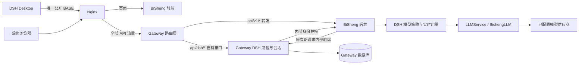
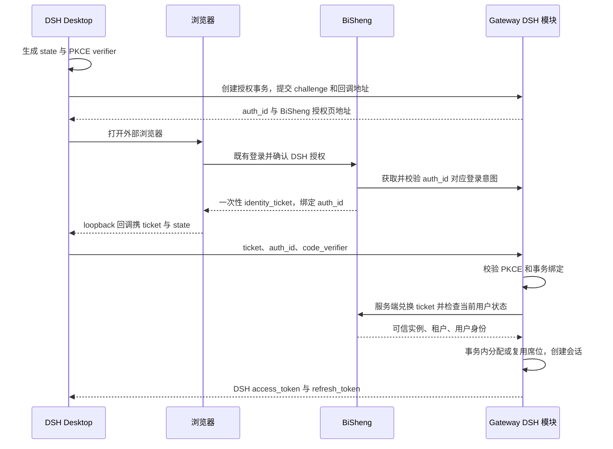
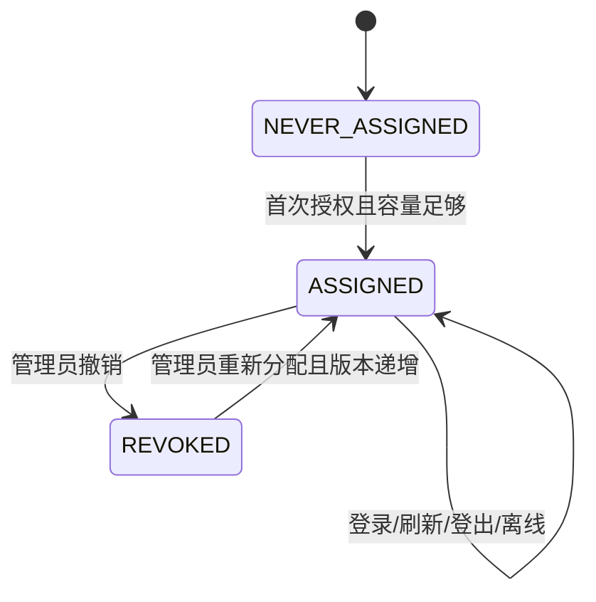

# Design: F062 DSH Desktop 登录、固定席位与模型调用

> 当前有效修订：[部署配置简化 0.4.0](./deployment-simplification.md)。共享 HMAC、现有 Redis、界面模型授权及北京时间默认值以此修订为准。
> 本文是 F062 当前设计的唯一来源。两仓接口、席位、模型逐项额度、恢复与管理界面已实现；当前接线见 §4.1，验证范围见修订验收。
> HTML 是评审图稿；[client-api.md](./client-api.md) 是本设计的客户端线协议附件，细化字段与示例，变更须双向同步。[tasks.md](./tasks.md) 记录实现与外部验收状态。DM 实机本轮暂缓，目标旧发行制品与真实客户端部署验收尚待外部证据。

**关联**：[spec.md](./spec.md) · [评审图稿](./architecture-review.html) · [评审报告](./design-review.md)
**版本**：v3.0.0-beta2
**状态**：用户已确认官方链路边界、单 Nginx 入口、接口冻结规则与逐模型修订；当前客户端契约为 `0.3.0`；逐模型额度、取消未知用量冻结及部门同步/筛选修订已实现；完整发布验收仍独立保留
**最后更新**：2026-09-09

## 1. 目标与非目标

DSH Desktop 完成 BiSheng 用户登录后，用平台已配置的模型驱动客户端 Agent。Gateway 项目中的闭源 DSH 模块管理 License、固定席位和 DSH 会话；BiSheng 提供模型调用、治理和统一管理界面。

一期不引入独立授权服务部署、不迁移模型配置、不复用 V2 API Key、不自动释放席位。RPM/TPM、金额预算、部门共享池与统计导出不纳入。

## 2. 关键约束

遵循 [Constitution C1–C8](../../../docs/constitution.md) 与 [beta2 版本契约](../release-contract.md)，下文只描述 F062 的具体接线要求。

| 约束 | 设计影响 |
|---|---|
| Gateway 对普通 BiSheng 可选 | DSH 默认关闭；开启后才初始化授权模块客户端。故障影响 DSH，不使普通业务启动失败 |
| 闭源代码放在 gateway 项目内 | 新增业务模块并随原进程部署；数据库归 Gateway，接口由 Controller 承载 |
| DSH 是桌面公共客户端 | 安装包不包含服务账号 Secret；使用浏览器授权、一次性票据和 PKCE |
| 席位长期绑定用户 | 席位与登录会话分表；刷新、登出、设备管理不改变席位计数 |
| 模型配置继续由 BiSheng 持有 | DSH 模块只存 model_id 和使用策略，Gateway 不保存模型供应商密钥 |
| 撤销后的新请求必须被拒绝 | 一期逐请求在线验席，不缓存正向席位判定；只缓存签名公钥 |
| 模型提供给 Agent 使用 | 必须保留 tools、tool_choice、tool_calls、tool_call_id、流式工具参数 |
| 多进程及流式响应 | 席位、会话、预算、操作进度均有共享存储；流结束前上下文不能被提前清理 |

### 2.1 商业控制的适用边界

本设计能保证：未修改的官方链路中，Gateway 不超额分配席位、不向无资格用户签发有效 DSH 凭证，BiSheng 在每次新调用时验证资格。

它不能保证：拥有服务器控制权和模型配置的客户，修改开源后端跳过验席或重新实现模型接口后，仍被限制使用其自有模型。仅将签名私钥放进本地闭源 Gateway 也不构成绝对防破解。

2026-09-09 用户明确接受上述边界；Spec US-C 已同步，OQ-01 已关闭。模型执行继续保留在 BiSheng。

## 3. 方案对比与选定

| 决策 | 备选 | 选定与原因 | 重新考虑条件 |
|---|---|---|---|
| D1 授权部署 | 独立新服务；Gateway 全局 Filter；Gateway 内独立模块 | Gateway 模块：已有 Java 服务、License 与调用 BiSheng 的 SDK；Controller 明确业务入口，Filter 不能承担席位事务 | 出现独立交付、独立扩缩容要求 |
| D2 凭证 | V2 PAT/SAK；普通 JWT；专用 DSH Token | 专用 Token：用户已确认与 V2 隔离，路由也可独立挂载；桌面无需内置服务账号 Secret | DSH 明确演变为公共开放 API 客户端 |
| D3 模型执行 | 把模型配置迁入闭源；Gateway 另建模型 SDK；复用 BiSheng 模型业务 | 复用 LLMService/BishengLLM：现有供应商映射、Root 共享、online 开关和遥测均在该链路 | 未来产品要求改变已确认的模型执行信任边界 |
| D4 席位生命周期 | 会话 TTL 租约；固定用户席位 | 固定席位：AC-08 明确禁止离线或过期释放；保留 REVOKED 记录防止重新登录抢占 | 产品明确改为并发在线计费 |
| D5 撤销一致性 | 短缓存 + 失效通知；逐请求验席 | 逐请求验席：满足 AC-17；去掉仅靠 Token 到期、缓存广播保证撤销的假设 | 测量显示验席成为瓶颈，且产品接受明确的撤销延迟 |
| D6 管理体验 | 独立 Gateway 管理网站；BiSheng 聚合入口 | BiSheng 管理入口：用户、模型、用量在同一页面，Gateway 保留席位/会话真相 | Gateway 成为多产品通用授权平台 |
| D7 月预算 | 每请求写 SQL；仅异步统计；Redis 原子账本 + Stream + 批量 SQL | Redis 按已用量准入、完成后实际入账，允许在途并发超额；Stream 投递，MySQL 持久化投影；不以异步 MySQL 数字决定放行。故障无法证明完整性时停止消费额度 | 若要求缓存故障后无损且无停机，另评审同步持久化日志或数据库逐请求方案 |
| D8 License 扩展 | 叠加多个 License 后相加；单个有效 License 的能力集合 | 每个实例一个有效 License，按 capability 配置 DSH 席位；避免重复授权叠加，其他商业能力独立判断 | 明确要求插件许可证、独立采购和合并规则 |
| D9 逐模型配置 | 共享用户月额度；逐模型独立额度 | 用户明确要求每个用户可配多个模型、各自独立额度；类型对象列表统一保存与CAS，避免模型间额度互借 | 以后明确要求共享池、单模型独立并发编辑或按模型反查用户时再评审存储拆分 |
| D10 DM 占席锁 | 沿用快照SERIALIZABLE范围假设；显式表锁 | DM READ_COMMITTED＋事务首条EXCLUSIVE表锁，锁后读最新已提交容量；避免空范围并发超发 | DM 实机证明其他等价锁方案，或不同实例席位操作发生可观测锁争用时再评审 |

登录交互采用外部浏览器、一次性授权码与 PKCE S256 的模式，不宣称本期实现通用 OAuth Server。桌面应用不能靠安装包内的共享 Secret 证明自身机密性。参考 [RFC 8252](https://www.rfc-editor.org/rfc/rfc8252) 与 [RFC 7636](https://www.rfc-editor.org/rfc/rfc7636)。

## 4. 系统现状与目标接线

### 4.1 已核对代码

本轮 BiSheng 开发基线为从 `v3.0.0-beta1-fix`（`02592397a3`）创建的 `feat/3.0.0-beta2-pre` worktree。Gateway 开发目录为 `/Users/zhangguoqing/works/bisheng-gateway`，开发分支为 `feat/dsh-access`，于 2026-09-09 从本地与远端一致的 `main`（`75a74ff28ea95cba0938ff4912317cade2353337`）创建并切换。不得以原 `cofco` 为开发基线。

下表 BiSheng 部分主要沿用此前设计的源码核对记录，实施时须按当前基线逐项复核；Gateway LicenseLoader、LicenseStatusHolder、LicenseExpiredGlobalFilter、LicenseController 及既有 License 单元测试已在目标 main 基线只读复核，行为见 §4.5.4。源码核对不等于实际部署或新版兼容测试通过。

| 已存在入口 | 当前行为 | F062 接入方式 |
|---|---|---|
| [api/router.py](../../../src/backend/bisheng/api/router.py) | V1 业务路由与 V2 `verify_open_api_access` 分开注册 | V1 新增 DSH 业务路由；不挂 V2 依赖 |
| [user/domain/services/auth.py](../../../src/backend/bisheng/user/domain/services/auth.py) 的 LoginUser | 普通 JWT、用户身份与管理鉴权 | 浏览器授权和管理端复用，模型请求单独解析 DSH Token |
| [utils/http_middleware.py](../../../src/backend/bisheng/utils/http_middleware.py) 的 CustomMiddleware | 以普通 JWT 设置租户；豁免路径会开启租户过滤 bypass | DSH 专用路径不能简单放入豁免白名单 |
| [sso_sync/.../login_sync.py](../../../src/backend/bisheng/sso_sync/api/endpoints/login_sync.py) | HMAC 认证后同步组织/用户并发普通 JWT | 仅参考内部服务认证模式，不调用此端点冒充 DSH 登录 |
| [llm/domain/models/llm_server.py](../../../src/backend/bisheng/llm/domain/models/llm_server.py) | LLMServer/LLMModel 配置；online 与探活 status 独立 | 引用原 model_id，不复制供应商配置 |
| [LLMService](../../../src/backend/bisheng/llm/domain/services/llm.py) | get_model_for_call 支持当前租户与合法 Root 共享；get_bisheng_llm 构造模型 | 模型可调用性与实例构造都走该业务入口 |
| [BishengLLM](../../../src/backend/bisheng/llm/domain/llm/llm.py) / [BishengBase](../../../src/backend/bisheng/llm/domain/llm/base.py) | 支持 bind_tools、异步生成与流；需要 app_id/app_type/app_name/user_id | 新适配器负责 OpenAI 协议，复用模型 SDK 与实际请求 |
| [llm/domain/utils.py](../../../src/backend/bisheng/llm/domain/utils.py) | 供应商每日调用次数限制；模型遥测尽力写入 | 不将现有 limit 当月 token 配额；另建 DSH 结算账本 |
| [ApplicationTypeEnum](../../../src/backend/bisheng/common/constants/enums/telemetry.py) | 尚无 DSH 类型 | 增加 DSH_DESKTOP 值及消费端展示映射 |
| Gateway LicenseLoader / LicenseExpiredGlobalFilter | main 基线已有过期降级；WebFilter 放行转发给后端的 V1/V2，自有商业端点受控 | 保留旧 License 判定与响应；DSH capability 独立判定，见 §4.5.4 |
| Gateway sdk/BsClient.java | 已有服务端调用 BiSheng 的接口 | 增加 DSH 专用 SDK 接口，不在客户端分发 SDK 密钥 |

Gateway 文件均相对其项目 `src/main/java/com/dataelem/gateway/`。实现位于 `feat/dsh-access`；上表“当前行为”是实施前基线，以下记录已落地接线。

#### 实施现状（2026-09-09）

- 冻结契约与发行样例已用于两仓测试；真实旧密文分段、旧发行工具与目标旧二进制仍是外部兼容门禁。
- Python 已实现 15 个 HTTP 端点、四张新表、用户资料版本增量迁移、共享 Secret 派生的 HMAC/HS256、模型适配、Redis Lua 账本与 Stream/SQL 投影、管理审计和生产 Runtime。Gateway 已实现 11 个端点、四张新表、独立 License 能力验签、固定席位/会话/刷新与集群激活门禁。默认关闭不初始化远程依赖。
- User 迁移父 revision 为实际单 head `update_time_default_align`；SQLite 与隔离 MySQL 的增量/重入/保留字段验证已通过。DM8 未执行真库验证。
- Platform 已接入 `/desktop-login` 与系统管理的席位、会话、模型额度、操作进度页面；客户端仍只配置同一个 Nginx origin。外部 Desktop 源码不在两仓范围内。
- 生产 CLI、首次账本初始化、恢复审批与故障处置见 [rollout.md](./rollout.md)、[quota-operations.md](./quota-operations.md)；测试和外部环境缺口见各验收报告。实现与隔离服务测试不等于已经部署或完成真实桌面联调。

### 4.2 运行拓扑



客户端只访问同一 Nginx origin。Nginx 将全部 `/api/*` 交给 Gateway，Gateway 将已配置的 `/api/v1/*`、`/api/v2/*` 转发到 BiSheng，其余 `/api/*` 由自有 Controller 处理；版本前缀优先匹配。DSH 换证逻辑终点为 Gateway，模型请求逻辑终点为 BiSheng，传输均经过 Nginx/Gateway。模型实现不因代理链新增而重复。

配置边界：BiSheng 部署 `dsh.enabled`（默认 false，决定是否显示 DSH 管理入口）；管理页另有默认 false 的实例业务开关，两者都开启才允许 DSH 新登录与模型调用。业务开关和下载地址保存在已有全局 Config 表的 dsh_management 项；部署信任字段包括固定的 `gateway_internal_url`、同 Nginx origin 的 `platform_public_url`、`installation_id`、复用既有用户同步共享 Secret；Token issuer 和各用途 key_id 由代码固定。内部 URL 指向真实服务地址，避免经公共反向代理形成回环；客户端不能提交任意 issuer 或验席 URL。

Gateway 新增 `dsh.enabled`、BiSheng 内部地址、同一个 `platform_public_url`、实例标识、DSH 签名密钥引用及客户端回调规则。DSH 用户配置只有 Nginx BASE；公开 client_id 通过 config 返回，所有 API 路径固定拼接到 BASE，不发现第二公开服务地址。config 不访问用户或模型数据。身份凭证保存在操作系统安全凭证存储中，不随 Agent 配置导出或写入普通配置文件。

### 4.3 登录与固定占席

浏览器确认接口 `POST /api/v1/dsh/authorize` 的可选 `decision` 为 `approve`（默认）或 `deny`。拒绝时只解析 Gateway 已绑定事务的 redirect_uri/state 并返回 access_denied，不签发 identity_ticket；页面据此执行客户端文档中已有的拒绝回调。固定页下载入口使用 DSH 管理页保存的无凭证 HTTP(S) 地址，未配置时显示联系管理员与手动填写平台地址；浏览器通过独立 `/api/v1/dsh/browser-config` 读取，不改变客户端冻结配置接口。

2026-09-09 客户端细化：固定前端入口 `/desktop-login`；入口 A 由客户端创建 PKCE 事务后打开带 auth_id 的页面；入口 B 的 `dsh-desktop://login?server=...` 只唤起客户端并确认平台，再新建同一 PKCE 流程。此处调整 PRD 旧的“深链直接带 code”时序，避免无客户端 verifier 的换证。浏览器复用现有登录；loopback 不可达时仅在当前 auth_id/verifier 事务中粘贴 identity_ticket，不接受孤立票据导入。具体回调、失败与超时见 [客户端契约 §4](./client-api.md#4-浏览器登录)。以下时序箭头表示逻辑服务，外部流量均经 §4.2 Nginx/Gateway。



- 授权事务有效期 5 分钟；identity_ticket 为随机不透明值，有效期 60 秒，以摘要存入共享 Redis，比较绑定条件后原子消费。票据仅证明本次身份授权，不承担席位判定。
- 回调采用 `http://127.0.0.1:<临时端口>/dsh/callback`；只允许 loopback IP、固定路径和本次登记的端口。浏览器携带的是一次性票据，不是长效访问或刷新凭证。
- 浏览器确认通过已登录 V1 接口提交，执行 Origin/CSRF 检查；tenant_id、user_id 从实际登录身份获得。禁止从客户端 body 或任意用户头取得有效主体。
- Token 交换没有客户端 Secret；Gateway 内部身份兑换必须认证，复核实例、auth_id、回调与 PKCE 绑定，拒绝服务账号、停用/删除用户和失效租户。
- Gateway 先完成一次性身份兑换，再开启数据库席位事务。席位变更按数据库选择事务保护：MySQL 使用 SERIALIZABLE 范围事务；DM 使用 READ_COMMITTED，并在事务首条 SQL 对 gt_dsh_seat 加 EXCLUSIVE 表锁，锁后统计当前已提交席位再写入。两者均在同一事务内统计 ASSIGNED、校验当前 License 上限并分配；序列化冲突或死锁有限重试整个事务，唯一键只负责同人去重，不能替代容量保护。
- 发证失败不自动释放已经提交的席位。用户重试登录仍复用它，符合固定席位语义；同一事务重放不得创建第二个会话族。

身份票据响应须 `Cache-Control: no-store`，日志不得记录票据、Authorization 或回调完整查询串。当前 HTTP 访问日志使用完整 URL，新增授权页面/回调链路需按字段脱敏。

### 4.4 模型请求与协议适配

实施接线：取消模型部署白名单。管理候选模型复用 LLMService 现有目录与租户共享规则；用户模型授权和每模型月额度只由界面维护。协议能力由现有供应商适配实现确定，配置文件不登记模型 ID。

`DSH 请求 → 专用 Token 校验 → 当前用户/租户校验 → Gateway 验席 → 模型可访问性与 DSH 白名单 → Redis 检查已用量并记准入事件 → LLMService → SSE/JSON → Redis 结算 → 后台批量 SQL`。

1. 专用依赖构造 `DshPrincipal`，固定算法与 issuer/audience，校验实例、有效期、session_id、seat_id、grant_version。不读取 OpenApiPrincipal，不接受 PAT/SAK、普通 JWT 或委托身份头替换用户。
2. `/api/v1/dsh/models`、`/api/v1/dsh/chat/completions`、`/api/v1/dsh/usage` 进入专用认证策略；浏览器授权和管理员路径仍走普通 JWT。中间件仅按明确路由选择认证类型，不以“Token 解码失败就跳过”处理。
3. 先验证 DSH 签名，再设置 tenant ContextVar，通过用户业务入口读取当前有效自然人。忽略客户端提供的管理租户覆盖，按现有隔离规则建立可见范围；不将整个 DSH 前缀加入 TENANT_CHECK_EXEMPT_PATHS。
4. Gateway 每个新请求在线检查当前 entitlement、seat.state、grant_version 和 session.state。无正向缓存；超时/未知即拒绝本次请求。HS256 使用共享 Secret 派生的 Token 密钥，拒绝其他算法和 kid，不远程取钥。
5. 可调用集合为“现有模型业务允许的集合”与“DSH 用户模型授权”的交集；合法 Root 共享通过 LLMService 判定。online=false 禁止调用；探活 status 不是永久权限，不因历史探活异常自行跳过 SDK 错误处理。
6. 适配器把消息转换为 LangChain 消息，调用 `LLMService.get_bisheng_llm`，携带服务器确定的 model_id/user_id，以及 `app_type=DSH_DESKTOP`、`app_id=dsh:<installation_id>`。DSH 仅收到逻辑模型标识，不收到模型配置、api_key 或 upstream URL。
7. 适配器使用 ainvoke/astream 和工具绑定；不得直接请求 llm.llm 绕开外层治理。SSE 逐块转发、自然背压，不缓存完整回答；取消时关闭上游迭代器，在 finally 中提交 Redis 结算事件或未知状态；提交失败按 §4.7.3 冻结受影响的准入并告警，不把未知用量记为零。
8. 流式响应的租户/主体上下文覆盖生成器整个生命周期；应在流生成任务内显式建立并 finally reset，不能依赖一个在返回 StreamingResponse 时已经结束的上下文。

现有 `BishengBase.get_class_instance` 会再次从缓存取模型/供应商。实施时在 LLM 业务层增加“强读并构造”的窄入口或明确的禁用缓存参数，复用原供应商初始化逻辑；DSH 不自行加载 LLMDao 或向通用构造器注入未经业务验证的配置。

| DSH 协议字段 | 约定 |
|---|---|
| model | `bisheng:<model_id>`，列表返回值原样回传；不按供应商模型名猜测映射 |
| messages | system/user/assistant/tool；保留 tool_call_id、assistant tool_calls 及工具结果 |
| tools / tool_choice | 透传语义到既有模型适配器；不支持工具调用的模型不开放为 DSH Agent 模型 |
| stream / stream_options | 支持 JSON 和 SSE；include_usage=true 时输出末尾用量块 |
| temperature / top_p / stop / max_tokens | 校验并映射到支持参数；max_completion_tokens 与 max_tokens 冲突时报错 |
| choices[].delta | 支持 content 与 tool_calls 增量；工具 index/id/name/arguments 连贯，不只拼接文本 |
| n | 一期只支持 1；其他值显式拒绝 |
| 未支持字段/多模态内容 | 显式报不支持，不能静默丢弃；非本期要求的多模态不承诺兼容 |

最终正常帧包含 finish_reason，用量块按请求选项输出，最后为 `data: [DONE]`。SSE 已发出响应头后发生异常，发送错误事件并终止，不伪造完成内容；不自动重放模型请求，避免重复生成或计费。

### 4.5 数据归属与状态

以下为拟定持久化对象；物理类型、迁移与索引须在实施时按双数据库校验。跨库只传稳定 ID，不创建跨数据库外键。

| 存储 | 对象 | 核心约定 |
|---|---|---|
| Gateway 既有 License 模块 | 当前生效授权 | 复用验签解析结果提供 capability、seat_limit、有效期与实例绑定；不新增 License 配置表，不持久化解析副本 |
| Gateway DB | SeatAssignment | seat_id、installation_id、tenant_id、user_id、state、grant_version；唯一键 installation_id + user_id，租户归属单独校验 |
| Gateway DB | DshSession | session_id、seat_id、grant_version、auth_id、state、expires_at、device_label；session_id 即 refresh family，设备信息只是描述 |
| Gateway DB | DshRefreshToken | session_id、token_hash、generation、state；保存 ACTIVE / USED / REVOKED 历史，支持轮换重放检测 |
| Gateway DB | GatewayOperation | operation_id 全局主键并校验 installation_id 作用域；记录动作、payload 摘要与结果，拒绝同 key 不同 payload |
| BiSheng DB | DshUserPolicy | tenant_id + user_id 唯一策略；保存逐模型独立月额度对象列表及版本，不复制 LLMModel |
| BiSheng DB | DshMonthlyUsage | 用户模型月用量的异步持久化投影；唯一键不变，准入读取 Redis 实时用户总量和模型分量，不读滞后 SQL |
| BiSheng DB | DshModelCall | Stream 批量投影的逐请求完整状态；request_id + event_version 去重，与月汇总差额在同一 SQL 事务提交 |
| BiSheng DB | DshAdminOperation | operation_id、操作者、目标、动作、payload 摘要、预期版本、状态与重试进度；同时作为持久化投递意图 |
| Redis | 登录临时态、防重放 nonce、最近活跃、实时额度与用量事件 Stream | 配额区采用独立 noeviction 存储与持久化；不能套用普通缓存 TTL，失效不清零额度或释放席位 |
| 密钥系统/部署 Secret | DSH 签名私钥、双向服务认证凭据 | Gateway 多副本共享同一有效密钥集并支持 kid 轮换；厂商 License 签名私钥永不进入客户部署 |

DSH 签名载荷的能力部分为 `capabilities.dsh={enabled, seat_limit}`；免费 10 席也由可信签名授权表达，BiSheng 无硬编码免费分支。签名扩展放在兼容旧格式的可选字段中，见 §4.5.4；不能把未签名的同名字段直接解释为席位授权。新 License 替换原实例当前版本，不把两个 license_limit 相加。降配导致已分配数超限时不自动释放人员；进入 DSH 超配阻断状态，允许管理员撤销至满足上限后恢复。

旧 Gateway LicenseLoader 使用内置密钥进行解密，不能直接作为新增 DSH 能力签名的证明；F062 增加厂商签名校验器，部署端仅持厂商公钥。旧 License 原样继续支撑既有 Gateway 能力；缺少 DSH 签名扩展只表示没有 DSH entitlement，不要求旧客户为继续使用原功能换证，也不默认赠送或赋予不限席位。开通 DSH 才由发行方补发兼容扩展授权。



持久状态只有 ASSIGNED / REVOKED；NEVER_ASSIGNED 表示无历史分配记录，REASSIGN 是操作，不新增 REASSIGNED 稳态。撤销和重新分配都递增 grant_version，旧 Token 和旧 refresh family 永远不能因恢复资格而复活。

用户停用、删除、租户停用或归属变化立即阻止新的 DSH 调用，但不自动归还席位；管理页继续展示占用/不可用，管理员显式撤销。自然人按实例内不可复用的 user_id 识别，不按用户名/邮箱去重；产品层面无法阻止同一人创建多个账号，或多人共享账号。

#### 4.5.1 当前表结构

实施补充：`dsh_model_call.reconciliation_operation_id` 可空 VARCHAR(36)，在登记补记意图的同一事务锁定原请求并绑定唯一操作，保留审计引用；Redis 补记带 operation_generation 阻止旧worker迟到覆盖。

以下 8 张新增表分别由 Gateway（4 张）和 BiSheng（4 张）迁移维护，不复用 api_credential 表。字段为本次实现契约；4 张 Python 模型已落地并通过 SQLite 建表及 MySQL DDL 编译检查，Gateway 4 张表及真实双库建表尚未验证。

所有表包含非空 created_at / updated_at（逻辑 UTC datetime）；主键以各表 PK 声明为准，字段分组中的其他列不是联合主键。BIGINT 用户/模型引用沿用现有实体 ID；Gateway UUID 使用 VARCHAR(36)。JsonType 表示跨库抽象类型，BiSheng 采用既有兼容封装，Gateway 使用目标 MySQL/DM8 方言映射；不依赖数据库专用 JSON 查询。

BiSheng 所有用户表必须携带 tenant_id，读写均显式校验作用域，不能依赖只覆盖 SELECT 的自动过滤。Gateway 从受信实例与租户上下文建立过滤条件；两库之间只有逻辑引用，无跨库外键。登录凭证和供应商密钥不落入业务响应或审计 JSON。

关系：稳定安装实例 1:N Seat，Seat 1:N Session，Session 1:N RefreshToken；User 1:1 UserPolicy（内含模型 ID 集合），User × Model × Month 1:1 MonthlyUsage，MonthlyUsage 1:N ModelCall（同 tenant_id、user_id、model_id、usage_month）。License 是既有模块的授权输入，不是新增实体表。BiSheng AdminOperation 与 Gateway Operation 使用同一 operation_id 对账，不构造跨服务事务。

**Gateway · `gt_dsh_seat`：固定用户席位**

- PK seat_id；UK (installation_id, user_id)
- INDEX (installation_id, state) 保护容量；管理索引按 installation_id、tenant_id 前缀，分别接 (state, created_at, seat_id)、(username_search, seat_id)、(display_name_search, seat_id)、(created_at, seat_id)；SQL 执行计划验证后确定最终组合

| 字段 | 逻辑类型 | 约束 / 默认 | 含义 |
|---|---|---|---|
| seat_id | VARCHAR(36) | PK | UUID；被 Token、Session 与调用记录引用 |
| installation_id | VARCHAR(64) | 非空 / 稳定实例标识 | 不引用某份 License，替换授权不改变用户占席记录 |
| tenant_id / user_id | BIGINT / BIGINT | 非空 | 稳定用户与归属租户；用户名、设备 ID 不参与席位唯一性 |
| state | VARCHAR(16) | 非空 | ASSIGNED / REVOKED；无历史行才是 NEVER_ASSIGNED |
| grant_version | BIGINT | 非空 / 初始 1 | 撤销、重新分配均递增，旧 Token 不可恢复 |
| assigned_at / revoked_at | UTC datetime | revoked_at 可空 | 最近一次分配/撤销时间 |
| username_search / display_name_search | MySQL VARCHAR(510) / DM8 VARCHAR(2040) | 可空 / 索引 | 完整容纳源User的255 Unicode字符及最多2倍小写展开；DM8按UTF-8字节保守预留，仅供检索展示，不参与授权，不截断名字 |
| profile_version / profile_synced_at | BIGINT / BIGINT / UTC datetime | 可空 | 资料投影版本与同步时间；权威身份仍在 BiSheng |
| last_login_at | UTC datetime | 可空 | 成功创建会话时更新；不随每次模型调用更新 |
| last_operation_id | VARCHAR(36) | 可空 | 最近管理员操作；首次自动占席可空 |

**Gateway · `gt_dsh_session`：登录设备与会话**

- PK session_id；UK auth_id；一个席位对应多个 Session
- INDEX (seat_id, state, expires_at) 支持当前页有效会话 EXISTS/聚合；INDEX expires_at

| 字段 | 逻辑类型 | 约束 / 默认 | 含义 |
|---|---|---|---|
| session_id | VARCHAR(36) | PK | 登录会话标识，同时作为 refresh family 标识 |
| seat_id / grant_version | VARCHAR(36) / BIGINT | 非空 | 建立会话时的席位与授权版本 |
| auth_id | VARCHAR(36) | UK / 非空 | 一次登录事务最多创建一个会话族 |
| device_label / client_version | device_label：MySQL VARCHAR(128) / DM VARCHAR(400)；client_version：VARCHAR(64) | 可空 | 设备名最多 100 Unicode 码点，DM 预留最多 400 UTF-8 字节；不作为认证依据，client_version 当前不写入 |
| state | VARCHAR(16) | 非空 | ACTIVE / REVOKED / EXPIRED |
| expires_at / last_seen_at | UTC datetime | last_seen_at 可空 | 会话绝对有效期及节流落库的最后活跃时间（如每 5 分钟）；实时最近活跃读 Redis，离线不释放席位 |

**Gateway · `gt_dsh_refresh_token`：刷新轮换与重放记录**

- PK refresh_id；UK token_hash；UK (session_id, generation)
- INDEX (session_id, state)；按 session_id 锁定 Session 后轮换

| 字段 | 逻辑类型 | 约束 / 默认 | 含义 |
|---|---|---|---|
| refresh_id / session_id | VARCHAR(36) / VARCHAR(36) | PK / 非空 | 所属会话即 family；所有旧代 token 都可反查 |
| token_hash | CHAR(64) | UK / 非空 | 高熵随机 refresh token 的 SHA-256 摘要；不存明文 |
| generation | BIGINT | 非空 / 从 1 递增 | 同一会话内刷新代次 |
| state | VARCHAR(16) | 非空 | ACTIVE / USED / REVOKED；识别 USED 重放后撤销整族 |
| expires_at / used_at | UTC datetime | used_at 可空 | 有效期与首次消费时间；保留至会话绝对到期和安全审计保留期结束 |

**Gateway · `gt_dsh_operation`：席位命令幂等与审计**

- PK operation_id；全局唯一，并校验 installation_id 作用域
- INDEX (installation_id, tenant_id, user_id, created_at)

| 字段 | 逻辑类型 | 约束 / 默认 | 含义 |
|---|---|---|---|
| operation_id / installation_id | VARCHAR(36) / VARCHAR(64) | PK / 非空 | 从 BiSheng 传入的稳定操作 ID |
| tenant_id / user_id / actor_user_id | BIGINT | 非空 | 受信请求中的目标与管理员身份 |
| action / expected_grant_version | VARCHAR(16) / BIGINT | 非空 | REVOKE / REASSIGN；阻止延迟旧命令覆盖新状态 |
| payload_hash | CHAR(64) | 非空 | 同 operation_id 不同负载返回 409 |
| status / result_grant_version | VARCHAR(16) / BIGINT | 结果版本可空 | SUCCEEDED / FAILED；与席位事务同提交，执行中不伪造成功 |
| result_code / result_payload | VARCHAR(64) / JsonType | 可空 | 幂等重试返回原结果；不含 Token 或 Secret |

**BiSheng · `dsh_user_policy`：用户逐模型独立月额度策略**

- PK id；UK (tenant_id, user_id, model_id)；索引 (tenant_id, model_id, enabled, user_id)
- 每个用户模型独立记录、版本与同步所有者；写入只携当前模型 expected_version

| 字段 | 逻辑类型 | 约束 / 默认 | 含义 |
|---|---|---|---|
| id / tenant_id / user_id | BIGINT | PK / 非空 | 租户字段由既有上下文与隔离机制维护 |
| model_id / monthly_token_limit / enabled | BIGINT / BIGINT / INTEGER | 非空 / 额度默认 0 / enabled 默认 0 | 一条用户模型授权；enabled=0 取消授权，enabled=1 且额度=0 禁止新调用；不删除历史用量 |
| version | BIGINT | 非空 / 首次生效 1，占位 0 | 当前模型授权与月限额变更在同一事务递增；0 仅首次配置前的禁止调用占位 |
| quota_sync_state / quota_epoch | VARCHAR(16) / BIGINT | 非空 / PENDING、初始 1 | PENDING / READY / FROZEN；策略同步、恢复代次控制，不是逐请求计数器 |
| updated_by | BIGINT | 非空 | 最近配置的真实管理员；完整变更历史见 UPDATE_POLICY 操作，未配置用户使用虚拟默认策略 |
| pending_operation_id | VARCHAR(36) | 可空 | 当前策略编排所有者；同一用户的同一模型一次只接受一个未完成操作；不同模型可并行，完成后清空 |

**BiSheng · `dsh_monthly_usage`：用户模型月用量汇总**

- PK id；UK (tenant_id, user_id, usage_month, model_id)
- 唯一索引前缀支持用户月份汇总；由消费者批量更新，不参与每请求 SQL 锁定；不按席位重新建账

| 字段 | 逻辑类型 | 约束 / 默认 | 含义 |
|---|---|---|---|
| id / tenant_id / user_id | BIGINT | PK / 非空 | 用量归属稳定用户，席位释放不重置 |
| model_id | BIGINT | 非空 / 联合唯一键成员 | 毕昇模型主键，不是上游模型名；与请求明细一致，不使用 NULL/0 表示用户总量 |
| usage_month / billing_timezone | CHAR(7) / VARCHAR(64) | 非空 | 如 2026-09；保存月份归属时区 |
| used_tokens | BIGINT | 非空 / 默认 0 | 已入账实际用量，非负；允许超过月限额，不截断超额部分 |
| version / projected_at | BIGINT / UTC datetime | 默认 0 / 时间可空 | 持久化投影版本与时间；同事务应用明细差额，不代表实时额度 |

**BiSheng · `dsh_model_call`：请求用量与结算明细**

- PK request_id；服务端生成 UUID，结算按 request_id 幂等
- INDEX (tenant_id, user_id, started_at)；INDEX (tenant_id, user_id, model_id, started_at)；INDEX (status, updated_at)；INDEX trace_id

| 字段 | 逻辑类型 | 约束 / 默认 | 含义 |
|---|---|---|---|
| request_id / tenant_id / user_id | VARCHAR(36) / BIGINT / BIGINT | PK / 非空 | 调用与配额结算标识；用户 ID 来自 DshPrincipal |
| seat_id / session_id / grant_version | VARCHAR(36) / VARCHAR(36) / BIGINT | 非空 | Gateway 引用与调用当时授权代次 |
| model_id | BIGINT | 非空 | 既有字段单列说明：服务端鉴权后解析的毕昇模型主键，与月汇总模型 ID 一致 |
| usage_month / policy_version | CHAR(7) / BIGINT | 非空 | 准入月份与使用的策略版本；结算不重新按当前月份归属 |
| event_version / quota_epoch | BIGINT / BIGINT | 非空 | 请求状态事件递增版本与准入代次；去重、乱序和重建依据 |
| input_tokens / output_tokens / total_tokens | BIGINT | 可空 | NULL 表示尚未知；0 只表示可靠计量为零 |
| status / usage_source | VARCHAR(24) | 非空 / source 可空 | RUNNING / SUCCEEDED / FAILED / CANCELLED / USAGE_UNKNOWN；计量来源 PROVIDER / RECONCILED |
| settled_at / started_at / ended_at | UTC datetime | started_at / ended_at / settled_at 可空 | started_at 记录准入时点；settled_at 记录可靠用量入账时点，未知时为空，event_version 保证幂等 |
| provider_request_id | VARCHAR(256) | 可空 | 适配器取得的供应商请求标识；无法取得时仍保留本地 request_id，补记必须另有逐请求关联证据 |
| trace_id / error_code / latency_ms | VARCHAR(64) / VARCHAR(64) / BIGINT | 错误/耗时可空 | 仅记录脱敏摘要，不默认保存完整消息 |

**BiSheng · `dsh_admin_operation`：管理编排、不可变审计与可靠重试**

- PK operation_id；仅 REVOKE / REASSIGN 转发 Gateway 并复用相同 ID；UPDATE_POLICY / RECONCILE_USAGE 在 BiSheng 执行，SYNC_PROFILE 投递资料更新
- INDEX (status, next_retry_at)；INDEX (tenant_id, user_id, created_at)

| 字段 | 逻辑类型 | 约束 / 默认 | 含义 |
|---|---|---|---|
| operation_id / tenant_id / user_id | VARCHAR(36) / BIGINT / BIGINT | PK / 非空 | 原子登记管理员操作意图 |
| actor_user_id / action | BIGINT / VARCHAR(16) | actor 仅 SYNC_PROFILE 可空 | REVOKE / REASSIGN / UPDATE_POLICY / RECONCILE_USAGE 必须记录真实已鉴权操作者 |
| expected_grant_version / payload_hash | BIGINT / CHAR(64) | expected 仅席位动作必填 / hash 非空 | 按动作校验；相同 ID 不同操作者/目标/负载返回 409 |
| expected_policy_version / expected_event_version | BIGINT | 按动作必填 | UPDATE_POLICY / RECONCILE_USAGE 的乐观锁；其余动作为空 |
| payload | JsonType | 非空且登记后不可覆盖 | 原始动作负载；补记包含 request_id、证据引用/摘要及可靠 usage；不含 Secret |
| before_values / after_values | JsonType | 策略提交时必填，其余按动作 | UPDATE_POLICY 的 model_id、enabled、monthly_token_limit 与 version 旧新值；提交后不可覆盖；首次配置 before.version=0、enabled=false |
| created_at / updated_at / committed_at / effective_at | UTC datetime | 前两者非空，后两者可空 | 意图登记、进度更新、业务提交、最终生效时间；策略已提交不等于已解冻 |
| status | VARCHAR(16) | 非空 | PENDING / PROCESSING / SUCCEEDED / FAILED |
| attempts / next_retry_at / lease_until / lease_generation | INTEGER / UTC datetime / UTC datetime / BIGINT | attempts/代次默认 0；时间可空 | 领取时原子递增 lease_generation 作为 fencing token，状态写入和 Redis 操作校验当前代次；不用于席位回收 |
| result_code / result_payload | VARCHAR(64) / JsonType | 可空 | 席位保存 Gateway 结果；策略保存 committed_version、phase；补记保存结算 event_version。SUCCEEDED 终态结果不可覆盖 |

Python实体通用创建/修改时间物理列统一为 `create_time/update_time`，按后端约定使用默认值；本文逻辑 `created_at/updated_at` 在后续管理DTO中显式映射，查询索引使用物理列。`committed_at/effective_at/started_at/ended_at/settled_at` 保留各自业务语义。数据库连接按UTC运行，DTO再按协议输出带时区时间。JSON字段采用JsonType，未知用量为NULL，新增用户模型不默认填租户1。

#### 4.5.2 事务与临时状态

| 操作 | 同库原子写入 | 一致性要求 |
|---|---|---|
| 首次占席 / 登录 | Gateway seat + session + refresh_token | MySQL 使用 SERIALIZABLE 范围事务；DM 使用 READ_COMMITTED，并在事务首条 SQL 对 gt_dsh_seat 加 EXCLUSIVE 表锁，锁后统计当前已提交席位再写入，统计已占数后对照有效 License；auth_id 唯一；不写 License |
| 刷新 | Gateway session + refresh_token | 锁定 Session；旧代改 USED 与新代插入同提交；重放撤销整族 |
| 撤销 / 重新分配 | Gateway operation + seat + session | 同样的实例范围事务；校验 expected_grant_version；撤销只修改席位状态，已用数按席位状态统计，重分配不复活旧会话 |
| 策略更新 | SQL 登记操作/所有者 → Redis 冻结 → SQL user_policy + 审计快照 → Redis 安装版本 → 解冻 | §4.5.5 定义重试和审计；低频编排，不跨远程调用持 SQL 锁 |
| 准入检查 / 实际用量入账 | Redis 总量 + 模型分量 + 请求 + Stream | 准入只检查已用量、记事件，完成后原子累计；不逐请求写 SQL |
| SQL 批量投影 | monthly_usage + model_call | 同事务应用新旧明细差额，版本去重，提交后 ACK |
| 管理编排 / 补记 | BiSheng admin_operation；席位动作再到 Gateway operation | 先持久化意图；策略、补记本地分派，超时重试同一 ID；不跨 HTTP 持有 DB 锁 |

授权事务在 Gateway Redis 保留 5 分钟；identity_ticket 摘要在 BiSheng Redis 保留 60 秒并原子消费；内部 HMAC nonce 保留 120 秒。USED 刷新摘要属于持久安全记录，保留至会话绝对到期和审计保留期结束，不能在轮换时删除旧记录。清理 Session/RefreshToken 不改变 Seat 状态或席位计数。

#### 4.5.3 简化后的授权与用量口径

| 数据 | 来源 / 表 | 回答的问题 |
|---|---|---|
| License 上限 | 既有 License 验签解析结果 | 当前实例最多多少席？替换授权不清空席位 |
| 席位占用 | gt_dsh_seat 的 ASSIGNED 记录数 | 当前哪些用户占席？不另存 assigned_count |
| 用户配置 | dsh_user_policy | 允许哪些模型？这些模型合计每月达到多少 token 后拒绝新请求？ |
| 月用量汇总 | dsh_monthly_usage | 用户在每个模型上本月实际已用多少？跨模型求和得到用户总量 |
| 请求明细 | dsh_model_call | 哪次请求调用哪个 model_id、实际消耗多少、是否结算？支持审计和故障对账 |

额度配置直接保存在 `dsh_user_policy`：每个 tenant_id＋user_id＋model_id 一条记录，字段为 enabled、monthly_token_limit、version、quota_sync_state、quota_epoch、pending_operation_id；取消原 model_configs JSON，不增加主表或明细表。保存仅更新指定模型，以该行 version/CAS 和 operation_id 防止覆盖及重复执行；取消授权保留该行和递增版本，防止旧请求重放造成重新授权。同一用户不同模型的 SQL 及 Redis 策略版本独立。按模型查询已授权用户走 (tenant_id, model_id, enabled, user_id) 索引。聚合列表仅是模型列表、只读用量和恢复清单的临时 DTO，不落库为用户 JSON；恢复用的聚合版本为各行版本之和，不能作为管理写入版本。详见 [表结构修订](./model-policy-row-revision.md)。

类型适配器在持久化边界将对象转换为 JSON，在读取时还原并验证对象；通过既有 JsonType 兼容 MySQL/DM8，不在数据库中查询 JSON 成员。不新增按模型反查用户的需求。`allowed_model_ids` 与 `monthly_token_limit` 仅为内存派生的 ID 列表及展示总和，不持久化，不是准入权威；模型自身配额才是准入依据。总和不得超过现有 int64 展示边界。旧草案模型清单＋共享额度不自动迁移成每模型额度，测试库按所有权重建，已有试装环境必须关闭 DSH 后重新确认模型配置及恢复证据。

配置不保存用量。Redis 实时记用户总量和模型分量，SQL 模型月行批量投影。每次请求完成后累加实际 usage，不提前扣减；更换模型、撤销席位不清历史，跨月入账仍归准入月。

License 只保存于既有受管授权源；DSH 不建立第二份配置真相。免费席位也由签名内容给出。容量变更不修改 Seat 主键或清除 REVOKED 历史，已用数始终从席位状态统计；到期和降配超限仍按前述规则阻断新消费、允许管理员撤销。

一期替换 License 采用受控切换：暂停所有副本的新 DSH 准入（含登录/刷新/验席与席位变更），等待席位事务结束，更新既有授权源并验证所有副本加载相同版本/摘要后恢复；已准入模型请求可完成。不依赖一次广播就假设切换成功，验签失败或版本不一致保持 DSH 关闭，普通业务不受影响。本期不承诺无停机热切换。

不增加容量锁表。MySQL 使用 SERIALIZABLE 范围事务；DM 使用 READ_COMMITTED，并在事务首条 SQL 对 gt_dsh_seat 加 EXCLUSIVE 表锁，锁后统计当前已提交席位再写入；不是仅锁已有用户行。DM 表锁持续到提交/回滚，保护空表与临界容量，但会串行化不同安装实例的短席位事务。全部撤销/再分配复用此入口，事务内无外部 HTTP；冲突有界重试。真实 MySQL 空实例竞争、临界容量已通过；DM 分支的隔离级别、锁顺序、回滚、分页和字符容量有自动化检查，DM 实机本轮按用户确认暂缓，不能宣称运行时已验证。

#### 4.5.4 Gateway 旧 License 兼容设计

**目标：新版 Gateway 接受原有 License，继续提供其原有能力；DSH 授权作为独立、可选、可验证的增量。** 用户于 2026-09-09 明确要求兼容旧版 License。本节固定兼容约束，不表示新增解码/签名实现已落地。

已核对 `main@75a74ff28ea95cba0938ff4912317cade2353337` 的现有行为：

| 代码锚点（Gateway 项目内） | 兼容基线 |
|---|---|
| `config/LicenseLoader.java:73` | 从既有 `BishengConfig.getLicense()` 读取密文，用原解密逻辑得到 JSON；读取 `version`、`expireDay` |
| `config/LicenseLoader.java:83` | `version=trial` 按服务器 LocalDate 与 `yyyy-MM-dd` 计算，剩余天数 `<=0`（含到期日当天）即过期 |
| `config/LicenseLoader.java:98` | 当前非 trial 分支调用 updatePro，旧 pro 永久，不使用 expireDay 使其过期；不在 F062 顺手收紧其他历史输入的旧分支行为 |
| `config/LicenseLoader.java:103` | 原 License 缺失 / 无法解密 / 旧字段解析失败标记原功能过期降级，不退出进程 |
| `config/LicenseStatusHolder.java`、`config/ReloadTask.java` | 保留原状态、到期严重级别与现有重载机制；DSH 不能把自己的状态写回旧 expired 字段 |
| `controller/LicenseController.java:28` | 保留 `GET /api/license/status`、原 ResultData 包装及 `version/expire_day/days_remaining/severity/expired/checked_at` 字段含义 |
| `filter/LicenseExpiredGlobalFilter.java:52` | 保留旧商业端点的过期行为，包括 HTTP 200 + `status_code=11001`；代理 V1/V2、License 状态接口继续放行。此历史响应不能沿用到已冻结的 DSH 错误协议 |

**格式采用向后兼容扩展，不替换原密文为裸 JWT/JWS。** 外层仍从原配置项读取相同编码/加密格式；解密后的原有顶层字段和值保持不变，仅增加可选 `dsh_entitlement` 字符串。例如以下为结构示意，不是真实 License：

```json
{
  "name": "existing-customer",
  "version": "pro",
  "expireDay": "2025-05-25",
  "finger": "existing-fingerprint",
  "dsh_entitlement": "<vendor-signed-compact-JWS>"
}
```

- `dsh_entitlement` 内部为厂商签名载荷，包含独立 schema version、发行方、用途 audience、License 标识、实例绑定、签发生效/到期时间、`capabilities.dsh.enabled` 和非负整数 `seat_limit`。算法由服务端固定白名单，kid 仅查预配厂商公钥；不从载荷提供的任意 URL 取钥，不使用旧解密密钥作为签名信任根。
- 签名内容同时绑定对应旧授权字段（含字段是否存在及原值），与解密外层逐项比对，防止把 DSH 扩展拼接到另一份旧 License。签名编码与测试向量已在 license-issuer-contract.md 和 contracts/license-entitlement-v1.json 固定；真实发行工具/旧密文样本仍须在 Gateway 实施时验证；不影响客户端 `0.3.0` API。
- 不重命名或删除旧 `version/expireDay`，不把 version 改为 `dsh`、`v2` 等新值。当前旧程序的非 trial 分支会被视作 pro，新类型值可能错误扩大旧商业授权。
- 未配置 DSH 扩展时，新 Gateway 只执行原 License 行为；已启用 DSH 的请求报告缺少有效 DSH 授权。只有合法厂商签名明确授权时才有免费 10 席 / 付费席位；旧 pro 不意味着 DSH 无限额。
- 外层成功解析后，原 License 状态和 DSH 状态分别计算、分别发布。DSH 扩展格式错误、未知版本、签名无效、错误实例、过期或禁用仅关闭 DSH，不落入旧 Loader 的全局 markExpired 路径；原 License 自身解码失败则保留原有降级行为，同时 DSH 不可用。
- 旧商业有效期与 DSH 签名有效期分别执行，不互相延长。DSH 是否可用以其有效签名、实例、capability 与开关为准；SSO 等旧商业功能仍按原授权执行。任何一侧未知状态都不能借另一侧的成功状态放行。
- DSH Controller 和内部端点按明确路由分派独立策略；仅从旧商业过滤器中移交 DSH 路由，不豁免其他商业接口。登录/刷新/准入必须验 DSH，公钥读取与可验证身份的会话撤销按既有设计允许。缺少/失效扩展不返回旧 HTTP 200 + 11001 伪装成客户端成功。
- DSH License 到期和实例绑定在每次验席/发证时检查，不能等待旧按小时重载才拒绝已到期能力；更换授权仍按现有“全副本暂停 DSH 准入 → 安装同一版本 → 校验 → 恢复”规则，不改变席位、会话与用量归属。

术语固定：**旧商业授权**是原 `version/expireDay` 的判定结果；**DSH 授权**是通过外层绑定验证的签名 entitlement；**外层有效**仅指密文与旧字段可解析，不表示旧商业授权仍在有效期。本文发席/发证/验席所称“License 有效”均指 DSH 授权有效且实例激活、DSH 开关启用。旧 trial 期满本身不使外层不可解析。

| 旧商业授权 | DSH 授权（外层可解析且绑定正确） | 旧商业端点 | DSH 发席/发证/新准入 |
|---|---|---|---|
| 有效 | 有效 | 原规则允许 | 再校验用户、席位、策略 |
| 有效 | 过期/缺失/失效 | 原规则允许 | 拒绝 |
| 过期 | 有效 | 原规则降级 | 再校验用户、席位、策略；不延长原 SSO 有效期 |
| 过期 | 过期/缺失/失效 | 原规则降级 | 拒绝 |

**兼容矩阵（实施验收门禁，以下新版行为尚待测试）：**

| 输入与程序 | 旧 Gateway 能力 | DSH |
|---|---|---|
| 新 Gateway + 原 trial/pro 密文（无扩展） | 与升级前一致；无需换证 | 无授权，不自动分配席位 |
| 新 Gateway + 外层缺失/无法解密/旧字段无法解析 | 保留原降级行为和状态 API | 不放行，无法取得可信可绑定载荷 |
| 新 Gateway + 原字段未变、有效签名扩展 | 原能力及期限不变 | 按签名与席位上限执行 |
| 新 Gateway + 有效外层、失效/篡改/跨实例扩展 | 仍按原字段执行，不被 DSH 连带标为过期 | 失败关闭 |
| 新 Gateway + 旧 trial 已过期、DSH 扩展仍有效 | 旧商业能力维持过期，不被 DSH 延长 | 独立校验 DSH，浏览器登录仍受所选原登录方式的可用性约束 |
| 目标旧版本 Gateway + 含可选扩展的新密文 | 旧解析器应忽略新增字段，原能力不变 | 无 DSH 实现 |

兼容证据要求：使用不含真实凭证的测试密钥和固定样本覆盖旧 trial 临界日期、pro、缺字段/解密失败、未知扩展、错误签名与拼接、签名有效期、旧 Banner 响应、V1/V2 代理与旧商业路径；保留现有两组 License 测试。另将含扩展的加长密文送入实际待支持旧版本的解码器，验证 RSA 分段、配置长度与未知字段处理，不能只靠“JSON 可扩展”声称所有历史二进制均兼容。

升级/回退时保留原 License 原文及版本，不在升级时自动重新加密旧客户授权。若某个旧二进制不能读取扩展密文，回退同时恢复原 License；不删除 DSH 数据，回退程序不提供 DSH 能力。发行工具适配和目标旧版本样本验收完成前不得宣传新版 License 可用于全部旧版本。

#### 4.5.5 策略变更审计与恢复（AC-27/29）

复用 `dsh_admin_operation` 的 UPDATE_POLICY 动作，不增加第九张表。`DshAdminService.update_policy` 接收 operation_id、expected_version（首次配置为 0）、models（逐模型配置对象列表）；用户/租户/actor 来自管理鉴权。UI 为一次保存生成 UUID 并保留到终态；重试不换 ID，不自动改 expected_version。

1. Repository 在短 SQL 事务中登记不可变操作意图并锁定/创建用户策略占位行，校验 expected_version 和 pending_operation_id；首次并发创建由用户唯一键和事务重试裁决。占位行使用禁止调用的默认策略，审计仍记逻辑旧 version=0。对同一操作先查幂等结果，再校验版本；相同 ID 不同主体/负载为 409。另一个操作尚在处理中返回 409 operation_in_progress，不覆盖原所有者。
2. Worker/同步处理器按 lease 领取同一操作，重新校验当前操作者权限；尚未业务提交且权限已撤销时标失败并安全清理本操作标记。先设置 Redis 独立冻结原因 `POLICY_SYNC:<operation_id>`。SQL 事务再次校验所有者与旧 version，将新策略、PENDING、updated_by、旧新快照、committed_at 同提交；快照按排序去重的模型集合记录，此后不可修改。版本冲突不产生成功变更审计。
3. Redis 用 CAS 安装新策略版本但保留冻结原因；SQL 标 READY，再以 operation_id、版本、quota_epoch 和当前领取代次 CAS 移除此操作的冻结原因。仅在确认该策略已安装后记录 effective_at、SUCCEEDED 并清理 pending_operation_id。其他冻结原因仍存在时准入继续拒绝；这里成功只表示新策略已生效。旧 Worker 不能安装旧版本、清除新操作标记或覆盖终态。
4. 任一步结果不确定返回 PROCESSING + operation_id，由 Worker 重读 SQL 与 Redis 后继续原操作；SQL 已提交的恢复仅完成该已授权意图，不因操作者后来失权回滚已生效策略。SQL 已提交后不将新操作当成重试、不再次递增版本、不再覆盖快照；保留 PENDING/PROCESSING、错误摘要与下一重试时间。过期 lease 由另一 Worker 接管；用户策略占位/所有者的创建和清理均在同库事务内，不用易失锁替代。

`GET admin/operations/{id}` 按当前管理权限返回动作、actor、目标、原负载、before/after、created_at/committed_at/effective_at、phase、status 与 result；非终态明确 PROCESSING。历史记录与当前策略独立保留，禁止因下一次配置、席位撤销或用户删除而覆盖/级联删除。请求明细的 policy_version 可关联该用户 after.version；不同用户不能只凭 version 混查。现有操作查询通过 ID 提供审计明细，批量审计检索通过受控运维 Repository 游标查询，不新增客户端接口。

### 4.6 会话、刷新与撤销

- Access Token 建议 5 分钟，aud=`bisheng-dsh-model`；refresh 使用高熵随机值，仅持久化哈希，绝对有效期建议 30 天。时间值是本设计默认值，不写入 License 席位计数规则。
- refresh 每次原子轮换，检查用户/租户状态、License、席位与会话版本；同一会话客户端串行刷新，检测已用 refresh 的重放时撤销该 family，要求重新登录。登录过期清理 session 不释放 SeatAssignment。
- 普通登出仅撤销当前 DSH session；管理员撤销席位覆盖该席位全部 session，普通 BiSheng JWT 的 token_version 和 PAT/SAK 不改动。
- 管理员调用 BiSheng 管理端：校验管理员及目标租户 → 持久化 operation → 调用 Gateway revoke → Gateway 事务修改席位版本与会话状态 → BiSheng 标记完成并返回。数据库事务不得跨远程调用持锁。
- 超时返回 PROCESSING + operation_id；后台重试或查询同一操作结果。Gateway 已成功而回包丢失时，不重复释放容量；无法确认不得显示成功。
- 每个用户的撤销/重分配操作串行且带 expected_grant_version，旧的重试不能覆盖新的重分配。REVOKED 行保留，不能删除后让首次登录逻辑再次占席。
- “撤销完成后的新请求”按 Gateway 验席的原子判定点排序；已经通过验席的在途请求允许完成。若要求中断在途 SSE，属于 §8 OQ-03，不以 Token TTL 伪装即时终止。

### 4.7 高频调用与实时限额

**Redis 原子账本负责实时准入，Stream 保存待落库事件，MySQL/DM8 批量保存明细和月汇总。** 不逐 SSE chunk 写库，不读取滞后 SQL 余额放行；Gateway 每次在线验席仍保留。

| 环节 | 实时路径 | SQL 写入 |
|---|---|---|
| 准入 | Lua 检查策略版本、恢复代次及已用量是否低于限额；只登记请求状态和 Stream 事件，不扣减，再调用模型 | 无 |
| 完成 | Lua 按 request_id 幂等累加用户/模型实际用量并登记新版本事件 | 无 |
| 持久化 | Worker 按最多 500 事件或等待 5 秒批量消费 | 同事务写明细和月汇总，提交后 XACK |
| 登录活跃 | Gateway last_seen 在 Redis 每会话最多每 60 秒更新一次 | 如需保留，每 5 分钟批量 MAX 更新；登录/刷新/撤销仍为低频业务写 |

#### 4.7.1 达限拒绝新请求，在途允许超额

Redis 同时维护用户总量和模型分量；同用户的全部模型、请求状态与事件 Stream 使用同一分片 hash tag，保证 Cluster 同槽脚本。SQL 仍按 tenant_id、user_id、model_id、usage_month 分行，不新增总量表。当前检查所选模型的独立月上限；用户总量只用于统计及账本完整性校验，不作为额度池，不允许跨模型借用。

**准入条件：`model_used_tokens < model_monthly_token_limit`**，两者均属于同一租户、用户、模型与准入月份；其中 model_used_tokens 仅为已经可靠入账的实际用量。Lua 同时检查 version、quota_epoch、READY；通过后登记 RUNNING 请求及 Stream 事件，**不修改用量，不预占额度**。正常在途请求不冻结后续准入。request_id、主体、模型 ID 与准入月份由服务端确定；准入结果不确定时查原请求，不自动重发上游。

**完成后：用户总量与对应模型分量原子累加已获取的实际 usage。** 入账与新准入按 Redis 脚本执行顺序判定；达到或超过阈值后拒绝新的模型调用，已准入的请求继续完成，不因达限中断 SSE，也不把记录截断到限额。取消输入 token 上界估算及按剩余额度约束输出的要求；max_tokens 等仍按既有模型参数规则处理，不用于额度担保。

例：同一模型限额 1000、已用 900；请求 A/B 在两者完成前均通过检查，各实际使用 300。A 完成后已用 1200，此后的新请求拒绝；B 继续完成后如实记为 1500。超额取决于已准入请求数量及其实际用量，**不承诺固定超额上界，也不新增并发限流需求**。

| 结果 | 同一脚本内记账 |
|---|---|
| 获得可靠 usage=U | 用户与模型 used += U，记录实际 usage、settled_at 及完整状态事件 |
| 确认未执行上游且未产生用量 | 记录失败终态和可靠零用量，不增加 used |
| 断流或失败但获得可靠 usage | 按实际 usage 入账，保留 CANCELLED / FAILED 结果 |
| 崩溃或未知 usage | 标 USAGE_UNKNOWN、token字段=NULL 并保留调用明细及缺失原因；不编造零或估算扣款，不冻结用户或模型。后续按已记录的逐模型额度判断准入 |
| 重复完成 / 迟到补记 | request_id + event_version 和合法状态迁移判重；已入账的不重复累计，未知转可靠只补记一次 |
| 入账提交结果不确定 | 不重发模型；查询原请求，不能确认账本时按 §4.7.3 冻结受影响的准入 |

正常在途超额是明确接受的业务行为；未知用量或账本故障则是计量完整性问题，按上述异常策略处理。两者不混为一谈。

按准入月份入账，旧月份与存在在途/USAGE_UNKNOWN 请求的数据不因月底自动清理。已取消授权、下线、删除模型的历史用量仍计入用户总额；删除模型不级联删账、不按同名模型重新映射。

#### 4.7.2 批量投影与读取

Stream 事件包含完整请求状态：request_id、event_version、quota_epoch、用户/模型/月、实际 usage（未知为 NULL）、结果和脱敏审计信息。准入事件必须先登记，保证崩溃后可定位未结算请求；超时转 USAGE_UNKNOWN 待核对，不编造零用量。

Worker 按 request_id 合并同批事件，锁定明细后仅接受更高 event_version；由新旧明细已入账实际用量的差额更新月汇总；RUNNING / USAGE_UNKNOWN 的 NULL 不作零用量结算，不增加汇总。明细和汇总同一 SQL 事务，提交后 XACK；重复投递、乱序终态和 ACK 丢失只重试投影，不能重复扣费。完整状态让终态先到也能正确投影，旧事件随后到达忽略。批次按固定主键顺序锁定，使用双库 Repository。

每批每个命中月行只更新一次，减少事务、往返与热点行写入；审计仍有 O(请求数) 的明细，批量化不是没有 SQL 写入。增加 projected_at 标识落库时点。正常目标延迟 5 秒；积压超过 30 秒或容量高水位停止新准入并告警，为在途结算预留空间；这些参数必须压测确认。

/usage 和模型策略视图读 Redis，返回 source=live、as_of。Redis 不可用时只允许明确展示 source=persisted 的 SQL 数值及投影时点，并标 unavailable；不能用于实时准入。席位页完全不查询模型/用量。

#### 4.7.3 故障与策略变更

| 场景 | 处理 |
|---|---|
| Worker/SQL 暂不可用 | Redis 按已入账实际用量判断，事件保留 PEL；积压达阈值停止新准入。SQL 恢复后重放，确认提交后再 ACK |
| Redis 断连、OOM、key 丢失 | 失败关闭；禁止从旧 SQL 初始化为零或按旧余额继续放行 |
| 重启/主从切换/恢复旧快照 | 关闭配额就绪门禁并隔离旧主；核对 AOF/Stream、SQL 明细和未完成请求，恢复并核验后提高 quota_epoch，再开放 |
| 无法证明已确认事件完整 | 冻结受影响月份/分片、人工核账；无法确定用户范围则冻结整个分片，不宣称从旧 SQL 自动无损恢复 |
| 修改模型范围或额度 | 按 §4.5.5 登记 UPDATE_POLICY 意图/所有者并冻结，策略与审计同提交，再安装版本和移除本操作冻结原因；失败原 ID 续跑 |
| 降低上限或撤销资格 | 不清 used；新准入按新策略校验，达限或无资格时拒绝，在途按原请求归属结算；席位撤销继续走 Gateway 强校验 |

当前容量与维护参数作为服务端配置固定：`quota_memory_budget_bytes=536870912`（512 MiB）、`quota_memory_headroom_bytes=67108864`（64 MiB）、`quota_backlog_high_watermark=10000`、`backlog_stop_seconds=30`、`quota_retention_seconds=2592000`（30 天）、`quota_projection_max_batches=10`、`quota_projection_max_seconds=1.0`。Redis 设置有限 maxmemory 时取其与配置预算的较小值；即使 maxmemory=0 也执行有限预算。高水位只关闭新准入，允许在途请求结算；这些默认值不是已通过生产压测的容量承诺。`usage` 与准入使用同一实时容量/积压检查。

每用户维护 RUNNING 有序索引及数量校验，终态移除；索引丢失或不一致时拒绝新准入。超时检查每批最多 100 条，投影每批最多 500 条，单用户到批数或时间预算后让出队列；用户投影租约与全局扫描租约限制重复调度。SQL 提交后记录精确事件确认，只有可靠终态已被所有消费组送达并 ACK、超过保留期且请求确认完整时，才逐条删除 Stream 事件并在最后事件删除后删除请求缓存。UNKNOWN、RUNNING、SQL 审计和月用量不因此删除，旧数据缺少确认标记时保守保留。

配额 Redis 采用独立配置的 noeviction 受管存储和 AOF/副本，不走普通缓存 pickle + 默认一小时 TTL 方法。当前月 key 不设普通失效时间；Stream 只清理已确认落库且过保留期的事件，不能 MAXLEN 强删未消费数据，不用 Pub/Sub 或进程内任务替代。

首次开通用户或进入新月份由受控初始化流程一次性创建账本及 READY 标记：先确认该维度没有既有消费/未投影事件，再原子建用户总量和模型分量；普通缓存 miss 不能触发零值初始化。恢复已有月份必须走上述核对流程。用户身份投影版本也须由用户变更事务生成单调版本，不能使用客户端时间或随意覆盖。

Lua 不被并发穿插，但运行错误不回滚：写前校验参数、类型和容量，任一异常/不确定均不放行并冻结排查。连接必须绑定已批准主节点身份和恢复代次；自动重连/主身份变化先关闭门禁，旧主需网络隔离，不能只靠复制的 READY key 或失效广播。复用现有 Redis 配置创建 DSH 受控连接，当前支持单实例/Sentinel，Cluster 尚未实现；保留独立恢复校验而不修改公共连接行为。

AOF、副本和 WAIT 降低丢失概率但不提供任意故障下的零丢失强一致保证。方案以故障期间停止新调用避免按失真账本继续放行；已准入请求的超额仍按 §4.7.1 接受；若要求故障后无损且持续可用，需另评审同步持久化日志或数据库逐请求准入。恢复流程只有证明事件完整才能重开，无法证明则保守冻结，而不是“重建成功即放行”。参考 [Redis 复制说明](https://redis.io/docs/latest/operate/oss_and_stack/management/replication/)、[Redis Streams](https://redis.io/docs/latest/develop/data-types/streams/)。

恢复使用不可变 MinIO 版本对象和 SHA256 审批；完整请求按 request_id 排序分片，每片最多 500 条且不超过 4 MiB。索引记录连续片序、条数与逐片及整体摘要，不设置一万请求的总上限；索引自身上限 32 MiB。SQL 按主键每批 500 条读取，Redis 每批恢复 500 条，全片校验及策略 quota_epoch CAS 成功前保持冻结。恢复先以 owner/manifest digest 写入 FROZEN 完整性回执，SQL quota_epoch CAS 提交后，才用同一 owner/digest/epoch/policy version 再次 CAS 发布 READY；任何旧所有者不得提前开放。结算结果不确定时，独立控制连接只能在原已批准主身份上精确确认原终态，或增加 STORAGE_UNCERTAIN 存储故障保护；它不能恢复准入，不采信新主上复制的终态。当前恢复构建仍需在内存保有请求清单，并非无限容量流式恢复；容量与生产恢复时长需部署压测。首次初始化须由原 UPDATE_POLICY 的 version=0 持久意图证明空历史，审批就绪后以同 operation_id 续跑，不能手工写 READY。具体命令与失败分支见 [quota-operations.md](./quota-operations.md)。

策略同步/恢复是低频 SQL 写；额度变更不等事件消费者更新才生效。用户/租户/模型可用性仍按 §4.4 强校验，本次减少高频写入不等于取消必要的授权读取。

#### 4.7.4 未获取用量：保留明细，不冻结

2026-09-09 用户明确取消未知用量导致的冻结。供应商完成回答但没有返回 usage 时，保留回答并正常返回 HTTP 200；SSE 正常输出 finish_reason 和 `[DONE]`。usage 三个字段均为 null，不能伪造零。上游本身失败则保留对应错误；缺少 usage 不将上下文超限等业务错误替换为 `usage_unavailable`。

调用明细保留主体、模型、请求时间、结束时间、供应商请求标识、错误原因；`status=USAGE_UNKNOWN`、token 字段和 usage_source/settled_at 为 NULL。成功但无 usage 时记录 `error_code=usage_missing`；上游失败或取消保留对应原因。这些调用不增加月用量，后续仍按所选模型已记录的用量判断额度。

Redis 的 `unknown_usage` 集合仅统计缺失用量请求，不参与准入。它和 `blocks` 完全分离；`blocks` 仅保留策略变更 `POLICY_SYNC:<operation_id>`、账本写入不确定 `STORAGE_UNCERTAIN:<request_id>` 等独立保护。正常缺少 usage 不写入这些保护项。重建未知请求和跨月也不恢复任何 UNKNOWN 阻断。

已有 `DshReconciliationService` / `python -m bisheng.dsh.cli.reconcile` 保留为可选的可靠补记工具，逐请求验证证据、管理员权限、原模型/月、expected_event_version 和 operation_id；重复提交不重复累计，补记不重新调用供应商，也不清除策略/存储故障保护。无法取得用量时明细持续保留未知状态，无需补记即可继续调用，不存在“等人工核账才能解冻”的运营要求。


### 4.8 模块职责与统一管理

| 新增或修改位置 | 职责 | 边界 |
|---|---|---|
| BiSheng `dsh/api/`、`dsh/domain/services/` | 薄端点、登录票据、DshPrincipal、调用与管理编排 | 不持有 Gateway 签名私钥或席位写权限 |
| BiSheng `dsh/domain/repositories/`、`dsh/infrastructure/` | 本域 Repository、Gateway 客户端、OpenAI 协议适配 | Service 不直接 ORM；端点不跨模块导入其他端点 |
| 既有用户、租户、模型模块的业务适配入口 | 可信身份/状态查询、模型可见性和调用 | 新增窄方法时保留原领域所有权，DSH 不直查其 ORM |
| `api/router.py`、`utils/http_middleware.py` | 独立路由与认证策略接线 | 不给 V2 增加 DSH 回退，不全局绕过租户隔离 |
| `common/constants/enums/telemetry.py` | DSH 应用类型和下游展示接线 | 保留所有旧枚举含义 |
| platform `pages/SystemPage/dsh/`、`controllers/API/dsh.ts` | 分视图管理席位登录、模型额度及操作进度 | 沿用平台请求封装、Zustand/现有异步模式、bs-ui 和三语言资源；不新增被冻结的 react-query v3 import |
| Gateway `dsh/controller、service、repository、dto/` | 发证、刷新、验席、固定席位事务、会话管理 | 不调用模型 SDK，不读取 BiSheng 模型 Secret |
| Gateway License 业务、BsClient、服务认证、过滤器 | capability 校验、双向可信通信、DSH 自有路由 | DSH 到期不能通过全局商业过滤器连带阻断普通代理 |

管理仍在 BiSheng，无独立 Gateway 网站。系统管理 / DSH Desktop 保留“席位与登录”“用户用量”和操作审计，登录会话用弹窗展示；席位列表不展示模型、额度、用量或最后模型调用。经 2026-09-10 用户批准，模型授权和额度统一移至“模型管理 → DSH 开放范围”，按模型搜索当前租户用户，包含未登录 DSH 的用户。具体界面边界、配套接口和验收见 [ui-demo-alignment.md](ui-demo-alignment.md)。

#### 4.8.1 万级席位分页与检索

| 环节 | 方案 |
|---|---|
| 分页主表 | Gateway 席位表；默认 ASSIGNED，可切 REVOKED。未分配用户走 BiSheng 既有用户选择器，不做全量用户跨库分页 |
| 游标 | created_at DESC、seat_id DESC；limit 默认 50、最大 100，读取 limit+1 判断 has_more。签名 cursor 绑定租户/实例/筛选/排序；改变筛选重置游标 |
| 检索 | user_id 精确、账号/显示名前缀、席位状态；标准化输入、长度限制、转义通配符和 SQL 参数化，不默认支持任意子串 |
| 查询顺序 | Gateway SQL 内先检索和筛选有效会话，再 LIMIT；不在分页后过滤，不将上万 user_id 传给另一服务 |
| 当前页补齐 | 一次 BiSheng 批量身份查询、一次会话聚合、一次 Redis 最近活跃批量读；无 N+1，无全量模型/用量查询 |
| 计数 | 列表返回 next_cursor/has_more，不每页 COUNT；License 占用展示可缓存 10 秒并标 as_of，真实分配仍用事务内数量 |
| 前端 | 搜索防抖 300ms、取消旧请求、防止过期响应覆盖；前后页游标栈，最多 100 行，不做深 OFFSET 跳页 |

资料变更接线已落地：在原 User 表增加非空 BIGINT `dsh_profile_version`（server_default=0），由原用户事务递增，内部 DTO 映射为 `profile_version`。既有表变更用正式 Alembic DDL，数据回填由巡检完成；不新增第九张表，回退关闭 DSH 后保留版本字段，避免旧命令覆盖。用户改名通过用户业务接线；仅启停账号不登记名称同步，部门变更不登记 DSH 同步；用户 Repository 返回当前版本快照，DSH Profile Service 用同一 session 登记本域操作意图，不跨模块直调 Repository。保留 F012/F048 的权限/JWT/部门投影顺序与回滚规则；DSH 关闭不初始化远程依赖。

gt_dsh_seat 只保存最小身份检索投影，不成为用户主数据。首次从可信身份兑换写入；改名由 BiSheng 低频 profiles/upsert 更新，按 profile_version 拒绝旧版本覆盖。用 dsh_admin_operation 增加 SYNC_PROFILE 动作作为用户改名同事务投递意图（通过业务钩子接入），payload 保存版本化资料；该动作 actor_user_id 和 expected_grant_version 可空，撤销/重分配仍要求管理员及授权版本。

初始回填和周期版本巡检采用 user_id 游标，每批最多 100 条；失败重试，记录 profile_synced_at。检索短暂使用旧投影可标明同步延迟，当前页真实身份由 BiSheng 补齐。删除用户仍保留席位并显示“账号已删除”，不会因资料同步释放名额；鉴权始终读真实用户/租户状态，不读投影授权。

排序键不可变，但筛选结果是实时集合而非快照；列表变更后刷新首屏，前端按 seat_id 去重。用户字段索引、OR 前缀检索与 EXISTS 会话过滤须实际执行计划验证，避免全扫描加逐用户 SQL。

#### 4.8.2 登录状态展示

列为：用户/账号、席位状态、登录状态、有效会话数、最近登录、最近活跃、操作。登录状态为“有有效会话 / 无有效会话 / 不可用”，判定是 Session ACTIVE 且绝对有效期未到；不将它称为当前在线。最近活跃来自登录/刷新/模型验席，没有心跳不能推断客户端正在运行。

登录成功更新 last_login_at；模型验席对 Redis last_seen 按会话节流 60 秒，本期读取当前页的 Redis 观察值，尚未增加 SQL last_seen_at 定期 MAX 投影；SQL 字段保留作后续扩展。最近活跃过期只显示未知/未观察到，不改变席位和 Session 有效性。会话详情按 seat_id 独立游标分页，不在首屏加载所有历史设备；席位撤销保持原有管理员明确操作语义。

## 5. 已知坑与处理位置

| 事实 | 不处理的后果 | 处理位置 |
|---|---|---|
| 放在 Gateway 项目不等于所有业务已依赖 Gateway | 新模块上线后 BiSheng 无法验席或管理 | DshGatewayClient 配置与能力探测；关闭时不初始化 |
| Gateway 自有 Controller 不经过 Spring Cloud Gateway GlobalFilter | 只加路由 Filter 会漏掉发证/刷新端点 | DSH Controller / Service 自身认证与 capability 判定 |
| 普通 JWT 中间件的“豁免”会开启 tenant bypass | DSH 路径可能跨租户读数据 | 专用认证分派与 context 生命周期测试 |
| Root 共享模型不是当前租户自有行 | 直接比 tenant_id 会误拒绝合法模型 | LLMService.get_model_for_call；Spec AC-18/21 明确合法共享 |
| status 是探活结果，online 才是手动可用开关 | 历史异常可能永久屏蔽模型 | 模型业务校验与运行错误映射 |
| 现有 telemetry 缺 usage 可得到 0，写失败会被吞 | 月限额被低估 | Redis 原子账本与 Stream；SQL 是批量投影，不能实时放行 |
| 恢复席位后仅校验 seat_id | 撤销前旧 Token 重新有效 | grant_version 与 session family 版本 |
| operations/read 只返回 operation_id 与状态，不证明原意图 | 数据恢复后相同 ID 的其他动作可能被误认为本地操作成功 | 管理恢复用原动作/actor/target/expected version 重放，让 Gateway 比对持久 payload_hash 后才采信终态 |
| REASSIGN 在写审计前因 License/开关被拒绝 | operation 永远 UNKNOWN，平台持续 PROCESSING | 已认证命令的明确 license_invalid/expired、实例不匹配、dsh_disabled 写 FAILED；依赖/激活不确定仍保持 503 与原 ID 重试 |
| 延迟到达的旧 revoke / reassign | 覆盖管理员后来操作 | expected_grant_version + 串行操作账本 |
| 长流的 finally 可能不运行（进程退出） | 预算永久卡住或错误释放 | 持久化调用记录与后台 UNKNOWN 对账 |
| SQL 在 WebFlux 事件循环执行 | Gateway 全部请求被阻塞 | 阻塞数据库操作调度到有界专用线程池，事务内无外部 HTTP |
| 既有 SSO HMAC 无时间戳/nonce | 原样复用可能允许重放 | DSH 独立认证协议加入时间窗与共享 nonce 存储 |
| 管理 API 沿用 HTTP 200 + status_code 业务错误 | 仅判断 HTTP 状态会把确定版本冲突一直展示为处理中 | 平台 request 的 preserveError 与 API/dsh.ts；只对明确拒绝结束，网络不确定保留原操作 |
| 255 字符用户名在小写标准化后可能扩展 | Java UTF-16 长度或窄投影列会拒绝合法用户或截断 | DshContracts 按 Unicode code point 校验；检索列 MySQL 510 字符 / DM8 2040 字节，真实 MySQL Unicode 测试 |
| 100 条资料可能超过内部 64 KiB body 限制 | 每次重试都失败，投影永远滞后 | Profile Service 以确切 UTF-8 JSON 字节数和条数同时拆批；单项过大持久化失败 |
| 旧审批对应的 Redis 连接重新建立 | 复制的 READY/审批不能证明丢失事件完整 | QuotaRedis 拓扑绑定、ModelRuntime 单次激活锁、不可变 MinIO 审批与恢复 CAS |
| 恢复清单可能超过一万请求 | 固定总数上限阻止繁忙用户恢复 | RecoveryShard 每片最多 500 条/4 MiB，连续片序与逐片/整体摘要；Redis 分批恢复期间保持冻结 |
| 仅闭源发证不能保护客户自有模型接口免于 fork | 把有限授权控制宣传成绝对不可绕过 | §2.1 与 §8 OQ-01 |

## 6. 对外契约与依赖

### 6.0 客户端接口冻结与变更同步

**当前修订：`contract_version=0.5.0`。2026-09-10 用户确认将缓存 Token 记录到调用明细并返回客户端；在 0.4.0 上新增 nullable 缓存明细，调用时序不变。** [client-api.md](./client-api.md) 及其 7 张时序图是本 Design 的规范性附件，不是可被服务端自行替换的示例。客户端接收与联合验收仍待完成。

| 冻结对象 | 固定内容 |
|---|---|
| 桌面端直接调用的 7 个 HTTP 接口 | `GET /api/v1/dsh/config`；`POST /api/dsh/authorizations`；`POST /api/dsh/token`；`POST /api/dsh/logout`；`GET /api/v1/dsh/models`；`POST /api/v1/dsh/chat/completions`；`GET /api/v1/dsh/usage` |
| 浏览器协作接口 | `POST /api/v1/dsh/authorize` 仅由普通登录态的浏览器调用；客户端使用独立 DSH Token，不接触普通 JWT/PAT/SAK |
| 入口与时序 | 一个 Nginx BASE；`/desktop-login`；深链只唤起并确认平台；loopback `/dsh/callback` 与本地 PKCE 事务；当前事务票据粘贴兜底 |
| 请求与响应结构 | 附件规定的字段名、类型、必填性、默认值、枚举；客户端裸 JSON/退出 204 与浏览器统一响应的区别；Token 身份显示与期限字段 |
| 行为语义 | 刷新轮换与串行等待、不可重放条件；model ID；JSON/SSE/工具增量与正常/异常终止；实际用量及降级展示；HTTP/字符串错误码；退出保席 |

**后续任何影响客户端的改动，必须同步客户端团队：**

1. 先在本文与 client-api.md 同步修改契约、示例和受影响时序，列明旧行为/新行为、变更原因、涉及端点和兼容性；HTML 若描述相同事实也同步。
2. 按线协议影响更新 contract_version，并在下表记录变更；只改错别字或解释且不改变线协议时可保持版本。不得在相同版本下悄悄改字段/状态码/刷新或流语义。
3. 把具体差异、客户端必改点、服务端发布顺序和联调用例同步给客户端负责人，记录客户端确认和验证结果。文档已写或分支已推不等于客户端已收到、已适配。
4. 不兼容改动必须确认客户端适配与联合发布方案后才能替换已交付基线；过渡期若保留旧契约，要明确支持范围与结束条件。内部实现改动若不影响客户端，无需改线协议版本。
5. 提交/PR 说明必须写清“客户端影响：无”或列出对应变更记录；不得把待同步项标成完成。实际对外发送消息仍由明确授权的人员执行，本任务不自动发送外部消息。

| 日期 | 契约版本 | 变更 | 客户端同步 / 验证状态 |
|---|---|---|---|
| 2026-09-09 | 0.1.0（历史） | 用户要求冻结原 7 个接口、浏览器协作与调用时序 | 已交付本地文档；尚无客户端团队接收确认或真实联调记录 |
| 2026-09-10 | 0.5.0 | JSON/SSE usage 新增 prompt_tokens_details.cached_tokens / cache_creation_tokens；总额度不变 | 用户已批准范围；文档及自动测试已更新，客户端接收/联调待确认 |

历史修订 **0.3.0**：继承 0.2.0 的逐模型独立额度、usage 可选 model 参数及逐模型剩余量汇总；新增成功响应 nullable usage、缺少用量不冻结、移除部门筛选/同步。新版 config 返回 0.3.0，旧 JSON 仅保留用于差异审阅，不代表双版本运行时兼容。客户端接收确认与真实联调尚待完成，禁止将文档更新等同于已同步。

### 6.1 接口清单（26 个端点已接线，客户端契约见 §6.0）

`B` 为 BiSheng，`G` 为 Gateway。内部接口均使用独立服务认证；普通管理 JWT 不能直接调用 Gateway 内部管理接口。

#### 登录与模型接口

DSH 仅配置 Nginx BASE，公开配置返回开关、client_id 与 contract_version；不返回第二公开地址。浏览器走用户 JWT，模型调用只接受 DSH Token。

| 提供方 / 方法 / 路径 | 调用方 / 鉴权 | 关键入参 | 返回契约 | 关联数据 |
|---|---|---|---|---|
| BiSheng `GET /api/v1/dsh/config` | DSH；公开只读 | 无 | enabled, client_id, contract_version | 部署配置 |
| Gateway `POST /api/dsh/authorizations` | DSH；公共客户端 + 防滥用 | client_id, redirect_uri, code_challenge, code_challenge_method=S256, state, device_name（可选） | auth_id, authorize_url, expires_in | Redis 授权事务 |
| BiSheng `POST /api/v1/dsh/authorize` | 浏览器；用户 JWT + CSRF | auth_id | identity_ticket, redirect_uri, state, expires_in（统一响应 data 内） | Redis 票据 |
| Gateway `POST /api/dsh/token` | DSH；票据 + PKCE / refresh | grant_type + identity_ticket/auth_id/code_verifier 或 refresh_token | token_type, access_token, refresh_token, expires_in, refresh_expires_in, session_id, session_expires_at, user, tenant | 有效 License（只读）, seat, session, refresh |
| Gateway `POST /api/dsh/logout` | DSH；DSH Token / refresh | 当前会话凭证 | HTTP 204；当前会话撤销，席位保留 | session, refresh |
| Gateway `GET /api/dsh/jwks` | BiSheng；公开只读 | 无 | keys: kid, kty, alg, use 及公钥参数 | 受管公钥集 |
| BiSheng `GET /api/v1/dsh/models` | DSH；DSH Token + 在线验席 | 无 | OpenAI models 列表与能力说明 | user_policy 中 enabled=1 的模型记录 + 既有模型 |
| BiSheng `POST /api/v1/dsh/chat/completions` | DSH；DSH Token + 在线验席 | model, messages, tools, stream, max_tokens | JSON / SSE + usage / tool_calls | policy, monthly_usage, model_call |
| BiSheng `GET /api/v1/dsh/usage` | DSH；DSH Token + 在线验席 | 无；仅当前用户 | month, billing_timezone, period_start, reset_at, used, limit, remaining, source, as_of, quota_state | Redis 实时，SQL 仅降级展示 |

#### 统一管理接口

2026-09-10：模型管理新增按模型分页用户 GET 及单模型策略 GET，策略 PUT 改为单模型正文；见 [完整修订契约](./model-policy-row-revision.md)。以下用户策略 GET 为只读用量聚合，不能用于保存版本。

均由 BiSheng 提供，管理员 JWT + 当前管理作用域；用户与租户不能由未验证参数替换。users/{id} 的管理操作可携带 tenant_id 查询参数明确已加载记录的归属：Root管理可选择受控目标，租户管理员只能选择当前scope。Gateway席位仍按(installation_id,user_id)唯一；此参数不会创建跨租户重复席位或自动迁移授权，策略/历史仍按其原tenant隔离。

| 提供方 / 方法 / 路径 | 调用方 / 鉴权 | 关键入参 | 返回契约 | 关联数据 |
|---|---|---|---|---|
| BiSheng `GET /api/v1/dsh/admin/users` | 席位页；管理员 JWT | cursor, limit, keyword, seat_state, login_state | 身份/席位/登录 items, next_cursor, has_more, as_of | Gateway SQL 分页 + 当前页身份批量补齐，不查模型 |
| BiSheng `GET /api/v1/dsh/admin/license` | 管理页面；管理员 JWT | 无 | 授权状态, used, limit, valid_until | Gateway 当前有效 License + 席位统计 |
| BiSheng `PUT /api/v1/dsh/admin/users/{id}/models/{model_id}/policy` | 管理页面；管理员 JWT | operation_id, enabled, monthly_token_limit, expected_version | operation_id, status；成功含 policy/version，处理中含 phase | user_policy + admin_operation；见 §4.5.5 |
| BiSheng `POST /api/v1/dsh/admin/users/{id}/revoke` | 管理页面；管理员 JWT | operation_id, expected_grant_version | SUCCEEDED / PROCESSING + operation_id | admin_operation → Gateway |
| BiSheng `POST /api/v1/dsh/admin/users/{id}/reassign` | 管理页面；管理员 JWT | operation_id, expected_grant_version | SUCCEEDED / PROCESSING + 新授权版本 | admin_operation → Gateway |
| BiSheng `GET /api/v1/dsh/admin/operations/{id}` | 管理页面；管理员 JWT | 路径 operation_id | status, phase, action, actor/target, before/after, 时间、result_code 及 result | admin_operation；含策略审计 |

#### 内部服务接口

HTTP 或 HTTPS + 现有用户同步 Secret 派生的双向 HMAC；key_id 由代码固定并绑定安装实例，签名包含时间戳和 nonce。DSH 客户端不持有服务 Secret。

| 提供方 / 方法 / 路径 | 调用方 / 鉴权 | 关键入参 | 返回契约 | 关联数据 |
|---|---|---|---|---|
| BiSheng `POST /api/v1/internal/dsh/identity/redeem` | Gateway → BiSheng；服务 HMAC | identity_ticket, auth_id, client_id, redirect_uri, code_challenge | DshIdentitySnapshot（见下） | Redis 消费票据 + 用户业务 |
| BiSheng `POST /api/v1/internal/dsh/identity/check` | Gateway → BiSheng；服务 HMAC | 受信实例、租户、用户 | DshIdentitySnapshot（见下） | 既有用户/租户业务 |
| Gateway `POST /api/internal/dsh/introspect` | BiSheng → Gateway；服务 HMAC + DSH Token | token | active, seat_id, session_id, grant_version, reason | 有效 License（只读）, seat, session |
| Gateway `POST /api/internal/dsh/authorizations/resolve` | BiSheng → Gateway；服务 HMAC | auth_id | challenge, redirect_uri, client_id, instance, state, expires_in | Redis 授权事务 |
| Gateway `POST /api/internal/dsh/management/read` | BiSheng → Gateway；HMAC + 管理员上下文 | resource, cursor, limit, keyword, seat_state, login_state, target | license / seats / sessions 分页摘要 | License、席位检索投影与有效会话；目标实例/租户受限 |
| Gateway `POST /api/internal/dsh/seats/revoke` | BiSheng → Gateway；服务 HMAC + 管理员上下文 | operation_id, target, expected_grant_version | 结果、新授权版本 | operation + seat/session；License 只读 |
| Gateway `POST /api/internal/dsh/seats/reassign` | BiSheng → Gateway；服务 HMAC + 管理员上下文 | operation_id, target, expected_grant_version | 结果、新授权版本 | operation + seat；License 只读 |
| Gateway `POST /api/internal/dsh/operations/read` | BiSheng → Gateway；服务 HMAC | operation_id | UNKNOWN / SUCCEEDED / FAILED | operation |

**内部 `DshIdentitySnapshot`（redeem / check 共用）**：

| 字段 | 类型 / 规则 |
|---|---|
| installation_id | string；服务 key_id 绑定的实例 |
| tenant_id / user_id | string；既有业务主键的十进制字符串，必须分别等于 tenant.id / user.id |
| active / reason | boolean / string 或 null；成功为 true/null，拒绝为 false/稳定原因，不附身份显示对象 |
| user | active=true 时必返 `{id:string, username:string, display_name:string}` |
| tenant | active=true 时必返 `{id:string, name:string}` |
| profile_version | integer；既有用户业务生成的单调资料版本，用于席位检索投影，不用于授权或租户名称版本 |

redeem 在消费票据时、check 在每次刷新时，通过既有用户/租户业务查询当前状态和资料，拒绝服务账号、删除/停用用户及不可用租户。`username` 使用有效账号名，空值视为无效身份拒绝；display_name 空时回退 username，租户 name 空时回退 `Tenant <tenant.id>`。成功对象的显示字段始终为非空字符串；租户名称直接读取当前资料，不从 Gateway 旧席位投影拼装。

Gateway 在首次换证与每次刷新时，将该次受信快照的 user/tenant 原样映射到冻结 Token 响应（不透传内部 profile_version/active/reason），同时复核请求主体、会话及签名范围一致。因此改名在下一次成功换证/刷新可见；两次请求之间无需额外资料轮询。身份服务不可用返回依赖错误，active=false 返回身份拒绝；均不签发新凭据，也不通过客户端名称、空对象或旧投影拼出成功响应。

resolve 的 expires_in 为 Redis 剩余 TTL 秒（1–300）；Python 票据 TTL=min(60,expires_in)，拒绝过期事务。此为内部字段补全，客户端 0.3.0 不变。

DSH Token 的 JOSE header 固定 typ=bisheng-dsh-access+jwt、alg=HS256、kid=dsh-access-v1。DSH Token 声明固定为 `iss, aud, sub, installation_id, tenant_id, seat_id, session_id, grant_version, iat, exp, jti`；sub 是稳定 user_id 字符串，不能作为可任意更换的邮箱或用户名。所有状态更新主体从可信认证结果建立。

| 补充契约 | 约束 |
|---|---|
| 配置与公钥 | DSH 关闭时 config 只返回 enabled=false；不泄露内部地址或 Secret。JWKS 保留空 keys 兼容响应；不发布密钥，验签不依赖该接口 |
| 票据换证 | grant_type=identity_ticket，携带 identity_ticket、auth_id、code_verifier；刷新使用 grant_type=refresh_token 和 refresh_token。PKCE 固定 S256，不允许 plain |
| 内部身份兑换 | 受信请求同时携带本事务的 client_id、redirect_uri、code_challenge；与票据绑定记录比对后原子消费 |
| 操作与聚合 | 同一 operation_id 保持动作、actor、目标、预期版本一致；operations/read 终态须以原命令重放确认 payload_hash 后采信。已认证命令的明确业务失败写 FAILED；仅命令端严格 409 authorization_conflict 结束本地冲突意图，其他网络/依赖不确定保持 PROCESSING。Gateway 摘要不可用不展示成 0 席 |
| 既有 License 入口 | 沿用 Gateway 现有导入/激活流程提供 DSH 验签解析结果，不另建客户端可调用的 License 写接口 |

客户端 7 个接口（config、authorizations、token、logout、models、chat/completions、usage）成功体统一裸 JSON，logout 为 204；浏览器 authorize 与普通管理 API 使用现有 UnifiedResponseModel。模型接口使用 OpenAI 兼容 JSON 与 SSE，不额外包 resp_200。错误返回真实 HTTP 状态和 `{error:{message,type,code},request_id}`；客户端稳定字符串码、字段类型与示例以 [client-api.md](./client-api.md) 为准，内部 MMMEE 已按 C5 注册为261模块。

本轮接口细化不新增 HTTP 业务接口数量：补充 token 的可信身份显示/绝对会话期限、models 的 capabilities（streaming/tools/reasoning_content）、usage 的计费时区/重置时间/降级状态。正常 JSON 不因缺失 usage 失败；未知用量字段为 null；成功 SSE 正常发送 finish_reason 和 DONE，仅实际上游/存储错误使用 error 事件。DeepSeek reasoning_content 仅在适配验证通过且 capabilities 声明时支持。刷新同会话串行、响应丢失不重放旧 refresh；登出允许 access 或 refresh 二选一，关闭 DSH/License 过期仍允许验证后撤销当前会话。这些线协议细化见客户端契约 §5～9。

补充 3 个接口（共 26 个）：

| 提供方 / 接口 | 鉴权 | 请求与返回 |
|---|---|---|
| Gateway `POST /api/internal/dsh/profiles/upsert` | BiSheng 服务 HMAC | 最多 100 条 user_id、username/display_name、profile_version；按版本幂等更新已有席位检索投影，不创建席位或改变授权 |
| BiSheng `GET /api/v1/dsh/admin/users/{id}/policy` | 管理员 JWT、同租户 | 指定用户的模型策略、额度及 source/as_of 用量，供用户用量只读视图；保存后单行刷新使用新增模型策略 GET |
| BiSheng `GET /api/v1/dsh/admin/users/{id}/sessions` | 管理员 JWT、同租户 | cursor/limit 的设备会话列表，内部复用 Gateway management/read |

管理 `GET /api/v1/dsh/admin/users/{id}/policy` 的已实现补充字段：`tenant_id` 是后端授权解析的真实目标，单模型管理接口同样返回/使用该目标，不能从 simple 用户列表或管理员登录租户猜测。`available_models` 为 `{id:int,name:string,is_root_shared:boolean}[]`，其中 name 展示“提供方名称 / 实际 model_name”，不使用自动生成的模型配置标签；由目标租户原模型强读筛选在线 LLM 后逐模型强校验；`available_models_source=live|unavailable` 区分无候选与依赖失败。`last_call` 为最近 SQL 投影的 `{request_id,model_id,status,started_at,finished_at,total_tokens,projected_at}` 或 null，`last_call_source=persisted|unavailable` 区分无历史和读取失败；未知用量为 null，记录允许投影延迟。以上只补普通管理员接口，7 个 Desktop 客户端接口及 0.3.0 不变。

### 6.2 内部接口与权限

已提供 `IdentityService.authorize/redeem/check`、`DshAccessService.authenticate`、`DshModelService.list_models/complete`、`DshUsageService.check_and_start/record_usage/reconcile_unknown`。SQL 投影由独立 `DshProjectionService` 承担；管理分别由 `DshManagementService`、`DshAdminService` 与 `DshReconciliationService` 编排。接口返回领域 DTO，不向 Endpoint 暴露 ORM 查询。

BiSheng 管理入口采用既有管理员能力校验并限定目标租户；模型选择调用现有模型业务授权。需要具体资源授权的操作由业务侧构造已验证目标后进入 `permission.application`；不直接访问 OpenFGA，也不把 DSH model grant 当成可绕过原权限的替代结论。

内部服务通信采用固定 HTTP/HTTPS origin + 独立 HMAC-SHA256 协议，复用现有 SSO Secret 并按方向/Token 用途派生密钥，不新增密钥配置，不使用 License 密钥。签名覆盖 method、规范化 path、body_hash、installation_id、key_id、timestamp、nonce；内部端点不使用 query 参数传签名数据。时间窗建议 ±60 秒，nonce 共享存储原子占用 120 秒；重试用新 nonce、同 operation_id。服务端从 key_id 的受信注册映射验证安装实例，不能只信请求体中的 installation_id。采用 HTTPS 时仍校验证书，不禁用 TLS 验证；采用 HTTP 时直接连接配置的固定 origin，不新增开关。

### 6.3 依赖与风险

| 依赖 | 风险及约束 |
|---|---|
| 既有用户/租户业务 | 状态变更必须影响下次模型调用和刷新；停用不等于释放席位 |
| LLMService、模型共享权限 | 已有缓存可能延迟 online/配置变更；DSH 准入需强读业务状态，构造实例时使用同一已校验版本，不能被旧缓存恢复已撤配置 |
| LangChain 模型消息/流契约 | tools 参数、chunk 合并和 usage 表达因供应商不同而变化，需要 DSH 端真实 Agent 合同测试 |
| Gateway 开发基线 | `feat/dsh-access` 基于 `main@75a74ff2`；按 §4.5.4 保留旧 License 兼容，不能混入 cofco 特有改动；迁移与 SDK 实施时再核对 |
| MySQL/DM8 与 Gateway JDBC 方言 | 两侧唯一键、行锁、条件更新和大整数都要验证；首次开发即避免数据库专用 JSON 查询 |
| Redis | 新增配额持久化区、同槽脚本、Stream 与恢复门禁；状态不可确认即失败关闭，不能直接沿用通用自动重试 |
| 厂商 License 发行与客户端 | 提供签名的新能力载荷与可信实例绑定；DSH 交付支持 PKCE、凭证安全存储、tools 与 SSE |
| 现有 C4 及 F053 | 共享身份/租户/授权基础设施可复用；不 import F053 凭据校验器或修改 api_credential 表 |

### 6.4 部署与升级

先发布 Gateway 模块及其数据库迁移、可信 License 和密钥，再发布 BiSheng DSH 模块及 DDL，最后在平台启用 DSH。只执行结构迁移，所有用户初始为从未分配；不把已有 Web 登录或 PAT 自动转换为席位。

同一 Gateway 多副本共享数据库与签名密钥版本，SQL/nonce 存储不可用时只使 DSH 失败关闭。License 到期时仍允许已认证管理员读取状态和执行撤销，便于释放与整理；拒绝登录、刷新、重分配和模型准入。

当前 Gateway 的 LicenseExpiredGlobalFilter 会把自有 `/api/*` 视为整体商业端点。新增 DSH 路径须先分流到独立 capability 策略，并区分读取/撤销与发证/消费操作，防止旧整站过期逻辑提前拦截所有 DSH 管理请求；普通代理和旧商业端点保持原有判定。

关闭 BiSheng 的 DSH 开关即可停止新 DSH 请求，保留席位/会话/预算记录；这不是释放席位操作。旧版 BiSheng 的普通 API 兼容性不因新 Gateway 模块改变。后续重新开启按既有授权版本验席，不重建空账本。

## 7. 测试与可观测

隔离环境已执行身份、配额、管理、MySQL 席位/会话、MinIO 与多进程崩溃恢复验证，证据见 [root-integration-progress.md](./root-integration-progress.md)、[recovery-acceptance.md](./recovery-acceptance.md)。下表是覆盖要求，并非所有外部验收均通过。未完成的生产压测目标：5 万席位、页大小 50/100、同名/改名/删除与跨租户检索，查询 p95 300ms；配额按 1000 请求/秒、热点单用户和多用户测试，报告 Redis p95、SQL 事务/秒、批量大小、投影延迟和积压。均为待验证目标，不是性能结论。

| 层次 | 覆盖范围 | AC |
|---|---|---|
| 身份与协议单元 | PKCE、回调绑定、一次性票据重放、签名/aud/kid、HMAC nonce、普通 JWT/PAT/SAK 混用 | 01–04、13–16 |
| Gateway 双数据库集成 | 空实例与 11 人抢 10 席的可串行化范围保护、冲突重试、同人并发、多设备、撤销/重分配乱序、刷新轮换、License 受控换版/过期/降配、多副本 | 05–12、14、17 |
| BiSheng 业务集成 | 共享模型权限、同名异提供方模型 ID 区分、白名单、模型关闭/删除即时生效及历史用量保留、所选模型按实际用量达限拒绝新请求、其它模型不受该额度耗尽影响、在途继续并允许超额、首月行并发创建、跨月结算、断流 UNKNOWN、补偿幂等 | 18–24、30–31 |
| 端到端 | 浏览器登录→模型列表→带工具调用的 Agent 多轮→逐块 SSE→登出保席→管理员撤销→旧凭证拒绝→重新分配仍拒绝旧凭证 | 01–29 |
| 回归 | DSH 关闭/Gateway 不可用、常规 JWT 与 V2 PAT/SAK、其他租户、管理员作用域 | 16–17、25–34 |
| 规模与故障 | 分页/检索无 N+1；跨模型原子计数、重复乱序事件、SQL 提交后 ACK 丢失、消费者崩溃、积压背压、Redis 丢尾/主切换门禁、策略冻结中断恢复 | 22–23、27、33–34 |

手动验证使用测试环境中的租户 T1/T2、T1 管理员 A、普通用户 U1～U11；测试 License 为 10 席。访问模型管理的 DSH 开放范围弹窗开放一个支持工具调用且有计量适配的模型，DSH 登录后选择该模型。随后登出 U1 验证仍占席，撤销 U1 后验证其旧 Token 调用和刷新失败，重新分配后验证只有重新登录得到的新 Token 可用。全程观察 request_id 与 operation_id，不在文档或命令行参数中填入真实密钥。

指标建议：DSH 登录/拒绝原因计数、席位 used/limit、验席延迟与失败率、模型首 token 延迟、实际 used、超额 token 数、USAGE_UNKNOWN 请求数、管理操作积压。日志关联 trace_id、request_id、operation_id；user_id/seat_id 只进入受控日志，不作高基数指标标签。Authorization、refresh_token、票据、供应商配置及完整消息默认不记录。

默认工程目标：内部验席超时 2 秒；在双方各两副本、50 个并发模型准入请求的测试中，鉴权与预算准入额外 p95 目标不超过 200ms（不含模型首字），需要实测确认。SSE 首块到达即转发，不能因审计或完整文本收集延迟到流结束。

### 7.1 评审修复的验收要求（本地覆盖与外部门禁分别记录）

- AC-29：连续两次模型/限额修改能还原 actor、前后值、版本和时间；并发版本冲突不形成成功审计。SQL 提交后 Redis 失败由原 operation_id 续跑，旧 Worker 不得清理新冻结原因。
- AC-18/21/30：自有模型与合法 Root 共享分别允许；非共享跨租户模型拒绝；取消共享/开放后立即拒绝新调用。
- License：执行 §4.5.4 四组合及外层损坏、无扩展、篡改扩展；回归旧状态 API、trial/pro 与目标旧二进制解码，不仅测试新版解析器。
- 身份合同：首次换证和刷新均返回完整 user/tenant；改名、空显示名回退、停用和服务不可用逐项验证，内部响应与冻结客户端样例映射一致。
- UNKNOWN：JSON/SSE 回答成功但缺少 usage 时正常结束，明细标记未知；同模型、其他模型及跨月新调用均不因此阻断。可选补记幂等，策略同步和存储故障保护独立验证。

## 8. 待确认项与后续边界

| ID | 当前缺口 | 本稿处理 | 影响 |
|---|---|---|---|
| OQ-01（已关闭） | 官方链路商业控制的适用边界 | 2026-09-09 用户接受仅保证未修改的官方 DSH 链路；Spec US-C 已同步 | 不再是设计阻塞；模型执行继续在 BiSheng |
| OQ-02（已关闭） | Root 共享模型验收口径 | 按本轮修复要求同步 AC-18/21/30：既有业务认可的合法访问范围与 DSH 授权取交集 | 自有/合法共享允许，未经授权跨租户拒绝；取消共享后新调用拒绝 |
| OQ-03 | 撤销是否必须终止已通过验席的在途 SSE 未明确 | 默认禁止撤销后的新准入，已准入请求完成；不实现主动中断广播 | 设计默认值，确认时可调整 |
| OQ-04（异常策略已确认；供应商样本待验收） | 供应商计量能力 | 缺少 usage 仅记录未知明细，不冻结；可选可靠补记 | 外部供应商兼容样本尚未完成，不声称全部模型已联调 |
| OQ-05（客户端范围已核对） | 2026-09-09 已通过浏览器读取 PRD v0.7 的登录、模型协议、员工自查及客户端改造章节 | client-api.md §1 记录 PRD 与后续设计差异，补充固定链接与粘贴兜底；非客户端章节未宣称全量覆盖 | 发布前仍需完整产品验收；客户端契约可用于开发与 Mock |

本期不增加自动释放或禁止管理员合理重新分配的冷却期，也不声称固定账号能技术识别真实自然人。可选的设备并发限制、在途终止和席位反滥用策略需另行定义，不通过心跳 TTL 改变席位口径。

## 修订历史

- 2026-09-09：完成性复核补齐管理最后调用、受管模型候选与授权目标租户，修复明确策略拒绝、操作成功回读、Gateway票据错误/退出期限/device_name契约偏差；配额恢复开放顺序、不确定结算、容量/清理/后台有界处理均已修复并完成真实存储回归。T114 本地实现复核通过，外部验收汇总待完成，见 completion-audit.md。

- 2026-09-09：完成两仓核心实现、26 个 HTTP 端点与 Platform 接线；补充实际运行入口、独立审批恢复及分片、HTTP 200 管理错误保留、Unicode 资料投影边界。当时客户端 7 接口基线为 0.2.0；真实 Desktop/Nginx/供应商、DM8 与旧发行二进制门禁分别保留。以下早期条目是历史记录。

- 2026-09-09：Wave 1 已部分实施，登记4张Python表模型、默认关闭配置/DTO、261错误码与三语言生成产物；补充T115基础验证与T116注册。Gateway只落测试工具；Maven与真实双库尚未验证。

- 2026-09-09：用户继续，完成 114 项/8 Wave 任务拆解及任务评审；核对用户资料版本与两处事务钩子，明确旧 User 表 DDL、新独立表发现、MyBatis 注册及 Platform 现行请求约束。均为实施接线细化，客户端契约不变。

- 2026-09-09：修复 SDD R1–R5；复用操作表补齐策略审计和补记流程，同步共享模型及双授权语义，固定内部身份 DTO。当时客户端 0.2.0 线协议不变；内部身份 DTO、平台管理 policy 与 operations 契约有补充，需两仓实现同步。

- 2026-09-09：当时按用户要求冻结客户端契约 0.2.0，新增 §6.0 的变更同步门禁；Gateway 从已核对 main 创建 feat/dsh-access，新增 §4.5.4 旧 License 兼容设计与验收矩阵。本轮不改接口线协议或业务代码。

- 2026-09-09：用户确认 OQ-01 和单 Nginx origin；同步 Spec，新增 client-api.md，细化双入口 PKCE/票据粘贴、7 个客户端 API、身份显示、刷新、SSE/工具、用量和错误处理。读取并对照 PRD 客户端相关章节；未开始实现或联调。

| 日期 | 改动 | 原因 |
|---|---|---|
| 2026-09-08 | 取消额度预占；达限后拒绝新请求、在途允许超额并如实入账；同步 Spec AC-22/34、接口、表字段与异常规则 | 用户明确接受在途并发超额 |
| 2026-09-08 | 万级席位游标检索与身份投影；席位视图仅身份/登录；Redis 实时配额 + Stream + 批量 SQL，新增 3 个接口，保留 8 张表 | 用户补充规模、界面、高频模型调用场景 |
| 2026-09-08 | 月汇总新增 model_id 并调整联合唯一键；调用明细已有 model_id 单列说明，补充模型查询索引与跨模型汇总并发规则；仍按用户月总额限流 | 用户要求同时支持用户及用户加模型的用量维度 |
| 2026-09-08 | 补齐 23 个接口；按评审意见精简至 8 张表，复用 License 解析结果，合并用户模型范围与月总上限，保留月用量及请求明细；同步 HTML | 用户要求补充并简化设计 |
| 2026-09-07 | 迁入 v3.0.0-beta2 并形成完整设计草案；核对 BiSheng 模型/身份链路与本地 Gateway 分支；明确固定席位、独立凭证、强验席、协议适配、预算账本和评审缺口 | 用户指定版本并要求产出设计 |

## 2026-09-09 逐模型额度与配置类型修订

用户明确确认每个用户可配置多个模型、逐模型独立额度，一期无任何限流功能。本修订覆盖旧稿的共享用户总额语义。主配置改为 `Settings.dsh: DshSettings`，纯配置定义位于 `core/config/dsh.py`，28 个配置字段与 7 个模型能力字段均有 description；领域兼容导出保持调用方类型一致，不从 core 反向导入领域。

管理 GET/PUT policy 的 models 为对象列表，移除顶层 monthly_token_limit。用量汇总保留所有历史模型的实际消费；展示的 limit 是当前配置限额之和，remaining 为各模型 `max(limit-used,0)` 之和，不用总量相减，也不因移除模型而清理历史。恢复摘要与策略 CAS 必须包含完整逐模型配置，相同 ID 集合与限额总和不能证明配置相同。

Desktop GET usage 增加可选 `model=bisheng:<id>`，响应字段不变；选中模型时只返回该模型用量/限额/剩余，未配置模型返回 model_not_allowed。省略 model 时为不可借用的汇总展示。客户端应在模型选择/切换及调用后查询对应模型，本次参数及计量语义变化必须同步客户端；见 client-api.md 修订记录。

本轮 DM8 真库按用户授权暂缓。毕昇新增业务 SQL 使用 ORM；允许列默认值/约束表达式及 DDL 方言适配。Gateway 维持既有 Mapper 写法，独立审查其分页、行锁、字符与 LOB 兼容性。

- 2026-09-09：按用户明确修订取消 UNKNOWN 冻结，缺失用量保留明细；删除 DSH 部门字段、筛选和同步。客户端契约升级 0.3.0，客户端确认与联调尚待完成。

## 2026-09-10 两层开关与下载地址

用户已确认：部署开关决定 DSH 管理界面可见性，初始化部署默认关闭；管理页业务开关控制整个 DSH 功能。关闭后隐藏模型开放范围和 DSH 用户入口，服务端拒绝模型转发、浏览器授权及身份换证/刷新检查；保留现有席位、授权、凭证及用量，不停止在途结算与后台投影。部署开启时配置页不依赖业务已开启，避免无法重开。

新增管理 GET/PUT `/api/v1/dsh/admin/settings` 使用超级管理员 JWT 和类型化 `{enabled, download_url, launch_url}`；新增公开只读 GET `/api/v1/dsh/browser-config` 返回 `{management_enabled, enabled, download_url, launch_url}`，无部署秘密。原客户端 `/api/v1/dsh/config` 响应形状不变，enabled 为两层开关的有效状态。Gateway 仅补充 browser-config 精确路由归属，不改变 License 逻辑。下载地址不再使用构建变量。

完整验收、依赖与已知坑见 [管理配置修订](./management-settings-revision.md)。2026-09-10 用户批准工作台本人弹窗与逐会话吊销，详见 [本人弹窗修订](./self-service-revision.md)。工作台入口、弹窗和 desktop-login 均受同一业务开关控制。

唤起地址配置与管理页紧凑布局的 2026-09-10 修订见 [管理配置修订](./management-settings-revision.md#唤起配置及紧凑布局修订2026-09-10)。默认客户端协议与 PKCE 时序不变。


## 2026-09-10 缓存 Token 明细（0.5.0）

- `dsh_model_call` 原表增加 `cache_read_tokens`、`cache_creation_tokens`，均为可空 BIGINT。NULL 表示未测得，0 表示上游明确为零；不回填历史记录、不新增明细表。
- 适配器归一化缓存读/写量，随 UsageEvent 完整 JSON 经 Redis Stream 投影到 SQL；同版本冲突比较包含两个字段，重复事件不得重复入账。月汇总仍只累加 `total_tokens`。
- 成功、失败或取消时以已观察到的供应商用量记录缓存详情；未知总量不伪造零值。人工补记接口不扩展新参数，本次不新增界面、缓存价格或额度折算。
- 客户端字段、JSON/SSE 示例与空值语义见 client-api.md §7.3；本轮无需改变时序。
- 按用户确认的未发布功能处理方式不新增 Alembic revision。109 独立 DSH 库先给原表增加上述可空列，再由用户统一更新 Bisheng API 与消费用量事件的 Worker 镜像；旧 Worker 不应与会产生新字段的 API 混用。新代码兼容缺失缓存字段的旧事件。Gateway 不需要修改。
