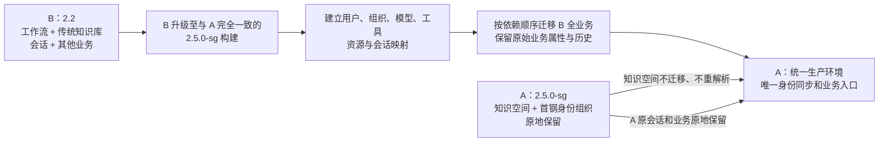

# 毕昇 A/B 环境升级与数据融合方案（客户评审版）

> 文档状态：架构调整评审稿
>
> 当前环境：A 为 2.5.0-sg，主要承载知识空间、空间文件扩展业务及首钢用户组织同步；B 为 2.2，主要承载工作流、传统知识库、用户、会话及其他既有业务。
>
> 调整后目标：以 A 为最终统一生产环境。先将 B 升级到与 A 完全一致的目标 2.5.0-sg 构建，再将 B 的用户关联、传统知识库、工作流、助手、会话、消息及其他业务数据完整迁入 A。
>
> 数据保护原则：A 原有知识空间、标签、文件业务属性、版本链、解析产物、索引和权限关系原地保留，不重新解析、不重新生成、不经中间环境回灌。

## 1. 评审结论摘要

推荐将原方案调整为“**B 先升级，B 全业务迁入 A，A 作为最终生产环境**”。



调整方向的核心理由是：A 中知识空间已经不仅是“文件 + 向量”，还包含标签、分类、别名、摘要、业务编码、业务文档版本链、主版本、发布/分享关系、审批来源、权限、投影代次及共享存储路由等扩展逻辑。如果把 A 空间迁出后重新解析，可能改变：

- 文件标签、自动分类、别名和摘要；
- Chunk 切分、向量值、全文索引及检索排序；
- 业务文档与物理文件版本之间的关系；
- 发布、分享、前后继文件及原始上传人等关系；
- OpenFGA 权限、部门授权和空间可见性；
- 文件业务编码、用户元数据、解析状态和投影状态。

因此，把 A 作为最终环境，可以把最复杂、最难证明无损的知识空间数据留在原地。本次迁移的复杂度转移到 B 的全业务数据合并，尤其是用户主键、工作流内部引用、传统知识库索引以及会话消息引用的映射。

### 1.1 新旧路线对比

| 比较项 | 原路线：A 迁入 B | 调整路线：B 迁入 A |
|---|---|---|
| 最终环境 | 升级后的 B | A |
| A 知识空间 | 需要跨环境迁移并重建大量关联 | 原地保留，不重解析、不重建 |
| 标签/分类/版本风险 | 高，需证明迁移与重解析不会改变业务结果 | 低，A 原数据不进入迁移写集合 |
| B 工作流和传统知识库 | 原地保留 | 需要完整迁移和引用重写 |
| 两边会话 | B 原会话天然保留，A 会话需另迁 | A 原会话天然保留，B 会话按聚合关系迁入 |
| 用户主键 | 倾向保留 B 用户 ID | 以 A 首钢身份为准，重写 B 资源归属 |
| 实施工具复杂度 | 知识空间、共享存储、权限和索引迁移复杂 | 业务表数量更多，ID/JSON/附件映射复杂 |
| 最大不可逆风险 | 重新解析导致空间业务属性和检索结果变化 | 漏迁 B 业务关联或切换后难以整体退回 B |
| 推荐结论 | 不再推荐 | 推荐，但必须完成业务域迁移工具和全量演练 |

调整路线并不是工作量更小，而是把风险从“难以证明语义不变的知识空间重建”，转移为“可以通过映射、哈希、数量和业务回归逐项验证的 B 业务关系迁移”。

本方案成立必须满足以下前提：

1. **B 仍需先完成 2.2→2.5.0-sg 升级。** 只有两侧 Schema、业务模型和权限语义一致后，才允许执行跨环境业务迁移。
2. **B 跨版本升级不能只运行 Alembic。** 2.3、2.4 的历史 SQL 和数据脚本必须按顺序补齐；2.5 Alembic 不能替代此前的升级动作。
3. **A 的实际运行构建是唯一目标基线。** 必须固定 A 的 Git 提交、镜像摘要、配置模板、Alembic head、OpenFGA 模型和底层组件版本。
4. **禁止数据库整库覆盖或直接合库。** 迁移必须按业务域执行 ETL、ID 映射和完整性核对，A 原数据不得被覆盖。
5. **两边会话和业务数据采用并集保留。** A 数据原地不变；B 数据迁入时重写所有显式和嵌套引用，冲突项按本方案处理。
6. **最终切换时 B 必须停止写入。** 切换后 A 是唯一业务入口，首钢身份同步始终只在 A 运行。

## 2. 当前环境与目标边界

### 2.1 当前环境

| 项目 | A 环境 | B 环境 |
|---|---|---|
| 当前版本 | 2.5.0-sg | 2.2 |
| 主要业务 | 知识空间、空间文件扩展逻辑、首钢用户/组织同步 | 工作流、助手、传统知识库、会话消息及其他业务 |
| 调整后角色 | 最终统一生产环境 | 待升级的数据来源环境，切换后只读留档 |
| 数据策略 | 原地保留，不重新解析知识空间 | 升级到目标版本后按业务域完整迁移 |

### 2.2 目标状态

- A 保留其现有知识空间、文件标签、业务文档版本、解析结果、向量、全文索引和权限。
- B 的用户相关业务、传统知识库、工作流、助手、会话、消息、反馈、附件及其他业务记录迁入 A。
- 同一自然人在 A、B 的数据统一归属于 A 中的同一目标用户。
- A 原有会话与 B 迁入会话同时保留，用户登录 A 后可查看两侧历史。
- 首钢用户和组织同步继续由 A 执行，B 不启用同步。
- 最终域名、Gateway、回调和其他业务入口统一指向 A。
- B 在观察期内保持只读，期满后按客户制度归档或下线。

### 2.3 本次纳入范围

默认迁移 B 中所有可持续使用或需保留历史的业务数据，包括：

- 用户、用户角色映射、本地用户组及成员关系；
- 工作流、工作流版本、变量、助手、助手关联；
- 传统知识库、历史个人知识库、文件、标签、用户元数据和现有解析产物；
- 会话、消息、附件、反馈、点赞/点踩/复制、敏感状态和引用；
- 标注任务及记录、报表、收藏、置顶、分享等与核心资源直接相关的持久业务关系；
- 工具定义、模型引用、知识库引用及外部接口配置的目标映射；
- B 升级后生成的权限关系和需迁入资源的目标权限；
- 经客户盘点确认的审计类、积分类或其他业务表。

### 2.4 不作为“在线业务合并”的数据

以下数据不直接写入 A 在线业务表，但需按客户保留策略归档：

- Redis 缓存、分布式锁、Celery 队列和正在运行的任务上下文；
- JWT、登录 Session、临时 Token、一次性凭证和缓存结果；
- 容器日志、调试日志、遥测中间数据、同步运行日志等运维数据；
- 已失效密钥和无法安全迁移的外部系统凭证。

如果客户将某类审计日志或统计数据定义为合规业务数据，应迁入专用归档库或单独设计迁移，不应与核心在线表直接拼接。

## 3. 方案调整后的核心原则

1. **A 原有数据优先且不可覆盖。** A 的主键、业务编码、对象路径、空间关系和权限均为目标侧既有事实。
2. **知识空间原地保护。** A 的知识空间不导出、不回灌、不重新解析；迁移工具不得更新其文件、标签、版本、索引和权限。
3. **B 先升级再迁移。** 迁移程序只处理同版本业务模型，避免同时承担跨版本转换和跨环境合并两类风险。
4. **同一用户以 A 身份为主。** 对同一自然人保留 A `user_id`，B 中所有资源、会话和消息归属改写到 A 用户。
5. **业务域整体迁移。** 工作流与版本、会话与消息、知识库与索引等必须作为一致性单元处理。
6. **显式 ID 与嵌套 ID 同时重写。** 除数据库字段外，还要识别工作流 JSON、消息 JSON、附件描述和变量值中的资源引用。
7. **业务属性与派生数据分离。** 标签、分类、用户元数据、业务编码和版本关系属于必须保留的业务事实；向量和全文索引属于可验证的派生数据，但本方案仍优先物理迁移现有产物。
8. **不按名称自动合并。** 姓名、用户名、部门名、空间名、知识库名、工作流名和文件名都不能单独作为同一对象判据。
9. **全程可追溯、可重跑。** 每个导入对象必须带迁移批次号、源环境和源 ID，迁移程序支持试运行、应用、续跑、核对和按批次回滚。
10. **失败关闭。** 无法映射的所有者、依赖、模型、权限或嵌套引用不得静默忽略。

## 4. 实施前必须形成的基线

### 4.1 版本与运行指纹

正式评审后必须补齐：

- A 当前运行的前后端、Worker、Gateway 镜像摘要和 Git 提交；
- A 的 Alembic current/head、OpenFGA Store ID、Authorization Model ID；
- A/B 的 MySQL、MinIO、Milvus、Elasticsearch、Redis 版本和拓扑；
- 多租户开关、A/B 租户 ID及目标租户映射；
- A 的共享存储开关、租户路由、Collection/Index 命名和向量模型；
- A/B 的模型 Provider、模型名、Embedding 维度、Rerank 配置和解析组件版本；
- B 2.2 当前 Schema、镜像、配置和历史升级记录；
- 最终用于升级 B 的唯一目标构建，要求与 A 实际运行构建一致。

“版本名称都叫 2.5.0-sg”不能作为一致性证明。

### 4.2 A 保护基线

迁移前对 A 建立不可变基线，至少包括：

- 用户、部门、知识空间、目录、文件、标签、文档、版本和权限数量；
- 每个空间的成员、所有者、发布状态和文件业务编码；
- MinIO 对象清单、大小和哈希；
- Milvus Collection/分区/Schema/实体量；
- Elasticsearch 索引 Mapping、文档量和样本摘要；
- OpenFGA 模型、Tuple 数量和关键权限矩阵；
- A 原会话、消息、工作流及其他既有业务数量；
- 目标表自增值、唯一约束和名称冲突分布。

迁移后的 A 原生数据必须与该基线一致。任何非预期变化均视为阻断问题。

### 4.3 B 业务盘点基线

| 数据域 | 必须统计的内容 |
|---|---|
| 用户 | 总数、启用/停用、来源、员工编码、用户名、手机号、邮箱、角色、重复身份 |
| 组织与用户组 | 部门、层级、外部编码、本地用户组、管理员、成员关系 |
| 工作流 | 工作流、所有版本、节点类型、模型/工具/知识库引用、状态、所有者 |
| 助手/应用 | 助手、关联工作流、工具、知识库、模型、上下架和分享状态 |
| 传统知识库 | 类型、文件、标签、用户元数据、解析模型、MinIO、Milvus、ES 现状 |
| 历史个人知识库 | `knowledge.type=2` 数量、所有者、文件和升级后转换结果 |
| 会话消息 | 会话数、消息数、`chat_id`、`flow_id`、用户、附件、反馈、引用、标注 |
| 其他业务 | 报表、变量、收藏、置顶、分享、评估、积分、审计及客户自定义功能 |
| 异常状态 | 无主资源、缺失附件、孤儿消息、运行中任务、失败解析、损坏索引 |

### 4.4 强制映射台账

迁移前必须建立以下映射表，禁止在脚本中临时猜测：

- `B_user_id → A_user_id`
- `B_department_id → A_department_id`
- `B_group_id → A_group_id`
- `B_tenant_id → A_tenant_id`
- `B_model_id → A_model_id`
- `B_tool_id → A_tool_id`
- `B_knowledge_id → A_knowledge_id`
- `B_knowledge_file_id → A_knowledge_file_id`
- `B_flow_id → A_flow_id`
- `B_flow_version_id → A_flow_version_id`
- `B_assistant_id → A_assistant_id`
- `B_chat_id → A_chat_id`
- `B_message_id → A_message_id`
- 其他业务表主键映射及 MinIO/Milvus/ES 对象映射。

每条映射需记录匹配规则、来源证据、是否人工确认、迁移批次和核对结果。

## 5. B 环境 2.2→目标 2.5.0-sg 升级

### 5.1 为什么仍要先升级 B

若直接从 2.2 抽取数据写入 A 2.5，迁移工具必须同时处理历史 Schema 转换、权限模型转换和 A/B 冲突，难以验证。先升级 B 有三点价值：

- 历史 2.3/2.4 数据转换由对应升级规则完成；
- B 可先在 2.5 上完成原业务回归，确认数据本身可用；
- A/B 迁移程序只需面向同一目标 Schema，显著降低合并脚本复杂度。

### 5.2 强制升级顺序

历史升级文档明确要求跨版本时逐版本执行 MySQL 和数据脚本。推荐顺序如下：

| 顺序 | 阶段 | 主要动作 | 完成判据 |
|---:|---|---|---|
| 1 | 2.2 基线 | 停止 B 写入；备份并验证恢复；记录 Schema/数据基线 | 可在隔离环境恢复并运行 2.2 |
| 2 | 2.3 beta1 | 补齐知识库/文件元数据字段；迁移旧元数据；回填上传者/更新者 | 字段、行数和抽样内容正确 |
| 3 | 2.3 beta4/正式版 | 补齐角色菜单；执行遥测重建和中间表脚本 | 脚本成功，业务查询正常 |
| 4 | 2.4 beta1 | 新增并回填会话 `group_ids`；大表按演练批次执行 | 所有历史会话用户组信息可解释 |
| 5 | 2.4 正式版 | 用户、知识库、知识空间、文件、标签等历史兼容变更 | Schema 一致，旧 `type=2` 处置完成 |
| 6 | 目标 2.5.0-sg | 部署目标 OpenFGA；运行 Alembic 到 A 对应 head；执行版本要求的人工脚本 | Alembic current/head 与 A 一致 |
| 7 | 权限/工作台迁移 | dry-run 后执行 RBAC→ReBAC、工作台等迁移 | B 原资源权限回归通过，失败 Tuple 为 0 |
| 8 | B 原业务回归 | 验证工作流、知识库、会话和附件 | 迁移前基线与升级后结果一致 |

历史依据：[版本升级注意事项](https://dataelem.feishu.cn/wiki/WNqbwm8zyiPo9ukIw5ecCWcfnPe?chunked=false)。实施脚本必须以 B 实际 Schema、A 运行构建和演练结果为准。

禁止：

- 仅替换镜像后运行 `alembic upgrade head`；
- 使用 `alembic stamp head` 跳过真实迁移；
- 因容器健康或 HTTP 200 就认定数据库升级成功；
- 原样重复执行不具备幂等保护的历史 SQL；
- B 升级到与 A 不同的“近似版本”。

### 5.3 升级执行账本

每一步记录脚本校验和、前置检查、开始/结束时间、影响行数、前后统计、执行人、异常和是否可重跑。任一强制步骤失败即停止，不允许数据库未升级完成时继续启动业务服务。

## 6. 总体迁移架构

### 6.1 迁移方式

使用独立的迁移控制库或 Staging Schema 承载：

- 源数据快照与摘要；
- 全部 ID 映射表；
- 冲突清单和人工决策；
- 批次状态、续跑点、错误记录；
- 目标写入清单、对象清单和回滚清单。

迁移工具必须支持：

```text
inventory → dry-run → apply → resume → verify → rollback-manifest
```

不得把 B 的 MySQL Dump 直接导入 A 主库，也不得通过关闭唯一约束来强行合库。

### 6.2 数据归属规则

| 数据类别 | 目标规则 |
|---|---|
| A 原有知识空间及其关联 | 完全原地保留，不进入迁移写集合 |
| A 原有用户、组织和同步 | 继续作为目标权威数据 |
| A 原有会话及业务数据 | 原地保留 |
| B 业务数据 | 在完成依赖映射后以新增方式迁入 A |
| 同一自然人的 B 数据 | 重写归属于 A 中对应用户 |
| B 独有本地用户的数据 | 为该用户在 A 创建目标账号后归属 |
| 系统级配置 | 以 A 为准；B 配置只做依赖映射或经审批新增 |
| 运行态和缓存 | 不迁入在线表，按需要归档 |

### 6.3 迁移依赖顺序

必须按以下顺序处理，后序对象不得引用尚未完成映射的前序对象：

1. 租户、用户、部门、角色和用户组映射；
2. 模型、工具、字典及外部依赖映射；
3. B 传统知识库、文件、标签及解析产物；
4. 工作流、工作流版本、变量和附件；
5. 助手及助手与工作流/工具/知识库的关联；
6. 会话、消息、消息附件、引用和反馈；
7. 标注、报表、收藏、置顶、分享及其他业务关系；
8. 目标资源的 OpenFGA 权限；
9. 数量、引用、对象、检索和权限核对；
10. 最终增量与切换。

## 7. 用户、组织与租户融合

### 7.1 用户主键策略

A 已承载首钢身份同步，因此 A 用户是目标权威主体。

| 场景 | 处理规则 |
|---|---|
| A、B 员工编码相同且确认是同一人 | 保留 A `user_id`；B 所有资源、会话、消息和操作记录重写到 A 用户 |
| B 用户无员工编码，但可由权威花名册确认 | 人工确认后映射到 A 用户 |
| B 独有本地用户且需继续使用 | 在 A 新建本地用户并分配新 `user_id`；迁移其角色和资源 |
| B 独有用户已离职但有历史业务 | 在 A 创建或映射到停用审计主体，禁止登录但保留历史归属 |
| 同一员工编码对应多个 B 用户 | 确定主账号并制定资源归并；未确认前阻断迁移 |
| 姓名/用户名相同但员工编码不同 | 视为不同用户，不自动合并 |
| 手机/邮箱相同但编码不同 | 仅作为人工核对候选 |

不得为了保留 B `user_id` 修改 A 的现有用户主键；所有 B 外键和嵌套引用都通过映射改写。

JWT、登录 Session 和 Token 不迁移。B 独有本地用户在 A `create` 时拷贝 B 已存的 `password` 哈希（不是明文），迁入后可用 B 原密码登录；`bind` 到 A 已有账号的用户不改 A 密码。B 侧密码为空时仍写入不可登录占位，需重置后才能登录。

### 7.2 部门、角色与用户组

- A 的首钢部门外部编码和组织树是权威结构。
- B 部门通过外部编码或客户确认映射到 A；仅同名不自动合并。
- B 独有的本地业务分组优先作为 A 中新的本地用户组迁入，不擅自改变 A 组织树。
- B 用户组分配新 A `group_id`，同步迁移管理员和成员关系。
- `message_session.group_ids` 等 JSON 字段必须使用新的 A 用户组 ID 重写。
- A 系统角色和权限模板为准；B 角色不能直接复制数字 ID。对 B 用户计算目标角色映射并由客户确认。
- 若 B 角色包含 A 中不存在的自定义能力，先新增经审批的目标角色，再迁移用户关联。

### 7.3 租户映射

- 每个 B 租户必须显式映射到一个 A 目标租户。
- 租户数字 ID 相同不能证明属于同一租户。
- 同一 B 租户的数据不得拆入多个 A 租户，除非客户提供逐资源分拆规则。
- 用户、资源、会话等新增数据的 `tenant_id` 都写为目标 A 租户；不能沿用 B 数字值。
- 映射完成后执行跨租户泄露检查，确保用户叶子租户、资源租户和派生数据租户符合目标版本约束。

## 8. B 传统知识库与文件迁移

### 8.1 对 A 知识空间的硬保护

以下对象不得被本次迁移更新或重建：

- A 原有 `knowledge.type=3` 空间及目录；
- A 空间文件、标签、用户元数据、业务编码和分类；
- A 业务文档、版本链、主版本及发布/分享关系；
- A 空间 MinIO 对象、Milvus 向量、ES 文档；
- A 空间 OpenFGA Tuple、部门授权和审批关系；
- A 空间共享存储路由、代次和投影状态。

迁移工具需通过“目标资源白名单 + 迁移批次号”限制写入，不允许只靠程序员约定规避误更新。

### 8.2 B 知识库迁移原则

B 的传统知识库也以保持现状为优先：

- 业务元数据、标签、用户元数据、文件名称、目录、解析参数、上传人和时间完整保留；
- B 知识库与文件使用 A 新 ID并建立映射；
- MinIO 原文件、预览、BBox、缩略图等对象复制到不冲突的新对象路径；
- 在底层兼容时，Milvus 向量和 ES 文档采用“保留向量/内容、重写目标 ID和租户元数据”的方式迁入，不重新 Embedding；
- 迁移后校验 Chunk 数量、向量数量、ES 文档量、元数据和检索结果；
- 不因重建派生数据覆盖标签、分类、别名、摘要、业务编码或用户元数据。

### 8.3 物理解析产物迁移的兼容门禁

直接迁移 B 的解析产物必须同时满足：

- A/B 使用兼容的 Embedding 模型、版本和向量维度；
- Milvus Schema、字段类型、索引参数和分区语义兼容；
- ES Mapping、Analyzer、字段语义和全文检索逻辑兼容；
- Chunk 文档中涉及的知识库 ID、文件 ID、租户 ID和对象路径可确定性重写；
- 原始对象、解析对象、向量实体和 ES 文档之间可一一核对；
- 目标名称不与 A 现有 Collection/Index 冲突。

任一条件不满足时，该知识库进入异常清单。默认处置顺序：

1. 先尝试专用格式转换，保留原 Chunk 和向量内容；
2. 无法转换时，仅对受影响的 B 文件提出重新解析申请；
3. 重新解析前导出并锁定标签、分类、别名、摘要、业务编码和用户元数据；
4. 解析后重新挂接这些业务属性并进行逐项核对；
5. 未经客户批准不得自动重新解析。

无论 B 是否需要局部重解析，A 原知识空间均不在重解析范围。

### 8.4 B 旧个人知识库

历史升级规则可能将 B 2.2 的 `knowledge.type=2` 转换为个人知识空间。升级前必须专项盘点：

- 有有效文件和使用记录的个人知识库按升级规则保留；
- 升级后作为 B 业务资源迁入 A，空间名称冲突按冲突矩阵处理；
- 若 A 对目标租户启用了共享空间存储，迁入空间必须按 A 当前路由写入目标共享结构，不能在同一租户中并存未知的旧/新写路径；
- 无主、空数据或损坏项进入客户决策清单，不自动删除。

## 9. 工作流、助手、模型与工具迁移

### 9.1 模型与工具先行映射

- A 已存在且技术参数一致的模型配置直接映射，不重复创建。
- 同名但 Provider、模型名、Embedding 维度或参数不同的配置不自动合并。
- B 独有模型在 A 中重新配置服务地址和凭证；密钥不从 B 明文复制。
- B 自定义工具分配 A 新 ID；接口地址、认证、网络和返回结构需重新联调。
- 缺失模型或工具时，依赖它的工作流不得上线。

### 9.2 工作流迁移

工作流是“主记录 + 全版本 + JSON 节点 + 变量 + 附件 + 权限”的整体：

- `flow_id` 为 UUID 且与 A 无冲突时可以保留，以减少会话和外部引用改写；发生冲突时生成新 ID。
- 工作流所有者改写为目标 A 用户。
- 所有 FlowVersion 一并迁移，保持当前版本和历史版本关系。
- 对每种节点 Schema 建立明确的字段映射规则，重写知识库、模型、工具、助手、子流程和用户等 ID。
- 禁止对 JSON 做不区分字段的全文字符串替换。
- 变量值、节点配置、上传附件和对象路径按语义重写。
- 工作流名称冲突不合并，默认追加“[B迁移]”；只有内容摘要、所有者和版本均确认同源时才允许去重。
- 每个迁入工作流都需执行打开、保存、发布、单节点测试和端到端运行。

### 9.3 助手与应用关联

- 助手 UUID 无冲突时可保留，冲突时生成新 ID。
- 助手与工作流、工具、知识库的关联在所有依赖映射完成后重建。
- 模型配置使用 A 目标模型 ID。
- 上下架、分享状态按 B 原状态迁移，但在完成权限和依赖验证前保持隐藏。
- B 中已删除应用仍可保留为会话历史快照，不应恢复为可执行应用。

## 10. 两边会话、消息及关联数据完整保留

### 10.1 会话合并目标

- A 原有会话和消息不修改。
- B 全部有效会话、已删除但需审计的会话及其消息迁入 A。
- 同一自然人的 A/B 会话最终均归属于映射后的 A 用户。
- 消息正文、顺序、时间、角色、附件、反馈、敏感状态和引用应保持一致。
- 会话迁移必须晚于对应用户、用户组、工作流/助手和附件迁移。

### 10.2 `chat_id` 冲突规则

| 场景 | 处理规则 |
|---|---|
| B `chat_id` 在 A 不存在 | 保留原 `chat_id`，减少外部链接和消息引用改写 |
| A/B `chat_id` 相同且会话/消息摘要完全一致 | 经核对确认同源后去重，记录双来源 |
| A/B `chat_id` 相同但内容不同 | 为 B 会话生成新 `chat_id`，重写消息、标注、引用、分享等所有关联 |
| B 会话找不到对应应用 | 保留为只读历史会话，使用会话快照中的应用名称/描述展示 |
| B 会话对应应用已成功迁入 | 默认允许查看历史；是否允许从原会话继续对话按客户决策和回归结果确定 |

### 10.3 消息迁移规则

- `chatmessage.id` 等数字主键由 A 重新分配并记录映射。
- `user_id`、`mark_user` 等用户字段使用目标用户映射。
- `flow_id` 和 `chat_id` 使用目标应用及会话映射。
- 保留 `message`、`type`、`category`、`sender`、`create_time`、`update_time`、点赞/点踩/复制、解决状态和敏感状态。
- `files`、`extra`、`receiver`、`intermediate_steps`、`remark` 等文本或 JSON 字段需要先解析结构，只重写已知 ID、URL 和对象路径字段；未知结构保持原文并进入兼容核对。
- 消息附件先复制到 A 的不冲突对象路径，再更新消息引用。
- 消息引用、Citation、反馈、标注记录和会话统计在消息 ID 映射完成后迁移。
- 保持每个会话内消息的原始顺序；不能仅依赖新自增 ID排序，应以原 ID和时间建立稳定顺序。
- `message_session.group_ids` 必须映射为 A 用户组 ID；无法映射的历史组保留来源快照，但不能产生越权过滤。

### 10.4 会话验收

每类应用至少抽取以下样本：

- 有附件、无附件；
- 多轮消息、工具调用、知识库引用；
- 点赞/点踩、标注、敏感状态；
- 已删除应用、已删除会话、停用用户；
- `chat_id` 冲突并发生重映射；
- A/B 同一用户两侧都有历史会话。

验收要求包括会话数量、消息数量、首尾消息时间、内容哈希、附件可访问性、应用跳转和用户可见性一致。

## 11. 权限、分享与其他业务关系

### 11.1 权限迁移

- A 当前 OpenFGA Store 和模型为唯一目标权限系统。
- A 原资源 Tuple 不修改。
- B 在升级后先完成自身 RBAC→ReBAC 迁移和验证，以明确 B 原有效权限。
- 迁入 A 时，仅为 B 新增资源按映射后的用户、部门、用户组重建 Tuple。
- 不直接复制 B 的底层 Tuple ID或在不同 Authorization Model 间原样导入。
- 同一主体对同一目标资源出现多种授权时，保留来源审计，并按客户确认的目标角色处理；不得自动扩大权限。
- 资源所有者缺失、主体歧义、Tuple 写入失败或待处理数据非 0 时，该资源不得发布。

### 11.2 其他持久业务数据

默认保留并迁移：

- 收藏、置顶、分享关系和有效分享配置；
- 标注任务、标注记录及与会话的关联；
- 报表、工作流变量、评估和客户确认的业务统计；
- 已完成审批记录中需要审计的历史快照；
- 与迁入资源相关的业务标签和关联表。

特殊规则：

- 旧分享链接包含环境域名或签名时，在 A 中重新生成链接，保留历史链接与新链接映射；不复制签名密钥。
- API Token、Developer Token 和外部调用密钥默认重新签发。
- 正在运行的审批、解析、定时或同步任务必须在 B 冻结前完成或取消，不跨环境恢复运行上下文。
- 审计日志进入 A 在线库 `auditlog`（重写操作者/租户/对象 ID；未映射操作者及未迁空间对象跳过）。积分、计费、遥测不迁入 A 在线库。

## 12. 冲突数据处理矩阵

以下为默认规则。例外必须进入冲突报告并由指定负责人签字。

| 数据对象/冲突 | 判定依据 | 默认处理规则 | 是否阻断 |
|---|---|---|---|
| 数字主键相同 | 仅 ID 相同 | A 原 ID不变；B 对象分配 A 新 ID并建映射 | 否 |
| UUID 相同且 A 无对应对象 | 目标唯一约束 | 可保留 B UUID | 否 |
| UUID 相同但内容不同 | UUID + 内容摘要 | B 生成新 UUID，重写全部关联 | 是，直到映射完成 |
| 同一自然人两侧账号 | 员工编码 + 权威确认 | 保留 A 用户，B 业务归属重写到 A | 是 |
| 同一用户两侧姓名/邮箱/头像不同 | 已确认同一员工 | A 的身份同步属性为准；B 属性差异进入审计，不反向覆盖 A | 否 |
| 用户姓名/用户名相同 | 仅名称相同 | 不自动合并 | 涉及所有者时是 |
| 手机/邮箱相同 | 辅助属性 | 只作为人工确认候选 | 涉及所有者时是 |
| 重复员工编码 | 一个编码多账号 | 确认唯一目标用户，完成资源归并 | 是 |
| B 独有在用本地用户 | B 有业务数据 | 在 A 新建本地账号或接入统一身份 | 是，直到账号就绪 |
| B 离职用户有历史 | 离职状态 + 历史资源 | 映射/创建停用审计主体，资源按客户规则转交 | 无主资源时是 |
| 部门外部编码相同 | 权威编码 | 映射到 A 部门并校验层级 | 层级冲突时是 |
| 部门同名、编码不同 | 名称相同 | 不合并，人工映射或保留为本地组 | 否 |
| B 用户组与 A 同名 | 同租户同名 | 默认新建“[B迁移]”用户组，不按名称合并 | 否 |
| 租户 ID 相同 | 仅数字相同 | 显式确认业务租户映射 | 是 |
| 系统角色同名但权限不同 | 角色名相同 | 以 A 为准，人工建立能力映射 | 是 |
| 模型同名且参数完全相同 | Provider、模型、维度、参数 | 复用 A 模型 | 否 |
| 模型同名但参数不同 | 技术参数不同 | 不合并，新建或选择目标模型并回归 | 是 |
| 工具同名 | 名称相同 | 不自动合并；按接口定义、版本和鉴权核对 | 依赖工作流时是 |
| 知识库同名 | 同租户同名 | 默认迁入项追加“[B迁移]” | 否 |
| 文件同名且内容相同 | 规范名 + 哈希 + 大小 | 同一目标知识库内可去重，保留双来源记录 | 否 |
| 文件同名但内容不同 | 名同、哈希不同 | 两份保留，B 文件追加来源后缀 | 否 |
| 标签同名 | 标签名 + 业务域/租户 | 语义确认一致才映射，否则新建带来源标签 | 否 |
| 文件业务编码冲突 | 编码相同、内容或版本不同 | 阻断自动导入，确认同一业务文档或重新编码 | 是 |
| MinIO 对象路径相同 | 对象键相同 | B 使用新目标键，校验哈希后更新映射 | 否 |
| Milvus/ES 名称相同 | Collection/Index 名相同 | B 创建目标新名称，禁止覆盖 A | 否 |
| 向量维度或 Schema 不兼容 | 模型/Schema 对比 | 尝试格式转换；否则逐文件审批重解析 | 是 |
| 工作流名称相同 | 名称相同 | 不合并，B 追加来源后缀 | 否 |
| 工作流 UUID 相同、内容不同 | UUID + 版本摘要 | B 生成新 UUID并语义重写引用 | 是 |
| 工作流 JSON 未知引用 | 无法识别的 ID字段 | 进入人工分析，不做全局替换 | 是 |
| 会话 `chat_id` 相同、内容一致 | 会话/消息摘要一致 | 确认同源后去重 | 否 |
| 会话 `chat_id` 相同、内容不同 | 摘要不同 | B 生成新 `chat_id`，全链重写 | 是 |
| 消息数字 ID相同 | 自增 ID相同 | A 新分配 ID，保留顺序并映射 | 否 |
| 消息嵌套字段包含旧 ID/路径 | JSON/文本结构 | 只按字段白名单重写；未知结构原样保留并报告 | 核心引用未知时是 |
| B 会话无对应应用 | 应用缺失/已删除 | 作为只读历史迁移，保留应用快照 | 否 |
| 权限角色冲突 | 同一主体/资源多授权 | 不扩大权限，按目标模型和客户决策重建 | 敏感资源时是 |
| 无法映射资源所有者 | 主体缺失或歧义 | 不发布，客户指定目标所有者 | 是 |
| 分享链接或 Token 冲突 | 环境签名/密钥不同 | 在 A 重新生成，不复制密钥 | 外部切换前是 |
| 正在运行的业务任务 | 非终态任务 | 在 B 完成或取消，不迁移运行态 | 是 |
| 已删除数据 | 删除/回收状态 | 保持删除语义，不意外恢复 | 否 |
| 孤儿/损坏记录 | 依赖对象缺失 | 隔离并报告，不伪造引用 | 影响核心数据时是 |

冲突优先级：

- **P0：** 用户/租户/所有者歧义、A 原数据被修改、权限越权、核心引用不明、文件业务编码冲突、目标模型或存储不兼容。
- **P1：** 会话/消息缺失、附件不可用、工作流无法运行、知识库检索不一致、分享/外部接口未切换。
- **P2：** 名称增加来源后缀、非核心历史统计差异、经客户确认只归档的数据。

上线要求：P0 为 0；P1 为 0 或逐项书面豁免；P2 形成最终遗留清单。

## 13. 分阶段实施计划

### P0：方案和目标版本冻结

- 客户确认 A 为最终环境及本方案范围。
- 固定 A 实际运行构建和底层组件指纹。
- 确认会话保留、业务数据范围、权限和冲突规则。
- 确认维护窗口、RPO/RTO、观察期和回滚截止点。

**门禁：** 第 18 节所有决策项有负责人和结论。

### P1：A/B 只读盘点

- 建立 A 保护基线和 B 业务基线。
- 输出全部映射候选、冲突清单和容量评估。
- 扫描 B 工作流 JSON、消息嵌套字段、附件路径和底层索引兼容性。
- 识别 B 的旧个人知识库、孤儿数据和运行中任务。

**门禁：** P0 问题有明确处置方案；A 目标容量满足导入和临时空间要求。

### P2：B 升级演练

- 从 B 生产备份恢复隔离副本。
- 按历史顺序升级到 A 目标构建。
- 验证工作流、知识库、会话、附件和权限。
- 完成升级回滚演练并得到实测停机时间。

**门禁：** 升级包幂等可重跑，B 原业务回归通过。

### P3：生产 B 升级

- 冻结 B 写入、Worker、Beat 和外部入口。
- 完成一致性备份和恢复验证。
- 使用演练通过的升级包升级 B。
- 在目标 2.5.0-sg 下恢复 B 业务并观察。
- B 不启用首钢身份同步。

**门禁：** B 与 A 目标 Schema/版本一致，B 原业务稳定。

### P4：完整迁移演练

- 使用 A、B 同时点生产副本搭建隔离演练环境。
- 执行全量映射和按业务域导入。
- 重点验证 A 原空间零变化、B 会话完整、工作流可运行和知识库检索一致。
- 演练最终增量、按批次清理和切换回滚。

**门禁：** 迁移工具可试运行/续跑/核对/回滚；得到全量和增量实测耗时。

### P5：生产全量迁移

- A、B 均可继续各自业务，但迁入 A 的 B 资源保持隐藏。
- 冻结映射表版本，迁移 B 基础主体、依赖配置、知识库、工作流、助手、会话和其他业务。
- 所有写入带批次号，只能新增或更新本批 B 来源对象。
- A 原知识空间不参与迁移任务。

**门禁：** 全量数据和依赖验证通过，A 原生数据保护基线无变化。

### P6：最终冻结、增量和切换

1. 公告窗口并停止 B 的用户入口、API 写入、Worker、Beat 和外部调用。
2. 记录 B 最终水位，确认冻结后无新增写入。
3. 对 A 短时限制相关写入，避免用户看到半完成的 B 导入资源。
4. 迁移 B 全量后产生的新增、修改和删除增量。
5. 完成会话、消息、附件、工作流、知识库、权限和数量终检。
6. 发布已验证的 B 迁入资源。
7. 将 B 的域名、Gateway、回调和外部集成切换到 A。
8. 验证首钢身份同步仍仅由 A 运行。
9. 客户业务、技术、安全负责人共同执行 Go/No-Go。

**门禁：** RPO=0；A 为唯一入口；P0/P1 均关闭或书面豁免。

### P7：观察期与收尾

- B 建议只读保留 2–4 周，具体按客户制度确定。
- 每日检查登录、会话、工作流、知识库、检索、权限、同步和容量。
- B 原链接可在观察期提供跳转或映射查询。
- 遗留项关闭后，撤销 B 凭证和网络入口，按审批归档或下线。

### 参考里程碑

具体日期只能在数据盘点、容量测试和至少一次全量演练后承诺。评审阶段可先采用以下相对排期：

| 相对时间 | 里程碑 | 主要输出 |
|---|---|---|
| T-20～T-15 个工作日 | 版本冻结和 A/B 盘点 | 保护基线、业务基线、容量及冲突清单 |
| T-15～T-10 个工作日 | B 升级及回滚演练 | 升级包、执行账本、实测停机时间 |
| T-12～T-5 个工作日 | 完整融合演练 | 映射表、业务域迁移结果、会话/检索/权限报告 |
| T-5～T-2 个工作日 | 例外关闭和生产准备 | 最终 Runbook、备份验证、Go/No-Go 预审 |
| T-1～T 日 | 生产全量末次同步、最终冻结和切换 | 最终增量、业务验收、入口切换 |
| T+1～观察期结束 | 持续观察 | 日报、遗留项、最终验收和 B 归档审批 |

B 生产升级与 B→A 最终切换默认安排为两个独立窗口。只有演练证明总耗时、回滚和业务影响均可接受时，才考虑合并窗口。

## 14. 最终增量和数据一致性规则

### 14.1 增量水位

- 对有可靠 `update_time`、单调业务序号或审计流水的表记录“全量开始水位”和“冻结水位”。
- 对无可靠更新时间的关系表使用主键集合、行摘要或前后快照差异。
- MinIO 使用对象键、大小、哈希/ETag 和最后修改时间联合判断。
- 删除记录生成独立删除清单，按映射在 A 应用删除/失效语义。
- 每条导入记录带源 ID和批次号，重复执行必须得到相同结果。
- 冻结后发现 B 仍有写入，则水位作废，重新冻结和核对。

### 14.2 同时在线边界

全量迁移期间 A、B 可以分别服务各自原业务，但必须满足：

- A 用户不能使用尚未发布的 B 迁入资源；
- B 不向 A 的知识空间或索引写入；
- 组织同步仅 A 运行；
- 导入 Worker 使用独立队列和批次上下文；
- 最终增量期间 B 完全停止写入；
- 同一租户的旧/新共享存储写路径不得出现并发写入者。

## 15. 验收标准

### 15.1 A 原数据零变化验收

- A 原知识空间、目录、文件、标签、业务文档和版本数量一致。
- A 原文件业务编码、用户元数据、别名、摘要和分类摘要一致。
- A 原 MinIO 对象哈希、Milvus 实体量和 ES 文档摘要无非预期变化。
- A 原权限矩阵和关键 OpenFGA Tuple 无非预期变化。
- A 原会话、消息和其他业务记录无丢失或覆盖。

### 15.2 B 业务迁移验收

- B 范围内用户、用户组、工作流、版本、助手、知识库、文件、会话和消息均有目标映射。
- B 原核心资源所有者映射成功率 100%。
- 所有工作流的模型、工具、知识库和嵌套引用有效。
- B 知识库业务标签、用户元数据、文件属性和检索金标符合原环境。
- B 会话数和消息数与范围基线一致；差异逐条有批准说明。
- 消息正文和附件哈希一致，消息顺序、时间、反馈、引用和标注完整。
- 同一用户登录 A 后能查看 A 原会话和 B 迁入会话。
- B 原有效权限在 A 中等价，且未扩大到 A 原资源。

### 15.3 运行与切换验收

- A API、Worker、Beat、MySQL、Redis、MinIO、Milvus、ES 和 OpenFGA 健康。
- 首钢组织同步仅 A 活跃，用户和部门数据与权威源一致。
- Gateway、域名、证书、回调和外部接口均指向 A。
- 队列无持续积压，失败 Tuple、失败导入批次和未知引用为 0。
- 性能、容量和检索质量达到双方批准的阈值。

## 16. 备份与回滚

### 16.1 备份要求

- B 升级前：B MySQL、MinIO、Milvus、ES、配置、镜像和权限数据的一致性备份。
- 生产全量导入前：A 全量一致性备份及 A 保护基线。
- 最终切换前：A 导入后快照、B 最终冻结快照、全部映射和批次清单。
- 备份必须记录时间点、版本、校验值、保留位置和负责人。
- 至少一次演练必须从备份恢复并通过核心启动和数据检查。

### 16.2 分阶段回滚

| 时点 | 回滚方式 | 约束 |
|---|---|---|
| B 升级失败，尚未接受 2.5 新写入 | 恢复 B 2.2 的数据库与存储一致性快照，使用原镜像启动 | MySQL、MinIO、Milvus、ES 必须同一冻结点 |
| A 全量导入失败，尚未切换 | 按批次清单删除/隔离 B 新增对象、索引、权限和数据；A 原数据不动 | 禁止无批次条件的范围删除 |
| 最终增量核对失败，尚未切换 | 保持 B 冻结或恢复 B 服务；清理失败增量批次后重新安排 | 恢复 B 前确认 A 未接收 B 来源新写入 |
| 已切换，A 尚未产生 B 来源新写入 | 在快速回滚截止点内，可将 B 原入口切回 B | A 原知识空间业务仍留在 A，需明确入口拆分策略 |
| 已切换，A 已产生新写入 | 不允许简单切回 B；优先前向修复。确需回退时先冻结 A，并执行 A→B 反向增量 | 高风险，需联合审批 |

由于 A 原生知识空间始终只存在于 A，切换后的“整站回退到 B”天然比原方案更困难。因此必须设置快速回滚截止点，并优先通过批次回滚和前向修复保护 A。

### 16.3 共享存储回退约束

- 一旦导入资源按 A 的共享存储路由产生写入，不能直接用不识别该路由的旧代码接管同一租户。
- 旧/新版本 API、Worker 和 Beat 不得同时写同一租户。
- 回退前必须验证路由状态；如需降级，先执行与目标版本匹配的反向迁移。
- 共享存储相关操作应与 B→A 业务融合分成可独立验收的批次，避免一个窗口同时改变数据归属和底层路由。

## 17. 风险与控制措施

| 风险 | 影响 | 控制措施 |
|---|---|---|
| B 遗漏 2.3/2.4 历史迁移 | Schema 或历史数据不完整 | 按版本顺序、执行账本、Schema diff 和演练确认 |
| Alembic 失败但服务继续启动 | 表面健康、实际未完成升级 | 独立检查 current/head，将失败设为硬阻断 |
| 误修改 A 知识空间 | 标签、版本、索引或权限变化 | A 保护基线、写入白名单、批次隔离、零变化核对 |
| 同一用户映射错误 | 资源和会话归属错误、越权 | 员工编码权威匹配，歧义人工确认，P0 阻断 |
| 工作流 JSON 漏改引用 | 工作流打开正常但运行失败 | 节点 Schema 白名单、未知字段扫描、端到端测试 |
| 会话只迁主表未迁关联 | 消息、附件、标注或引用丢失 | 会话聚合迁移，显式列和嵌套 JSON 同时核对 |
| 直接复制向量不兼容 | 检索失败或结果错误 | 模型/维度/Schema/Mapping 门禁，金标检索验证 |
| 局部重解析改变 B 业务属性 | 标签或分类发生变化 | 先导出锁定业务属性，审批后局部重解析并回挂核对 |
| ID/名称冲突覆盖 A 数据 | A 原业务损坏 | A ID永不覆盖，B 映射新 ID，名称只加后缀 |
| 权限迁移扩大授权 | 数据泄露 | 按 A 模型重建、失败关闭、权限矩阵验收 |
| 双写或水位不准 | B 最终数据遗漏或分叉 | 最终冻结、表级水位、删除清单、重复写入检测 |
| 切换后难以整体回退 | 新写入无法回到 B | 快速回滚截止点、前向修复、必要时反向增量 |
| 数据规模超出窗口 | 切换超时 | 全量提前迁移，仅窗口内迁最终增量；按演练实测排期 |

## 18. 客户评审需确认的决策项

| 编号 | 决策项 | 推荐值 | 客户结论 |
|---|---|---|---|
| D01 | 最终统一环境 | A 环境 | 已确认 |
| D02 | A 知识空间处理 | 原地保留，禁止重解析和重建 | 已确认 |
| D03 | B 升级目标构建 | 与 A 实际镜像摘要、提交和 Alembic head 完全一致 | 规则已锁定；生产钉死待演练 |
| D04 | 用户权威标识 | 首钢员工编码，A 用户为目标主体 | 按建议锁定 |
| D05 | B 独有本地用户 | 在 A 新建本地/统一身份账号，保留业务 | 按建议锁定 |
| D06 | 歧义用户 | 人工逐项确认，不按姓名自动合并 | 按建议锁定 |
| D07 | 部门权威体系 | A 的首钢组织树；B 本地组独立迁入 | 按建议锁定 |
| D08 | B 旧个人知识库 | 不迁 B 的 type=3，只迁传统库 type=0/1 | 已确认（覆盖原稿“作为空间迁入”） |
| D09 | B 知识库解析产物 | 兼容时物理迁移，不重新 Embedding | 按建议锁定 |
| D10 | 不兼容 B 文件 | 仅逐项审批后重解析，并锁定/回挂业务属性 | 按建议锁定 |
| D11 | 两边会话和消息 | 全部保留并在 A 中合并展示 | 按建议锁定 |
| D12 | 迁入会话能否继续对话 | 依赖应用验证通过则允许；缺失应用只读 | 按建议锁定 |
| D13 | 同名工作流/知识库 | 默认增加“[B迁移]”，不自动合并 | 按建议锁定 |
| D14 | 分享链接和 API Token | A 中重新生成/签发 | 已确认 |
| D15 | 标注、报表、收藏等 | 随核心业务完整迁移 | 按建议锁定 |
| D16 | 审计、积分、遥测数据 | 审计 `auditlog` 在线迁入 A；积分/遥测不迁 | 已确认（2026-09-16） |
| D17 | 租户映射 | B tenant 1 对应 A tenant 1 | 已确认 |
| D18 | 共享存储路由 | 不迁 B 空间，门禁不触发；以 A 当前路由为准 | 已确认 |
| D19 | RPO | 最终冻结并完成增量后 RPO=0 | 按建议锁定 |
| D20 | 维护窗口 | 以演练实测最大耗时 + 30% 缓冲确定 | 规则已锁定；小时数待演练 |
| D21 | B 只读观察期 | 不做独立 P7 观察期 | 已确认 |
| D22 | 快速回滚截止点 | 切入口前可按批次回滚；超过后优先前向修复 | 规则已锁定；时刻待演练 |
| D23 | 可接受例外 | P0=0；P1 原则上为 0；P2 逐项签字 | 按建议锁定 |

## 19. 实施角色与职责

| 角色 | 主要职责 |
|---|---|
| 客户业务负责人 | 确认迁移范围、历史保留、名称冲突和 UAT；签署 Go/No-Go |
| 客户身份负责人 | 提供权威员工/部门编码，确认歧义用户和离职人员策略 |
| 客户运维负责人 | 备份、网络、DNS、Gateway、证书、维护窗口、监控和回滚审批 |
| 毕昇交付负责人 | 固定版本，提供升级/迁移工具，执行演练、生产迁移和核对 |
| 数据库/存储负责人 | MySQL、MinIO、Milvus、ES 容量、备份恢复和一致性保障 |
| 权限/安全负责人 | OpenFGA 权限矩阵、凭证重签、越权检查和敏感数据验收 |
| 变更指挥人 | 统一指挥冻结、切换、回滚、问题升级和对外沟通 |

生产命令采用执行人和复核人双人确认，明确环境、租户、目标和影响范围。

## 20. 交付物清单

1. A/B 版本、配置、数据、容量和底层存储盘点报告；
2. A 保护基线及迁移后零变化核对报告；
3. B 2.2→目标 2.5.0-sg 幂等升级包、执行账本和回滚手册；
4. 用户、部门、租户、模型、工具、知识库、工作流、会话等完整映射表；
5. 冲突清单、人工决策和客户签字记录；
6. 业务域迁移工具及 `inventory/dry-run/apply/resume/verify/rollback-manifest` 说明；
7. 工作流 JSON 和消息嵌套引用扫描/重写规则清单；
8. B 知识库物理解析产物兼容性报告和局部例外清单；
9. 全量演练、增量演练、恢复演练和性能容量报告；
10. 生产 Runbook、回滚 Runbook、Go/No-Go 清单和通讯录；
11. 会话、消息、附件、工作流、知识库、检索和权限验收报告；
12. 观察期报告及 B 归档/下线审批记录。

## 21. Go/No-Go 检查表

以下任一项为“否”时不得进入最终切换：

- [ ] A 目标镜像摘要、Git 提交、Alembic head 和 OpenFGA 模型已固定。
- [ ] B 已按历史顺序升级到与 A 完全一致的构建并通过原业务回归。
- [ ] A 原知识空间零变化保护机制已在演练环境验证。
- [ ] 用户、部门、租户、用户组和角色映射已冻结，歧义所有者为 0。
- [ ] B 模型、工具、知识库、工作流和助手依赖映射完整。
- [ ] 工作流 JSON 和消息嵌套引用不存在未知核心 ID。
- [ ] B 传统知识库业务属性和解析产物迁移验证通过。
- [ ] A/B 会话和消息并集核对通过，附件、反馈、标注和引用完整。
- [ ] B 迁入资源权限矩阵通过，A 原权限无变化。
- [ ] 最终增量水位、删除清单和 RPO=0 方案已经演练。
- [ ] 备份完成恢复验证，批次清理和回滚脚本已就位。
- [ ] Gateway、域名、证书、回调和监控切换步骤已确认。
- [ ] A 是唯一身份同步端，B 的同步和写入停用方案已验证。
- [ ] P0/P1 问题全部关闭或取得客户书面豁免。
- [ ] 客户业务、身份、运维、安全和毕昇交付负责人均签署 Go。

## 22. 评审建议结论

建议客户批准调整后的总体路径：

1. 以 A 作为最终生产环境，完整保护 A 已投入使用的知识空间及其扩展业务数据；
2. 先将 B 按历史升级链升级到与 A 完全一致的 2.5.0-sg；
3. 以 A 的首钢用户、部门和系统配置为目标权威，建立 B→A 全量映射；
4. 按依赖顺序迁移 B 的传统知识库、工作流、助手、会话、消息及其他业务数据；
5. 两边会话和业务数据采用并集保留，不以覆盖、整库合并或丢弃历史换取迁移简化；
6. A 知识空间不重新解析；B 知识库也优先迁移原解析产物，局部不兼容项须审批后处理；
7. 经过全量和最终增量演练后，冻结 B、完成 RPO=0 增量并将全部入口切换到 A；
8. B 在观察期内只读保留，确认无遗漏后再归档或下线。

与原“迁移 A 空间到 B”方案相比，本方案需要处理更多 B 侧业务表和引用映射，但把风险从难以证明无损的知识空间重建，转换为可通过映射台账、业务域 ETL、内容哈希和依赖回归验证的数据合并。结合 A 知识空间已有标签、版本、权限、投影和解析逻辑，调整后方案更符合“保护复杂既有事实、迁移可枚举业务关系”的原则。
