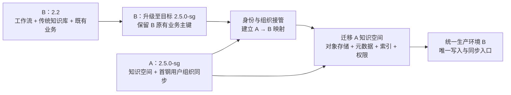

# 毕昇 A/B 环境升级与数据融合方案
> 文档状态：评审稿
>
> 适用场景：A 环境为 2.5.0-sg，主要承载知识空间及首钢组织用户同步；B 环境为 2.2，主要承载用户、工作流、传统知识库等既有业务。
>
> 推荐目标：将 B 升级到经双方确认的同一套 2.5.0-sg 构建版本，以 B 为最终生产环境，再将 A 的知识空间和首钢身份体系融合进 B。
>
> 重要说明：本文是实施与评审基线。正式执行前，必须以 A/B 生产数据盘点、目标镜像摘要和至少一次全量演练结果补齐文中的待确认项。

## 1. 评审结论摘要

推荐采用“先升级 B、再迁移 A、最终切换到 B”的方案。

该路径的主要收益是：

- B 中数量更多、关联更复杂的工作流、传统知识库、会话及业务数据无需跨库搬迁，只承担原地版本升级风险。
- A 的迁移范围收敛为首钢身份/组织体系、知识空间及其直接依赖，改动面更小。
- B 原有资源继续引用原有 `user_id`、知识库 ID、工作流 ID，避免大范围改写业务关联。
- 可以先完成 B 升级和回归，再分批迁移 A，风险能够按阶段隔离。

但该方案成立必须满足四个前置条件：

1. **B 的 2.2→2.5 不能只执行 Alembic。** 2.3、2.4 历史版本的人工 SQL 和数据脚本必须按顺序补齐；Alembic 是 2.5 引入后的迁移机制，不能替代此前的升级动作。
2. **A、B 必须对齐到完全相同的目标构建。** 不能只比较“2.5.0-sg”名称，必须固定 Git 提交、镜像摘要、配置模板、Alembic head 和 OpenFGA 模型版本。
3. **首钢用户同步切换前必须完成身份接管。** 对于 B 中已存在的同一自然人，应保留 B 的 `user_id`，将其绑定为首钢身份；不能仅按姓名或用户名新建 A 用户，否则会产生重复账号和资源失主。
4. **切换时只允许一个写入源。** A、B 不能同时执行组织同步，也不能同时向同一租户的 MySQL、MinIO、Milvus、Elasticsearch 或 OpenFGA 写入。

## 2. 现状与目标边界

### 2.1 当前环境

| 项目 | A 环境 | B 环境 |
|---|---|---|
| 版本 | 2.5.0-sg | 2.2 |
| 主要用途 | 知识空间、首钢第三方用户/组织同步 | 工作流、传统知识库、既有用户及其他业务 |
| 目标角色 | 数据来源环境，迁移完成后只读留档 | 升级后的统一生产环境 |
| 迁移重点 | 用户/部门映射、知识空间、文件、索引、权限 | 原地升级并保持既有业务完整 |

### 2.2 目标状态

- 统一生产入口为升级后的 B。
- B 承载原有工作流、传统知识库及 A 迁入的知识空间。
- 首钢第三方用户和组织同步仅在 B 运行。
- A 在观察期内保持只读，不再承担生产写入；观察期结束后按客户数据保留制度归档或下线。
- 所有迁移对象均可通过迁移批次号和映射表追溯来源。

### 2.3 本次默认纳入范围

- B 的数据库结构和历史数据从 2.2 升级到目标 2.5.0-sg。
- B 原有用户、工作流、传统知识库、模型/工具引用和业务关系的兼容性回归。
- A、B 用户与组织身份融合。
- A 中知识空间的目录、文件、业务文档、版本关系、成员和权限迁移。
- A 知识空间文件对象迁移及在 B 中重新解析、向量化和检索建索引。
- 首钢同步配置在 B 中重新配置、验证和切换。
- 完整的备份、演练、核对、切换、回滚和观察期安排。

### 2.4 默认不纳入范围

下列数据默认不合并到 B，只在 A 的只读归档中保留；如客户要求迁移，应单独评估和签字：

- A 的聊天会话、消息历史、操作审计日志、遥测日志和同步运行日志。
- 正在执行的解析任务、审批任务、定时任务和临时队列状态。
- 已过期的 API Token、登录会话、一次性凭证和历史分享链接。
- 与知识空间无直接关系的 A 侧试用数据、测试数据和无主数据。
- 门户或其他外围系统的数据改造；本方案只包含其与毕昇统一环境的接口重配和联调。

## 3. 实施原则

1. **先盘点、后变更。** 所有生产动作先在副本完成演练，生产环境不直接试错。
2. **B 主数据优先。** B 原有业务数据、主键和资源归属默认不变；A 的迁入对象分配 B 侧新 ID。
3. **业务标识优先于数据库主键。** 跨环境匹配使用员工编码、部门外部编码、文件业务编码等稳定标识，不使用自增 ID。
4. **不按名称自动合并。** 用户姓名、部门名称、空间名称、文件名称都不足以证明是同一对象。
5. **权限不扩大。** 不能确认的权限关系失败关闭，进入人工确认清单，不因迁移而默认授予更高权限。
6. **派生数据优先重建。** Milvus、Elasticsearch 索引等派生数据原则上在 B 中重新生成，不直接跨环境拼接。
7. **全程可追溯、可重跑。** 升级和迁移脚本应具备检查、试运行、应用、续跑、核对能力；每一步记录校验和、前后数量和执行结果。
8. **禁止双写。** 最终增量迁移和切换期间，明确停止旧端写入、组织同步、Worker 和定时任务。

## 4. 实施前必须形成的基线

### 4.1 软件与配置基线

双方共同签字确认以下内容：

- A 当前运行镜像摘要、Git 提交、配置文件版本、前后端和外围组件版本。
- B 当前 2.2 的实际镜像、数据库版本和部署拓扑。
- 目标 2.5.0-sg 的唯一镜像摘要和 Git 提交，禁止在实施中使用浮动标签。
- MySQL、MinIO、Milvus、Elasticsearch、Redis、OpenFGA 的版本、容量和拓扑。
- B 升级后的 Alembic 目标 head、OpenFGA Store/Model 版本。
- 租户模式、共享存储开关、模型配置、对象存储桶和索引命名规则。
- 首钢 Gateway/身份源的同步方式、回调地址、账号范围和凭证交付方式。

### 4.2 数据盘点基线

盘点结果应至少包含：

| 数据域 | 必须统计的项目 |
|---|---|
| 用户 | 总数、启用/停用、`source`、外部员工编码、用户名、手机号、邮箱、无外部编码用户、重复外部编码 |
| 部门/用户组 | 总数、层级、外部编码、同名项、无外部编码项、成员数 |
| B 既有业务 | 工作流、助手、传统知识库、文件、会话、工具、模型引用、无主资源 |
| B 历史知识库 | `knowledge.type` 分布，特别是 2.2 中 `type=2` 的个人知识库 |
| A 知识空间 | 空间、目录、文件、业务文档、版本链、主版本、成员、角色、发布状态 |
| 存储与索引 | MinIO 对象数/容量、Milvus collection/分区/实体量、ES 索引/文档量 |
| 权限 | 资源所有者、直接授权、部门/用户组授权、OpenFGA 待处理或失败数据 |
| 运行状态 | 未完成解析、审批、同步、定时任务、失败任务、积压队列 |

盘点完成后输出四份强制清单：

1. 用户映射清单；
2. 部门映射清单；
3. 资源与 ID 映射清单；
4. 冲突/异常及客户决策清单。

## 5. B 环境 2.2→2.5.0-sg 升级方案

### 5.1 升级机制说明

历史升级文档明确要求跨版本升级时逐版本执行 MySQL 和数据处理命令。2.5 引入 Alembic 后，Alembic 只负责其迁移链覆盖的结构变更，不能自动补齐 2.3、2.4 的历史人工 SQL 和数据脚本。

因此禁止采用以下做法：

- 直接将 B 镜像从 2.2 替换为 2.5 后，仅执行 `alembic upgrade head`。
- 使用 `alembic stamp head` 跳过真实结构或数据迁移。
- 不核对结果就依赖容器启动成功或 `/health` 返回 200 判断升级成功。
- 将历史文档里的非幂等 SQL 原样反复执行。

正式实施应将历史动作整理为一套经过当前 B 数据验证的、带前置检查和幂等保护的升级包。原则上不需要让每个中间版本的 API 对外提供服务，但需要使用匹配版本的脚本/工具容器执行相应数据迁移。

### 5.2 升级顺序

| 顺序 | 版本阶段 | 核心动作 | 完成判据 |
|---:|---|---|---|
| 1 | 2.2 基线 | 停止写入；备份 MySQL、MinIO、Milvus、ES、配置和镜像；验证恢复 | 可在隔离环境恢复并启动 2.2 |
| 2 | 2.3 beta1 历史变更 | 补齐知识库/文件元数据字段；迁移 `extra_meta`；回填上传者/更新者信息 | 字段和回填数量与预检一致，无截断/无主数据 |
| 3 | 2.3 beta4/正式版 | 补齐角色菜单数据；执行遥测事件重建及中间表脚本 | 脚本成功，抽样数据可查，角色菜单符合预期 |
| 4 | 2.4 beta1 | 新增并回填消息会话用户组字段；大表按演练确定的批次处理 | 历史会话回填完成，锁表时间在窗口内 |
| 5 | 2.4 正式版 | 配置、用户头像、知识空间/文件/标签等结构变更；处理旧个人知识库兼容 | Schema 检查通过，`type=2` 处置与客户决策一致 |
| 6 | 2.5.0-sg | 部署 OpenFGA；运行 Alembic 到固定 head；应用目标版本要求的人工数据脚本 | `alembic current` 等于目标 head，不能仅看服务健康状态 |
| 7 | 权限与工作台迁移 | 先 dry-run，再执行 RBAC→ReBAC 和工作站/工作台相关迁移 | 迁移前后权限抽样一致，失败/待提交权限为 0 |
| 8 | 回归验证 | 启动 API、Worker、定时任务；验证 B 原业务 | 核心回归、数量核对和性能门禁全部通过 |

参考历史文档：[版本升级注意事项](https://dataelem.feishu.cn/wiki/WNqbwm8zyiPo9ukIw5ecCWcfnPe?chunked=false)。生产脚本仍须以目标代码、实际 Schema 和演练结果为准。

### 5.3 旧个人知识库的专项处理

历史 2.4 兼容动作会将旧版本 `knowledge.type=2` 数据转换为个人知识空间并补充成员关系。因此即使业务方认为 B“没有使用知识空间”，也必须先查询 B 是否存在此类历史个人知识库。

默认规则：

- 存在 `type=2` 且有有效文件/使用记录：按历史规则转换，保留原 ID 和创建者，并纳入升级验收。
- 存在 `type=2` 但无主、空数据或测试数据：不自动删除，列入异常清单，由客户确认保留、归档或清理。
- 与后续 A 迁入空间同名：不按名称合并，使用空间冲突规则处理。

### 5.4 升级执行账本

每个升级动作必须写入不可变的执行账本，至少记录：

- 环境、数据库、目标提交和镜像摘要；
- 步骤编号、脚本名称与 SHA256；
- 前置检查结果、执行人、开始/结束时间和状态；
- 影响行数、迁移前后统计、异常样本；
- 是否允许重跑、重跑条件和回滚点。

任一强制步骤失败即停止后续启动，不允许以“打印 WARNING 后继续启动”作为生产策略。

## 6. A→B 身份与组织融合方案

### 6.1 为什么必须先处理身份

目标版本的首钢同步以 `source=sg + external_id/员工编码` 识别用户。B 从旧版本升级后，既有账号通常仍是本地来源。即使用户名相同，直接在 B 启用首钢同步也可能新建另一条 SG 用户记录，造成：

- 同一自然人出现两个账号；
- B 原工作流、知识库等仍属于旧账号；
- A 空间权限授予新账号，用户登录后只能看到一部分资源；
- 后续再合并账号需要改写更多关联表，风险显著增大。

因此需要先做“身份接管”：将可确认的 B 既有用户绑定到唯一首钢员工编码，并保留 B 原 `user_id`。

### 6.2 用户合并规则

| 场景 | 默认处理 | 禁止行为 |
|---|---|---|
| A、B 员工编码相同，确认是同一人 | 保留 B `user_id`；将 B 账号接管为 SG 身份；记录 `A_user_id → B_user_id` | 新建第二个 SG 账号 |
| B 有本地账号，A 有 SG 账号，但 B 无员工编码 | 用客户权威花名册核对；确认后接管 B 账号 | 仅凭姓名/用户名自动合并 |
| A 独有且仍在职 | 在 B 通过受控同步创建，记录新 B ID | 复制 A 自增 ID |
| B 独有本地用户 | 默认保留为本地用户；是否纳入 SG 身份由客户决定 | 因 A 中不存在而删除 |
| 同一员工编码对应多个 B 账号 | 阻断自动迁移；确定主账号，制定资源归并和从账号停用方案 | 随机选一条或覆盖 |
| 姓名相同但员工编码不同 | 视为不同人员 | 按姓名合并 |
| 手机/邮箱相同但员工编码不同 | 只作为冲突候选，必须人工确认 | 自动合并 |
| A 用户已离职/停用 | 资源仍需映射到 B 中可审计的停用账号；权限是否保留由资源所有权规则决定 | 删除用户导致资源无主 |
| 无法确认身份 | 进入人工清单，涉及所有者时阻断上线 | 猜测映射 |

用户接管需保持 B `user_id` 不变，并在唯一性检查通过后更新身份来源、外部员工编码及必要属性。密码、Token、登录会话不从 A 复制；A 独有 SG 用户由统一身份源管理。

### 6.3 部门和用户组规则

| 场景 | 默认处理 |
|---|---|
| A、B 部门外部编码相同 | 认定为同一业务部门，优先保留 B 部门 ID并绑定外部编码；校验父子关系 |
| B 本地部门可被权威映射到 SG 部门 | 经客户确认后接管，尽量保留 B ID，避免改写 B 资源关系 |
| 同名但外部编码不同/缺失 | 不自动合并，进入人工映射清单 |
| A 独有有效部门 | 由 B 的首钢同步创建或受控导入 |
| B 独有本地部门 | 默认保留；名称冲突时增加来源标识，但不改变其业务成员 |
| 父部门映射不一致 | 阻断该子树自动迁移，由客户确认目标组织树 |
| 普通用户组 | 使用映射后的成员在 B 重建；数据库 ID 一律重新分配 |

组织同步切换规则：

1. 批量迁移阶段：A 保持同步，B 同步关闭。
2. 最终窗口开始：关闭 A 同步，记录最后同步时间和水位。
3. 在 B 应用最终增量并完成身份核对。
4. B 启用同步，A 永久保持关闭。
5. 任意时刻只允许一个环境消费回调或轮询同一身份源。

## 7. A 知识空间迁移方案

### 7.1 迁移对象

一个知识空间不是单张数据库表。本次迁移必须将以下对象视为一个一致性单元：

- 空间、目录层级、标签和发布状态；
- 文件元数据、业务文档、主版本和历史版本链；
- MinIO 原始文件、预览图、缩略图及其他业务对象；
- 解析结果、向量索引和全文索引；
- 所有者、成员、部门/用户组授权及 OpenFGA 关系；
- 收藏、置顶、订阅等经客户确认需要保留的用户可见关系。

系统现有的空间内文件迁移能力不能等同于跨环境融合工具。本次应使用专项迁移工具，支持 `inventory/dry-run/apply/resume/verify/rollback-manifest`。

### 7.2 ID 与对象处理策略

- A 的数据库自增 ID、空间 ID、文件 ID、部门 ID、用户组 ID一律不直接写入 B 原值。
- B 为 A 迁入资源分配新 ID，并保存完整 `A_ID → B_ID` 映射。
- 对具备稳定业务编码的文档，业务编码用于去重判断，但数据库主键仍按 B 规则生成。
- MinIO 对象使用 B 侧目标命名规则或迁移批次前缀生成新对象名，不覆盖已有路径。
- Milvus 和 Elasticsearch 默认不做物理拼接；在 B 中根据迁入的原始文件和目标模型重新解析、向量化和建索引。
- 模型、Embedding、Rerank、工具等引用按“业务键 + 技术参数”映射，禁止直接沿用 A 的数字 ID或复制密钥。

### 7.3 版本链策略

默认迁移用户可见的完整业务文档版本链，并保持：

- 版本先后关系；
- 当前主版本指向；
- 每个版本的原始文件、创建人和时间；
- 已删除或失效版本不被意外恢复。

若客户接受只迁移当前主版本，可显著缩短迁移与重建时间，但历史版本将只在 A 归档环境查询。该选择必须在演练前确认。

### 7.4 权限重建策略

- B 原有资源的权限不因 A 数据迁移而改变。
- B 升级产生的原有资源权限由目标版本的 RBAC→ReBAC 迁移处理。
- A 迁入空间只为新建的目标资源重建权限，不在导入后再次全局重跑权限迁移。
- A 的用户、部门、用户组先映射到 B 主体，再按目标 OpenFGA 模型生成关系。
- 不跨不同 OpenFGA 模型直接复制底层 Tuple。
- 同一主体对同一资源出现多条直接授权时，先保留来源记录，再按目标权限模型合并为不扩大权限的有效结果。
- 所有者缺失、映射歧义、权限写入失败或待提交 Tuple 非 0 时，该空间不得发布。

### 7.5 分批发布

知识空间建议按业务部门或空间批次迁移：

1. 在 B 创建为隐藏/未发布状态；
2. 迁移元数据和原始对象；
3. 重建解析、向量和全文索引；
4. 重建权限；
5. 执行数量核对、文件打开、检索金标和权限矩阵测试；
6. 业务负责人签字后发布该批次。

## 8. 冲突数据处理规则

以下规则为默认基线。任何例外必须进入冲突报告，由客户指定负责人签字后处理。

| 数据对象/冲突 | 判定依据 | 默认处理规则 | 是否阻断上线 |
|---|---|---|---|
| 数据库自增主键相同 | ID 相同 | 不能视为同一对象；A 迁入对象分配 B 新 ID并建映射 | 否，映射即可 |
| UUID 相同 | UUID + 业务内容 | 内容一致且证明同源才可保留；否则生成新 UUID | 歧义时是 |
| 同一自然人两个账号 | 权威员工编码 + 客户确认 | 保留 B `user_id`，接管为 SG 身份，A ID 映射到 B | 是 |
| 用户姓名/用户名相同 | 仅名称相同 | 不自动合并 | 涉及资源所有者时是 |
| 手机/邮箱相同 | 辅助属性相同 | 仅生成候选，人工确认 | 涉及所有者时是 |
| 重复员工编码 | 同一编码多条有效用户 | 确认唯一主账号，归并资源后停用从账号 | 是 |
| B 独有本地用户 | A 无对应 SG 用户 | 保留；是否接入 SG 由客户确认 | 否 |
| 离职/停用用户 | 身份源状态 | 保留审计主体，停止登录；资源转交规则由客户确认 | 有无主资源时是 |
| 部门外部编码相同 | 权威组织编码 | 合并映射并校验父子关系，优先保留 B ID | 层级冲突时是 |
| 部门同名但编码不同 | 名称相同 | 不自动合并；可增加来源标识 | 否 |
| 租户 ID 冲突 | 租户业务归属 | 显式建立 A 租户→B 租户映射，禁止直接沿用数字 ID | 是 |
| 空间名称相同 | 同租户、同可见范围、同名 | 默认不合并；迁入项追加“[A迁移]”或客户指定后缀 | 否 |
| 客户要求同名空间合并 | 逐空间审批 | 先比较成员、目录、文档业务编码和权限，再制定专项合并清单 | 是，需签字 |
| 同一目标空间内文件同名且内容相同 | 规范化文件名 + MD5/大小 + 业务编码 | 去重，保留一份，迁移清单记录来源 | 否 |
| 同一目标空间内文件同名但内容不同 | 文件名相同、内容校验不同 | 两份均保留，迁入项追加来源或时间后缀，禁止覆盖 | 否 |
| 文档业务编码相同但版本不同 | 稳定业务编码 + 版本链 | 作为同一文档候选，按时间和主版本关系合并；歧义进入人工清单 | 是 |
| MinIO 对象路径相同 | 对象键相同 | 生成目标新路径；校验大小和哈希后登记映射 | 否 |
| ES/Milvus 名称相同 | 索引/Collection 名称 | 不物理合并；使用 B 目标命名并重建 | 否 |
| 模型/工具 ID 相同 | 仅数字 ID 相同 | 不视为同一配置；按业务键和参数映射 | 缺少依赖时是 |
| 模型配置同名但参数不同 | 名称相同、Provider/模型/维度等不同 | 不自动复用；客户选择目标模型并重新解析验证 | 是 |
| 密钥、Token、分享链接 | 敏感凭证 | 不复制；在 B 重配或重新签发 | 外部联调前是 |
| 权限角色冲突 | 同一主体同一资源多种授权 | 按目标模型计算不扩大权限的有效角色，保留来源审计 | 所有者/敏感空间是 |
| 无法映射的空间所有者 | 主体不存在或歧义 | 不迁移发布；客户指定新所有者后重试 | 是 |
| 正在运行的解析/审批任务 | 任务未终态 | 切换前完成、取消或失败关闭；不迁移运行状态 | 是 |
| A 会话/聊天历史 | 用户历史数据 | 默认不迁入，A 只读归档；若要求迁移则另立范围 | 否 |
| 审计、遥测、同步日志 | 历史运行数据 | 默认不合并，按合规期限归档 | 否 |
| 收藏/置顶/订阅 | 用户可见持久关系 | 核心资源和用户映射完成后迁移；无法映射的记录跳过并报告 | 否 |
| 积分/统计类数据 | 可能是派生或独立业务数据 | 默认不合并；客户确认业务必要性后专项迁移 | 视客户要求 |
| 已删除数据 | 删除标记/回收状态 | 不恢复；必要时迁移删除标记以防重新出现 | 否 |
| 无主或损坏数据 | 引用对象缺失 | 隔离到异常清单，不为通过数量核对而伪造关系 | 影响核心数据时是 |

### 8.1 冲突优先级

- **P0 阻断类：** 重复员工编码、身份歧义导致资源所有者不明、部门树冲突、租户映射不明、权限写入失败、目标模型缺失、核心对象损坏。
- **P1 上线前关闭：** 文件内容冲突、历史版本关系异常、解析失败、检索质量不达标、外部接口未切换。
- **P2 可带清单上线：** 命名后缀、非核心收藏/订阅迁移失败、历史日志不合并等经客户接受的例外。

P0 必须为 0；P1 必须为 0 或有客户批准的逐项豁免；P2 形成最终交付清单。

## 9. 分阶段实施计划与门禁

### 阶段 P0：方案确认与变更冻结

- 确认本方案的目标架构、范围、冲突规则和责任人。
- 固定目标镜像摘要、代码提交和组件版本。
- 确认维护窗口、RPO/RTO、观察期和回滚截止点。
- 建立变更单、沟通群、指挥人和 Go/No-Go 机制。

**门禁：** 本文第 14 节决策项全部有明确结论。

### 阶段 P1：只读盘点与迁移评估

- 对 A/B 数据库、对象存储、向量库、搜索引擎、OpenFGA、配置和运行任务做只读盘点。
- 生成用户/部门/资源映射候选和冲突报告。
- 测算全量复制、解析、建索引和最终增量所需时间与容量。
- 识别 B 中旧个人知识库及历史 Schema 差异。

**门禁：** P0 冲突有处置人；目标容量至少覆盖迁入数据、重建临时空间和安全余量。

### 阶段 P2：B 升级演练

- 从生产备份恢复一套隔离 B 副本。
- 按第 5 节顺序执行历史 SQL、数据脚本、Alembic、权限和工作台迁移。
- 完成 B 原业务回归、数据核对和性能验证。
- 至少进行一次恢复回滚演练。

**门禁：** 全步骤账本完整；升级脚本可重跑；核心回归全部通过；得到实测停机时间。

### 阶段 P3：生产 B 升级

- 公告维护，停止 B API 写入、Worker、Beat 和外部入口。
- 完成并验证可恢复备份。
- 使用演练通过的同一升级包执行升级。
- 完成 Schema、Alembic、权限和 B 原业务门禁后恢复服务。

**门禁：** B 在 2.5.0-sg 下稳定运行；原有业务数量和抽样结果一致；不立即启用 SG 同步。

### 阶段 P4：身份与组织接管

- 冻结映射表版本，处理重复编码和人工确认项。
- 在 B 中接管既有用户/部门，保留 B 业务主键。
- 创建 A 独有用户和部门，重建用户组成员关系。
- 在同步关闭状态下验证登录、资源归属、部门和权限。

**门禁：** 有效员工编码唯一；所有核心资源有有效所有者；用户歧义为 0。

### 阶段 P5：A 知识空间全量迁移

- 按批次迁移空间元数据、目录、文档版本和对象。
- 在 B 中重建解析、Milvus 向量和 ES 全文索引。
- 使用映射后的主体重建空间权限。
- 迁入空间保持隐藏/未发布，A 继续承载线上读取和有限写入。

**门禁：** 每批数量、对象哈希、版本链、解析、检索和权限验收通过。

### 阶段 P6：最终增量与切换

建议顺序如下：

1. 宣布最终冻结，停止 A 的用户入口、知识空间写入、组织同步、Worker 和 Beat。
2. 记录 A 最终水位，迁移全量后产生的新增、修改和删除增量。
3. 停止 B 相关写入，应用最终增量并执行全量核对。
4. 验证 B 登录、组织、空间、文件、检索、权限、工作流和传统知识库。
5. 在 B 启用首钢组织同步，确认 A 同步永久关闭。
6. 发布迁入空间，切换域名、Gateway、回调和外部集成到 B。
7. 业务和技术负责人共同执行 Go/No-Go 签字。

**门禁：** RPO=0 的最终增量核对通过；单一写入源成立；所有 P0/P1 项关闭或获得明确豁免。

#### 最终增量水位规则

全量迁移开始前，为每类源数据确定独立水位和删除识别方式，不能只使用一个全局时间戳：

- 有可靠 `update_time`、单调业务序号或审计流水的表，记录“全量开始水位”和“最终冻结水位”，增量区间采用前开后闭规则，防止边界重复或遗漏。
- 没有可靠更新时间的关系表，使用主键集合、行摘要或全表快照差异识别新增、修改和删除。
- MinIO 对象使用对象键、大小、ETag/哈希和最后修改时间联合核对；不能仅比较文件名。
- 删除数据单独生成删除清单，在 B 中按映射执行软删除/失效处理，避免已删除文件在融合后重新出现。
- 每条增量写入携带迁移批次号和源对象 ID；重复执行必须得到同一结果，不得生成重复资源或重复授权。
- 冻结后若发现 A 仍有新写入，当前水位作废，重新冻结、重新盘点增量，不允许带着未知差异切换。

#### 参考里程碑

具体日期和时长只能在盘点、容量测试和全量演练后承诺。客户评审可先按以下相对里程碑排期：

| 相对时间 | 里程碑 | 主要输出 |
|---|---|---|
| T-15～T-10 个工作日 | 版本冻结与只读盘点 | 基线、容量报告、映射候选、冲突清单 |
| T-10～T-5 个工作日 | B 升级演练与回滚演练 | 实测耗时、升级账本、回归报告 |
| T-8～T-3 个工作日 | A→B 全量迁移演练 | 批次报告、解析/检索/权限验收、最终 Runbook |
| T-3～T-1 个工作日 | 生产前确认 | 决策关闭、备份验证、变更审批、Go/No-Go 预审 |
| T 日 | B 升级或最终融合切换窗口 | 生产执行记录、核对结果、业务签字 |
| T+1～观察期结束 | 持续观察 | 日报、遗留项、最终验收及 A 归档审批 |

B 生产升级和最终融合切换可以安排为两个独立窗口；这是默认建议。只有在演练证明总耗时、回滚和业务影响均可接受时，才考虑合并为同一窗口。

### 阶段 P7：观察期与收尾

- 建议 A 只读保留 2–4 周，具体时长由客户数据制度决定。
- 每日核对登录、同步、权限、解析、检索、错误率、容量和关键业务指标。
- 修复 P2 例外，形成最终验收报告。
- 观察期结束后撤销 A 凭证和网络入口，按审批归档或下线资源。

## 10. 验收标准

### 10.1 B 升级验收

- 历史升级步骤执行账本 100% 完整，所有强制步骤成功。
- `alembic current` 与固定目标 head 一致，无多 head 或未应用 revision。
- B 原用户、工作流、传统知识库、文件、会话等数量与迁移前基线一致，差异均可解释并签字。
- 核心工作流可打开、编辑、发布和执行；模型/工具/知识库引用有效。
- B 原知识库上传、解析、检索、下载、删除及权限行为符合预期。
- 权限迁移回归无扩大授权，失败/待处理权限记录为 0。

### 10.2 身份和组织验收

- 活跃 SG 员工编码唯一，重复和歧义数量为 0。
- B 原核心资源所有者映射成功率 100%。
- A 用户到 B 用户、A 部门到 B 部门映射均可追溯。
- 典型用户使用统一登录后可同时看到其 B 原资源和 A 迁入空间。
- 部门层级、成员数量与权威身份源一致，差异有客户批准说明。
- 仅 B 执行首钢同步，A 无回调、轮询或定时同步写入。

### 10.3 知识空间验收

- 空间、目录、文件、业务文档、版本和主版本数量与批准的迁移范围一致。
- 原始文件对象存在且大小/哈希一致；没有覆盖 B 原对象。
- 完整版本链可追溯，或符合客户批准的“仅主版本”策略。
- 解析和索引成功率达到 100%，或失败项全部在批准例外清单中。
- 使用双方共同确定的检索金标集验证召回、排序、引用文件和权限过滤。
- 所有者、成员、部门/用户组授权矩阵逐角色通过；无越权和漏权。
- 迁移前后的 B 原有资源数量、对象哈希和权限抽样无意外变化。

### 10.4 运维验收

- API、Worker、Beat、MySQL、Redis、MinIO、Milvus、ES、OpenFGA 健康，队列无持续积压。
- 备份已做恢复验证，监控、告警、日志和容量水位正常。
- 外部身份同步、Gateway、回调、域名和证书均指向 B。
- 峰值响应时间和关键任务耗时不劣于双方批准的性能阈值。

## 11. 备份与回滚方案

### 11.1 备份要求

每个关键阶段均做一致性备份并验证恢复：

- B 升级前：MySQL、MinIO、Milvus、ES、配置、镜像清单及现有权限数据。
- A 最终冻结前：同等范围的全量备份及最终同步水位。
- B 全量导入前和最终切换前：升级后基线快照、迁移映射、批次清单和对象清单。
- 所有备份记录版本、时间点、校验值、保留位置和恢复负责人。

“备份文件存在”不等于可回滚，至少一次演练必须从备份恢复并通过核心启动检查。

### 11.2 分界点回滚策略

| 时点 | 回滚方式 | 注意事项 |
|---|---|---|
| B 升级失败，且尚未接受 2.5 新写入 | 停止 B，恢复 2.2 的数据库及相关存储一致性快照，使用原镜像启动 | 数据库、对象、向量和索引须来自同一冻结点 |
| B 已升级，A 全量导入失败但尚未切换 | 根据迁移批次清单删除/隔离本批新增资源、对象、索引和权限；B 保持 2.5 | 不影响 B 原数据；禁止无清单的范围删除 |
| 最终切换前核对失败 | 保持 A 冻结或恢复 A 写入，清理 B 最终增量批次后重新安排窗口 | 重新开放 A 前确认 B 未产生新业务写入 |
| 切换后 B 已接受新写入 | 不允许简单把流量切回 A；优先前向修复。确需回退时先冻结 B，并制定 B→A 反向增量方案 | 这是高风险回滚，必须由变更指挥人和客户共同批准 |

双方须在切换前约定“可快速回滚截止点”。超过该时间且 B 已产生新数据后，默认采用前向修复，避免新数据丢失。

## 12. 共享存储与索引的专项约束

如果目标 2.5.0-sg 启用了共享存储或新的租户路由，应将“版本/数据融合”和“共享存储切换”拆成两个可独立验收的变更，除非客户明确要求同一窗口完成。

默认建议：

- 先让 B 在与其既有数据兼容的路由下完成升级和 A 数据融合。
- 迁入知识空间在目标路由中重新解析和建索引，不直接复制 A 的底层索引命名。
- 后续再按租户执行共享存储迁移、验证和路由切换。
- 任何时刻旧路由和新路由不得同时有写入者；API、Worker、Beat 和队列消费者均需纳入冻结范围。
- 路由切换前核查数据库 Schema、模型维度、Milvus Collection、ES 索引和租户字段兼容性。

若客户决定同窗完成，应扩大演练范围、维护窗口和回滚复杂度，并单独签署风险接受。

## 13. 实施角色与职责

| 角色 | 主要职责 |
|---|---|
| 客户业务负责人 | 确认范围、冲突规则、所有者转交、历史数据保留策略；组织 UAT 并签字 |
| 客户身份/组织负责人 | 提供权威员工和部门编码；确认歧义用户、部门树和离职人员策略 |
| 客户运维负责人 | 维护窗口、备份存储、网络/DNS/Gateway/证书、监控告警和回滚审批 |
| 毕昇交付负责人 | 固定目标版本；提供升级和迁移工具；执行演练、生产迁移和核对报告 |
| 数据库/存储负责人 | 容量、备份恢复、锁表评估、MySQL/MinIO/Milvus/ES 一致性保障 |
| 安全与权限负责人 | OpenFGA 模型、权限矩阵、凭证重发、越权和敏感空间验收 |
| 变更指挥人 | 在各门禁组织 Go/No-Go；统一指挥冻结、切换、回滚和对外沟通 |

生产操作应采用双人复核：执行人负责命令，复核人确认环境、目标、影响范围和输出。

## 14. 客户评审需确认的决策项

| 编号 | 决策项 | 推荐值 | 客户结论 |
|---|---|---|---|
| D01 | 最终统一环境 | 升级后的 B | 待确认 |
| D02 | 目标 2.5.0-sg 构建 | 以固定提交和镜像摘要为准 | 待补齐 |
| D03 | 用户权威标识 | 首钢员工编码 | 待确认 |
| D04 | B 独有本地用户 | 保留本地身份，不自动删除 | 待确认 |
| D05 | 无员工编码或歧义用户 | 人工逐项确认，不按姓名自动合并 | 待确认 |
| D06 | 部门权威体系 | 首钢外部部门编码和权威组织树 | 待确认 |
| D07 | B 中旧 `type=2` 个人知识库 | 有效数据按历史规则转换，异常项逐项确认 | 待盘点确认 |
| D08 | A 知识空间版本历史 | 默认迁移完整版本链 | 待确认 |
| D09 | 同名空间/文件策略 | 不自动合并；同内容去重，不同内容改名保留 | 待确认 |
| D10 | A 会话、审计、遥测、同步日志 | 不合并，A 只读归档 | 待确认 |
| D11 | A 收藏/订阅/积分等数据 | 收藏/订阅按映射迁移；积分单独确认 | 待确认 |
| D12 | 分享链接、API Token 和密钥 | B 中重签/重配，不复制 | 待确认 |
| D13 | 共享存储切换时机 | 与本次融合解耦，后续单独变更 | 待确认 |
| D14 | 租户映射 | 由盘点后明确 A 租户→B 租户映射 | 待补齐 |
| D15 | RPO | 最终冻结增量完成后 RPO=0 | 待确认 |
| D16 | 维护窗口 | 以演练最大实测耗时 + 30% 缓冲确定 | 待演练确认 |
| D17 | A 只读观察期 | 建议 2–4 周 | 待确认 |
| D18 | 快速回滚截止点 | 切换前由演练结果和业务窗口共同确定 | 待确认 |
| D19 | 可接受例外 | P0=0；P1 原则上为 0；P2 按清单签字 | 待确认 |

## 15. 风险与控制措施

| 风险 | 影响 | 控制措施 |
|---|---|---|
| 遗漏 2.3/2.4 历史迁移 | Schema 缺列、数据不可用或运行时报错 | 按版本顺序整理升级包；Schema diff、账本和演练三重核对 |
| Alembic 失败但容器继续启动 | 服务看似正常，实际数据库未升级完成 | 将 Alembic 结果作为独立硬门禁，核对 current/head 和日志 |
| 用户重复或资源失主 | 登录后看不到原资源、权限错乱 | 先身份接管，保留 B `user_id`，员工编码唯一性检查 |
| 跨环境直接复制索引 | ID、模型维度或 Schema 冲突，检索异常 | 复制原始对象后在 B 重建解析和索引 |
| 权限模型不同 | 漏权或越权 | 映射主体后按目标模型重建，逐角色权限矩阵验收 |
| 双写导致最终数据分叉 | RPO 无法保证、回滚困难 | 最终冻结 A，同步和 Worker 单活，按水位迁移增量 |
| 大表变更锁库超窗 | B 升级停机延长 | 演练测量；分批回填；必要时使用在线 DDL 方案 |
| 存储容量不足 | 迁移或重建中断 | 盘点原始量、索引膨胀、临时空间和安全余量 |
| 依赖配置/密钥复制不当 | 安全风险或外部集成失败 | 密钥不导出，目标端重新配置并逐项联调 |
| 切换后直接回退 | B 新数据丢失 | 设定快速回滚截止点；超过后前向修复或先做反向增量 |

## 16. 交付物清单

正式实施应交付以下材料：

1. A/B 软件、配置、数据和容量盘点报告；
2. 固定目标版本清单（提交、镜像摘要、Alembic head、OpenFGA 模型）；
3. B 2.2→2.5 幂等升级脚本包、执行账本和操作手册；
4. 用户、部门、租户、模型、空间、文件等映射表；
5. 冲突和异常处理报告及客户签字记录；
6. A→B 迁移工具及 `dry-run/apply/resume/verify/rollback-manifest` 使用说明；
7. 演练报告，包括耗时、失败恢复、容量和性能结果；
8. 生产切换 Runbook、回滚 Runbook 和通讯录；
9. 业务、权限、检索和运维验收报告；
10. 观察期日报、最终遗留项清单和 A 环境归档/下线记录。

## 17. Go/No-Go 检查表

以下任一项为“否”时不得进入最终切换：

- [ ] 目标镜像摘要、Git 提交、Alembic head 和 OpenFGA 模型已固定。
- [ ] B 升级已在生产同规模副本完成演练，并通过恢复回滚演练。
- [ ] B 原有工作流、传统知识库、用户和关键业务回归通过。
- [ ] 用户和部门映射已冻结，重复员工编码、歧义所有者为 0。
- [ ] A 知识空间全量迁移已完成，最终增量窗口和水位已确认。
- [ ] MinIO 对象、文档版本、解析、向量、ES 和权限核对通过。
- [ ] A/B 的 API、Worker、Beat、组织同步和外部回调单活方案已演练。
- [ ] 生产备份已完成恢复验证，回滚脚本和负责人已就位。
- [ ] DNS/Gateway/证书/回调/监控切换步骤已确认。
- [ ] 所有 P0/P1 问题已关闭或取得客户书面豁免。
- [ ] 客户业务、身份、运维、安全和毕昇交付负责人均签署 Go。

## 18. 评审建议结论

建议客户批准以下总体路径：

1. B 作为最终环境；
2. 先完成 B 的逐版本、可验证升级，不以 Alembic 替代 2.3/2.4 历史动作；
3. 在 B 中先接管首钢身份并保留 B 原用户主键；
4. A 知识空间采用新 ID + 映射表迁入，原始文件复制后在 B 重建索引和权限；
5. 经过全量演练后，在最终冻结窗口完成增量、同步单活和入口切换；
6. A 只读观察期结束后再归档或下线。

该方案相较于将 B 大量业务数据迁入 A，整体改写范围更小，能够最大限度保持 B 既有工作流和传统知识库的主键及引用关系；同时通过身份接管、权限重建、派生索引重建和单写切换，控制融合过程中的重复账号、越权、索引冲突和数据分叉风险。
