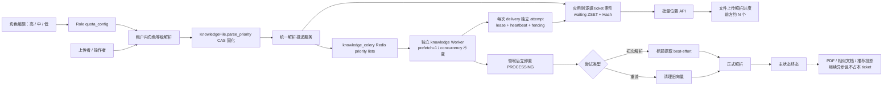

# 设计说明 Design: 知识文件解析三级优先级与排队位置可视化

## 阅读摘要
- 本文档说明：在不拆分 `knowledge_celery`、不增加 Worker 总并发的前提下，把角色配置解析为文件级不可变快照，通过 Redis transport 完成三级调度；调度单位由标题/解析阶段消息调整为一次文件完整解析尝试，并以应用侧 Redis 索引向用户提供当前排队位置的近似快照。
- 设计重点：角色等级解析、文件首次入队原子固化、文件级生命周期投递、初次解析单 delivery 内标题→正式解析、重试单 delivery 内清理→正式解析、专用 knowledge Worker 的 Redis priority 与预取配置、每次尝试单逻辑 ticket、每次 Worker delivery 独立 processing attempt、attempt 租约收敛和文件级安全批量查询。
- 不在本设计中处理：加权公平、防饥饿、任务抢占、精确名次/ETA、队列容量上限、OCR 分队列、其他 Celery 队列的路由或并发调整。
- 阅读摘要用于快速理解；需求追踪、文件计划、边界承诺和测试策略以结构化表格为准。

## 元信息 Metadata
- Feature ID: `052-knowledge-file-parse-priority`
- Status: `confirmed`
- Related requirements: `specs/052-knowledge-file-parse-priority/requirements.md`
- Created: `2026-08-06`
- Updated: `2026-08-09`

## 上下文 Context
- 现有架构 Existing architecture:
  - Redis 是 Celery broker；项目当前锁定 Celery 5.5.3、Kombu 5.5.4。
  - `knowledge_celery` 当前通过任务白名单承载标题提取、首次解析和解析重试三个任务；标题提取完成后再次发布正式解析任务。批量上传会先发布所有标题消息，导致同优先级、单并发下按任务 FIFO 形成跨文件阶段穿插。
  - 生命周期合并后的初次解析和重试任务继续使用 `acks_late=True` 且没有任务级硬时限；当前 Redis broker 配置未覆盖 `visibility_timeout`，Kombu 5.5.4 默认值为 3600 秒，因此大文件解析仍可能在原 delivery 尚未结束时被恢复并由另一 Worker 再次领取。
  - 角色扩展配置保存在 `Role.quota_config` JSON 中，`QuotaService` 负责允许键和值校验；同一个通用校验方法也被租户配额调用，因此新键必须通过角色专用校验入口隔离；Platform 角色编辑页统一组装该配置。
  - `KnowledgeFile` 已记录 `user_id` 与 `tenant_id`，但没有能区分“历史文件尚未定级”和“已固化中优”的解析等级字段。
  - `KnowledgeFile.status` 只有 WAITING/PROCESSING 等粗粒度状态，当前没有 queue ticket、阶段或排队序号；文件上传完成页每 5 秒轮询文件状态，但不显示排队数量。
  - 项目 Redis client 支持单机、Sentinel、Cluster 以及 pipeline/ZSET 原生命令，可在不增加依赖的情况下实现应用侧排队索引。
  - 生产部署存在独立 knowledge Worker；`run_celery.py` 还提供同时消费多个队列的兼容/开发入口。
- 已检查文件 Relevant files inspected:
  - `src/backend/bisheng/core/config/celery_queues.py`
  - `src/backend/bisheng/core/config/celery_redis.py`
  - `src/backend/bisheng/worker/config.py`
  - `src/backend/bisheng/worker/knowledge/file_title_worker.py`
  - `src/backend/bisheng/worker/knowledge/file_worker.py`
  - `src/backend/bisheng/knowledge/domain/models/knowledge_file.py`
  - `src/backend/bisheng/knowledge/domain/repositories/`
  - `src/backend/bisheng/knowledge/domain/services/knowledge_service.py`
  - `src/backend/bisheng/knowledge/domain/services/knowledge_space_service.py`
  - `src/backend/bisheng/knowledge/domain/services/department_file_view_access_service.py`
  - `src/backend/bisheng/permission/domain/services/permission_service.py`
  - `src/backend/bisheng/knowledge/domain/services/knowledge_utils.py`
  - `src/backend/bisheng/knowledge/api/endpoints/knowledge.py`
  - `src/backend/bisheng/core/cache/redis_conn.py`
  - `src/backend/bisheng/role/domain/services/role_service.py`
  - `src/backend/bisheng/role/domain/services/quota_service.py`
  - `src/backend/bisheng/database/models/role.py`
  - `src/backend/bisheng/database/models/user_role.py`
  - `src/backend/entrypoint.sh`
  - `docker/bisheng/entrypoint.sh`
  - `src/frontend/platform/src/pages/SystemPage/components/Roles.tsx`
  - `src/frontend/platform/src/pages/KnowledgePage/components/FileUploadStep4.tsx`
  - `src/frontend/platform/src/components/bs-comp/knowledgeUploadComponent/ProgressItem.tsx`
  - `docs/superpowers/specs/2026-05-20-file-parse-scheduler-design.md`
- 现有测试或验证命令 Existing tests or validation commands:
  - Backend 定向测试：`uv run pytest test/role test/knowledge test/celery`
  - Backend 静态检查：`uv run ruff check <changed-python-files>`、`uv run ruff format --check <changed-python-files>`
  - Frontend 定向测试：在 `src/frontend/platform` 执行对应 Vitest 文件。
  - 架构约束：`bash scripts/arch-guard.sh`
  - Redis 行为验证：非生产 Redis + `knowledge_celery` Worker `-c 1` 冒烟，记录实际消费顺序。
- 项目约束 Constraints from project guidance:
  - 后端必须遵守 Router → Endpoint → Service → Repository → DB 分层；新能力不新增 DAO 入口。
  - 数据库变更必须使用 Alembic，并同时兼容 MySQL 与 DM8。
  - 不手写多租户过滤；角色解析必须显式限定业务上的目标租户关系，且不能绕过现有权限入口。
  - Platform 使用 TypeScript、Zustand、react-query v3 与现有 `bs-ui`，不得引入新 UI 或状态库。
  - 本轮为 `spec-only`，只产出到 `tasks.md`。

## 目标 / 非目标 Goals / Non-Goals

### 目标 Goals
- 在现有角色编辑链路中增加高、中、低文件解析优先等级，并保证旧角色默认中优。
- 为每个知识文件在首次入队前原子固化唯一业务等级，后续解析链路只读取该快照。
- 统一初次解析和重试两类文件生命周期消息的投递入口，显式设置队列、Celery priority 与可观测 header；新生产入口不再发布标题子任务。
- 让独立 knowledge Worker 按 Redis priority steps 消费并使用预取 1，同时保持原并发及其他队列不变。
- 为每次正常文件尝试建立一个独立、可过期 queue ticket；同一文件的并发重复或 broker 重投递仍可被独立观测，按优先级和同级序号计算当前 `ahead_waiting_count`，索引故障时不影响解析主链路。
- 为每次 Worker delivery 建立独立 processing attempt 和短周期可续期租约，使 Worker 强制退出后的幽灵活动记录在有界时间内退出 `active_count`，并隔离同一 task ID 的重叠执行。
- 通过同时校验知识库与现有文件级有效可见性的批量接口和现有 5 秒轮询，在 Platform 文件上传解析进度区和首钢门户上传记录展示不含内部子阶段的近似排队数量；Platform 可保留独立运行尝试数，门户不展示运行数，并在已有数据刷新时原位合并字段。
- 初次解析消息被领取后立即把文件置为 PROCESSING，并在同一并发槽串行完成 best-effort 标题提取和正式解析；重试消息被领取后立即置 PROCESSING，并在同一并发槽串行完成旧向量清理和正式解析。
- 提供滚动升级、历史数据、存量 broker 消息和应用回滚的兼容路径。

### 非目标 Non-Goals
- 不设计公平调度、租户配额、等待老化或中低优保障时间。
- 不修改文件解析算法或结果存储；只调整 Celery 生命周期边界、任务领取时的 PROCESSING 切换时点及为滚动发布所需的最小任务兼容契约。
- 不把三级业务等级实现为三个 Celery 队列或三个 Worker 池。
- 不重排已执行、已预取或升级前已存在的 broker 消息。
- 不实现既有 OCR/按用户公平调度设计文档中的能力。
- 不通过扫描/反序列化 Celery Redis List 计算位置，不向用户暴露其他任务身份。
- 不承诺位置稳定递减、绝对精确、固定名次或 ETA，不引入队列容量阈值与背压机制。

## 边界承诺 Boundary Commitments
| Boundary | Allowed Change | Disallowed Change | Revalidation Trigger |
|---|---|---|---|
| 角色配置 | 在现有 `quota_config` 增加枚举键、校验、默认值和角色弹窗控件 | 改变角色权限模型、作用域、其他配额含义或新增角色表字段 | 等级来源不再是角色，或需要独立授权能力 |
| 文件数据 | 为 `KnowledgeFile` 增加可空快照列和原子首次写 Repository 方法 | 回填全部历史文件、覆盖已固化值、把快照放入不可查询的 metadata | 角色变化需要反向影响已入队文件 |
| 解析投递 | 统一初次解析/重试生命周期消息；旧标题消息仅保留滚动升级兼容消费；Worker 领取后立即切换 PROCESSING | 新生产入口继续发布标题子任务、把后置任务并入主生命周期、改变 callback/preview key/`acks_late` 语义 | 新增生命周期类型、任务参数或消息 schema 再次变化 |
| Redis/Celery | 复用单队列、兼容 priority steps 与 prefetch 1 | 拆队列、增加并发、修改 `queue_order_strategy` 或全局 `visibility_timeout`、改变其他队列路由/确认/重投递策略、清空 Redis | broker 改为非 Redis，或 Celery/Kombu 大版本升级 |
| 排队可观测 | 增加应用侧 Redis ZSET/Hash 逐 ticket 索引、逐 delivery attempt 租约、只读批量位置 API 和 UI 近似文案 | 扫描 Celery 私有 key、把索引或去重锁变成解析前置依赖、暴露其他任务身份、承诺 ETA、阻止业务重复执行 | 需要绝对精确名次、稳定倒计时、强制消息去重或队列容量控制 |
| 文件可见性 | 复用或抽取现有文件级批量有效可见性，组合知识库权限、`view_file`、所有者/管理员、部门审批授权和隐藏状态 | 仅凭知识库可读或数据库归属回显文件、在 Repository 内重写权限规则、串行执行 100 次权限网络请求 | 文件权限模型或部门审批语义变化 |
| 部署 | 修改两个独立 knowledge Worker 启动入口并补充组合入口使用约束 | 改写生产并发值、为组合 Worker 承诺同等等待时延隔离 | 组合 Worker 成为生产唯一受支持入口 |
| 前端 | 在角色弹窗增加配置，并在 Platform 文件上传解析进度区及首钢门户上传记录展示近似位置 | 角色列表新增列、在其他文件列表默认查询位置、引入新状态/UI 库、展示固定名次或 ETA | 产品要求扩展到其他文件页面或实时推送 |
- Allowed dependencies: `none`；只使用项目已有 Celery/Kombu、SQLModel/SQLAlchemy、React 与 `bs-ui`。

## 需求追踪 Requirements Traceability
| Requirement | Acceptance Criteria | Design Element | Verification Strategy |
|---|---|---|---|
| REQ-001 | AC-REQ-001-01～06 | `quota_config.knowledge_file_parse_priority`、角色专用枚举校验、角色弹窗与默认回显 | 前端组件测试 + Role/Tenant API/Service 定向测试 + 权限回归 |
| REQ-002 | AC-REQ-002-01～06 | 租户范围角色 Repository + 有效等级解析服务 + 超管/缺失/异常降级规则 | 参数化单元测试，覆盖多角色、跨租户、超管和依赖失败 |
| REQ-003 | AC-REQ-003-01～05 | `KnowledgeFile.parse_priority` 可空列 + Repository 条件更新/CAS + 快照服务 | Repository/Service 集成测试；MySQL 本地、DM8 CI 验证并发首次写 |
| REQ-004 | AC-REQ-004-01～05 | 统一文件生命周期投递服务、所有生产入口替换、初次/重试任务级中优默认值、旧标题消息兼容消费 | 发布参数 contract test + AST/source guard + 受影响回归 |
| REQ-005 | AC-REQ-005-01～06 | 默认兼容 priority steps、prefetch 1、独立 knowledge Worker、并发/白名单保持 | 配置/启动脚本 contract test + 非生产 Redis 单并发冒烟 |
| REQ-006 | AC-REQ-006-01～05 | 可空迁移、不回填、兼容默认、自然消费存量消息、非破坏性回滚 | migration upgrade/downgrade、兼容/失败路径测试、发布清单审查 |
| REQ-007 | AC-REQ-007-01～13 | 应用侧 Redis 文件尝试 ticket 索引、逐 delivery processing attempt/租约、多 ticket 归并、文件级有效权限、无阶段批量位置 API、Platform 上传进度和首钢门户上传记录展示及安全降级 | Redis/worker lifecycle 集成测试 + 同 task ID 重叠 delivery/并发多 ticket 测试 + API 权限测试 + Platform/Client 前端组件测试 |
| REQ-008 | AC-REQ-008-01～06 | 初次解析单 delivery 的 PROCESSING→标题→正式解析；重试单 delivery 的 PROCESSING→清理→正式解析；终态和后置任务边界 | lifecycle worker 自动化测试 + 终态回归 + 真实 Redis/Celery 单并发顺序冒烟 + 路由 contract test |

## 架构设计 Architecture
- Pattern: `角色配置 → 有效等级解析 → 文件级不可变快照 → 文件生命周期投递 + 单逻辑 ticket → Redis 单队列优先消费 → 每次 Worker delivery 建立 attempt → 同 delivery 串行完成文件主生命周期 → 安全位置查询`。
- Rationale: 文件快照解决角色变更、重试和多入口一致性；文件级单 delivery 消除标题与正式解析之间的重新排队和跨文件阶段穿插；集中投递避免任一 `.delay()` 绕过 priority；旁路 ticket 索引提供可查询位置且不把 UI 可观测性变成解析依赖；单队列保持现有容量模型。
- Preserved existing patterns: 继续使用角色 `quota_config`、knowledge Repository、tenant header 注入、独立 Worker 进程、现有正式解析/终态逻辑和后置异步任务；旧标题任务名称仅作为滚动升级兼容入口保留。
- Architecture change justification, if any: 新增文件列是区分“未定级历史文件”和“已固化中优”并保证跨进程/重试不可变的最小持久化变化；应用侧 Redis ticket 索引是避免扫描 Celery 私有 List、同时支持 `O(log N)` 排名查询的最小可观测扩展。两者均不替代 broker。

### 业务等级与 transport 映射
| Business value | Rank for multi-role merge | Celery priority | Redis/Kombu meaning |
|---|---:|---:|---|
| `high` | 3 | `0` | 最先消费 |
| `medium` | 2 | `3` | 默认等级 |
| `low` | 1 | `9` | 最后消费 |

- Redis transport 中数值越小优先级越高；业务层不得直接散落使用数字。
- 保持 Kombu 兼容默认 `priority_steps=[0, 3, 6, 9]`，业务只映射 `0/3/9`；兼容档位 `6` 不暴露为第四个业务等级。
- 不改为 `[0, 5, 9]` 等自定义 steps，避免滚动发布时旧 Worker 不监听新 Redis List key 而遗留消息。
- 初次解析和重试生命周期任务的任务级默认 priority 设为中优 `3`，作为遗漏显式等级时的安全默认；统一投递仍必须显式传值。旧标题兼容任务在过渡期也使用中优默认。

### 等级解析与快照算法
1. 读取文件；若 `parse_priority` 已存在，直接返回，不再查询角色。
2. 确定解析身份：新文件使用当前已认证操作者；历史文件重试/重解析使用文件 `user_id`；无可识别身份使用低优。
3. 可确认身份为全局超级管理员时返回高优。
4. 确认当前租户上下文与文件 `tenant_id` 一致，并依赖现有多租户自动注入只查询该上下文内的有效角色；不得在 Repository 手写 `tenant_id` SQL 条件。读取 `quota_config.knowledge_file_parse_priority`，缺键按中优处理，多角色按 rank 取最高。
5. 身份存在且没有角色时按中优处理；`user_id` 为空或用户记录已不存在时按低优处理。
6. Repository 以 `WHERE id=:id AND parse_priority IS NULL` 条件更新首次值；无论本次是否更新成功，都重新读取并返回数据库最终值。
7. 角色/FGA/Repository 查询出现非预期解析异常时记录上下文并尝试以低优固化；快照写入本身失败时不得发布消息，异常交由现有业务边界处理。
8. 同一请求批量处理多个文件时，以 `(user_id, tenant_id)` 缓存一次有效角色解析结果，但每个文件仍独立完成快照 CAS。

### 排队索引数据结构
- 排队索引使用应用 Redis `RedisManager` 管理，是可观测旁路，不替代 Celery broker；即使 `redis_url` 与 `celery_redis_url` 指向同一实例，也不得读取或写入 Kombu 私有 key。所有应用索引 key 使用共同 Redis Cluster hash tag `{knowledge_parse_queue}`，确保需要原子执行的多 key Lua 操作位于同一 slot。
- `...:{knowledge_parse_queue}:sequence`：全局单调 `INCR`，作为同等级近似入队序号。
- `...:{knowledge_parse_queue}:waiting:{high|medium|low}`：三个 ZSET，member 为不可预测 `queue_ticket_id`，score 为 sequence。
- `...:{knowledge_parse_queue}:processing`：ZSET，member 为不可预测的 `processing_attempt_id`，score 为该次 Worker delivery 的实际开始时间；一个逻辑 ticket 可同时关联多个 attempt。
- `...:{knowledge_parse_queue}:processing_leases`：ZSET，member 为 `processing_attempt_id`，score 为该 attempt 当前租约截止时间；Worker 只续期自身 attempt，`ZCOUNT(now, +inf)` 直接提供不包含过期租约的全局 delivery-level `active_count`，写入和查询再按固定批次物理清理过期 member。
- `...:{knowledge_parse_queue}:expires`：ZSET，member 为 ticket，score 为清理截止时间；写入和查询时按固定批量惰性清理过期 member，不新增 Celery Beat。
- `...:{knowledge_parse_queue}:ticket:{ticket_id}`：逻辑消息 Hash，保存 `tenant_id`、`knowledge_id`、`file_id`、`attempt_kind=initial|retry`、内部 priority、sequence、逻辑 state 和时间；`queue_ticket_id` 继续复用 Celery `task_id`，但不作为单次执行身份。
- `...:{knowledge_parse_queue}:ticket:{ticket_id}:attempts`：该逻辑 ticket 当前 processing attempt 的 ZSET，member 为 `processing_attempt_id`、score 为实际开始时间；attempt 结束或租约过期时只移除自身。
- `...:{knowledge_parse_queue}:attempt:{attempt_id}`：单次 delivery Hash，保存所关联的 `queue_ticket_id`、`tenant_id`、`knowledge_id`、`file_id`、`attempt_kind`、开始时间、最近心跳和租约截止时间。
- `...:{knowledge_parse_queue}:file:{tenant_id}:{knowledge_id}:{file_id}:tickets`：该文件所有活动 ticket 的 ZSET，member 为 ticket、score 为 sequence；不得使用会被后写覆盖的单值 current pointer。单个 ticket 清理只 `ZREM` 自身，集合为空时才删除 key。
- ticket/attempt Hash、ticket attempts 和 file tickets key 设置硬 TTL；逻辑 ticket member 通过 expires ZSET 清理，attempt member 通过 attempt 租约和生命周期操作清理。硬清理截止时间不得短于现有解析超时加安全余量，但 processing 活跃性只由短周期 attempt 租约决定，不能等待硬 TTL 才从 `active_count` 中剔除。Redis 中不保存文件名、用户名、正文或角色信息。

### Ticket 发布与 Worker 生命周期
1. 投递服务本地生成 `queue_ticket_id`，同时将其用作显式 Celery `task_id`，并确定 `attempt_kind=initial|retry`；一次正常文件尝试只执行一次本步骤。
2. 索引 Repository 以 Lua/pipeline 最佳努力创建 `state=publishing` metadata、全局 sequence，并把 ticket 加入文件活动 ticket ZSET；索引失败只记录日志，任务继续发布。
3. `apply_async` 除现有参数外显式携带 `knowledge_parse_ticket_id`、`knowledge_parse_attempt_kind` 和内部 priority header。
4. broker 发布成功后，仅当 ticket 仍为 publishing 时原子转为 queued 并加入对应 waiting ZSET；发布失败时最佳努力清理 publishing ticket，然后按现有投递错误边界抛出。
5. 每次 Worker delivery 进入共享 processing lease guard 时，本地生成全新、不可预测的 `processing_attempt_id`；`begin_processing` 原子地从 waiting 移除逻辑 ticket（若仍存在），保留或按消息 header 与数据库文件归属最佳努力重建逻辑 metadata，并把本 attempt 加入 processing、processing lease、ticket attempts 和 attempt metadata。同一 Celery `task_id` 重投递不得复用已有 attempt identity；旧版本无 ticket 消息不创建伪 ticket。
6. processing lease guard 使用项目现有同步 Redis connection 启动轻量任务内心跳，按固定间隔且携带 `processing_attempt_id` 续期自身 lease、attempt metadata 和相关硬 TTL；租约期限必须覆盖至少两个心跳间隔。心跳初始化或续期失败只记录日志并停止本 attempt 的可靠观测，不中断、撤销或重试业务任务，也不得续期同一 ticket 的其他 attempt。
7. Worker 成功、失败、撤销或正常结束时停止自身心跳，并以 attempt identity/fencing token 从 processing、processing lease、attempt metadata 和 ticket attempts 中幂等清理自身。仅当该 ticket 不再存在有效 attempt 时，才能结束其 processing 关联并清理逻辑 ticket/file member；不得删除、覆盖或续期同 ticket 的其他 attempt，也不得影响同文件的其他 ticket。
8. 写入和查询先固定批量清理已过期 processing lease：Lua 仅在目标 attempt 存储的 lease deadline 仍不晚于当前时间且 fencing identity 匹配时，从 processing/lease ZSET、attempt metadata 和 ticket attempts 移除该 attempt；并发续期已推进 deadline 时清理必须失败。清理后仅在对应 ticket 不再有有效 attempt 时条件清理逻辑 ticket/file member。数据库仍为 WAITING/PROCESSING 且没有可靠活动 ticket/attempt 时 API 返回 unavailable；因此 `active_count` 最迟在 attempt 租约期限加一次查询清理周期内收敛，而不是等待 24 小时硬 TTL。
9. Redis visibility timeout 可能在原 delivery 仍运行时把同一 task ID 重投递；两个 delivery 的 attempt 必须同时存在、分别计入 `active_count`，任一结束顺序都只能移除结束方。若原 attempt 已结束且逻辑 ticket 已清理，而恢复消息尚未被再次消费，API 在该不可观测 broker 窗口返回 unavailable；新 delivery 取得任务后可依据 header 最佳努力重建逻辑 ticket 和新 attempt，本功能不扫描 broker 弥合该窗口。
10. 初次解析的标题提取和正式解析共用当前 delivery/ticket，不在内部步骤之间新建 ticket 或发布后继消息；显式重试、重新解析、并发重复请求或 broker 重投递仍按真实 broker 消息/实际 delivery 独立表达，Redis 旁路不承担消息去重或发布锁职责。
11. publishing 崩溃窗口、旧版本消息或索引故障统一返回 unavailable；本功能不引入 outbox，不修改全局 `visibility_timeout`、确认或重投递策略，不允许排队索引故障阻断 Celery 主链路。

并发生产者获得 sequence 与 Celery `LPUSH` 不能组成单一事务，因此同级序号是近似顺序。该误差、Worker 预取和后到高优插队共同决定 API 必须返回 `approximate=true`。

### 排队位置计算
- high：`同一 high ZSET 中 rank 更早的 ticket 数`。
- medium：`ZCARD(high) + medium 中 rank 更早的 ticket 数`。
- low：`ZCARD(high) + ZCARD(medium) + low 中 rank 更早的 ticket 数`。
- `processing` 不计入 `ahead_waiting_count`；全局 `active_count` 使用 processing lease ZSET 的 `ZCOUNT(now, +inf)` 按有效 attempt 单独返回，不能按唯一 ticket/file 去重，也不能对包含过期 member 的 processing ZSET 直接 `ZCARD`。
- 全局 `waiting_count` 等于 high/medium/low 三个 waiting ZSET 的 `ZCARD` 之和，只统计已进入 queued 的真实 ticket，不包含 publishing 或 processing。该值与名次一样是查询时刻近似快照；若并发消费导致 `waiting_count < ahead_waiting_count + 1`，Client 必须视为不可靠并降级为普通上传成功提示。
- 使用 pipeline 批量读取 higher-level cardinality、ticket metadata 与 rank；禁止 `LRANGE` Celery broker、禁止枚举或反序列化其他任务。
- 查询前先清理过期 attempt 租约，再用数据库文件状态和文件活动 ticket ZSET 做一致性检查。每个文件先过滤已过期、归属不匹配或 metadata 缺失的 ticket/attempt：若存在有效 processing attempt，返回 processing；否则从 queued ticket 中按业务优先级、再按 sequence 选择实际调度最靠前者并计算位置。publishing-only、无可靠 ticket/attempt 或状态冲突时返回 unavailable，而不是返回 0。内部 `attempt_kind` 不作为面向用户的解析阶段返回。
- 同一文件的多个 ticket 都独立参与全局 waiting 聚合；所有有效 attempt 独立参与全局 processing/`active_count` 聚合。API 只选择其中一个用于该文件的展示，不把文件级归并误当成 broker 消息或执行尝试去重。

### 排队位置 API
- Route: `GET /api/v1/knowledge/{knowledge_id}/parse-queue-positions?file_ids=1&file_ids=2`。
- Validation: `knowledge_id` 为正整数；`file_ids` 去重后必须为 1～100 个正整数，超过范围沿用 FastAPI 422 校验响应。
- Authorization: 使用登录依赖和现有 Knowledge Permission Service（内部统一调用 `PermissionService.check(...)`）验证目标知识库读取权限；Knowledge File Repository 只按当前租户和目标知识库批量加载候选文件，不在 Repository 内判断权限。Service 再调用从知识空间文件列表抽取/复用的公共批量有效可见性能力，保持 `knowledge_file:view_file`、资源所有者/管理员、适用的部门审批授权和隐藏状态语义一致。不存在、不属于或不可见文件均直接省略且不可区分。
- Response: 使用 `resp_200` 返回 `{items, active_count, waiting_count, approximate: true, as_of}`；`waiting_count` 为 nullable 全局 queued ticket 总数，Redis 不可用时为 `null`。item 的稳定字段为 `{file_id, state, ahead_waiting_count}`，其中 state 为 `queued|processing|not_queued|unavailable`，只有 queued 可返回非空数量。滚动升级期间 MAY 暂时保留 nullable/deprecated `stage` 字段以兼容旧前端，但新前端不得读取或展示，后续版本可按 API 兼容流程删除。
- Failure: Redis 排队索引读取失败、attempt lease 过期或活动 ticket/attempt 无法可靠归并时记录内部上下文并为已授权的 WAITING/PROCESSING 文件返回 unavailable；不暴露 key、ticket、attempt、priority、堆栈或其他租户信息。
- Platform: `FileUploadStep4` 在现有状态轮询周期内批量请求尚未结束文件的位置，默认每 5 秒且禁止同轮并发；`ProgressItem` 只显示“排队中，前方约 N 个等待任务”的通用排队文案，可独立显示 active count，全部文件终态后停止。
- Client: `PortalUploadedFilesDrawer` 对 queued 文件只显示“排队中，前方约 N 个等待任务”；processing/unavailable 保留原状态。首次打开和切换分页使用整表加载态；已有当前页数据时，自动轮询、上传触发刷新和手动刷新保持 keyed rows 挂载，并按文件 ID 合并服务端最新字段。
- Client upload Toast: `usePortalUploadDialog.finishUploadedFiles` 使用非重复、成功注册文件 ID 批量查询位置；超过单次 API 上限时按最多 100 个 ID 分批。选择可靠 queued 响应中最小 `ahead_waiting_count`，仅当其大于 0 且同批响应 `waiting_count >= ahead_waiting_count + 1` 时，用一条 success Toast 输出“上传成功，M 个文件已进入队列，最前第 X/Y 名”。无可靠快照或请求失败时吞掉位置错误并沿用“上传成功”。

## 文件结构计划 File Structure Plan
| Path | Action | Responsibility | Linked Requirement |
|---|---|---|---|
| `src/backend/bisheng/common/constants/enums/knowledge_parse_priority.py` | create | 定义业务枚举、rank 与唯一 transport 映射 | REQ-001, REQ-002, REQ-005 |
| `src/backend/bisheng/role/domain/services/quota_service.py` | modify | 通过角色专用入口校验等级键，且不扩大全局/租户键白名单 | REQ-001 |
| `src/backend/bisheng/role/domain/services/role_service.py` | modify | 角色创建/更新调用角色专用 quota 校验入口 | REQ-001 |
| `src/backend/bisheng/role/domain/repositories/interfaces/role_priority_repository.py` | create | 声明租户范围的用户角色等级读取接口 | REQ-002 |
| `src/backend/bisheng/role/domain/repositories/implementations/role_priority_repository_impl.py` | create | 通过 ORM 实现角色等级读取，不新增 DAO | REQ-002 |
| `src/backend/bisheng/role/domain/services/knowledge_parse_priority_service.py` | create | 解析超管、租户多角色、默认和降级等级 | REQ-002, REQ-003 |
| `src/frontend/platform/src/pages/SystemPage/components/Roles.tsx` | modify | 角色弹窗编辑、提交和回显等级 | REQ-001 |
| `src/frontend/platform/src/pages/SystemPage/components/RoleParsePriorityField.tsx` | create | 独立承载等级选择控件，避免继续扩大既有超长角色页面 | REQ-001 |
| `src/frontend/platform/public/locales/{zh-Hans,en-US}/{bs,knowledge}.json` | modify | 增加角色等级和排队位置文案 | REQ-001, REQ-007 |
| `src/backend/bisheng/knowledge/domain/models/knowledge_file.py` | modify | 增加可空文件快照属性 | REQ-003, REQ-006 |
| `src/backend/bisheng/knowledge/domain/repositories/interfaces/knowledge_file_repository.py` | modify | 声明只在空值时固化等级的接口 | REQ-003 |
| `src/backend/bisheng/knowledge/domain/repositories/implementations/knowledge_file_repository_impl.py` | modify | 实现 ORM 条件更新与最终值读取 | REQ-003, REQ-006 |
| `src/backend/bisheng/core/database/alembic/versions/<next>_knowledge_parse_priority.py` | create | MySQL/DM8 兼容地增删可空快照列，不回填 | REQ-003, REQ-006 |
| `src/backend/bisheng/knowledge/domain/services/knowledge_parse_dispatch_service.py` | create/modify | 固化/读取快照、生成单 ticket，并统一发布初次解析或重试生命周期消息 | REQ-003, REQ-004, REQ-007, REQ-008 |
| `src/backend/bisheng/knowledge/domain/repositories/interfaces/knowledge_parse_queue_repository.py` | create/modify | 声明逻辑 ticket 创建/状态 CAS、attempt lease/fenced 清理、多 ticket/attempt 查询、批量排名与全局 waiting 总数接口 | REQ-007 |
| `src/backend/bisheng/knowledge/domain/repositories/implementations/knowledge_parse_queue_redis_repository.py` | create | 用 Cluster-safe Redis ZSET/Hash/Lua 实现逻辑 ticket 索引和逐 delivery attempt 租约 | REQ-007 |
| `src/backend/bisheng/knowledge/domain/services/knowledge_parse_processing_lease.py` | create | 为同步 knowledge task 的每次 delivery 提供独立 attempt lease guard、心跳和 fenced 正常结束清理 | REQ-007 |
| `src/backend/bisheng/knowledge/domain/services/knowledge_file_visibility_service.py` | create | 抽取并批量复用现有知识空间文件有效可见性，组合文件权限与部门审批语义 | REQ-007 |
| `src/backend/bisheng/knowledge/domain/services/knowledge_parse_queue_service.py` | create/modify | 组合文件状态、有效可见文件集合与多个 Redis ticket/attempt，计算安全位置与 nullable waiting 总数响应 | REQ-007 |
| `src/backend/bisheng/knowledge/domain/schemas/knowledge_parse_queue_schema.py` | create/modify | 定义逻辑 ticket、attempt、尝试类型/状态和无阶段批量位置响应 schema；兼容字段显式标记 deprecated | REQ-007, REQ-008 |
| `src/backend/bisheng/knowledge/api/dependencies.py` | modify | 注入排队 Repository/Service 依赖 | REQ-007 |
| `src/backend/bisheng/knowledge/api/endpoints/knowledge.py` | modify | 增加有界、只读、鉴权的批量排队位置端点 | REQ-007 |
| `src/backend/bisheng/knowledge/domain/services/{knowledge_service.py,knowledge_space_service.py,knowledge_utils.py}` | modify | 将现有生产入口接入统一投递服务；知识空间文件列表复用抽取后的公共可见性能力并保持既有行为 | REQ-004, REQ-007 |
| `src/backend/bisheng/worker/knowledge/{file_title_worker.py,file_worker.py}` | modify | 抽取可复用标题 helper；初次任务在同一 guard/delivery 内完成 PROCESSING→标题→正式解析，重试完成 PROCESSING→清理→正式解析；旧标题消息兼容消费但不再产生后继消息 | REQ-004, REQ-007, REQ-008 |
| `src/backend/scripts/enqueue_reparse_knowledge_space_files.py` | modify | 运维重解析脚本接入统一投递 | REQ-004 |
| `src/backend/bisheng/core/config/{celery_redis.py,celery_queues.py}` | modify | 声明兼容映射、初次/重试生命周期任务中优默认和旧标题任务滚动兼容路由 | REQ-004, REQ-005, REQ-006, REQ-008 |
| `src/backend/entrypoint.sh` | modify | 新 knowledge Worker 入口显式 prefetch 1，保留 concurrency | REQ-005 |
| `docker/bisheng/entrypoint.sh` | modify | 旧 Docker knowledge Worker 入口显式 prefetch 1，保留 concurrency | REQ-005 |
| `src/backend/test/role/` | create/modify | 覆盖角色配置和等级解析独立结果 | REQ-001, REQ-002 |
| `src/backend/test/knowledge/` | create/modify | 覆盖快照、生命周期单投递、标题失败继续、重试清理、排队排名/租约、权限与失败路径 | REQ-003, REQ-004, REQ-006, REQ-007, REQ-008 |
| `src/backend/test/celery/` | modify | 覆盖映射、路由、启动入口和遗漏直投 guard | REQ-004, REQ-005 |
| `src/frontend/platform/src/test/roleParsePriority.test.tsx` | create | 覆盖角色弹窗选项、默认和回显 | REQ-001 |
| `src/frontend/platform/src/controllers/API/index.ts` | modify | 增加有类型的批量排队位置查询函数 | REQ-007 |
| `src/frontend/platform/src/pages/KnowledgePage/components/FileUploadStep4.tsx` | modify | 在现有状态轮询中合并位置快照并控制停止条件 | REQ-007 |
| `src/frontend/platform/src/components/bs-comp/knowledgeUploadComponent/{index.tsx,ProgressItem.tsx}` | modify | 扩展可选排队字段并展示无内部阶段的近似等待数；运行数量保持独立可选 | REQ-007, REQ-008 |
| `src/frontend/platform/src/test/parseQueuePosition.test.tsx` | create | 覆盖 queued/processing/unavailable/终态和动态约数文案 | REQ-007 |
| `src/frontend/client/src/api/knowledge.ts` | modify | 增加 Client 有类型的批量排队位置查询函数并映射 `waiting_count` | REQ-007 |
| `src/frontend/client/src/pages/knowledge/portal/hooks/usePortalUploadDialog.ts` | modify | 上传成功后对非重复注册文件查询可靠位置，以一条 success Toast 展示最前 `X/Y` 名并安全降级 | REQ-007 |
| `src/frontend/client/src/pages/knowledge/portal/components/{PortalUploadedFilesDrawer.tsx,PortalUploadQueueStatus.tsx,PortalUploadFolderTree.tsx}` | create/modify | 对当前页待处理文件按知识库分组查询并展示简化近似位置；已有数据刷新时保持表格并按文件 ID 合并字段，同时保持抽屉单文件规模门禁 | REQ-007 |
| `src/frontend/client/src/{api/knowledge.test.ts,pages/knowledge/portal/PortalKnowledgeWorkbench.test.tsx}` | modify | 覆盖 Client API 契约、门户排队展示和失败降级 | REQ-007 |
| `docs/architecture/{04-knowledge-rag.md,08-deployment.md}` | modify | 记录等级、文件级单 delivery 生命周期、排队索引语义、Worker 启动和发布/回滚约束 | REQ-005, REQ-006, REQ-007, REQ-008 |

## 组件与接口 Components and Interfaces

### 角色配置契约
- Responsibility: 在现有 `quota_config` 中读写 `knowledge_file_parse_priority`。
- Inputs: 字符串 `high | medium | low`；缺失值。
- Outputs: 合法原值；缺失时业务默认 `medium`。
- Dependencies: 现有 Role API、`QuotaService`、角色权限检查、Platform 角色表单。
- Error behavior: 新增角色专用 validator 先验证/剥离该键，再复用现有 quota validator 处理其余配置；非字符串或枚举外值沿用现有角色配置校验错误；租户配额继续使用原 validator 并把该键视为未知键。
- Requirements: `REQ-001`

### 角色等级解析服务
- Responsibility: 对指定 `user_id + tenant_id` 返回唯一业务等级。
- Inputs: 用户标识、文件租户标识、可选的已知全局超管上下文。
- Outputs: `KnowledgeParsePriority` 枚举。
- Dependencies: 新 Role Priority Repository、现有租户上下文/自动注入机制、现有全局超管判断能力。
- Error behavior: 租户上下文不匹配不得跨租户查询；可识别用户无角色/缺配置返回中优；无用户或用户不存在返回低优；依赖异常记录后降级低优。
- Requirements: `REQ-002`

### 文件快照 Repository
- Responsibility: 原子实现“仅在空值时设置”，并返回数据库最终等级。
- Inputs: `file_id`、候选业务等级。
- Outputs: 已固化的最终业务等级。
- Dependencies: 现有 `KnowledgeFileRepository` 会话与 ORM 模型。
- Error behavior: 文件不存在沿用现有 not-found 契约；数据库异常回滚并抛出，不得假装固化成功。
- Requirements: `REQ-003`, `REQ-006`

### 统一解析投递服务
- Responsibility: 确保文件快照存在，把业务等级映射为消息 priority，最佳努力创建可观测 ticket，并为一次文件尝试投递一个初次解析或重试生命周期消息。
- Inputs: 文件或 `file_id`、尝试类型（初次/重试）、现有任务参数、可选当前操作者上下文。
- Outputs: Celery async result 或与现有调用方等价的发布结果。
- Dependencies: 文件 Repository、角色等级解析服务、排队索引 Repository、初次解析/重试 Celery task；旧标题 task 只作为消费兼容依赖。
- Error behavior: `apply_async` 显式设置 `queue="knowledge_celery"`、priority、attempt kind 与 ticket header；排队索引失败记录后继续发布；broker 发布失败仍向上传播并最佳努力清理 ticket，不引入 outbox 或静默吞错。
- Requirements: `REQ-003`, `REQ-004`, `REQ-006`, `REQ-007`, `REQ-008`

### 排队索引 Repository
- Responsibility: 封装所有 Redis key、Lua/CAS、硬 TTL、逻辑 ticket、attempt-scoped processing lease、ticket→attempt/file→ticket ZSET、rank/cardinality 与 pipeline，不让 Service/API 依赖 Celery/Kombu 私有结构。
- Inputs: ticket metadata、attempt identity/metadata、期望/目标状态、租约期限、批量文件 ticket/attempt 查询。
- Outputs: ticket 创建/转换、attempt 创建/续期/fenced 清理是否成功，以及有效 ticket/attempt 列表、当前 rank、higher-level count 和 attempt-level processing count。
- Dependencies: 项目 `RedisClient.connection/async_connection`，同步 Worker guard 使用 sync connection，异步 API 使用 async connection；不新增 Redis SDK。
- Error behavior: Redis 错误向上返回可识别的 tracking failure；调用方降级，不影响任务业务结果。processing 续期和删除必须验证 attempt identity/fencing，只能作用于该 attempt；逻辑 ticket 仅在无有效 attempt 时条件清理。
- Requirements: `REQ-007`

### Processing Lease Guard
- Responsibility: 在文件生命周期 Celery task 的每次 delivery 期间生成并维护独立 `processing_attempt_id` 的短周期租约，覆盖该文件尝试的全部内部步骤，并保证正常退出只停止自身心跳和幂等清理自身。
- Inputs: 逻辑 `queue_ticket_id`/ticket header、attempt kind、priority、file ID，以及可配置 heartbeat/lease duration；guard 内部为本 delivery 生成 attempt identity。
- Outputs: 最佳努力的 attempt-level processing 进入、周期续期和 fenced 结束清理；不改变 task 返回值或异常语义。
- Dependencies: 排队索引 Repository 的同步接口、项目现有 Worker 线程模型；每个执行中 delivery 最多一个轻量 daemon heartbeat，结束时必须 join/停止，不能跨 delivery 复用 attempt identity 或可变状态。
- Error behavior: Redis 初始化或续期失败记录结构化日志并停止本 attempt 的可靠观测，业务继续；Worker 被强制终止时心跳自然停止，由查询/写入惰性清理过期租约；相同 task ID 重投递创建新的 attempt，不能复用、续期或清理原 delivery 的 attempt。
- Requirements: `REQ-007`, `REQ-008`

### 文件有效可见性 Service
- Responsibility: 为指定知识库批量判定 1～100 个候选文件是否可见，保持知识空间文件列表已有的 `view_file`、所有者/管理员、部门审批授权和隐藏状态语义。
- Inputs: 登录用户、目标知识库、已完成租户/知识库归属过滤的 Knowledge File records。
- Outputs: 仅包含可见文件的集合；不返回拒绝原因，避免区分不存在与无权限。
- Dependencies: `PermissionService`/现有 Fine-Grained Permission 能力、`DepartmentFileViewAccessService` 及知识空间权限上下文；不得在新服务中直接查询 `RoleAccess`。
- Error behavior: 权限依赖异常 fail closed；批量能力不可用时整个候选批次不回显，不以知识库可读作为文件可见兜底。
- Requirements: `REQ-007`

### 排队位置 Service / API
- Responsibility: 校验知识库权限、文件归属和文件有效可见性，把数据库状态与 Redis 多 ticket 合成为批量、安全、近似的位置快照。
- Inputs: 登录用户、`knowledge_id`、1～100 个 `file_ids`。
- Outputs: `{items, active_count, approximate, as_of}`，不包含其他任务身份和内部 priority。
- Dependencies: Knowledge Permission Service、Knowledge File Repository、文件有效可见性 Service、排队索引 Repository。
- Error behavior: 无权访问目标知识库沿用现有权限拒绝；不可见/不属于的 file ID 不回显；Redis 不可用时对已授权文件返回 unavailable，不暴露内部异常。
- Requirements: `REQ-007`

### 文件上传排队位置 UI
- Responsibility: 在 Platform 上传进度和首钢门户上传记录的现有解析状态轮询中批量获取未结束文件的位置，并以非承诺性文案展示。
- Inputs: 当前知识库 ID、未结束文件 ID 列表、批量位置响应。
- Outputs: Platform 和首钢门户 queued 状态统一输出“排队中，前方约 N 个等待任务”，不展示标题/正式解析/重试等内部阶段；Platform 可另行显示独立运行数，processing/unavailable 保留原文件状态文案。
- Dependencies: Platform wrapped request、现有 `FileUploadStep4` 5 秒 timer 与 `ProgressItem`；Client wrapped request、`PortalUploadedFilesDrawer` 现有 5 秒 timer，以及上传记录中的 `spaceId`/文件 ID。
- Error behavior: 位置请求失败不终止文件状态轮询、不弹高频错误 toast；保留普通“文档数据准备中”展示，下一周期可恢复。首钢门户已有数据的刷新请求失败时保留当前表格，不清空记录。
- Requirements: `REQ-007`, `REQ-008`

### 文件解析生命周期 Worker
- Responsibility: 一个 delivery 独占一个并发槽并完成一次文件主解析尝试。初次解析在领取后立即置 PROCESSING，串行执行标题提取和正式解析；重试在领取后立即置 PROCESSING，串行执行旧向量清理和正式解析。
- Inputs: 初次或重试任务参数、文件快照等级、ticket/attempt headers、tenant context 和既有 callback/preview 参数。
- Outputs: 沿用正式解析的 SUCCESS、FAILED、VIOLATION、remark、callback 与 preview 结果；内部步骤不产生新的 `knowledge_celery` 消息或 ticket。
- Dependencies: 标题提取 helper、旧向量清理逻辑、从现有正式解析任务抽取的可复用 parse core、Processing Lease Guard。生命周期 wrapper 负责唯一的领取状态切换；parse core 必须接受文件已经处于 PROCESSING，不得再次以 WAITING 作为进入条件。PDF Artifact、相似文档、推荐投影只作为终态后的既有异步后置任务。
- Error behavior: 标题提取失败记录日志后继续正式解析；清理或正式解析失败沿用重试任务既有失败终态；旧标题消息由兼容入口执行完整初次生命周期且不得再次发布正式解析消息。
- Requirements: `REQ-004`, `REQ-006`, `REQ-008`

### 滚动消息兼容矩阵
| Broker message | 识别方式 | 新 Worker 行为 | 是否新建后继消息 |
|---|---|---|---|
| 新初次解析 | 复用现有正式解析 task name，携带 `knowledge_parse_attempt_kind=initial` | 置 PROCESSING→标题 best-effort→parse core | 否 |
| 新重试 | 复用现有重试 task name，携带 `knowledge_parse_attempt_kind=retry` | 置 PROCESSING→清理旧向量→parse core | 否 |
| 旧标题消息 | 旧标题 task name，可能携带旧 stage/ticket header | 复用当前 ticket/attempt；若文件仍 WAITING，先置 PROCESSING，再执行标题 best-effort→parse core | 否 |
| 旧正式解析消息 | 现有正式解析 task name，但缺少新 attempt-kind header | 视为标题已由旧任务完成，只执行既有正式解析兼容路径 | 否 |
| 旧重试消息 | 现有重试 task name，但缺少新 attempt-kind header | 沿用旧重试的清理→正式解析兼容路径 | 否 |

- 新 producer 只复用既有正式解析/重试 task name，不新增 Celery task name；是否执行标题由新 header 明确区分，避免存量旧正式解析消息重复提取标题。
- 必须先把上述兼容逻辑部署到全部 knowledge Worker，再切换 producer。若回滚 producer，新 Worker 仍能消费旧消息；若回滚 Worker，必须先确认 producer 已停止发送带新 attempt-kind 的初次生命周期消息。

### Redis / knowledge Worker 配置
- Responsibility: 让独立 knowledge Worker 通过 Kombu 默认顺序轮询 Redis priority lists，且单个子进程最多预取一个任务。
- Inputs: 现有 Redis/Sentinel 配置、独立 knowledge Worker 启动参数。
- Outputs: 与默认 steps 兼容的 transport options；knowledge Worker prefetch 1；`queue_order_strategy` 保持现有 `round_robin`。
- Dependencies: Celery/Kombu 现有配置装配。
- Error behavior: transport options 必须合并而非覆盖 Sentinel 设置；不得把多队列 `queue_order_strategy` 误当成单队列消息优先级开关。
- Requirements: `REQ-005`, `REQ-006`

## 数据 / 状态变化 Data / State Changes
- Entities:
  - `Role.quota_config` 新增可选键 `knowledge_file_parse_priority: "high" | "medium" | "low"`；缺键视为 `medium`。
  - `KnowledgeFile` 新增可空字符串列 `parse_priority`；`NULL` 仅表示尚未首次定级，非空只允许三个业务值。
  - Redis 增加逻辑 queue ticket metadata、attempt metadata、waiting/processing/processing lease ZSET、ticket→attempt ZSET 和 file→active tickets ZSET；它们只用于可观测，不是任务存在性、唯一执行或消息去重的事实源。
- Persistence changes: 角色表无需 schema 变化；知识文件表增加一列。排队索引不新增数据库表，随 TTL 自动清理。实现必须在模型/服务层限制枚举值，不使用数据库方言专属 JSON 查询。
- Migration or rollback:
  - Upgrade 只新增 nullable 列，不加非空默认、不扫描回填历史数据。
  - 应用上线后按文件首次重入队惰性固化。
  - 应用回滚时可保留该列，旧代码忽略；显式 downgrade 只删除该列，不清理角色 JSON 的其他键。
  - 回滚排队位置能力时先回滚前端，再停用 API/生产者/Worker 生命周期写入；残留 ticket 依靠 TTL 清理，不删除 Celery broker key。
- Compatibility:
  - 旧角色缺键为中优，旧文件空快照按历史规则首次解析。
  - 先部署能接受新键的后端，再部署角色 UI，避免旧后端拒绝新 payload。
  - 存量无 priority 消息位于 Redis 基础 List，可能在过渡期表现为高档，但自然消费且不迁移、不清空。
  - 业务映射复用 Kombu 默认 steps，保证新旧 Worker 都能找到新消息对应的 Redis List。
  - 上线前或旧生产者发布的消息没有 ticket，位置 API 返回 unavailable；不得扫描存量 broker 消息补索引。
  - 滚动窗口内旧 Worker 可能不回写 ticket/attempt；Service 以数据库文件状态校验并降级，attempt lease 与硬 TTL 分别清理运行态和其他陈旧记录。
  - 新 Worker 必须能消费滚动窗口内的旧标题消息：直接执行完整初次生命周期，不再发布旧正式解析后继消息；缺少新 attempt-kind header 的旧正式解析只执行 formal parse，旧重试沿用旧兼容路径。新 producer 切换后只发布文件生命周期消息。
  - 新 producer 复用既有正式解析/重试 task name，并增加可选 attempt-kind header；旧 Worker 虽能识别 task name，但不会执行新初次消息的标题步骤，因此仍必须严格 Worker-first，不能把“任务可反序列化”误当成行为兼容。不得引入 purge。

## 运行时与发布顺序 Runtime and Rollout
1. 先执行可空列 Alembic upgrade；验证 MySQL，DM8 由 Linux CI 门禁验证。
2. 先部署可识别 ticket header、安全忽略缺失 ticket、支持逐 delivery attempt lease、能消费旧标题/正式解析/重试消息并执行文件级完整生命周期的新 Worker；独立入口保持 `--prefetch-multiplier=1`，原 `-c` 数值不变。此阶段 producer 仍可发送旧消息。
3. Worker 全部升级后，再部署包含枚举兼容、快照、统一文件生命周期投递、排队索引和位置 API 的 Web/producer；新 producer 不再发布标题子任务，新旧角色、文件空值和旧消息均可安全读取。
4. 后端全部具备新角色键与排队 API 后，再部署 Platform 角色配置和排队位置 UI。
5. 不运行 purge 或 Redis broker key 操作；等待旧消息自然消费，应用侧索引残留只通过自身 TTL 清理。
6. 在非生产 Redis 以 `-c 1` 发布交错的低、中、高文件尝试，确认等待消息按高→中→低、同级 FIFO 取得；再依次发布三个同优初次解析文件，记录并确认“文件1完整生命周期→文件2完整生命周期→文件3完整生命周期”。同时验证位置 API 近似公式、一次正常尝试单 ticket、同文件异常多 ticket、attempt 心跳停止和同 task ID 重叠 delivery 两种结束顺序。

Kombu Redis transport 无论采用何种多队列轮询策略，都会按 `priority_steps` 生成同一队列的 Redis List 并按 step 顺序取消息；因此本功能不需要修改 `queue_order_strategy`。组合 `run_celery.py` 会同时受其他队列流量影响，无法提供独立 knowledge Worker 的等待时延隔离，其定位保持开发/兼容入口，不作为生产优先级 SLA 的验收入口。若产品要求组合入口成为生产唯一模式，必须更新本规格重新设计容量隔离。

## 测试策略 Testing Strategy
选择足以证明风险的最低层级；Redis、并发 CAS、双数据库和部署入口属于跨边界风险，需要 V2/V3 证据，其余行为优先使用定向单元/API/组件测试。

| Acceptance IDs | Risk / Level | Distinct Outcomes | Primary Layer | Evidence Group | Stop Condition |
|---|---|---|---|---|---|
| AC-REQ-001-01～06 | medium/V2 | 三选项与默认回显；合法保存；非法拒绝；权限不变；租户配置拒绝角色键 | component + API/service | EG-001 | 前后端契约覆盖五类独立结果且现有角色/租户边界回归通过 |
| AC-REQ-002-01～06 | medium/V1 | 租户隔离/多角色最高；默认中；超管高；缺失/异常低 | unit | EG-002 | 参数化覆盖所有决策出口与异常日志，不重复按角色数量造用例 |
| AC-REQ-003-01～05 | high/V2 | 首次固化；不可覆盖；历史惰性定级；并发唯一结果 | repository/service integration | EG-003 | MySQL 可执行证据和 DM8 CI 均证明条件更新语义 |
| AC-REQ-004-01～05 | high/V2 | 初次/重试生命周期参数；全部入口；无标题后继发布；遗漏默认；滚动兼容 | service/task contract + source guard | EG-004 | 所有已知入口无直接绕过或标题子消息，新旧消息兼容回归通过 |
| AC-REQ-005-01～06 | high/V3 | steps/strategy 合并；实际消费顺序/FIFO；prefetch/并发/路由不变 | config contract + Redis smoke | EG-005 | 单并发 Redis 冒烟有顺序证据，且其他队列 contract 无变化 |
| AC-REQ-006-01～05 | high/V3 | 双库迁移；空值兼容；存量消息；失败不丢；回滚 | migration + failure integration + release review | EG-006 | upgrade/downgrade、失败边界、发布清单和回滚步骤均有证据 |
| AC-REQ-007-01～13 | high/V3 | 三级排名公式；一次正常尝试单 ticket；attempt lease/强退收敛；同 task ID 重叠 delivery；异常多 ticket；文件级权限隔离；索引失败降级；Platform/Client 无阶段近似文案 | Redis/worker lifecycle integration + overlapping delivery/concurrent dispatch + API security + Platform/Client component | EG-007 | 真实 Redis 证明 attempt 租约有界收敛、同 task ID 两个 delivery 独立计数且两种结束顺序互不覆盖，文件级越权/审批路径拒绝，Platform/Client UI 均不展示内部阶段；不扫描 broker 验证 |
| AC-REQ-008-01～06 | high/V3 | 领取即 PROCESSING；初次标题失败继续；重试清理且不标题；主终态；单并发生命周期 FIFO；后置任务边界 | lifecycle worker + terminal regression + real Redis/Celery smoke + routing contract | EG-008 | 自动化证明单 delivery 内部顺序和终态，真实 Redis/Celery `-c 1` 证明三个同优文件不发生阶段穿插，后置任务未进入 knowledge 生命周期队列 |

## 设计决策 Decisions

### Decision: 使用单个 `knowledge_celery` 的 Redis 消息优先级
- Context: 用户要求总并发不变，并已选择单队列实现。
- Options considered: 三个独立队列；单队列 Redis priority；应用层公平调度器；RabbitMQ 原生 priority。
- Decision: 保留单队列，使用 Redis/Kombu priority lists。
- Rationale: 改动和运维成本最低，不重分 Worker 配额，能满足已确认的严格三级顺序诉求。
- Consequences: 优先级是 Redis transport 模拟，无法抢占，且中低优可能饥饿。

### Decision: 复用 Kombu 默认 priority steps 的 `0/3/9`
- Context: 自定义三个 steps 会在新旧 Worker 滚动共存时产生旧 Worker 未监听的 List key。
- Options considered: 自定义 `[0,5,9]`；默认 `[0,3,6,9]` 中选择三个值；四级业务等级。
- Decision: 业务高/中/低映射为 `0/3/9`，保留但不使用兼容 step `6`。
- Rationale: 同时满足三个业务等级与新旧 Kombu 消费兼容，不形成新 key 集合。
- Consequences: 配置层仍可见四个 transport step，文档和代码必须明确 `6` 不是业务等级。

### Decision: 优先级固化在文件专用可空列
- Context: 同一文件后继、重试和角色变更后都必须保持等级，历史未定级文件又需要被识别。
- Options considered: 仅消息 header；复用 `user_metadata`；文件专用列；另建快照表。
- Decision: 增加 nullable `parse_priority` 列并使用 CAS 首次写。
- Rationale: 查询直接、语义明确、并发可控，且比新表更小；`NULL` 自然表示历史未定级。
- Consequences: 需要 MySQL/DM8 迁移与回滚验证。

### Decision: 所有任务从文件快照显式继承
- Context: 标题提取会二次发布；Redis 下不能依赖父任务 priority 自动传递。
- Options considered: 读取父请求 priority；透传函数参数；重读文件快照并统一发布。
- Decision: 后继和重试均通过统一服务重读文件快照、显式设置 priority。
- Rationale: 数据库快照是唯一事实源，跨任务/跨进程/人工重试一致。
- Consequences: 所有生产入口必须消除直接 `.delay()`，并用 source guard 防回归。

### Decision: 不修改多队列 `queue_order_strategy`
- Context: Kombu Redis 在 `_get`/`BRPOP` 路径中已经按 `priority_steps` 检查同一队列的 List；`queue_order_strategy` 只决定多个逻辑队列的排列。
- Options considered: 全局设为 `priority`；按进程设为 `priority`；保持现有策略并使用独立 knowledge Worker。
- Decision: 保持现有 `round_robin`，生产验收和部署继续使用只消费 `knowledge_celery` 的独立 Worker。
- Rationale: 单队列消息优先级不需要该开关，同时避免 workflow/default 等队列的轮询语义发生范围外变化。
- Consequences: 组合入口仍可开发使用，但不具备独立 Worker 的等待时延隔离，部署文档必须明确此限制。

### Decision: 使用应用侧 Redis ticket 索引而不是扫描 Celery List
- Context: Kombu 只提供 priority List 的取数和总长度，没有稳定的单文件位置 API；直接扫描需要依赖私有 key、消息序列化和 O(N) `LRANGE`。
- Options considered: 扫描 Celery Redis List；按数据库 WAITING/创建时间估算；应用侧 Redis ZSET/Hash；引入数据库调度器/outbox。
- Decision: 使用与 broker 解耦的应用侧 ticket 索引，并通过统一投递和 Worker 生命周期最佳努力维护。
- Rationale: 保持当前 Celery 调度架构和总并发，ZSET rank/cardinality 支持有界批量查询，索引故障可以安全降级。
- Consequences: 索引和 broker 不具备强事务一致性，只能提供近似快照；需要状态 CAS、TTL、Cluster hash tag 和失败测试。

### Decision: 一次文件尝试使用一个生命周期 delivery
- Context: 标题提取与正式解析原本是两个独立消息。批量上传同优先级文件时，单并发 Worker 会按 FIFO 先执行多个文件的标题，再回到第一个文件的正式解析，用户看到多个文件都完成前处理却仍等待主解析。
- Options considered: 保持阶段消息并调整优先级；为同文件后继消息插队；初次解析合并标题与正式解析；把所有后置任务也并入同一消息。
- Decision: 初次解析在一个 delivery/ticket 内串行执行“领取即 PROCESSING→标题 best-effort→正式解析”；重试在一个 delivery/ticket 内串行执行“领取即 PROCESSING→清理旧向量→正式解析”，不执行标题。PDF、相似文档和推荐投影继续异步。
- Rationale: Celery 的调度单位与用户理解的“一个文件解析尝试”一致；在不提高并发、不创建私有插队机制的前提下消除跨文件阶段穿插，并让排队 ticket 语义稳定。
- Consequences: 单 delivery 执行时间变长，必须继续用 attempt lease 处理 visibility timeout/强退观测；滚动发布需要 Worker-first 的旧消息兼容；标题失败不能再通过任务边界独立失败，必须明确 best-effort 日志语义。

### Decision: 同一文件使用活动 ticket 集合而不是单值指针
- Context: 现有重试入口是数据库状态检查后再发布，无法与 Celery broker 组成原子去重；滚动窗口、broker 重投递或并发重复请求仍可能产生同文件多个真实活动消息。旁路索引不得成为发布强依赖。
- Options considered: Redis 发布锁强制单 ticket；新增数据库 dispatch/outbox 状态；单值 current pointer；逐文件活动 ticket ZSET。
- Decision: 每个真实消息使用唯一 ticket，并在 file→active tickets ZSET 中逐 ticket 保存；API 优先选择有效 processing，否则选择按优先级和 sequence 实际调度最靠前的 queued ticket。
- Rationale: 能表达异常并发、滚动兼容和 broker 重投递事实，不要求 Redis 可用才能发布，也不把本功能扩大为消息幂等/outbox 重构；正常文件生命周期本身仍只创建一个 ticket。
- Consequences: API 展示的是文件的一个代表状态而不是消息数量；所有逻辑 ticket 独立影响 waiting 聚合，其有效 attempt 独立影响 processing 聚合，两个层级都必须按自身 identity 清理。

### Decision: 逻辑 ticket 与 Worker delivery attempt 使用不同 identity
- Context: 文件生命周期任务使用 `acks_late=True` 且没有任务级硬时限；Kombu Redis 默认 visibility timeout 可能在长任务结束前恢复同一消息，使相同 Celery `task_id` 的两个 delivery 重叠运行。若 processing 只以 task ID/ticket 为 member，先结束的 delivery 会删除仍在运行的另一个 delivery。
- Options considered: 直接把 task ID 作为唯一 processing member；修改全局 visibility timeout；为每次 delivery 建立独立 attempt；把旁路索引升级为业务执行去重锁。
- Decision: `queue_ticket_id` 继续表示一个逻辑 broker 消息并复用 Celery task ID；每次 Worker 领取都生成新的不可预测 `processing_attempt_id`。processing ZSET、lease、心跳、过期与结束清理全部以 attempt identity/fencing 执行，逻辑 ticket 只在没有有效 attempt 时结束 processing 关联。
- Rationale: 能如实表达 Redis 重投递导致的并存执行，不改变所有 Celery 队列共享的 transport 语义，也不把可观测旁路变成业务执行前置锁。
- Consequences: `active_count` 是有效 delivery attempt 数，可能大于唯一 task/file 数；恢复消息尚未再次消费的 broker 窗口仍可能 unavailable；本功能不防止重复业务执行。

### Decision: processing 使用短租约和心跳，不依赖硬 TTL
- Context: `acks_late` 任务在 Worker 子进程或容器强制退出时不能保证执行 postrun/finally；24 小时硬 TTL 会让幽灵 `active_count` 持续过久。
- Options considered: 只依赖 task postrun；只依赖 24 小时 TTL；新增 Beat 对账；processing lease + 任务内心跳 + 查询惰性清理。
- Decision: 文件生命周期任务及滚动兼容入口共享 processing lease guard，每个 delivery 的 attempt 覆盖全部内部步骤、运行时周期续期并在正常结束时只清理自身；心跳停止后由写入/查询在租约窗口内惰性剔除，其他 attempt 不受影响。
- Rationale: 不增加 Beat、不修改 Celery 确认策略，也能让运行数量在 Worker 异常退出后有界收敛。
- Consequences: Redis 故障期间真实运行任务可能显示 unavailable 或暂不计入 active count，这是可观测降级，不得影响解析。

### Decision: 两端只展示文件尝试级排队文案
- Context: 文件主生命周期不再拆成标题/正式解析阶段消息；后到高优任务仍能插到中低优之前，文件大小和解析耗时差异也很大。
- Options considered: 固定名次；预计开始时间；展示内部步骤；只展示文件尝试级近似等待数。
- Decision: API 稳定契约使用 `ahead_waiting_count` 和独立 `active_count`，内部 `attempt_kind` 不对用户展示；兼容期 nullable `stage` 可暂留但标记 deprecated。Platform 与首钢门户 queued 状态统一展示“排队中，前方约 N 个等待任务”，processing 使用原文件状态；两端都按 `approximate=true` 使用“约”。
- Rationale: 文案与真实调度单位一致，避免把 Worker 内部步骤误解为再次排队，也不对用户作无法兑现的稳定倒计时承诺。
- Consequences: 中低优数字仍可能因高优插队增加；旧前端阶段字段需要兼容期，所有新组件测试必须证明不展示内部阶段。

### Decision: 排队位置 API 只返回授权文件和聚合数量
- Context: 全局排队数量包含其他租户任务，若返回 ticket、文件或角色明细会造成跨租户信息泄露。
- Options considered: 返回完整队列；返回同租户明细；只返回请求文件状态和全局聚合计数。
- Decision: 先通过现有 Knowledge Permission Service 验证知识库读取，再通过公共批量文件有效可见性服务应用 `view_file`、所有者/管理员、适用部门审批授权和隐藏状态；只返回最终可见的请求文件，不返回内部 priority、ticket 或任何其他任务身份。
- Rationale: 用户获得等待预期所需的最少数据，同时保持多租户和资源权限边界。
- Consequences: 客户端无法解释具体哪些任务位于前方，这是刻意的安全限制。

## 风险 / 取舍 Risks / Trade-Offs
| Risk | Impact | Mitigation | Owner / Phase |
|---|---|---|---|
| 严格优先造成中低优饥饿 | 中低等级文件等待时间无上限 | 已由产品接受；监控分等级等待时间，后续另立公平调度需求 | 产品/上线后 |
| 运行中或已预取低优不能被抢占 | 高优仍需等待当前任务 | prefetch 1 限制预留量；不承诺抢占 | 实现/验收 |
| 误改 `queue_order_strategy` 污染其他队列 | workflow/default 队列间轮询行为变化 | 保持现有值并加入配置 contract test；组合入口明确非 SLA 模式 | 实现/部署 |
| 并发首次固化竞态 | 同文件可能获得不同等级 | Repository CAS + 重读最终值 + 双库验证 | 实现/CI |
| 角色查询失败被降级 | 高等级用户暂时按低优排队 | 结构化日志和监控；只对解析等级降级，不绕过鉴权 | 实现/运维 |
| 快照成功但 broker 发布失败 | 文件保持 WAITING 且没有消息 | 保留异常传播和现有重试/人工重试能力；本次不引入 outbox | 实现/运维 |
| 存量无 priority 消息过渡时靠前 | 上线初期顺序不完全符合新等级 | 不破坏消息；自然消费并在发布说明中明确 | 发布 |
| DM8 本地不可运行 | macOS 无法给出真实双库证据 | migration 避免方言特性；DM8 Linux CI 作为发布门禁 | CI |
| ticket 与 broker 非原子 | 短时间位置缺失或顺序近似 | publishing/queued CAS、task_id 复用、attempt 重建、硬 TTL、一致性检查和 unavailable 降级 | 实现/验收 |
| 同一文件存在多个活动消息 | 单值指针覆盖、文件状态与 ticket 冲突 | file→active tickets ZSET、processing 优先/queued 最靠前归并、逐 ticket 清理和并发集成测试 | 实现/验收 |
| Worker 强退未执行清理 | processing/active count 长期虚高 | 短周期 attempt lease、任务内心跳、惰性过期清理和强退测试 | 实现/验收 |
| visibility timeout 早于任务完成 | 相同 task ID 的两个 delivery 重叠，先结束者误清理后结束者 | 逻辑 ticket/attempt 双层 identity、attempt-scoped fencing、两种结束顺序及租约过期集成测试；不修改全局 visibility timeout | 实现/验收 |
| 单 lifecycle delivery 执行时间增长 | 更容易跨过 Redis visibility timeout，或强退后遗留短期幽灵 attempt | 继续使用 attempt lease/心跳和 fenced cleanup；真实长任务/重投递测试；不把旁路当业务幂等锁 | 实现/验收 |
| 滚动发布中新旧消息契约并存 | 旧 Worker 虽能识别 task name 但不会执行新初次消息的标题步骤，或新 Worker 对旧标题消息再次发布正式解析导致重复 | Worker-first 发布；旧标题兼容入口直接完成初次生命周期；生产者切换后停止标题消息；禁止 purge；兼容 contract test | 发布/验收 |
| 后到高优使数字增加 | 用户误以为系统倒退 | 强制 `approximate=true` 和“约”文案，不展示 ETA；组件测试 | 产品/前端 |
| 高频批量轮询增加 Redis/API 负载 | 大批量上传时放大查询 | 每次最多 100、5 秒间隔、pipeline/ZRANK/ZCARD、终态停止、禁止 broker scan | 实现/压测 |
| 排队 API 绕过文件级权限 | 知识库查看者探测不可见文件存在性或处理阶段 | Knowledge Permission + 公共批量文件有效可见性、文件归属校验、不可见文件省略、审批/撤权/隐藏状态安全测试 | 安全测试 |

## 设计质量门 Design Quality Gate
- [x] Every requirement ID is represented in Requirements Traceability.
- [x] Every acceptance criterion has a verification strategy.
- [x] Verification uses the lowest sufficient layer and avoids duplicate commands across acceptance criteria.
- [x] Test cases map to distinct outcomes/risks instead of tasks, branches, roles, or raw input count.
- [x] One primary test layer is selected per behavior unless a boundary has independent risk.
- [x] Boundary Commitments include allowed and disallowed changes.
- [x] Every changed file has one clear responsibility and linked requirement.
- [x] Existing architecture is preserved or changes are justified.
- [x] Runtime prerequisites, migrations, and risky operations are explicit.
- [x] No speculative abstractions are included.
