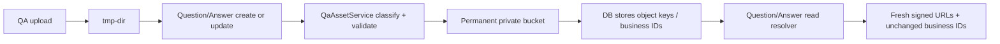

# 设计说明 Design: 专家问答上传资源持久化

## 阅读摘要
- 本文档说明：用统一 `QaAssetService` 覆盖问题与回答的图片/附件，在创建和更新时转正，在读取时重新签名。
- 设计重点：字段感知 codec、业务 ID 兼容、跨 MinIO/DB 补偿、双表历史修复以及前端无强制同步升级。
- 不在本设计中处理：全局 `tmp-dir` lifecycle、富文本正文 URL、软删除后的对象回收。

## 元信息 Metadata
- Feature ID: `054-qa-uploaded-asset-persistence`
- Status: `in-progress`
- Related requirements: `specs/054-qa-uploaded-asset-persistence/requirements.md`
- Created: `2026-08-11`
- Updated: `2026-08-12`

## 上下文 Context
- 现有架构 Existing architecture: QA 只有一个上传接口，默认写 `tmp-dir`；Question create/update 和 Answer create/update 直接保存请求字段；所有 read path 返回原数据库值，不重新签名。回答 update 目前还会忽略请求中的 `images_url`。
- 已检查文件 Relevant files inspected: `qa_expert/api/endpoints.py`、`qa_expert/domain/{schemas,services,repositories}.py`、`database/models/qa_expert.py`、`core/cache/utils.py`、`core/storage/{base.py,minio/minio_storage.py}`、`knowledge/domain/services/knowledge_utils.py`、`docs/qa_expert_api_documentation.py`、`test/qa_expert/`。
- 现有验证 Existing validation: `uv run pytest test/qa_expert`、定向 script tests、Ruff、staging MinIO smoke。
- 项目约束 Constraints: spec 先行；保留现有字段；不扩大 public policy；跨系统写入覆盖失败路径；未知附件 ID 默认保留。

## 目标 / 非目标 Goals / Non-Goals

### 目标 Goals
- 所有结构化 QA 上传字段在业务提交后不再依赖 `tmp-dir` 或旧签名。
- 创建、更新、列表、详情使用一致的引用 codec 和动态签名。
- 现有完整 URL 输入和业务附件 ID 可继续使用。
- 双表历史数据可先审计再渐进转正。

### 非目标 Non-Goals
- 不扫描问题富文本 HTML/Markdown 内嵌 URL。
- 不新建统一资源表，不修改全局生命周期，不立即回收旧正式资源。
- 不顺带重构问题/回答权限、通知、计数和附件产品策略。

## 边界承诺 Boundary Commitments
| Boundary | Allowed Change | Disallowed Change | Revalidation Trigger |
|---|---|---|---|
| QA upload | 增加 canonical key 信息，保留 file_path | 改知识库/工作流上传 | 上传 API 复用关系变化 |
| Question lifecycle | create/update/read 转正与 resolve | 改正文、邀请、通知、统计 | 问题字段或编辑规则变化 |
| Answer lifecycle | create/update/read 转正与 resolve | 改采纳、评论、点赞 | 回答字段或编辑规则变化 |
| Persistence | 目标字段混合读、新写 permanent key、`f083` 扩容三个多值字段 | 新表/JSON、压缩字段 | 数据模型重构 |
| Storage | copy/remove/sign + read-only metadata | public policy、global lifecycle | 存储安全策略变化 |
| Repair | 双表 dry-run/apply | 自动生产执行、失败时覆盖原值 | 数据修复范围变化 |

- Allowed dependencies: `none`

## 字段分类 Field Matrix
| Entity | Field | Known forms | Write target | Read behavior |
|---|---|---|---|---|
| Question | `image_url` | tmp URL / key / empty | permanent image keys | key -> fresh URL |
| Question | `file_url` | tmp URL / key / empty | permanent attachment key | key -> fresh URL |
| Question | `attachments` | tmp URL/key and/or opaque business IDs | permanent keys + preserved IDs | keys sign，IDs unchanged |
| Answer | `images_url` | tmp URL(s) / key(s) / empty | permanent image keys | keys -> fresh URLs |
| Answer | `attachments` | tmp URL/key and/or opaque business IDs | permanent keys + preserved IDs | keys sign，IDs unchanged |
| Both | `related_docs` | knowledge IDs | unchanged | unchanged |

## 需求追踪 Requirements Traceability
| Requirement | Acceptance Criteria | Design Element | Verification Strategy |
|---|---|---|---|
| REQ-001 | AC-REQ-001-01..04 | Question create/update/read asset pipeline | question service/API tests |
| REQ-002 | AC-REQ-002-01..04 | Answer create/update/read asset pipeline | answer service/API tests |
| REQ-003 | AC-REQ-003-01..04 | field-aware codec + compatible upload/serializer | codec/schema contract tests |
| REQ-004 | AC-REQ-004-01..05 | promotion journal + commit boundary | failure injection/idempotency tests |
| REQ-005 | AC-REQ-005-01..04 | dual-table repair command | script tests + dry-run evidence |
| REQ-006 | AC-REQ-006-01..04 | trust boundary、metadata validation、private signing | adversarial/storage/log tests |
| REQ-007 | AC-REQ-007-01..05 | MIME normalization + inline signing + portal preview modal + existing watermark context | backend contract tests + frontend preview/watermark tests/build |

## 架构设计 Architecture
- Pattern: `upload to staging -> classify -> validate -> promote -> persist key -> resolve on read`。
- Rationale: 预签名 URL 属于展示层，object key 才是稳定身份；字段感知 codec 可以兼容 attachments 的业务 ID。
- Preserved existing patterns: 复用知识库 `tmp_bucket -> bucket` copy、`UploadFileResponse.relative_path`、MinIO get/copy/remove/share link。
- Architecture change justification: 原规划的 `AnswerImageService` 扩展为 `QaAssetService`，否则问题资源与附件会继续走重复且不一致的生命周期逻辑。

## 文件结构计划 File Structure Plan
| Path | Action | Responsibility | Linked Requirement |
|---|---|---|---|
| `src/backend/bisheng/qa_expert/domain/asset_service.py` | create | field-aware codec、validation、promotion、compensation、resolve、redaction | REQ-001, REQ-002, REQ-003, REQ-004, REQ-006 |
| `src/backend/bisheng/core/storage/base.py` | modify | object size/content-type metadata contract | REQ-006 |
| `src/backend/bisheng/core/storage/minio/minio_storage.py` | modify | `stat_object` async/sync implementation | REQ-006 |
| `src/backend/bisheng/core/cache/utils.py` | modify | 通用上传保存函数可选透传 MIME，既有调用默认行为不变 | REQ-007 |
| `src/backend/bisheng/qa_expert/domain/services.py` | modify | Question/Answer create/update/read 集成 | REQ-001, REQ-002, REQ-004 |
| `src/backend/bisheng/qa_expert/domain/schemas.py` | modify | 补齐资源响应字段并固定混合格式契约 | REQ-003 |
| `src/backend/bisheng/qa_expert/api/endpoints.py` | modify | 上传 relative_path、tenant context、answer update images_url | REQ-001, REQ-002, REQ-003 |
| `src/backend/bisheng/database/models/qa_expert.py` | modify | 三个多值字段 ORM 类型对齐 `f083`，字段描述改为持久化引用 | REQ-001, REQ-002 |
| `src/backend/bisheng/core/database/alembic/versions/v2_6_0_f083_qa_answer_images_url_longtext.py` | modify | 尚未部署的 `f083` 一次性扩容三个多值资源字段 | REQ-001, REQ-002 |
| `src/backend/scripts/migrate_qa_uploaded_assets.py` | create | 双表多字段 dry-run/apply 历史修复 | REQ-005 |
| `src/backend/test/qa_expert/test_asset_persistence.py` | create | QA 资源主路径、兼容、安全、失败补偿 | REQ-001, REQ-002, REQ-003, REQ-004, REQ-006 |
| `src/backend/test/scripts/test_migrate_qa_uploaded_assets.py` | create | 历史脚本双表/幂等/失败验证 | REQ-005 |
| `../shougang-group-knowledge-portal/frontend/src/utils/qaAssetPreview.ts` | create | 根据原始文件名映射现有阅读器模式 | REQ-007 |
| `../shougang-group-knowledge-portal/frontend/src/components/QaAssetPreviewModal.tsx` | create | QA 图片/文件站内预览、显式下载入口与现有用户水印 Provider 接线 | REQ-007 |
| `../shougang-group-knowledge-portal/frontend/src/components/QaAssetPreviewModal.module.css` | create | QA 预览弹窗样式 | REQ-007 |
| `../shougang-group-knowledge-portal/frontend/src/pages/ExpertQADetailPage.tsx` | modify | 图片和自上传附件点击切换为预览 state；知识文档链接保持 | REQ-007 |
| `../shougang-group-knowledge-portal/frontend/tests/qaAssetPreview.test.ts` | create | 阅读器模式与点击行为回归契约 | REQ-007 |
| `specs/054-qa-uploaded-asset-persistence/verification.md` | create during implementation | 最终 evidence 和 staging smoke | all |

## 核心组件 Components and Interfaces

### QaAssetCodec
- Responsibility: 按字段把值分类为 `TEMP_OBJECT`、`PERMANENT_OBJECT`、`OPAQUE_ID`、`INVALID_URL`；序列化时保持现有分隔格式。
- Inputs: entity/field/value、配置的 MinIO host/buckets。
- Outputs: 有序 `AssetReference` 列表。
- Error behavior: URL-like 但不可信的值必须拒绝；仅非 URL 的 attachments 项可作为 opaque ID 保留；不进行 HTTP 请求。
- Requirements: `REQ-003, REQ-006`

### QaAssetService
- Responsibility: 对临时引用读取 metadata、执行字段策略验证、生成确定性正式 key、copy、记录 promotion journal、补偿和动态签名。
- Inputs: `tenant_id`、entity type、业务 ID/临时 stable ID、字段策略和引用列表。
- Outputs: `PromotionResult(persisted_values, source_keys, newly_created_keys)` 或 resolved API value。
- Error behavior: commit 前失败补偿本次新目标；commit 后临时清理失败仅脱敏告警；单个 legacy read 失败隔离。
- Requirements: `REQ-001, REQ-002, REQ-004, REQ-006`

### Question / Answer Integration
- Responsibility: create 先 promote 后 insert；update 只 promote 新 tmp 项并在 DB 成功后清理来源；read 对所有目标字段 resolve。
- Compatibility: opaque attachment ID 保持；新 writer 只写 permanent key；mixed-reader 同版上线。
- Important boundary: Answer update 必须显式传递并更新 `images_url`；Question update 不再直接 `model_dump` 后无差别写资源字段。
- Requirements: `REQ-001, REQ-002, REQ-003, REQ-004`

### Historical Repair
- Responsibility: 扫描 `qa_question` 三个字段与 `qa_answer` 两个字段；按整字段生成转换结果，全部对象成功后才更新该字段。
- Modes: 默认 dry-run；`--apply`；`--table`、`--record-id`、`--batch-size`、`--limit`。
- Failure behavior: 单字段任一引用失败则保留该字段完整原值；不因一行失败中断全批。
- Requirements: `REQ-005`

### Inline Asset Delivery and Portal Preview
- Responsibility: 上传时保存 MIME；转正与读取对历史 `application/octet-stream` 资源按受控扩展名修正 MIME，并在签名响应中声明 `inline`；门户把直接对象链接改为复用 `DocumentPreview` 的站内弹窗。
- Compatibility: `get_share_link` 与 `copy_object` 只新增可选参数，默认调用行为不变；知识库关联文档仍走 `/space/{spaceId}/file/{fileId}`。
- Error behavior: 阅读器拉取失败进入不支持提示，不自动触发下载；下载必须由用户显式点击。
- Security behavior: HTML 响应降级为 `text/plain` 后由 DOMPurify 净化渲染；SVG 等主动内容不进入站内图片 reader，仅提供显式下载。
- Watermark behavior: 弹窗从现有登录态取得 `PortalUser`，用 `PreviewWatermarkProvider` 向 `DocumentPreview`/`PdfPreview` 已有 overlay 提供同一水印行；不复制布局、透明度或后台文案逻辑。
- Requirements: `REQ-007`

## 数据与一致性 Data / Consistency
- 不新增 revision；扩展尚未部署的 `f083`，将问题附件、回答附件和回答图片三个多值字段设为 `LargeText`，其他字段保持不变。
- 正式 key：`qa-expert/{tenant_id}/{question|answer}/{image|attachment}/{owner_stable_id}/{source_uuid}.{ext}`。
- 创建前没有 DB ID 时使用服务生成的 `owner_stable_id`；落库后无需改 key。
- 每个请求维护 promotion journal，只补偿本次新建目标，不删除幂等复用目标。
- 更新移除的旧正式对象不立即删除，避免编辑回滚/并发读取造成数据丢失；作为后续 GC 输入。
- DB commit 成功后才 best-effort 删除 tmp 来源；失败不影响正式引用。
- 读取 resolver 只修改响应 DTO，不修改 ORM 或回写新签名。

## 测试策略 Testing Strategy
| Acceptance IDs | Risk / Level | Distinct Outcomes | Primary Layer | Evidence Group | Stop Condition |
|---|---|---|---|---|---|
| REQ-001 ACs | high/V2 | question create/update/read/no-op | service/API | EG-001 | 三字段资源与 opaque ID 均有证据 |
| REQ-002 ACs | high/V2 | answer create/update/read/no-op | service/API | EG-002 | images/attachments 与全部 read path 有证据 |
| REQ-003 ACs | high/V2 | URL/key/ID/mixed/bad legacy | parameterized codec/API | EG-003 | 每种不同分类结果覆盖 |
| REQ-004 ACs | high/V3 | validate/copy/DB/cleanup/retry failure | failure injection | EG-004 | 不一致风险各有独立证据 |
| REQ-005 ACs | high/V3 | 双表 dry/apply/missing/idempotent | script contract | EG-005 | dry-run 零写，apply 顺序与重复运行正确 |
| REQ-006 ACs | high/V2 | trust boundary、size/image、private sign、redaction | adversarial/storage | EG-006 | 非可信输入无外部 I/O，无 policy/log 泄露 |
| REQ-007 ACs | medium/V2 | wrong MIME、legacy octet-stream、image/file click、unsupported mode、missing watermark context | backend contract + frontend unit/build | EG-008 | 下载回归、支持/不支持预览与现有水印 Provider/overlay 接线均覆盖 |
| all | high/V3 | 真实 MinIO + DB 生命周期 | staging smoke | EG-007 | 创建/更新后删除 tmp，重新读取全部资源仍可访问 |

## 设计决策 Decisions

### Decision: 从 AnswerImageService 扩展为 QaAssetService
- Context: 同一上传接口被问题与回答的图片/附件共同使用，生命周期缺陷是模块级而非单字段缺陷。
- Options considered: 只修回答图片、为每个字段各写逻辑、统一字段感知服务。
- Decision: 统一服务，字段策略决定 image/attachment/opaque ID 行为。
- Rationale: 防止遗漏创建、更新或读取路径，并让历史脚本复用同一语义。
- Consequences: 影响文件增加，但实现边界仍限制在 QA 与最小 storage metadata contract。

### Decision: attachments 未知项默认保留，不默认当 URL
- Context: API 文档称 attachments 为 file IDs，运行 schema 又允许字符串 URL。
- Decision: URL-like 值必须通过 MinIO trust 校验；非 URL opaque 项原样保留。
- Rationale: 避免误签名、误复制或破坏既有业务 ID。
- Consequences: 后续需要产品统一 attachments contract，但不阻塞生命周期修复。

### Decision: 保存 object key，读取动态签名
- Context: 预签名 URL 固定过期且包含环境 host/credential scope。
- Decision: 新写永久 key，读取时签名；正式 bucket 保持 private。
- Rationale: URL TTL 和 host 变化不影响持久数据。
- Consequences: read path 增加签名计算和 legacy codec。

### Decision: 全局 lifecycle 与富文本 URL 分离
- Context: lifecycle 影响多个模块，正文内嵌资源缺少结构化证据。
- Decision: 当前闭环结构化 QA 字段；另立调查/治理任务。
- Rationale: 控制删除风险与修复范围。
- Consequences: abandoned tmp 与正文潜在 URL 仍是已知 follow-up。

## 发布与回滚 Rollout / Rollback
1. reader、codec、question/answer writer 同版部署，先不跑历史 apply。
2. staging 验证问题和回答的创建、更新、列表、详情；删除 tmp 源后永久资源仍可访问。
3. 生产先执行双表 dry-run 并备份目标字段，审查缺失/非法/业务 ID 分类。
4. 小 batch apply，观察 MinIO copy、DB lock 和补偿告警。
5. mixed-reader 至少保留一个发布周期；应用回滚包也必须理解 object key。
6. 不通过回滚删除永久对象或把 key 反写成旧签名 URL。

## 风险 / 取舍 Risks / Trade-Offs
| Risk | Impact | Mitigation | Owner / Phase |
|---|---|---|---|
| attachments 混合语义 | 误处理业务 ID | field-aware codec + opaque 默认保留 | implementation |
| MinIO/DB 跨系统事务 | 孤儿或断链 | promotion journal + commit 边界 + failure tests | implementation |
| 历史 tmp 已删除 | 不可恢复 | dry-run 报告、备份恢复、业务确认 | migration |
| update 移除旧资源不删除 | 正式桶冗余 | 后续 GC，不在紧急修复中做破坏性清理 | follow-up |
| mixed-reader 缺失时回滚 | 旧版无法签名 key | reader/writer 同版，回滚包保留 codec | deployment |
| 全局 tmp 生命周期错误 | abandoned upload 堆积 | 另立共享 lifecycle spec | follow-up |

## 设计质量门 Design Quality Gate
- [x] Every requirement ID is represented in Requirements Traceability.
- [x] Every acceptance criterion has a verification strategy.
- [x] Verification uses the lowest sufficient layer and avoids duplicate commands across acceptance criteria.
- [x] Test cases map to distinct outcomes/risks instead of tasks, branches, roles, or raw input count.
- [x] One primary test layer is selected per behavior unless a boundary has independent risk.
- [x] Boundary Commitments include allowed and disallowed changes.
- [x] Every changed file has one clear responsibility and linked requirement.
- [x] Existing architecture is preserved or changes are justified.
- [x] Runtime prerequisites, migrations, and risky operations are explicit.
- [x] No speculative abstractions are included.
