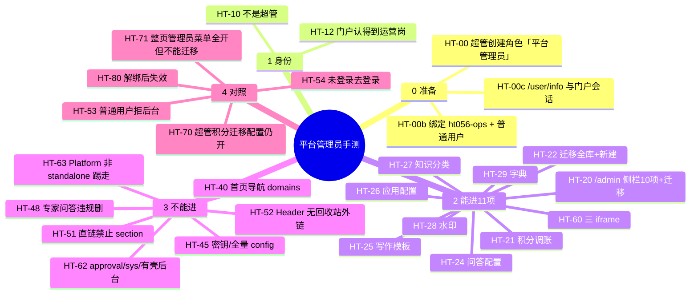

# 平台管理员 — 手测用例与数据

入口脑图：Cursor Canvas（可开在聊天旁）。本文可复制到飞书/XMind。

环境：门户 `http://127.0.0.1:5173`，Platform `http://127.0.0.1:3001`，毕昇 API `http://127.0.0.1:7860`。验收库 171 MySQL。本地栈需先「启动联调」。

密码：下列账号与现网 `admin`（user_id=1）同一密码哈希；用你平时登 171 admin 的密码。不要用文档里的 `admin123`，除非你已确认该明文能登 171。

---

## 脑图（Mermaid）

---

## 账号（171 已插入，2026-08-28）

| 代号 | 账号 | user_id | 当前角色 | 用途 | 备注 |
|---|---|---|---|---|---|
| U-super | `admin` | 1 | System Admin (id=1) | 创建保留名、绑人、回归 | 已有 |
| U-super2 | `gzx04` | 7 | System Admin + 普通用户 | 备用超管 | 已有，同密码 |
| U-portal | `ht056-portal` | 840 | 普通用户 + 管理员(id=5) | AT-71 整页管理员 | 新建 |
| U-ops | `ht056-ops` | 838 | **仅普通用户** | 主测运营岗 | 新建；**HT-00b 后才有「平台管理员」** |
| U-user | `ht056-user` | 839 | 普通用户 | 无权限对照 | 新建 |
| U-both | `ht056-both` | 841 | 仅普通用户 | AT-81 超管优先（可选） | 新建；后绑 AdminRole+平台管理员 |
| U-anon | — | — | 无 Cookie | 未登录 | |
| 调账对象 | `gzx02` | 5 | 普通用户 | 积分余额 360 | 已有账户 |
| 迁移对照库主人 | `gzx0002` | 13 | 普通用户 | 知识库 9990006 | 不要用 U-ops 登录此号 |

禁止：把「平台管理员」加进门户 `ADMIN_ROLES`；U-ops 不得出现 `role=admin`。

---

## 准备步骤（必须先做）

1. U-super 登录毕昇 Platform 角色管理，创建角色名精确四字 **`平台管理员`**（不要空格、不要「xx平台管理员」）。
2. 期望：创建成功；再创建同名 → 24002；可与「管理员」并存；改名/删除失败。
3. 给 `ht056-ops` 同时保留 **普通用户** + **平台管理员**（前台才能登录）。
4. 不要给该角色勾管理端 WEB_MENU（`board`/`sys`）；即使勾了保存后应被剥掉。
5. `ht056-ops` 重新登录门户，确认 Header 有「知识管理后台」「迁移记录」。

角色不要用 SQL 插，必须走 RoleService（保留名 + 菜单剥离）。

---

## 业务数据（171 现网，只读引用）

| 用途 | 表 | 关键行 |
|---|---|---|
| 调账对象 | `user_point_account` | user_id=5 `gzx02` balance=360 |
| 迁移「非本人库」 | `knowledge` | id=9990006 名称 `gzx0002的知识库` user_id=13 |
| 超管库对照 | `knowledge` | id=9990007 `一会删` user_id=1 |
| 门户配置 | 毕昇 `config` key=`shougang_portal_config` | 问答/水印可改；domains 对 U-ops 禁止 |
| 角色 | `role` | 尚无「平台管理员」行，HT-00 创建 |
| 绑定 | `userrole` | ht056-* 已绑 role_id=2；portal 另绑 5 |

无 DDL。手测写库后应用 U-ops 账号再读一遍核对。

---

## 用例清单（逐步）

入口：`http://127.0.0.1:5173`。每条失败期望：页面拒绝或接口 403，且禁止项表/配置块不变。

### 0 准备

- **HT-00** U-super 创建「平台管理员」。期望：角色列表出现精确四字；同租户再创建失败。
- **HT-00b** 绑定 `ht056-ops`。期望：`userrole` 有该角色 + 普通用户；无 role_id=1。
- **HT-00c** `ht056-ops` 登录后 `GET /api/v1/user/info`：`role=平台管理员`，`role_names` 含该名，**不是** `admin`。门户 `/api/v1/auth/me` 同样。

### 1 身份

- **HT-10** 运营岗前台当普通用户可用；不能进毕昇有壳管理后台。
- **HT-12** 门户用户菜单显示运营身份，刷新后仍在。

### 2 能进（11 项）

U-ops 打开 `/admin`。

侧栏应有且仅有：数据看板、积分管理、问答配置、写作模板、应用配置、知识分类、水印设置、字典配置、内容与安全审查、标签管理。Header「迁移记录」算第 11 项。

| ID | 操作 | 期望 |
|---|---|---|
| HT-20 | 扫侧栏与分组 | 无「门户管理」整组、课程、业务域映射、自动发布、科室绑定、审批、系统管理；无「BiSheng 管理后台」外链 |
| HT-21 | 积分管理：给 `gzx02` 调账小额正数 | 成功；余额=原 360+delta；再打开详情一致 |
| HT-22 | Header 迁移记录 → 新建迁移；源库选 9990006 | 能列出非本人库；建批成功；操作者是 ht056-ops |
| HT-24 | 问答配置改欢迎语后保存 | 成功；刷新仍在；首页导航 domains 未变 |
| HT-25 | 写作模板改一条 | 成功再读一致 |
| HT-26 | 应用配置保存 | 成功再读一致 |
| HT-27 | 知识分类保存 | 成功再读一致 |
| HT-28 | 水印保存（可加可辨认后缀 `-ht056`） | 成功再读一致 |
| HT-29 | 字典配置新建一条 type 带 `ht056` | 列表能见到；不要用生产字典名 |
| HT-60 | 点数据看板 / 标签管理 / 内容与安全审查 | 三 iframe 能渲染，内接口可用，不被踢到 workspace |

### 3 不能进

| ID | 操作 | 期望 |
|---|---|---|
| HT-51 | 地址栏 `/admin?section=site`（再试 domains / banners / search） | 主区「无权限访问该模块」；Network 无全量 `/admin/config` 200 |
| HT-40 | 若仍发出 `POST /api/v1/admin/config/domains` | 403，无 domains 正文；配置不变 |
| HT-45 | Network 搜 `/bisheng` `/rest-auth` 全量 `/admin/config` | 403 或未发；body 无密码/token |
| HT-48 | 专家问答已锁定问题 | 无违规删除按钮；不要用超管码误放行 |
| HT-52 | Header 用户菜单 | 有知识管理后台、迁移记录；无回收站 |
| HT-62 | 改 iframe URL 为 `/platform/standalone/approval`；另开 `/platform/standalone/sys`；有壳 `/dashboard` | 403 或踢 workspace；不加载审批/系统页 |
| HT-63 | 用 U-ops 直接打开 Platform `:3001` 非 standalone | 踢走 workspace / 无管理侧栏 |

### 4 对照账号

| ID | 身份 | 操作 | 期望 |
|---|---|---|---|
| HT-53 | ht056-user | `/admin`、`/knowledge-migrations` | 无权限；前台首页仍可用 |
| HT-54 | 退出登录 | `/admin` | 去登录 |
| HT-70 | admin | 积分调账、建迁移、`/admin` 改首页导航、打开数据源 | 全开且能保存 |
| HT-71 | ht056-portal | `/admin` | NAV 全开；有回收站/外链；**无**迁移记录；直开 `/knowledge-migrations` 无权限 |
| HT-80 | 超管解绑 ht056-ops 的平台管理员后重登 | 调账、保存问答、开 `/admin` | 18201/403；无新积分流水；qa 不再被他改掉 |

---

## 涉及数据表

无 DDL / 无字段增删改 / 不做迁移。

| 表 | 角色 | 关键已有字段 |
|---|---|---|
| `role` | 写（HT-00 一行） | `id`,`role_name`,`tenant_id` |
| `user` | 读；手测账号已插入 | `user_id`,`user_name`,`password`,`remark` |
| `userrole` | 写绑定/解绑 | `user_id`,`role_id`,`tenant_id` |
| `roleaccess` | 旁路（WEB_MENU 剥离） | `role_id`,`third_id` |
| `user_point_account` / `user_point_log` | 调账读写 | `user_id`,`balance`,`delta` |
| `knowledge` / `knowledge_migration_batch` | 迁移读写 | `id`,`user_id`,`batch_no` |
| `system_dictionary` | 字典写 | type/value |
| `sensitive_word_policy` | iframe 审查 | 现网策略 |
| `config` (`key=shougang_portal_config`) | 门户配置读写 | JSON 内 qa/watermark/domains 等 |

---

## 不要测

种子脚本插「平台管理员」角色、按库收窄迁移、公开发现开关、用户角色管理页本身、性能。
